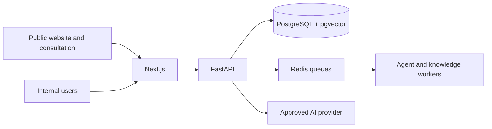

# Enterprise AI Business Development Agent Platform — Current Context

**Status date:** 2026-08-23

**Purpose:** Primary lightweight engineering entry point

**Translation:** `PROJECT_CONTEXT.zh-CN.md` is the last accepted Chinese review snapshot; English is current.

## 1. Product and architecture

The platform supports AI-assisted B2B customer acquisition and sales operations. Sari Arta, an
Indonesian commercial-kitchen engineering business, is the first operating domain. The application is
a modular monolith:

PostgreSQL is canonical business state. Prompts, model context, Redis, traces, and browser state are
not. Deterministic services own transactions; agents use narrow typed capabilities.

## 2. Implemented capabilities

| Phase | Current result |
|---|---|
| Phase 1 | Accepted Sari Arta CRM MVP: public intake, companies, contacts, leads, tasks, opportunities, dashboard, AI qualification, audit, retries, and demo data |
| Phase 2 | Agent Registry, Commercial Kitchen and IVC domain packages, multilingual Agent Playground |
| Phase 2.5 | Governed knowledge collections, uploads, processing, immutable versions, publication/activation, rollback, permissions, audit, embeddings, and pgvector |
| Phase 2.6 | Agent-scoped retrieval, evaluation baseline, search test UI, and read-only cited Knowledge Assistant |
| Phase 3.1 | Separate bilingual public Commercial Kitchen Consultation Agent with consented `website_ai_assistant` CRM intake |
| Phase 3.2 engineering | Content governance, human Marketing Workspace, Marketing Agent registry/policy, cited generation runtime, evaluation, feedback, previews, and acceptance workspace |
| Phase 3.2.4A | Public/private crawl boundary, robots, sitemap, canonical metadata, structured data, IndexNow readiness, and minimal search attribution |

## 3. Current production gates

Phase 3.2 Marketing Content engineering, security/governance, and technical evaluation are complete.
Business acceptance is **pending/deferred** and production activation is **disabled**.

Before production marketing generation or any automatic publication:

- approve a real Sari Arta Brand Guideline;
- complete final English and Chinese business content review;
- record real Human Edit Distance against approved successor versions;
- complete or explicitly defer the controlled English/Chinese OpenAI comparison;
- approve the exact content version and external action.

This gate does not block technical search foundations, but it blocks production generation,
automatic website publication, social publishing, and generated-content external communication.

Production search onboarding also remains pending: final HTTPS domain, Google Search Console, Bing
Webmaster Tools, real public-content approval, crawler/CDN verification, and measurement decisions.

## 4. Active boundaries

- CRM remains manually usable if AI or providers fail.
- Tenant isolation, RBAC, object authorization, PostgreSQL RLS, audit, idempotency, and correlation
  IDs remain mandatory.
- Authorization occurs before embedding, retrieval, model, or external-provider calls.
- Knowledge retrieval requires approved, published, active, processed evidence plus explicit agent
  binding.
- Public agents/pages cannot access internal knowledge, private customer data, CRM reads, pricing,
  supplier data, internal SOP, or unrestricted tools.
- AI cannot approve its own output or make pricing, delivery, technical, compliance, or contractual
  commitments.
- IVC production knowledge retrieval and marketing generation remain disabled.
- No automatic external publishing, WhatsApp/email sending, CRM writes by content agents, MCP, or
  multi-agent orchestration is active.

## 5. Active modules

| Area | Modules |
|---|---|
| Sales | CRM, lead qualification, tasks/follow-up, opportunities, dashboard |
| Agents | Agent Registry, Commercial Kitchen Agent, IVC demo agent, Agent Playground |
| Knowledge | Management, processing, governance, retrieval evaluation, read-only assistant |
| Public acquisition | Marketing website, contact intake, public consultation widget, search foundation |
| Marketing | Content governance, public-only knowledge policy, generation runtime, evaluation and business-acceptance workspace |

## 6. Remaining roadmap

Near-term work must be selected explicitly. Major incomplete capabilities are:

- Phase 3.2 business acceptance and later production activation;
- remaining Phase 3.2.4 production-domain onboarding, governed dynamic publication, and measurement;
- Proposal Assistant, versioning, and print-ready export;
- controlled WhatsApp/email delivery and n8n operational workflows;
- consent/opt-out, delivery status, retries, and external-communication audit;
- later Research Agent, evaluated additional providers, MCP, and multi-agent orchestration.

Use `docs/roadmap.md` only when choosing or changing phase scope.

## 7. Task document routing

After this file, read only the directly relevant English baseline:

| Task | Primary document |
|---|---|
| System/security/tenancy | `technical-architecture.en.md` or `multi-tenant-security-design.en.md` |
| CRM database/API | Relevant section of `database-design.en.md` or `api-design.en.md` |
| Agent framework/IVC | `phase-2-agent-framework-design.en.md` or the IVC domain package |
| Knowledge governance/processing | The matching `knowledge-*-design.en.md` document |
| Retrieval/assistant | `knowledge-retrieval-design.en.md` or `knowledge-assistant-design.en.md` |
| Public consultation | `public-consultation-agent-design.en.md` |
| Marketing content | The most specific `marketing-*.en.md` document for the task |
| Public search | `organic-ai-search-foundation.en.md` |
| UI implementation | `sari-arta-ui-specification.en.md`; read broader UI documents only when redesigning |

Do not read Chinese translations, CHANGELOG, historical phase plans, evaluation fixtures, demo data,
or unrelated domains unless the task explicitly requires them.

## 8. Documentation and validation mode

- English is the active implementation baseline.
- Chinese translations are synchronized at milestone/business-review points, not during routine work.
- Small tasks use targeted checks; sub-phases use affected-application checks; milestone/release work
  uses full regression, production build, migration, Docker, and end-to-end validation as relevant.
- Do not update this file for minor fixes, UI polish, refactors, dependency maintenance, or tests.
- Update CHANGELOG only for a completed meaningful product/architecture milestone.

Detailed engineering authority, safety, and approval rules are in `AGENTS.md`.
