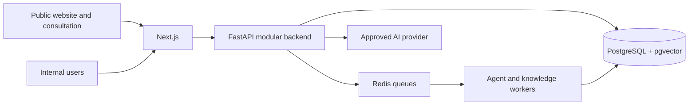

# Enterprise AI Business Development Agent Platform — Project Context

**Status date:** 2026-08-16  
**Primary reference:** This English document is the engineering baseline.  
**Review translation:** `PROJECT_CONTEXT.zh-CN.md`

## 1. Project Overview

**Project name:** Enterprise AI Business Development Agent Platform

This project builds a reusable AI-powered business development platform for B2B companies. It combines customer acquisition, lead qualification, sales workflow support, domain-specific AI agents, and governed enterprise knowledge.

Sari Arta, an Indonesian commercial-kitchen engineering business, is the first real-business validation domain. The platform is evolving toward multiple industry-specific business development agents without weakening domain, tenant, knowledge, or permission boundaries.

## 2. Current System Architecture



| Layer | Current responsibility |
|---|---|
| Frontend | Next.js public website, authenticated workspace, CRM UI, Agent Playground, Knowledge Management, retrieval testing, and Knowledge Assistant interfaces |
| Backend | FastAPI CRM services, agent runtime, public consultation, knowledge governance, processing, retrieval, and authorization |
| Database | PostgreSQL business system of record, pgvector embeddings, tenant-scoped records, and Row Level Security (RLS) |
| Infrastructure | Docker Compose local runtime, Redis-backed asynchronous workers, API/Web/Worker containers |

The application is a modular monolith. PostgreSQL is canonical business state; prompts, model context, Redis, and browser state are not.

## 3. Completed Development Phases

### Phase 1 — Sari Arta MVP

- Public B2B website and inquiry form.
- Companies, contacts, leads, opportunities, tasks, and activities.
- Dashboard, lead detail, opportunity pipeline, and follow-up workflow.
- Structured AI lead qualification with human acceptance or rejection.
- Lead-to-opportunity conversion, audit records, retryable Agent Runs, and synthetic demonstrations.

### Phase 2 — Multi-Agent Framework

- Agent Registry with domains, versioned agents, capabilities, and tenant activation.
- Commercial Kitchen Agent for Sari Arta.
- IVC Facility Business Development Agent for laboratory animal facilities.
- Multilingual Agent Playground for isolated domain demonstrations.

### Phase 2.5 — Enterprise Knowledge Platform

**Knowledge Management**

- Tenant/domain collections, documents, metadata, approval, and agent bindings.

**Knowledge Processing**

- PDF, DOCX, Markdown, and text extraction.
- Cleaning, deterministic chunking, embedding abstraction, and pgvector storage.

**Knowledge Governance**

- Immutable document versions and current/published/active pointers.
- Separate review, approval, publishing, activation, archive, restore, and rollback operations.
- Knowledge audit logs, optimistic concurrency, and separated permissions.

### Phase 2.6 — Retrieval and Read-Only Assistance

- Agent-scoped vector retrieval API with exact source citations.
- Retrieval evaluation baseline, bilingual consistency metrics, and regression fixtures.
- Internal retrieval search test interface.
- Read-only Commercial Kitchen Knowledge Assistant with sufficient, insufficient, and conflicting evidence handling.

### Phase 3.1 — Public Consultation Agent

- Separate English/Chinese Commercial Kitchen Consultation Agent on the public website.
- Guided project requirement and contact collection.
- Explicit consent, duplicate protection, `website_ai_assistant` source attribution, and reuse of the existing CRM lead workflow.
- Public-only knowledge boundary with no internal knowledge or CRM read access.

### Phase 3.2.3.1 — Marketing Content Governance Foundation

- Tenant-scoped content requests, assets, immutable versions, approval decisions, generation-run projections, and append-only audit records.
- Exact-version review and approval with checksum validation, separation of duties, optimistic concurrency, idempotent mutations, safe successor versions, and rollback without history rewriting.
- Dedicated content RBAC and forced PostgreSQL RLS; AI generation and external publishing remain disabled.

## 4. Current Active Modules

| Module | Role |
|---|---|
| CRM Platform | Companies, contacts, leads, tasks, activities, opportunities, and dashboards |
| Agent Registry | Domain, agent version, capability, localization, and activation control |
| Commercial Kitchen Agent | Sari Arta lead and project qualification |
| IVC Business Development Agent | Laboratory animal facility qualification demonstration |
| Agent Playground | Multidomain structured-input demonstration without CRM mutation |
| Knowledge Management | Collections, documents, metadata, review, approval, and bindings |
| Knowledge Processing Pipeline | Extraction, cleaning, chunking, embedding, and vector persistence |
| Knowledge Governance | Version, publication, activation, permission, rollback, and audit controls |
| Knowledge Retrieval | Governed agent-scoped evidence retrieval and citations |
| Knowledge Assistant | Internal read-only grounded Q&A for Commercial Kitchen knowledge |
| Public Consultation Agent | Public guided project intake and consented lead creation |
| Content Governance | Governed marketing requests, immutable assets and versions, review/approval, rollback, archive, and audit controls |

## 5. Agent Architecture

The architecture supports:

- **Domain Agents:** specialize in an industry and its qualification model.
- **Capability Agents:** provide bounded capabilities such as qualification, research, content, or proposal drafting.
- **Knowledge-enabled Agents:** retrieve only explicitly authorized, governed evidence.

Current agents:

- **Commercial Kitchen Agent:** B2B commercial-kitchen opportunity qualification.
- **IVC Facility Business Development Agent:** laboratory animal facility project qualification; production knowledge retrieval remains disabled.
- **Commercial Kitchen Consultation Agent:** public, guided project discovery and consented lead intake; it is separate from the internal Knowledge Assistant.

Planned agents include Marketing Content Agent, Proposal Assistant, controlled communication agents, and Research Agent. Agent Registry, typed capability boundaries, authorization, auditability, and human approval remain mandatory.

## 6. Knowledge Architecture

```text
Upload
↓
Review
↓
Approve
↓
Publish and activate
↓
Process
↓
Retrieve
↓
Authorized agent usage
```

- Documents use governed metadata, immutable versions, publication pointers, and audit history.
- Only approved, published, active, successfully processed versions may become retrieval evidence.
- Every evidence chunk preserves document, version, page/section, chunk, language, and source metadata.
- Retrieval is deny-by-default and requires matching tenant, domain, agent binding, capability, and permissions.
- Internal and public knowledge are separate trust zones. Public agents cannot use internal retrieval.
- Knowledge-grounded answers require validated citations; insufficient or conflicting evidence must be reported rather than guessed.

## 7. Security Principles

- Maintain a future-compatible multi-tenant model while operating the approved current workspaces.
- Enforce tenant isolation in application authorization and PostgreSQL RLS.
- Apply RBAC and object-level checks server-side.
- Restrict each agent to registered, typed capabilities and narrow tools.
- Authorize before embedding, model, retrieval, or external-provider calls.
- Keep public and internal knowledge, identities, APIs, and tools separated.
- Require human review for qualification decisions and consequential business actions.
- Preserve auditability, idempotency, correlation IDs, safe logging, and data minimization.
- Never expose hidden model reasoning, secrets, unsupported claims, private customer data, prices, or commitments.

## 8. Development Rules

- Do not break or bypass existing CRM workflows.
- Do not bypass Agent Registry for domain-agent behavior.
- Do not expose internal knowledge through public interfaces.
- Do not allow unsupported AI claims, invented facts, prices, specifications, cases, or commitments.
- Keep deterministic services responsible for transactions and state transitions.
- Prefer a modular monolith and the smallest complete vertical slice.
- Preserve manual operation and safe fallback when AI is unavailable.
- Maintain synchronized English and Chinese design documentation.
- Preserve tenant, agent, knowledge, permission, consent, approval, and audit boundaries.
- Follow `AGENTS.md`, then `docs/roadmap.md`, for detailed authority and scope rules.

## 9. Current Development Status

The system has evolved from a single Sari Arta demonstration into a reusable, multi-domain AI Business Development Platform.

- Phase 1 Sari Arta MVP: completed and accepted.
- Phase 2 Agent Framework and multidomain demo: completed.
- Phase 2.5 Knowledge Platform and governance: completed.
- Phase 2.6 retrieval foundation, evaluation, and read-only assistant: completed.
- Phase 3.1 public consultation agent: completed.
- Phase 3.2.3.1 marketing content governance persistence and RBAC: completed.

The next development direction is the governed Marketing Content Agent generation layer on top of this persistence foundation. Production deployment, real customer data, real public knowledge activation, and external communication remain human-approved activities.

## 10. Roadmap

### Phase 3 — Business Automation Layer

- Governed Marketing Content Agent with human approval.
- Social media content drafting and approval; no autonomous publishing.
- Controlled email automation and delivery tracking.
- WhatsApp integration with consent, templates, idempotency, and human control.
- n8n operational workflows outside core transaction ownership.
- Reliable retries, delivery status, audit, opt-out, and failure recovery.

### Phase 4 — Advanced AI Platform

- MCP integration with explicit tool and permission boundaries.
- Research Agent with source verification.
- Multi-agent orchestration only where measured business need justifies it.
- Evaluated multi-model routing, including approved Qwen or local-model paths.
- Expanded agent evaluation, cost, latency, and safety controls.

## 11. Maintenance Rules

Update `PROJECT_CONTEXT.en.md` and `PROJECT_CONTEXT.zh-CN.md` together only after a significant change, such as:

- A new architecture layer.
- A new agent type.
- A new security or tenancy model.
- A major platform capability.
- A new development phase or material scope boundary.

Do not update these documents for bug fixes, minor UI changes, routine refactoring, dependency maintenance, or test-only changes. Keep them compact, current, and independent of temporary implementation details.
