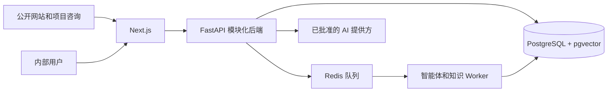

# 企业级 AI 商务拓展智能体平台 — 项目上下文

**状态日期：** 2026-08-16  
**主要参考：** 英文文档是正式工程基线。  
**审核译本：** `PROJECT_CONTEXT.zh-CN.md`

## 1. 项目概述

**项目名称：** Enterprise AI Business Development Agent Platform（企业级 AI 商务拓展智能体平台）

本项目为 B2B 企业建设可复用的 AI 商务拓展平台，整合客户获取、线索资格评估、销售工作流支持、行业专用 AI 智能体和受治理的企业知识。

印度尼西亚商用厨房工程企业 Sari Arta 是第一个真实业务验证领域。平台正在向多个行业专用商务拓展智能体演进，同时不会削弱领域、租户、知识或权限边界。

## 2. 当前系统架构



| 层级 | 当前职责 |
|---|---|
| 前端 | Next.js 公开网站、认证工作台、CRM 界面、Agent Playground、知识管理、检索测试和知识助手界面 |
| 后端 | FastAPI CRM 服务、智能体运行时、公开项目咨询、知识治理、处理、检索和授权 |
| 数据库 | PostgreSQL 业务事实来源、pgvector 向量、租户范围记录和行级安全（RLS） |
| 基础设施 | Docker Compose 本地运行环境、Redis 异步 Worker、API/Web/Worker 容器 |

应用采用模块化单体。PostgreSQL 是正式业务状态；Prompt、模型上下文、Redis 和浏览器状态都不是正式业务记录。

## 3. 已完成开发阶段

### Phase 1 — Sari Arta MVP

- B2B 公开网站和询盘表单。
- 公司、联系人、线索、商机、任务和活动。
- 仪表盘、线索详情、商机漏斗和跟进工作流。
- 结构化 AI 线索资格评估，并由人工接受或拒绝。
- 线索转商机、审计记录、可重试 Agent Run 和合成演示数据。

### Phase 2 — 多智能体框架

- 包含领域、版本化智能体、能力和租户启用的 Agent Registry。
- 面向 Sari Arta 的商用厨房智能体。
- 面向实验动物设施的 IVC Facility Business Development Agent。
- 用于隔离领域演示的多语言 Agent Playground。

### Phase 2.5 — 企业知识平台

**知识管理**

- 租户/领域知识集合、文档、元数据、审批和智能体绑定。

**知识处理**

- PDF、DOCX、Markdown 和文本提取。
- 清洗、确定性分块、嵌入抽象和 pgvector 存储。

**知识治理**

- 不可变文档版本和 current/published/active 指针。
- 独立的审核、批准、发布、启用、归档、恢复和回滚操作。
- 知识审计日志、乐观并发和权限分离。

### Phase 2.6 — 检索和只读辅助

- 带有准确来源引用的智能体范围向量检索 API。
- 检索评估基线、双语一致性指标和回归数据集。
- 内部检索测试界面。
- 只读商用厨房知识助手，支持证据充分、不充分和冲突处理。

### Phase 3.1 — 公开项目咨询智能体

- 公开网站中独立的英文/中文商用厨房项目咨询智能体。
- 引导式项目需求和联系方式收集。
- 明确授权、防重复、`website_ai_assistant` 来源记录，并复用现有 CRM 线索流程。
- 仅限公开知识，无法读取内部知识或 CRM。

## 4. 当前活动模块

| 模块 | 作用 |
|---|---|
| CRM 平台 | 公司、联系人、线索、任务、活动、商机和仪表盘 |
| Agent Registry | 领域、智能体版本、能力、本地化和启用控制 |
| 商用厨房智能体 | Sari Arta 线索和项目资格评估 |
| IVC 商务拓展智能体 | 实验动物设施资格评估演示 |
| Agent Playground | 不修改 CRM 的多领域结构化输入演示 |
| 知识管理 | 集合、文档、元数据、审核、批准和绑定 |
| 知识处理流水线 | 提取、清洗、分块、嵌入和向量持久化 |
| 知识治理 | 版本、发布、启用、权限、回滚和审计控制 |
| 知识检索 | 受治理的智能体范围证据检索和引用 |
| 知识助手 | 面向商用厨房知识的内部只读有依据问答 |
| 公开项目咨询智能体 | 公开引导式项目收集和授权后创建线索 |

## 5. 智能体架构

该架构支持：

- **领域智能体：** 专注于一个行业及其资格评估模型。
- **能力智能体：** 提供资格评估、研究、内容或提案起草等受限能力。
- **知识增强智能体：** 只检索明确授权的受治理证据。

当前智能体：

- **商用厨房智能体：** B2B 商用厨房商机资格评估。
- **IVC Facility Business Development Agent：** 实验动物设施项目资格评估；生产知识检索仍保持关闭。
- **商用厨房项目咨询智能体：** 公开引导式项目发现和授权后线索收集；它与内部知识助手完全分开。

计划中的智能体包括营销内容智能体、提案助手、受控沟通智能体和研究智能体。Agent Registry、强类型能力边界、授权、可审计和人工审批仍是强制要求。

## 6. 知识架构

```text
上传
↓
审核
↓
批准
↓
发布并启用
↓
处理
↓
检索
↓
授权智能体使用
```

- 文档使用受治理的元数据、不可变版本、发布指针和审计历史。
- 只有已批准、已发布、已启用并成功处理的版本才能成为检索证据。
- 每个证据分块保留文档、版本、页码/章节、Chunk、语言和来源元数据。
- 检索默认拒绝，必须匹配租户、领域、智能体绑定、能力和权限。
- 内部知识和公开知识属于独立信任区。公开智能体不能使用内部检索。
- 基于知识的回答必须包含经过验证的引用；证据不足或冲突时必须明确说明，不能猜测。

## 7. 安全原则

- 在运行当前已批准工作区的同时，保持面向未来的多租户模型。
- 通过应用授权和 PostgreSQL RLS 强制租户隔离。
- 在服务端执行 RBAC 和对象级权限检查。
- 将每个智能体限制在已注册的强类型能力和窄工具范围内。
- 在嵌入、模型、检索或外部提供方调用前完成授权。
- 分离公开与内部知识、身份、API 和工具。
- 资格评估决定和重要业务动作必须人工审核。
- 保留审计、幂等、Correlation ID、安全日志和数据最小化。
- 不得暴露模型隐藏推理、密钥、不受支持的声明、私有客户数据、价格或承诺。

## 8. 开发规则

- 不得破坏或绕过现有 CRM 工作流。
- 领域智能体行为不得绕过 Agent Registry。
- 不得通过公开界面暴露内部知识。
- 不允许 AI 生成无依据的声明、事实、价格、参数、案例或承诺。
- 由确定性服务负责交易和状态转换。
- 优先使用模块化单体和最小的完整垂直切片。
- AI 不可用时仍需保留人工操作和安全降级。
- 保持英文和中文设计文档同步。
- 保持租户、智能体、知识、权限、授权、审批和审计边界。
- 详细权限和范围规则依次以 `AGENTS.md` 和 `docs/roadmap.md` 为准。

## 9. 当前开发状态

系统已经从单一 Sari Arta 演示，发展为可复用的多领域 AI 商务拓展平台。

- Phase 1 Sari Arta MVP：已完成并验收。
- Phase 2 智能体框架和多领域演示：已完成。
- Phase 2.5 知识平台和治理：已完成。
- Phase 2.6 检索基础、评估和只读助手：已完成。
- Phase 3.1 公开项目咨询智能体：已完成。

下一开发方向是 Phase 3 中其余受控业务自动化层。生产部署、真实客户数据、真实公开知识启用和外部沟通仍需要人工批准。

## 10. 路线图

### Phase 3 — 业务自动化层

- 需要人工审批的受治理营销内容智能体。
- 社交媒体内容起草和审批，不允许自主发布。
- 受控邮件自动化和送达跟踪。
- 具有授权、模板、幂等和人工控制的 WhatsApp 集成。
- 位于核心事务职责之外的 n8n 运营工作流。
- 可靠重试、送达状态、审计、退订和失败恢复。

### Phase 4 — 高级 AI 平台

- 具有明确工具和权限边界的 MCP 集成。
- 具有来源验证的研究智能体。
- 只有在可衡量业务需求支持时才使用多智能体编排。
- 经过评估的多模型路由，包括批准的 Qwen 或本地模型路径。
- 扩展智能体评估、成本、延迟和安全控制。

## 11. 维护规则

只有发生重大变化时，才应同时更新 `PROJECT_CONTEXT.en.md` 和 `PROJECT_CONTEXT.zh-CN.md`，例如：

- 新架构层。
- 新智能体类型。
- 新安全或租户模型。
- 重大平台能力。
- 新开发阶段或实质范围边界。

不要因为 Bug 修复、小型 UI 调整、日常重构、依赖维护或仅测试变更而更新这些文档。文档应保持精简、准确，并且不依赖临时实现细节。
