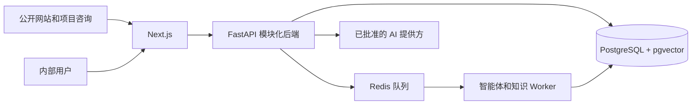

# 企业级 AI 商务拓展智能体平台 — 项目上下文

**状态日期：** 2026-08-16  
**主要参考：** 英文文档是正式工程基线。  
**审核译本：** `PROJECT_CONTEXT.zh-CN.md`

## 1. 项目概述

**项目名称：** Enterprise AI Business Development Agent Platform（企业级 AI 商务拓展智能体平台）

本项目为 B2B 企业建设可复用的 AI 商务拓展平台，整合客户获取、线索资格评估、销售工作流支持、行业专用 AI 智能体和受治理的企业知识。

印度尼西亚商用厨房工程企业 Sari Arta 是第一个真实业务验证领域。平台正在向多个行业专用商务拓展智能体演进，同时不会削弱领域、租户、知识或权限边界。

## 2. 当前系统架构



| 层级 | 当前职责 |
|---|---|
| 前端 | Next.js 公开网站、认证工作台、CRM 界面、Agent Playground、知识管理、检索测试、知识助手和人工营销内容界面 |
| 后端 | FastAPI CRM 服务、智能体运行时、公开项目咨询、知识治理、处理、检索和授权 |
| 数据库 | PostgreSQL 业务事实来源、pgvector 向量、租户范围记录和行级安全（RLS） |
| 基础设施 | Docker Compose 本地运行环境、Redis 异步 Worker、API/Web/Worker 容器 |

应用采用模块化单体。PostgreSQL 是正式业务状态；Prompt、模型上下文、Redis 和浏览器状态都不是正式业务记录。

## 3. 已完成开发阶段

### Phase 1 — Sari Arta MVP

- B2B 公开网站和询盘表单。
- 公司、联系人、线索、商机、任务和活动。
- 仪表盘、线索详情、商机漏斗和跟进工作流。
- 结构化 AI 线索资格评估，并由人工接受或拒绝。
- 线索转商机、审计记录、可重试 Agent Run 和合成演示数据。

### Phase 2 — 多智能体框架

- 包含领域、版本化智能体、能力和租户启用的 Agent Registry。
- 面向 Sari Arta 的商用厨房智能体。
- 面向实验动物设施的 IVC Facility Business Development Agent。
- 用于隔离领域演示的多语言 Agent Playground。

### Phase 2.5 — 企业知识平台

**知识管理**

- 租户/领域知识集合、文档、元数据、审批和智能体绑定。

**知识处理**

- PDF、DOCX、Markdown 和文本提取。
- 清洗、确定性分块、嵌入抽象和 pgvector 存储。

**知识治理**

- 不可变文档版本和 current/published/active 指针。
- 独立的审核、批准、发布、启用、归档、恢复和回滚操作。
- 知识审计日志、乐观并发和权限分离。

### Phase 2.6 — 检索和只读辅助

- 带有准确来源引用的智能体范围向量检索 API。
- 检索评估基线、双语一致性指标和回归数据集。
- 内部检索测试界面。
- 只读商用厨房知识助手，支持证据充分、不充分和冲突处理。

### Phase 3.1 — 公开项目咨询智能体

- 公开网站中独立的英文/中文商用厨房项目咨询智能体。
- 引导式项目需求和联系方式收集。
- 明确授权、防重复、`website_ai_assistant` 来源记录，并复用现有 CRM 线索流程。
- 仅限公开知识，无法读取内部知识或 CRM。

### Phase 3.2.3.1 — 营销内容治理基础

- 租户范围的内容请求、内容资产、不可变版本、审批决定、生成运行投影和仅追加审计记录。
- 通过校验和绑定精确版本的审核与批准、职责分离、乐观并发、幂等写操作、安全后继版本，以及不改写历史的回滚。
- 独立内容 RBAC 和强制 PostgreSQL RLS；AI 内容生成与外部发布仍保持关闭。

### Phase 3.2.3.2 — 内容 API 与人工营销工作台

- 受治理的请求与资产列表、请求编辑、筛选、人工资产创建、精确版本审核决定、归档/恢复、回滚、版本历史和授权审计 API。
- 支持网站文章、TikTok 脚本、Instagram Reel 脚本、Facebook 帖子和邮件草稿的人工营销内容工作台。
- 清楚区分当前版本与已批准版本，按角色显示操作，并明确处理过期编辑，且不覆盖不可变历史。
- AI 内容生成、Marketing Agent 运行时、外部发布和外发消息仍保持关闭。

### Phase 3.2.3.3 — 营销智能体注册与知识策略

- 在商用厨房领域注册独立的 Sari Arta 营销内容智能体，支持英文和中文。
- 增加生成资格能力元数据，但不授予审批、发布、沟通、排期或 CRM 权限。
- 复用现有受治理的集合/文档元数据和准确智能体绑定，强制执行默认拒绝的 `public_marketing_v1` 知识策略。
- 开发环境只为策略验证而启用；生产环境保持 pending 和 0% rollout，AI 生成仍保持关闭。

### Phase 3.2.3.4–3.2.3.5 — 营销内容生成与评估

- 使用已批准公开营销证据，通过与提供方无关的运行时生成强类型中英文草稿。
- 对五个场景和全部五种支持内容类型执行确定性业务评估。
- 提供绑定准确版本的不可变人工反馈、渠道专用预览、质量投影，以及存在批准审核数据时的人工编辑距离。
- 生产激活和业务验收仍保持 pending；继续禁止外部发布和 CRM 写入。
- 固定十项中英文业务验收工作区现在从现有受治理生命周期中派生审核进度、准确 AI/人工版本谱系、反馈、质量指标和就绪检查点。

## 4. 当前活动模块

| 模块 | 作用 |
|---|---|
| CRM 平台 | 公司、联系人、线索、任务、活动、商机和仪表盘 |
| Agent Registry | 领域、智能体版本、能力、本地化和启用控制 |
| 商用厨房智能体 | Sari Arta 线索和项目资格评估 |
| IVC 商务拓展智能体 | 实验动物设施资格评估演示 |
| Agent Playground | 不修改 CRM 的多领域结构化输入演示 |
| 知识管理 | 集合、文档、元数据、审核、批准和绑定 |
| 知识处理流水线 | 提取、清洗、分块、嵌入和向量持久化 |
| 知识治理 | 版本、发布、启用、权限、回滚和审计控制 |
| 知识检索 | 受治理的智能体范围证据检索和引用 |
| 知识助手 | 面向商用厨房知识的内部只读有依据问答 |
| 公开项目咨询智能体 | 公开引导式项目收集和授权后创建线索 |
| 内容治理 | 受治理的营销请求、不可变资产与版本、审核/批准、回滚、归档、审计控制和人工营销内容工作台 |
| 营销知识策略 | 独立营销智能体身份，以及仅限公开、准确智能体绑定、租户/领域隔离的检索资格 |
| 营销生成运行时 | 生成强类型、有引用的公开知识草稿，并进入人工内容治理流程 |
| 营销内容评估 | 版本化业务基线、内部质量投影、人工反馈、编辑距离和渠道专用预览 |

## 5. 智能体架构

该架构支持：

- **领域智能体：** 专注于一个行业及其资格评估模型。
- **能力智能体：** 提供资格评估、研究、内容或提案起草等受限能力。
- **知识增强智能体：** 只检索明确授权的受治理证据。

当前智能体：

- **商用厨房智能体：** B2B 商用厨房商机资格评估。
- **IVC Facility Business Development Agent：** 实验动物设施项目资格评估；生产知识检索仍保持关闭。
- **商用厨房项目咨询智能体：** 公开引导式项目发现和授权后线索收集；它与内部知识助手完全分开。
- **Sari Arta 营销内容智能体：** 在开发环境依据已批准公开营销证据创建强类型中英文受治理草稿；生产激活仍保持关闭。

计划中的运行能力包括受治理的营销内容生成、提案助手、受控沟通智能体和研究智能体。Agent Registry、强类型能力边界、授权、可审计和人工审批仍是强制要求。

## 6. 知识架构

```text
上传
↓
审核
↓
批准
↓
发布并启用
↓
处理
↓
检索
↓
授权智能体使用
```

- 文档使用受治理的元数据、不可变版本、发布指针和审计历史。
- 只有已批准、已发布、已启用并成功处理的版本才能成为检索证据。
- 每个证据分块保留文档、版本、页码/章节、Chunk、语言和来源元数据。
- 检索默认拒绝，必须匹配租户、领域、智能体绑定、能力和权限。
- 内部知识和公开知识属于独立信任区。公开智能体不能使用内部检索。
- 基于知识的回答必须包含经过验证的引用；证据不足或冲突时必须明确说明，不能猜测。

## 7. 安全原则

- 在运行当前已批准工作区的同时，保持面向未来的多租户模型。
- 通过应用授权和 PostgreSQL RLS 强制租户隔离。
- 在服务端执行 RBAC 和对象级权限检查。
- 将每个智能体限制在已注册的强类型能力和窄工具范围内。
- 在嵌入、模型、检索或外部提供方调用前完成授权。
- 分离公开与内部知识、身份、API 和工具。
- 资格评估决定和重要业务动作必须人工审核。
- 保留审计、幂等、Correlation ID、安全日志和数据最小化。
- 不得暴露模型隐藏推理、密钥、不受支持的声明、私有客户数据、价格或承诺。

## 8. 开发规则

- 不得破坏或绕过现有 CRM 工作流。
- 领域智能体行为不得绕过 Agent Registry。
- 不得通过公开界面暴露内部知识。
- 不允许 AI 生成无依据的声明、事实、价格、参数、案例或承诺。
- 由确定性服务负责交易和状态转换。
- 优先使用模块化单体和最小的完整垂直切片。
- AI 不可用时仍需保留人工操作和安全降级。
- 保持英文和中文设计文档同步。
- 保持租户、智能体、知识、权限、授权、审批和审计边界。
- 详细权限和范围规则依次以 `AGENTS.md` 和 `docs/roadmap.md` 为准。

## 9. 当前开发状态

系统已经从单一 Sari Arta 演示，发展为可复用的多领域 AI 商务拓展平台。

- Phase 1 Sari Arta MVP：已完成并验收。
- Phase 2 智能体框架和多领域演示：已完成。
- Phase 2.5 知识平台和治理：已完成。
- Phase 2.6 检索基础、评估和只读助手：已完成。
- Phase 3.1 公开项目咨询智能体：已完成。
- Phase 3.2.3.1 营销内容治理持久化与 RBAC：已完成。
- Phase 3.2.3.2 受治理内容 API 与人工营销内容工作台：已完成。
- Phase 3.2.3.3 营销智能体注册与公开营销知识策略：已完成。
- Phase 3.2.3.4 受治理营销 AI 生成运行时：开发和演示能力已完成。
- Phase 3.2.3.5 营销内容生成评估与 UX 验证：已实现；业务验收为有条件通过。
- Phase 3.2 业务验收准备：已实现；最终人工 GO 仍待决定。

营销智能体现在通过与提供方无关的运行时和现有人工审核流程，创建有引用、不可变的 `generated` 版本。生产部署、真实客户数据、真实公开知识启用、发布和外部沟通仍按适用规则保持关闭或需要人工批准。

确定性评估基线覆盖五个合成场景、全部五种支持格式和中英文配对案例。进入受控业务验收之后的能力之前，仍需获得真实 Sari Arta 审核反馈、用于编辑距离测量的人工批准版本，以及少量经过明确授权的真实提供方比较。

业务验收工作区是 `/marketing-content/acceptance`。品牌指南验证以及一个英文和一个中文的受控 OpenAI 对比仍明确处于 pending。在人工做出最终 GO 决定前，不得开始 Phase 3.2.4。

## 10. 路线图

### Phase 3 — 业务自动化层

- 需要人工审批的受治理营销内容智能体。
- 在外发自动化之前实施 Phase 3.2.4 自然搜索与 AI 搜索可见性基础。
- 社交媒体内容起草和审批，不允许自主发布。
- 受控邮件自动化和送达跟踪。
- 具有授权、模板、幂等和人工控制的 WhatsApp 集成。
- 位于核心事务职责之外的 n8n 运营工作流。
- 可靠重试、送达状态、审计、退订和失败恢复。

#### 计划中的 Phase 3.2.4 — 自然搜索与 AI 搜索可见性基础

这一未来里程碑将把明确公开的企业知识和经过人工批准的准确营销内容版本，转化为可抓取、可索引、服务端渲染的网站内容。规划范围包括 Sitemap、Canonical URL、Metadata 和爬虫访问策略基础；适用于组织、解决方案、行业、项目/案例、文章、产品/服务、面包屑、指南、FAQ 和业务问题页面的结构化元数据；以及通过事实清晰的页面、实体一致性、证据、服务/地点信息和公开来源追溯实现不绑定单一提供方的 AI 搜索就绪能力。

预期获客流程为：

```text
已批准公开知识
→ 受治理营销内容
→ 公开网站内容
→ 搜索 / AI 搜索发现
→ 网站访客
→ 公开项目咨询智能体
→ CRM 线索
→ 资格评估智能体
→ 销售跟进
```

未来可以衡量自然搜索流量、可识别的 AI 搜索引荐、落地页表现、咨询转化和 CRM 来源归因。本次规划更新不实现 Analytics。搜索可见内容不得包含内部价格、供应商信息、私有客户数据、内部 SOP、CRM 记录或机密商业信息。

### Phase 4 — 高级 AI 平台

- 具有明确工具和权限边界的 MCP 集成。
- 具有来源验证的研究智能体。
- 只有在可衡量业务需求支持时才使用多智能体编排。
- 经过评估的多模型路由，包括批准的 Qwen 或本地模型路径。
- 扩展智能体评估、成本、延迟和安全控制。

## 11. 维护规则

只有发生重大变化时，才应同时更新 `PROJECT_CONTEXT.en.md` 和 `PROJECT_CONTEXT.zh-CN.md`，例如：

- 新架构层。
- 新智能体类型。
- 新安全或租户模型。
- 重大平台能力。
- 新开发阶段或实质范围边界。

不要因为 Bug 修复、小型 UI 调整、日常重构、依赖维护或仅测试变更而更新这些文档。文档应保持精简、准确，并且不依赖临时实现细节。
