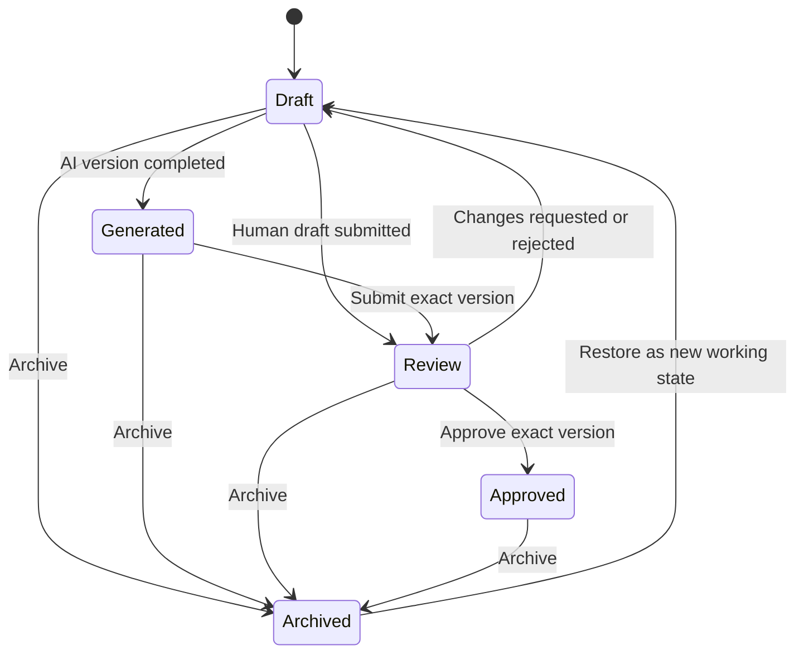

# Content Governance Foundation Design

**Status:** Design specification; not implemented  
**Primary engineering baseline:** English  
**Review translation:** `content-governance-design.zh-CN.md`

## 1. Purpose and Scope

The Content Governance Foundation manages AI-generated and human-authored marketing assets as controlled enterprise records. It provides ownership, immutable version history, human review, exact-version approval, auditability, tenant isolation, and safe archive behavior before the future Marketing Content Agent is enabled.

This layer does not generate content, send messages, schedule distribution, or perform external actions. Manual content assets must remain usable when AI is unavailable.

Core principles:

- PostgreSQL is the canonical content system of record.
- A content asset is a logical record; its text lives in immutable versions.
- AI generation never implies review or approval.
- Approval applies to one exact version and checksum.
- Every material edit creates a new version and requires new approval.
- Lifecycle transitions are deterministic application commands, not model decisions.

## 2. Content Asset Model

### 2.1 Content asset

A content asset is the stable business identity for one marketing deliverable across all revisions. It contains classification, ownership, lifecycle, and version pointers but not mutable canonical body text.

Proposed logical fields:

| Field | Purpose |
|---|---|
| `id` | External UUID |
| `tenant_id` | Mandatory tenant boundary |
| `domain_id` | Business domain, initially `commercial_kitchen` |
| `agent_id` | Optional generating agent identity |
| `title` | Human-readable working title |
| `content_type` | Controlled content format |
| `audience` | Primary intended B2B audience |
| `language` | BCP 47 content language |
| `channel` | Intended channel classification |
| `owner_membership_id` | Accountable business owner |
| `creator_membership_id` | Original creator |
| `status` | Current lifecycle state |
| `current_version_id` | Most recent selected version |
| `approved_version_id` | Exact currently approved version, if any |
| `record_version` | Optimistic-concurrency counter |
| `created_at`, `updated_at` | UTC timestamps |
| `archived_at`, `archived_by` | Archive attribution |

### 2.2 Controlled classifications

| Classification | Initial values |
|---|---|
| `content_type` | `website_article`, `case_study`, `tiktok_script`, `instagram_reel_script`, `facebook_post`, `email_draft` |
| `audience` | `schools`, `hospitals`, `factories`, `central_kitchens`, `project_owners`, `facility_managers` |
| `language` | `en`, `zh-CN`; future languages require approved terminology and evaluation |
| `channel` | `website`, `tiktok`, `instagram`, `facebook`, `email` |

The API should use controlled identifiers while the UI displays localized labels. One asset has one primary audience, language, and channel. A localized or channel-adapted derivative is a separate asset linked through optional lineage metadata rather than a mutable alternate body.

### 2.3 Ownership

- The creator records who first created the asset.
- The owner is accountable for keeping the asset accurate and moving it through review.
- Creator and owner may differ after an explicit, authorized reassignment.
- Reassignment is audited and does not alter version history.
- Deactivated users remain visible in historical attribution.

## 3. Content Version Management

### 3.1 Immutable versions

Every generated draft or material human edit creates a new immutable content version. Proposed version fields:

| Field | Purpose |
|---|---|
| `id` | Version UUID |
| `tenant_id`, `content_asset_id` | Isolation and parent identity |
| `version_number` | Monotonic number unique within the asset |
| `origin` | `human`, `ai_generated`, or `rollback` |
| `content_body` | Structured channel-specific content |
| `plain_text` | Safe review/search representation |
| `claims` | Structured factual claims and evidence references |
| `citations` | Exact approved knowledge citations |
| `generation_run_id` | Optional Agent Run reference |
| `based_on_version_id` | Predecessor or rollback source |
| `content_sha256` | Exact approval fingerprint |
| `created_by`, `created_at` | Attribution and UTC time |

Existing versions are never edited or deleted through ordinary workflows. Corrections create a successor version.

### 3.2 Current version

`current_version_id` identifies the version selected for current editing and review. Changing the pointer requires optimistic concurrency and a valid version belonging to the same tenant and asset.

Creating a new successor normally moves the current pointer to that version. If an approved asset is edited, its lifecycle returns to `draft`; the previous approval remains historical but is no longer the asset's active approval.

### 3.3 Approved version

`approved_version_id` points only to the exact version accepted by an authorized approver. The approval record stores the version ID and `content_sha256` so that changed content cannot reuse an earlier approval.

The approved pointer is cleared when:

- a successor version becomes current;
- material classification or audience metadata changes;
- the approval is explicitly rejected or withdrawn under an authorized correction flow;
- the asset is archived.

Historical approval records remain immutable.

### 3.4 Rollback strategy

Rollback never moves the current pointer directly to an old mutable record. It creates a new immutable successor whose content and citations are copied from the selected historical version, records `origin=rollback` and `based_on_version_id`, and returns the asset to `draft`.

The rollback version must complete review and approval again. This preserves chronological history and prevents old approval from silently authorizing a new business context.

### 3.5 Concurrent updates

- Asset metadata and pointer commands require `If-Match` or an explicit `record_version`.
- Version numbers are allocated transactionally under an asset-scoped lock or uniqueness constraint.
- Stale updates return `412 Precondition Failed`.
- Review and approval recheck the exact current version inside the transaction.

## 4. Content Lifecycle

The primary lifecycle is:

| State | Meaning | Allowed next actions |
|---|---|---|
| `draft` | Human-authored or editable working state; not approved | Create version, request AI generation, submit review, archive |
| `generated` | Valid AI-generated version exists; not reviewed | Edit into successor, submit review, archive |
| `review` | Exact current version is locked for human review | Approve, reject/request changes, archive |
| `approved` | Exact version and checksum accepted by an approver | Create successor draft, archive |
| `archived` | Asset excluded from active work | View history or restore to `draft` |

Generation failure does not create `generated`; the asset remains `draft` and the failed Agent Run is recorded separately. Restoring never restores previous approval automatically.

## 5. Approval Workflow

### 5.1 Roles

- **Creator:** creates the asset, brief, or manual version.
- **Owner:** accountable for content accuracy and workflow progress.
- **Reviewer:** evaluates audience fit, brand alignment, factual claims, citations, and prohibited content.
- **Approver:** accepts or rejects the exact reviewed version.

The application records the user membership performing each action. AI is recorded as the version origin and Agent Run, never as reviewer or approver.

### 5.2 Review submission

Submitting review must:

1. Confirm `content:submit_review` permission.
2. Confirm the asset belongs to the active tenant.
3. Confirm the current version exists and its checksum is stable.
4. Validate required structure, citations, knowledge eligibility, and prohibited claims.
5. Create an immutable review record for the exact version.
6. Move the asset to `review` in the same transaction.

### 5.3 Approval decision

Approval must:

1. Confirm `content:approve` permission and object access.
2. Recheck that the reviewed version is still current.
3. Recheck version checksum and deterministic validation results.
4. Enforce separation-of-duties policy.
5. Record decision, comment, approver, timestamp, version, and checksum.
6. Set `approved_version_id` and move the asset to `approved` transactionally.

Rejection or changes requested records a decision and returns the asset to `draft`. It never mutates the rejected version. Approval comments cannot replace missing evidence.

### 5.4 Separation of duties

The default policy prevents a creator from approving their own AI-generated content. Tenant policy may also require:

- a technical reviewer for technical statements;
- a brand reviewer for sensitive campaigns;
- a manager for named case studies or comparative claims.

No role may approve by editing database state directly or through an automation workflow.

## 6. Audit Logging

The content audit ledger is append-only and tenant-scoped.

Required events:

| Event | Minimum recorded details |
|---|---|
| `content.created` | Asset, creator, owner, classification |
| `content.metadata_updated` | Safe before/after metadata and record version |
| `content.version_created` | Version, origin, predecessor, checksum, Agent Run if applicable |
| `content.review_submitted` | Exact version, submitter, validation summary |
| `content.review_changes_requested` | Exact version, reviewer, structured reason |
| `content.rejected` | Exact version, decision maker, reason |
| `content.approved` | Exact version, approver, checksum |
| `content.archived` | Actor and reason |
| `content.restored` | Actor, source state, new working state |
| `content.owner_changed` | Previous and new owner |

Every event includes event ID, tenant ID, actor membership, timestamp, action, target asset/version, outcome, correlation ID, and safe metadata. Logs must not contain secrets, hidden reasoning, unnecessary prompt text, or full private source documents.

## 7. RBAC

| Permission | Allowed action |
|---|---|
| `content:create` | Create content assets and initial human drafts |
| `content:edit` | Update allowed metadata and create successor versions |
| `content:submit_review` | Submit the exact current version for review |
| `content:review` | Review and request changes |
| `content:approve` | Approve or reject the exact reviewed version |
| `content:archive` | Archive and, when policy permits, restore assets |
| `content:audit_read` | View version, decision, and audit history |

Recommended role defaults:

| Role | Default content permissions |
|---|---|
| Tenant Admin | All governance permissions |
| Marketing Manager | Create, edit, submit, review, approve, archive, audit read |
| Marketing User | Create, edit, submit, read own/team assets |
| Sales Manager | Read; optional review if explicitly assigned |
| Sales User / Technical User | Read or technical review only when explicitly granted |
| Viewer | Read approved assets only |

Role defaults do not replace tenant and object checks. Approval must remain independently assignable from creation and editing.

## 8. Knowledge Boundary

### 8.1 Marketing Agent access

The future Marketing Content Agent may retrieve only:

- approved public company and service information;
- approved public product information;
- approved, explicitly public case studies;
- approved brand guidelines and terminology;
- knowledge explicitly bound to the Marketing Content Agent.

### 8.2 Prohibited access

The Marketing Content Agent cannot access:

- internal pricing, discounts, margins, quotations, or cost data;
- supplier contracts or private supplier information;
- private customers, CRM records, leads, opportunities, messages, or contact details;
- internal SOP, staff policies, security information, or unpublished cases.

### 8.3 Enforcement

Authorization occurs before retrieval, embedding, queueing, or model calls. Eligible evidence must match tenant, domain, agent binding, public-marketing classification, approval, active version, processing status, language, and similarity threshold.

If evidence is missing, conflicting, or below threshold, the system records the condition and prevents the version from entering review until unsupported factual claims are removed or supported. Internal Knowledge Assistant access never transfers to the Marketing Content Agent.

## 9. Integration Boundaries

### Marketing Content Agent

The agent is a version producer, not a lifecycle authority. It may create a structured candidate version through the content application service after authorization. It cannot approve, archive, reassign ownership, or change lifecycle state directly.

### Knowledge Assistant

The internal Knowledge Assistant and Marketing Content Agent may reuse retrieval infrastructure, but use different agent identities, capabilities, knowledge bindings, visibility rules, and evaluation suites. Content governance stores only validated citations selected for a content version.

### Public Consultation Agent

No raw visitor conversation, contact information, or created lead is available to content generation. Future anonymized and aggregated topic trends require a separate approved analytics boundary and cannot identify individuals.

### CRM

The foundation does not read or write CRM. Future campaign attribution may reference a content asset ID in lead-source metadata, but the content model must not receive private lead or customer data.

### n8n

n8n may later send review notifications through a restricted service API. It cannot create approval decisions, select arbitrary versions, query production tables, or mutate lifecycle state directly.

## 10. Security and Operational Requirements

- Enforce tenant isolation through application authorization and PostgreSQL RLS.
- Use strict request schemas, object-level authorization, and parameterized persistence.
- Require optimistic concurrency for asset metadata and lifecycle commands.
- Store content and citations in PostgreSQL; store binary creative assets in private object storage.
- Treat prompts, content, citations, and model output as untrusted.
- Sanitize any rich-text representation before display.
- Use idempotency keys for generation, review submission, approval, rejection, archive, and restore commands.
- Record correlation IDs and safe structured logs without unnecessary content bodies.
- Keep model calls outside database transactions and preserve manual fallback.
- Never expose arbitrary prompts, tools, model selection, storage keys, or internal document IDs to ordinary callers.

## 11. Proposed Implementation Order

1. Content asset, immutable version, approval decision, and audit data model.
2. RLS policies, RBAC permissions, constraints, indexes, and optimistic concurrency.
3. Deterministic lifecycle application service and API contract.
4. Manual content creation, version history, review, approval, archive, and restore UI.
5. Permission, RLS, concurrent-update, checksum, rollback, and audit tests.
6. Marketing Content Agent integration as a bounded version producer.

The governance workflow should be validated with manual and synthetic versions before AI generation is enabled.

## 12. Acceptance Criteria

The foundation is complete when:

- An authorized creator can create a classified asset and immutable version.
- A material edit creates a successor and cannot overwrite history.
- A reviewer can request changes against an exact version.
- An authorized approver can approve only the unchanged reviewed version.
- Creating a successor invalidates the current approval.
- Rollback creates a new draft successor and requires new review.
- Archive removes the asset from active work without deleting history.
- Restore returns it to `draft` without restoring approval.
- Tenant, role, object, and separation-of-duties tests pass.
- All required actions are traceable through safe audit records.
- No external action or CRM mutation occurs.

## 13. Documentation Maintenance

This bilingual design pair must remain synchronized. Update it when the implemented content model, version semantics, lifecycle, permissions, knowledge boundary, or integration contract changes materially. Do not update `PROJECT_CONTEXT` or `CHANGELOG` until the governance capability is implemented and validated.
