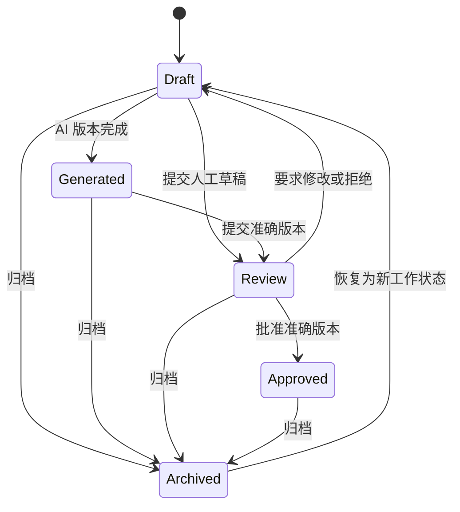

# 内容治理基础设计

**状态：** 设计规格；尚未实现  
**主要工程基线：** 英文  
**审核译本：** `content-governance-design.zh-CN.md`

## 1. 目的和范围

内容治理基础把 AI 生成和人工编写的营销资产作为受控企业记录进行管理。在未来营销内容智能体启用前，它提供所有权、不可变版本历史、人工审核、准确版本审批、可审计、租户隔离和安全归档行为。

该层不生成内容、不发送消息、不安排分发，也不执行外部动作。AI 不可用时，人工内容资产仍必须可以使用。

核心原则：

- PostgreSQL 是正式内容事实来源。
- 内容资产是逻辑记录；正文保存在不可变版本中。
- AI 生成不意味着已经审核或批准。
- 审批只适用于一个准确版本及其校验和。
- 每次实质编辑都创建新版本，并需要重新审批。
- 生命周期转换由确定性应用命令控制，而不是由模型决定。

## 2. 内容资产模型

### 2.1 内容资产

内容资产是一个营销交付物跨越所有修订的稳定业务身份。它包含分类、所有权、生命周期和版本指针，但不包含可变的正式正文。

建议逻辑字段：

| 字段 | 用途 |
|---|---|
| `id` | 外部 UUID |
| `tenant_id` | 强制租户边界 |
| `domain_id` | 业务领域，初始为 `commercial_kitchen` |
| `agent_id` | 可选生成智能体身份 |
| `title` | 人类可读工作标题 |
| `content_type` | 受控内容格式 |
| `audience` | 主要 B2B 目标受众 |
| `language` | BCP 47 内容语言 |
| `channel` | 预期渠道分类 |
| `owner_membership_id` | 负责的业务所有人 |
| `creator_membership_id` | 原始创建者 |
| `status` | 当前生命周期状态 |
| `current_version_id` | 最近选择的版本 |
| `approved_version_id` | 当前准确批准版本（如有） |
| `record_version` | 乐观并发计数器 |
| `created_at`, `updated_at` | UTC 时间戳 |
| `archived_at`, `archived_by` | 归档归属信息 |

### 2.2 受控分类

| 分类 | 初始值 |
|---|---|
| `content_type` | `website_article`、`case_study`、`tiktok_script`、`instagram_reel_script`、`facebook_post`、`email_draft` |
| `audience` | `schools`、`hospitals`、`factories`、`central_kitchens`、`project_owners`、`facility_managers` |
| `language` | `en`、`zh-CN`；未来语言需要经过批准的术语和评估 |
| `channel` | `website`、`tiktok`、`instagram`、`facebook`、`email` |

API 使用受控标识符，UI 显示本地化标签。一个资产只有一个主要受众、语言和渠道。本地化或渠道适配衍生内容是通过可选血缘元数据关联的独立资产，而不是同一资产中的可变替代正文。

### 2.3 所有权

- 创建者记录最初创建资产的人员。
- 所有人负责保持资产准确并推动审核流程。
- 创建者和所有人可以在明确授权的重新分配后不同。
- 重新分配需要审计，但不改变版本历史。
- 已停用用户仍会显示在历史归属中。

## 3. 内容版本管理

### 3.1 不可变版本

每个生成草稿或实质人工编辑都会创建新的不可变内容版本。建议版本字段：

| 字段 | 用途 |
|---|---|
| `id` | 版本 UUID |
| `tenant_id`, `content_asset_id` | 隔离和父级身份 |
| `version_number` | 资产内唯一的单调递增编号 |
| `origin` | `human`、`ai_generated` 或 `rollback` |
| `content_body` | 结构化渠道专用内容 |
| `plain_text` | 安全的审核/搜索表示 |
| `claims` | 结构化事实声明和证据引用 |
| `citations` | 准确的已批准知识引用 |
| `generation_run_id` | 可选 Agent Run 引用 |
| `based_on_version_id` | 前任版本或回滚来源 |
| `content_sha256` | 准确审批指纹 |
| `created_by`, `created_at` | 归属和 UTC 时间 |

现有版本永远不会通过普通工作流编辑或删除。修正通过创建后继版本完成。

### 3.2 当前版本

`current_version_id` 标识当前编辑和审核所选择的版本。更改指针需要乐观并发，并且目标版本必须属于同一租户和资产。

创建新后继版本通常会把当前指针移到该版本。如果已批准资产被编辑，其生命周期返回 `draft`；以前的审批保留为历史，但不再是资产的活动审批。

### 3.3 已批准版本

`approved_version_id` 只指向授权批准人接受的准确版本。审批记录保存版本 ID 和 `content_sha256`，因此修改后的内容不能复用以前的审批。

以下情况会清除已批准指针：

- 后继版本成为当前版本；
- 实质分类或受众元数据发生变化；
- 在授权修正流程中明确拒绝或撤销审批；
- 资产被归档。

历史审批记录保持不可变。

### 3.4 回滚策略

回滚不会把当前指针直接移动到旧的可变记录。系统创建一个新的不可变后继版本，从所选历史版本复制内容和引用，记录 `origin=rollback` 和 `based_on_version_id`，并把资产返回 `draft`。

回滚版本必须重新完成审核和审批。这样可以保留时间顺序历史，并防止旧审批静默授权新的业务上下文。

### 3.5 并发更新

- 资产元数据和指针命令要求 `If-Match` 或明确的 `record_version`。
- 版本号在事务中通过资产范围锁或唯一约束分配。
- 过期更新返回 `412 Precondition Failed`。
- 审核和批准在事务中重新检查准确的当前版本。

## 4. 内容生命周期

主要生命周期为：

| 状态 | 含义 | 允许的下一步动作 |
|---|---|---|
| `draft` | 人工编写或可编辑工作状态；尚未批准 | 创建版本、请求 AI 生成、提交审核、归档 |
| `generated` | 存在有效 AI 生成版本；尚未审核 | 编辑为后继版本、提交审核、归档 |
| `review` | 准确当前版本已锁定等待人工审核 | 批准、拒绝/要求修改、归档 |
| `approved` | 准确版本和校验和已被批准人接受 | 创建后继草稿、归档 |
| `archived` | 资产不再参与活动工作 | 查看历史或恢复为 `draft` |

生成失败不会创建 `generated` 状态；资产保持 `draft`，失败的 Agent Run 单独记录。恢复永远不会自动恢复以前的审批。

## 5. 审批工作流

### 5.1 角色

- **创建者：** 创建资产、Brief 或人工版本。
- **所有人：** 对内容准确性和流程推进负责。
- **审核人：** 评估受众适配、品牌一致、事实声明、引用和禁止内容。
- **批准人：** 接受或拒绝准确审核版本。

应用记录执行每个动作的用户 Membership。AI 记录为版本来源和 Agent Run，永远不会成为审核人或批准人。

### 5.2 提交审核

提交审核必须：

1. 确认 `content:submit_review` 权限。
2. 确认资产属于活动租户。
3. 确认当前版本存在且校验和稳定。
4. 验证必需结构、引用、知识资格和禁止声明。
5. 为准确版本创建不可变审核记录。
6. 在同一事务中把资产移动到 `review`。

### 5.3 审批决定

审批必须：

1. 确认 `content:approve` 权限和对象访问权。
2. 重新检查被审核版本仍然是当前版本。
3. 重新检查版本校验和和确定性验证结果。
4. 执行职责分离政策。
5. 记录决定、意见、批准人、时间、版本和校验和。
6. 在事务中设置 `approved_version_id` 并把资产移动到 `approved`。

拒绝或要求修改会记录决定，并把资产返回 `draft`，永远不会修改被拒绝版本。审批意见不能替代缺失证据。

### 5.4 职责分离

默认政策禁止创建者批准自己创建的 AI 生成内容。租户政策还可以要求：

- 技术声明由技术审核人确认；
- 敏感 Campaign 由品牌审核人确认；
- 具名案例或对比声明由经理确认。

任何角色都不能通过直接编辑数据库状态或自动化工作流进行批准。

## 6. 审计日志

内容审计账本为追加写入并按租户隔离。

必需事件：

| 事件 | 最低记录详情 |
|---|---|
| `content.created` | 资产、创建者、所有人、分类 |
| `content.metadata_updated` | 安全的变更前后元数据和记录版本 |
| `content.version_created` | 版本、来源、前任、校验和、相关 Agent Run |
| `content.review_submitted` | 准确版本、提交人、验证摘要 |
| `content.review_changes_requested` | 准确版本、审核人、结构化原因 |
| `content.rejected` | 准确版本、决定人、原因 |
| `content.approved` | 准确版本、批准人、校验和 |
| `content.archived` | 操作人和原因 |
| `content.restored` | 操作人、来源状态、新工作状态 |
| `content.owner_changed` | 前所有人和新所有人 |

每个事件包括事件 ID、租户 ID、操作 Membership、时间戳、动作、目标资产/版本、结果、Correlation ID 和安全元数据。日志不得包含密钥、隐藏推理、不必要的 Prompt 原文或完整私有来源文档。

## 7. RBAC

| 权限 | 允许动作 |
|---|---|
| `content:create` | 创建内容资产和初始人工草稿 |
| `content:edit` | 更新允许的元数据并创建后继版本 |
| `content:submit_review` | 提交准确当前版本审核 |
| `content:review` | 审核并要求修改 |
| `content:approve` | 批准或拒绝准确审核版本 |
| `content:archive` | 归档，并在政策允许时恢复资产 |
| `content:audit_read` | 查看版本、决定和审计历史 |

推荐角色默认值：

| 角色 | 默认内容权限 |
|---|---|
| Tenant Admin | 所有治理权限 |
| Marketing Manager | 创建、编辑、提交、审核、批准、归档、读取审计 |
| Marketing User | 创建、编辑、提交、读取本人/团队资产 |
| Sales Manager | 读取；明确分配时可选择审核 |
| Sales User / Technical User | 只有明确授权时才可读取或技术审核 |
| Viewer | 只能读取已批准资产 |

角色默认值不能替代租户和对象检查。批准权限必须保持可以与创建和编辑独立分配。

## 8. 知识边界

### 8.1 营销智能体访问权

未来营销内容智能体只能检索：

- 已批准的公开公司和服务信息；
- 已批准的公开产品信息；
- 已批准并且明确公开的案例；
- 已批准的品牌指南和术语；
- 明确绑定营销内容智能体的知识。

### 8.2 禁止访问

营销内容智能体不能访问：

- 内部价格、折扣、利润、报价或成本数据；
- 供应商合同或私有供应商信息；
- 私有客户、CRM 记录、线索、商机、消息或联系方式；
- 内部 SOP、员工政策、安全信息或未发布案例。

### 8.3 强制执行

授权发生在检索、嵌入、排队或模型调用之前。合格证据必须匹配租户、领域、智能体绑定、公开营销分类、审批、活动版本、处理状态、语言和相似度阈值。

如果证据缺失、冲突或低于阈值，系统记录该情况，并阻止版本进入审核，直到删除无依据事实声明或为其提供证据。内部知识助手访问权永远不会转移给营销内容智能体。

## 9. 集成边界

### 营销内容智能体

智能体是版本生产者，而不是生命周期权威。授权后，它可以通过内容应用服务创建结构化候选版本。它不能直接批准、归档、重新分配所有人或改变生命周期状态。

### 知识助手

内部知识助手和营销内容智能体可以复用检索基础设施，但使用不同智能体身份、能力、知识绑定、可见性规则和评估套件。内容治理只保存为某个内容版本选择的有效引用。

### 公开项目咨询智能体

任何原始访客对话、联系方式或已创建线索都不能供内容生成使用。未来匿名化和聚合的主题趋势需要独立批准的分析边界，并且不能识别个人。

### CRM

该基础层不读取或写入 CRM。未来 Campaign Attribution 可以在线索来源元数据中引用内容资产 ID，但内容模型不得接收私有线索或客户数据。

### n8n

n8n 未来可以通过受限服务 API 发送审核通知。它不能创建审批决定、选择任意版本、查询生产表或直接修改生命周期状态。

## 10. 安全和运营要求

- 通过应用授权和 PostgreSQL RLS 强制租户隔离。
- 使用严格请求 Schema、对象级授权和参数化持久化。
- 资产元数据和生命周期命令要求乐观并发。
- 内容和引用保存在 PostgreSQL；二进制创意资产保存在私有对象存储。
- 将 Prompt、内容、引用和模型输出视为不可信。
- 任何富文本表示在显示前必须清理。
- 生成、提交审核、批准、拒绝、归档和恢复命令使用幂等键。
- 记录 Correlation ID 和安全结构化日志，但不记录不必要的正文。
- 模型调用发生在数据库事务之外，并保留人工降级路径。
- 不向普通调用者暴露任意 Prompt、工具、模型选择、存储 Key 或内部文档 ID。

## 11. 建议实施顺序

1. 内容资产、不可变版本、审批决定和审计数据模型。
2. RLS 政策、RBAC 权限、约束、索引和乐观并发。
3. 确定性生命周期应用服务和 API 合同。
4. 人工内容创建、版本历史、审核、批准、归档和恢复 UI。
5. 权限、RLS、并发更新、校验和、回滚和审计测试。
6. 将营销内容智能体作为受限版本生产者接入。

治理工作流应先用人工和合成版本验证，再启用 AI 生成。

## 12. 验收标准

以下条件全部满足时，基础层才算完成：

- 授权创建者可以创建已分类资产和不可变版本。
- 实质编辑会创建后继版本，不能覆盖历史。
- 审核人可以针对准确版本要求修改。
- 授权批准人只能批准未经更改的审核版本。
- 创建后继版本会使当前审批失效。
- 回滚创建新的草稿后继版本，并需要重新审核。
- 归档会把资产移出活动工作，但不会删除历史。
- 恢复会把资产返回 `draft`，但不会恢复审批。
- 租户、角色、对象和职责分离测试通过。
- 所有必需动作都可以通过安全审计记录追溯。
- 不发生外部动作或 CRM 修改。

## 13. 文档维护

本中英文设计文档必须保持同步。当实际内容模型、版本语义、生命周期、权限、知识边界或集成合同发生实质变化时，应更新本文。内容治理能力实现并验证前，不更新 `PROJECT_CONTEXT` 或 `CHANGELOG`。
