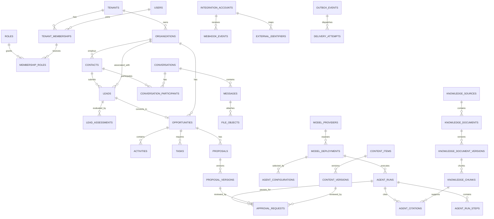

# Enterprise AI Business Development Agent Platform

## Database Design

> Chinese translation: [database-design.zh-CN.md](database-design.zh-CN.md). This English document is the primary engineering baseline.

**Reference business:** Sari Arta, Indonesia commercial kitchen engineering  
**Database:** PostgreSQL 16+  
**Extensions:** `pgvector`, `pg_trgm`, and optionally `citext`  
**Document version:** 1.0

> 中文审阅入口：[中文架构审阅指南](</Users/sujie/Documents/ChatGPT/Enterprise AI Business Development Agent Platform/docs/review-guide.zh-CN.md>)。重点参考其中“数据库设计怎么审核”和“业务方必须确认的事项”。

## Phase 2.5 schema addendum

Migration `9f31c6a7d2b4` implements `knowledge_sources`, `knowledge_bindings`,
`knowledge_documents`, `knowledge_ingestion_runs`, and `knowledge_chunks`. Every table has a non-null
`tenant_id`, forced RLS, and the `tenant_isolation` policy. Document bytes remain outside PostgreSQL.
Chunks store `vector(1536)` embeddings, source/document/ingestion lineage, page and section location,
and citation fingerprints. HNSW cosine indexing accelerates candidate retrieval while relational
tenant, agent-binding, source, approval, readiness, provider, and model filters remain authoritative.
See `docs/knowledge-foundation-design.en.md` for the complete state and relationship design.

## 1. Design goals

The database supports tenant-isolated CRM, omnichannel communication, AI-assisted workflows, knowledge retrieval, proposal/content lifecycle, integrations, approvals, and audit.

The design follows these rules:

- PostgreSQL is the canonical system of record.
- UUID primary keys prevent guessable sequential identifiers and work across distributed writers.
- Every tenant-owned row contains `tenant_id`.
- All timestamps use `timestamptz` and UTC.
- Monetary values use `numeric(19,4)` plus ISO 4217 currency code.
- Business state is explicit, constrained, and auditable.
- AI results are versioned artifacts, not silent overwrites of human-authored facts.
- Large binaries live in object storage; PostgreSQL stores metadata and integrity hashes.
- JSONB is reserved for variable provider metadata, policies, and snapshots—not routine relational fields.
- Foreign keys are required unless an append-only audit design deliberately stores a historical identifier.

## 2. Naming and shared columns

Names use lowercase `snake_case`. Table names are plural. Foreign keys use `<entity>_id`.

Most mutable tenant tables include:

| Column | Type | Rules |
|---|---|---|
| `id` | `uuid` | Primary key; generated server-side |
| `tenant_id` | `uuid` | Required FK to `tenants.id`; part of isolation and indexes |
| `created_at` | `timestamptz` | Required; default current transaction timestamp |
| `updated_at` | `timestamptz` | Required; updated on mutation |
| `created_by` | `uuid` | Nullable FK to `users.id` for system-originated data |
| `updated_by` | `uuid` | Nullable FK to `users.id` |
| `version` | `integer` | Required default `1`; optimistic concurrency |
| `deleted_at` | `timestamptz` | Nullable soft-delete marker where recovery is required |

Use database check constraints for numeric bounds and finite state values. Prefer lookup/configuration tables when a value set is tenant-configurable; use PostgreSQL enums sparingly because they complicate zero-downtime changes.

## 3. Entity relationship design



## 4. Core tenancy and access tables

### 4.1 `tenants`

| Field | Type | Constraints / purpose |
|---|---|---|
| `id` | `uuid` | PK |
| `slug` | `varchar(80)` | Unique, normalized public identifier |
| `name` | `varchar(200)` | Required |
| `status` | `varchar(30)` | `active`, `suspended`, `closed` |
| `default_locale` | `varchar(20)` | Default `en` |
| `default_timezone` | `varchar(64)` | IANA name, e.g. `Asia/Jakarta` |
| `default_currency` | `char(3)` | ISO 4217, e.g. `IDR` |
| `data_region` | `varchar(40)` | Deployment/data residency designation |
| `settings` | `jsonb` | Validated tenant feature and policy settings |
| `created_at`, `updated_at` | `timestamptz` | Required |

### 4.2 `users`

Global identity profile; authorization is tenant-membership based.

| Field | Type | Constraints / purpose |
|---|---|---|
| `id` | `uuid` | PK |
| `identity_provider` | `varchar(50)` | Required |
| `external_subject` | `varchar(255)` | Required; unique with provider |
| `email` | `citext` | Required |
| `display_name` | `varchar(200)` | Required |
| `locale` | `varchar(20)` | Nullable |
| `timezone` | `varchar(64)` | Nullable |
| `status` | `varchar(30)` | `active`, `disabled` |
| `last_login_at` | `timestamptz` | Nullable |
| `created_at`, `updated_at` | `timestamptz` | Required |

### 4.3 `tenant_memberships`

| Field | Type | Constraints / purpose |
|---|---|---|
| `id`, `tenant_id` | `uuid` | PK; tenant FK |
| `user_id` | `uuid` | FK `users`; unique with tenant |
| `status` | `varchar(30)` | `invited`, `active`, `suspended` |
| `job_title` | `varchar(120)` | Nullable |
| `manager_membership_id` | `uuid` | Nullable self-FK |
| `invited_at`, `joined_at` | `timestamptz` | Nullable lifecycle dates |
| `created_at`, `updated_at`, `version` | mixed | Shared columns |

### 4.4 `roles`, `permissions`, `role_permissions`, `membership_roles`

| Table | Important fields |
|---|---|
| `roles` | `id`, `tenant_id` nullable for platform templates, `code`, `name`, `description`, `is_system`, timestamps; unique `(tenant_id, code)` |
| `permissions` | `id`, `code` unique, `description`, `risk_level` |
| `role_permissions` | `role_id`, `permission_id`; composite PK |
| `membership_roles` | `membership_id`, `role_id`, `granted_by`, `granted_at`, `expires_at`; unique active grant |

## 5. CRM tables

### 5.1 `organizations`

Represents prospects, customers, partners, and other companies.

| Field | Type | Constraints / purpose |
|---|---|---|
| Shared mutable fields | mixed | Includes tenant, audit, version, soft delete |
| `legal_name` | `varchar(250)` | Required |
| `display_name` | `varchar(250)` | Required |
| `organization_type` | `varchar(30)` | `prospect`, `customer`, `partner`, `supplier`, `other` |
| `website_url` | `text` | Nullable; normalized |
| `domain` | `citext` | Nullable |
| `industry` | `varchar(120)` | Nullable |
| `employee_range` | `varchar(40)` | Nullable |
| `country_code` | `char(2)` | ISO 3166-1 alpha-2 |
| `city` | `varchar(120)` | Nullable |
| `address` | `jsonb` | Validated postal-address structure |
| `preferred_language` | `varchar(20)` | Nullable |
| `owner_membership_id` | `uuid` | Nullable FK membership |
| `lifecycle_stage` | `varchar(30)` | `prospect`, `qualified`, `customer`, `inactive` |
| `research_status` | `varchar(30)` | `not_started`, `draft`, `verified`, `stale` |
| `verified_at`, `verified_by` | mixed | Nullable human verification |
| `metadata` | `jsonb` | Limited custom attributes |

### 5.2 `contacts`

| Field | Type | Constraints / purpose |
|---|---|---|
| Shared mutable fields | mixed | Tenant-scoped |
| `organization_id` | `uuid` | Nullable FK |
| `first_name`, `last_name` | `varchar(120)` | At least one name or channel identity required |
| `job_title`, `department` | `varchar(120)` | Nullable |
| `email` | `citext` | Nullable; normalized |
| `phone_e164` | `varchar(20)` | Nullable; E.164 |
| `whatsapp_e164` | `varchar(20)` | Nullable |
| `country_code` | `char(2)` | Nullable |
| `preferred_language` | `varchar(20)` | Nullable |
| `preferred_channel` | `varchar(30)` | Nullable |
| `marketing_consent_status` | `varchar(30)` | `unknown`, `granted`, `denied`, `withdrawn` |
| `marketing_consent_at` | `timestamptz` | Nullable |
| `do_not_contact` | `boolean` | Required default false |
| `owner_membership_id` | `uuid` | Nullable FK |

Global uniqueness is intentionally avoided for email/phone because different tenants may know the same person. Partial tenant-scoped uniqueness may be enabled after duplicate-resolution policy is defined.

### 5.3 `leads`

| Field | Type | Constraints / purpose |
|---|---|---|
| Shared mutable fields | mixed | Tenant-scoped |
| `contact_id` | `uuid` | Nullable FK |
| `organization_id` | `uuid` | Nullable FK |
| `source_channel` | `varchar(30)` | `website`, `whatsapp`, `email`, `instagram`, `facebook`, `tiktok`, `manual`, `import`, `partner` |
| `source_detail` | `varchar(200)` | Campaign/form/account detail |
| `inquiry_summary` | `text` | Required normalized summary |
| `status` | `varchar(30)` | `new`, `qualifying`, `qualified`, `nurture`, `disqualified`, `converted`, `archived` |
| `priority` | `varchar(20)` | `low`, `normal`, `high`, `urgent` |
| `owner_membership_id` | `uuid` | Nullable FK |
| `estimated_value` | `numeric(19,4)` | Nullable, nonnegative |
| `currency` | `char(3)` | Required when value exists |
| `target_timeline` | `varchar(100)` | Nullable |
| `project_country_code` | `char(2)` | Nullable |
| `qualification_score` | `numeric(5,2)` | Nullable, 0–100; latest approved/deterministic score |
| `qualified_at`, `disqualified_at`, `converted_at` | `timestamptz` | Nullable |
| `disqualification_reason` | `varchar(200)` | Required when disqualified |
| `converted_opportunity_id` | `uuid` | Nullable unique FK |
| `last_activity_at` | `timestamptz` | Denormalized sort field |

### 5.4 `lead_assessments`

Append-only versions of AI or human qualification.

| Field | Type | Constraints / purpose |
|---|---|---|
| `id`, `tenant_id`, timestamps | mixed | Standard identifiers |
| `lead_id` | `uuid` | Required FK |
| `assessment_version` | `integer` | Unique with lead |
| `assessor_type` | `varchar(20)` | `agent`, `human`, `rule` |
| `assessor_user_id` | `uuid` | Nullable FK |
| `agent_run_id` | `uuid` | Nullable FK |
| `score` | `numeric(5,2)` | 0–100 |
| `tier` | `varchar(20)` | Tenant policy value such as `hot`, `warm`, `cold` |
| `need_summary` | `text` | Nullable |
| `budget_status`, `authority_status`, `need_status`, `timeline_status` | `varchar(30)` | Qualification dimensions |
| `recommended_action` | `text` | Required |
| `missing_information` | `jsonb` | Validated string array |
| `evidence` | `jsonb` | Validated evidence references |
| `confidence` | `numeric(5,4)` | 0–1 |
| `review_status` | `varchar(30)` | `not_required`, `pending`, `approved`, `rejected`, `superseded` |
| `reviewed_by`, `reviewed_at` | mixed | Nullable |

### 5.5 `opportunities`

| Field | Type | Constraints / purpose |
|---|---|---|
| Shared mutable fields | mixed | Tenant-scoped |
| `organization_id` | `uuid` | Required FK |
| `primary_contact_id` | `uuid` | Nullable FK |
| `source_lead_id` | `uuid` | Nullable unique FK |
| `name` | `varchar(250)` | Required |
| `description` | `text` | Nullable |
| `stage` | `varchar(40)` | Tenant-configurable controlled value |
| `status` | `varchar(20)` | `open`, `won`, `lost`, `cancelled` |
| `probability` | `numeric(5,2)` | 0–100 |
| `estimated_value` | `numeric(19,4)` | Nonnegative |
| `currency` | `char(3)` | Required |
| `expected_close_date` | `date` | Nullable |
| `project_country_code`, `project_city` | mixed | Project location |
| `requirements` | `jsonb` | Validated structured commercial-kitchen requirements |
| `owner_membership_id` | `uuid` | Required FK |
| `won_at`, `lost_at` | `timestamptz` | Nullable |
| `loss_reason` | `varchar(200)` | Required for lost status |
| `last_activity_at` | `timestamptz` | Denormalized |

### 5.6 `activities` and `tasks`

| Table | Fields |
|---|---|
| `activities` | Shared fields; nullable `lead_id`, `opportunity_id`, `organization_id`, `contact_id`; `activity_type`, `occurred_at`, `subject`, `description`, `channel`, `actor_membership_id`, `source_message_id`, `metadata`. Constraint requires at least one business parent. |
| `tasks` | Shared fields; nullable `lead_id`, `opportunity_id`, `organization_id`; `title`, `description`, `status`, `priority`, `assigned_to`, `due_at`, `completed_at`, `reminder_at`, `source`, `automation_execution_id`. |

## 6. Conversation and file tables

### 6.1 `conversations`

| Field | Type | Constraints / purpose |
|---|---|---|
| Shared mutable fields | mixed | Tenant-scoped |
| `channel` | `varchar(30)` | Canonical channel |
| `integration_account_id` | `uuid` | Nullable FK |
| `external_thread_id` | `varchar(255)` | Nullable; unique per account |
| `subject` | `varchar(500)` | Nullable |
| `status` | `varchar(20)` | `open`, `pending`, `closed`, `spam` |
| `lead_id`, `opportunity_id` | `uuid` | Nullable FKs |
| `assigned_to` | `uuid` | Nullable membership FK |
| `last_message_at` | `timestamptz` | Required |
| `unread_count` | `integer` | Denormalized, nonnegative |

### 6.2 `conversation_participants`

| Field | Type | Constraints / purpose |
|---|---|---|
| `id`, `tenant_id` | `uuid` | Identifiers |
| `conversation_id` | `uuid` | Required FK |
| `participant_type` | `varchar(20)` | `contact`, `user`, `external` |
| `contact_id`, `user_id` | `uuid` | Exactly one when corresponding type |
| `external_address` | `varchar(320)` | Email/phone/provider identity |
| `display_name` | `varchar(200)` | Nullable |
| `joined_at`, `left_at` | `timestamptz` | Lifecycle |

### 6.3 `messages`

| Field | Type | Constraints / purpose |
|---|---|---|
| `id`, `tenant_id`, timestamps | mixed | Identifiers |
| `conversation_id` | `uuid` | Required FK |
| `direction` | `varchar(10)` | `inbound`, `outbound`, `internal` |
| `sender_type` | `varchar(20)` | `contact`, `user`, `agent`, `system` |
| `sender_contact_id`, `sender_user_id` | `uuid` | Nullable FKs |
| `external_message_id` | `varchar(255)` | Nullable; unique per integration account |
| `idempotency_key` | `varchar(255)` | Nullable |
| `content_type` | `varchar(30)` | `text`, `html`, `image`, `document`, `audio`, `template`, `event` |
| `body_text` | `text` | Sanitized/plain form |
| `body_html` | `text` | Nullable, sanitized |
| `language` | `varchar(20)` | Nullable |
| `delivery_status` | `varchar(30)` | `received`, `draft`, `queued`, `sent`, `delivered`, `read`, `failed` |
| `sent_at`, `delivered_at`, `read_at` | `timestamptz` | Nullable |
| `reply_to_message_id` | `uuid` | Nullable self-FK |
| `agent_run_id` | `uuid` | Nullable FK for generated drafts |
| `provider_metadata` | `jsonb` | Redacted provider fields |

### 6.4 `file_objects`

| Field | Type | Constraints / purpose |
|---|---|---|
| Shared identifiers | mixed | Tenant-scoped |
| `message_id` | `uuid` | Nullable FK |
| `purpose` | `varchar(40)` | `attachment`, `knowledge_source`, `proposal`, `content`, `export`, `avatar` |
| `storage_provider`, `bucket`, `object_key` | text | Required; object key unique in bucket |
| `original_filename` | `varchar(500)` | Required, sanitized for display |
| `media_type` | `varchar(150)` | Required |
| `size_bytes` | `bigint` | Nonnegative |
| `sha256` | `char(64)` | Required |
| `malware_status` | `varchar(30)` | `pending`, `clean`, `quarantined`, `failed` |
| `encryption_key_ref` | `varchar(255)` | Nullable key reference, never key material |
| `retention_until` | `timestamptz` | Nullable |

## 7. Knowledge-base tables

### 7.1 `knowledge_sources`

| Field | Type | Constraints / purpose |
|---|---|---|
| Shared mutable fields | mixed | Tenant-scoped |
| `name` | `varchar(200)` | Required |
| `source_type` | `varchar(30)` | `upload`, `website`, `catalog`, `manual`, `integration` |
| `base_uri` | `text` | Nullable |
| `status` | `varchar(30)` | `active`, `paused`, `error`, `archived` |
| `access_scope` | `varchar(30)` | `tenant`, `role_restricted`, `private` |
| `ingestion_config` | `jsonb` | Validated connector/chunk policy without secrets |
| `last_synced_at` | `timestamptz` | Nullable |

### 7.2 `knowledge_documents`

| Field | Type | Constraints / purpose |
|---|---|---|
| Shared mutable fields | mixed | Tenant-scoped |
| `source_id` | `uuid` | Required FK |
| `external_key` | `varchar(500)` | Nullable; unique per source |
| `title` | `varchar(500)` | Required |
| `document_type` | `varchar(50)` | Product catalog, case study, policy, capability, etc. |
| `language` | `varchar(20)` | Required |
| `status` | `varchar(30)` | `draft`, `processing`, `active`, `quarantined`, `archived` |
| `access_policy` | `jsonb` | Validated role/user constraints |
| `effective_from`, `effective_until` | `timestamptz` | Nullable |
| `current_version_id` | `uuid` | Nullable FK set after version creation |

### 7.3 `knowledge_document_versions`

Immutable normalized versions.

| Field | Type | Constraints / purpose |
|---|---|---|
| `id`, `tenant_id`, timestamps | mixed | Identifiers |
| `document_id` | `uuid` | Required FK |
| `version_number` | `integer` | Unique with document |
| `file_object_id` | `uuid` | Nullable FK |
| `content_sha256` | `char(64)` | Required |
| `extracted_text` | `text` | Nullable; restricted access |
| `metadata` | `jsonb` | Page count, parser, headings |
| `processing_status` | `varchar(30)` | `pending`, `extracting`, `embedding`, `ready`, `failed` |
| `parser_version`, `chunking_version`, `embedding_model` | `varchar(120)` | Reproducibility |
| `approved_by`, `approved_at` | mixed | Required before active retrieval |

### 7.4 `knowledge_chunks`

| Field | Type | Constraints / purpose |
|---|---|---|
| `id`, `tenant_id`, `created_at` | mixed | Identifiers |
| `document_version_id` | `uuid` | Required FK |
| `chunk_index` | `integer` | Unique with version |
| `content` | `text` | Required |
| `content_tsv` | `tsvector` | Generated/stored search vector |
| `embedding` | `vector(N)` | Dimension fixed by selected embedding model |
| `token_count` | `integer` | Nonnegative |
| `page_start`, `page_end` | `integer` | Nullable |
| `section_path` | `text[]` | Heading ancestry |
| `content_sha256` | `char(64)` | Required |
| `metadata` | `jsonb` | Bounded retrieval metadata |

Changing embedding dimensions requires a new column/table migration or parallel embedding table; do not mix dimensions in one vector column.

## 8. AI agent tables

### 8.1 `model_providers`, `model_deployments`, and `model_routing_policies`

These tables separate agent workflows from a specific vendor or endpoint.

| Table | Fields |
|---|---|
| `model_providers` | `id`, optional `tenant_id` for tenant-owned provider, `provider_key`, `provider_type` (`openai`, `qwen_cloud`, `openai_compatible`, `local`, `custom`), `name`, `status`, `credential_secret_ref`, `base_url_secret_ref` or approved internal endpoint reference, `data_region`, `external_processing`, `retention_policy`, `training_use_policy`, `settings`, timestamps. No credential value is stored. |
| `model_deployments` | `id`, optional `tenant_id`, `model_provider_id`, `deployment_key`, `model_id`, `immutable_version`, `status` (`testing`, `active`, `degraded`, `disabled`, `retired`), `capabilities`, `supported_languages`, `context_limit`, `output_limit`, `data_classifications_allowed`, `unit_cost_config`, `concurrency_limit`, `timeout_seconds`, `health_status`, `last_verified_at`, `evaluation_version`, timestamps; unique `(tenant_id, deployment_key)`. |
| `model_routing_policies` | `id`, `tenant_id`, `workflow_type`, `version_number`, `status`, `primary_deployment_id`, `fallback_deployment_ids` ordered UUID array or normalized child rows, `required_capabilities`, `allowed_provider_types`, `allowed_data_regions`, `maximum_data_classification`, `fallback_behavior`, `budget_policy`, `activated_by`, `activated_at`, timestamps; unique `(tenant_id, workflow_type, version_number)`. |

Use a normalized `model_routing_policy_fallbacks` child table instead of an array if fallback conditions or per-entry ordering grow complex. A local model deployment is still treated as an external execution dependency from the application database's perspective and receives no database credentials.

### 8.2 `agent_configurations`

| Field | Type | Constraints / purpose |
|---|---|---|
| `id`, `tenant_id`, timestamps | mixed | Tenant nullable only for platform template |
| `agent_key` | `varchar(80)` | e.g. `lead_qualification`; unique with tenant/version |
| `version_number` | `integer` | Required |
| `status` | `varchar(20)` | `draft`, `active`, `retired` |
| `default_model_deployment_id` | `uuid` | Nullable FK; used when no active tenant routing policy overrides it |
| `required_model_capabilities` | `jsonb` | Structured output, tool use, vision, language, context, and other requirements |
| `instructions_ref` | `varchar(255)` | Versioned prompt/config reference |
| `tool_policy` | `jsonb` | Allowed tool names and limits |
| `guardrail_policy` | `jsonb` | Validated guardrail configuration |
| `output_schema_version` | `varchar(50)` | Required |
| `runtime_config` | `jsonb` | Temperature/reasoning/budgets as supported |
| `activated_by`, `activated_at` | mixed | Nullable |

### 8.3 `agent_runs`

| Field | Type | Constraints / purpose |
|---|---|---|
| `id`, `tenant_id`, timestamps | mixed | Tenant-scoped |
| `agent_configuration_id` | `uuid` | Required FK |
| `workflow_type` | `varchar(80)` | Required |
| `status` | `varchar(30)` | `queued`, `running`, `awaiting_approval`, `succeeded`, `failed`, `cancelled` |
| `initiated_by_type` | `varchar(20)` | `user`, `automation`, `system`, `customer` |
| `initiated_by_user_id` | `uuid` | Nullable |
| `service_account_id` | `uuid` | Nullable |
| `lead_id`, `opportunity_id`, `conversation_id` | `uuid` | Nullable scoped business FKs |
| `input_snapshot` | `jsonb` | Minimized, validated run input |
| `output_result` | `jsonb` | Nullable validated structured output |
| `input_schema_version`, `output_schema_version` | `varchar(50)` | Required |
| `trace_id`, `provider_response_id` | `varchar(255)` | Nullable correlations |
| `model_routing_policy_id` | `uuid` | Nullable FK to the effective routing-policy version |
| `model_deployment_id` | `uuid` | Required FK to the actual deployment used |
| `provider_type`, `model_id`, `model_version` | `varchar(120)` | Immutable execution snapshot for audit |
| `routing_reason`, `fallback_reason` | `varchar(255)` | Nullable safe routing metadata |
| `input_tokens`, `output_tokens` | `bigint` | Nullable, nonnegative |
| `estimated_cost` | `numeric(19,6)` | Nullable |
| `cost_currency` | `char(3)` | Nullable |
| `started_at`, `completed_at` | `timestamptz` | Nullable |
| `error_code`, `error_message_safe` | text | Nullable |
| `retention_until` | `timestamptz` | Nullable |

### 8.4 `agent_run_steps`, `agent_citations`, and `approval_requests`

| Table | Fields |
|---|---|
| `agent_run_steps` | `id`, `tenant_id`, `agent_run_id`, `sequence_no`, `step_type` (`model`, `tool`, `handoff`, `guardrail`, `approval`, `retrieval`), `name`, `status`, `started_at`, `completed_at`, `input_redacted`, `output_redacted`, `tool_call_id`, `error_code`; unique `(agent_run_id, sequence_no)` |
| `agent_citations` | `id`, `tenant_id`, `agent_run_id`, optional `agent_run_step_id`, `knowledge_chunk_id`, `claim_key`, `quote_excerpt` with strict length cap, `relevance_score`, `position`; unique logical citation |
| `approval_requests` | `id`, `tenant_id`, optional `agent_run_id`, `proposal_version_id`, `content_version_id`; `action_type`, `action_digest`, `status`, `requested_by`, `assigned_to`, `requested_at`, `expires_at`, `decided_by`, `decided_at`, `decision_comment`, `preview_snapshot`. Exactly one subject required. |

## 9. Proposal and content tables

### 9.1 `proposal_templates`, `proposals`, and `proposal_versions`

| Table | Fields |
|---|---|
| `proposal_templates` | Shared fields; `name`, `language`, `country_code`, `template_type`, `file_object_id`, `schema_version`, `status`, `is_default` |
| `proposals` | Shared fields; `opportunity_id`, `title`, `status` (`draft`, `in_review`, `approved`, `issued`, `accepted`, `rejected`, `expired`, `superseded`), `current_version_id`, `owner_membership_id`, `valid_until`, `issued_at`, `accepted_at` |
| `proposal_versions` | `id`, `tenant_id`, timestamps, `proposal_id`, `version_number`, `template_id`, `source_agent_run_id`, `language`, `currency`, `content` JSONB conforming to versioned schema, `subtotal`, `tax_amount`, `total_amount`, `assumptions`, `rendered_file_id`, `content_sha256`, `created_by`; unique `(proposal_id, version_number)` |

Commercial totals are computed and validated by deterministic services. The agent may propose line-item descriptions but does not authoritatively calculate or approve pricing.

### 9.2 `content_items` and `content_versions`

| Table | Fields |
|---|---|
| `content_items` | Shared fields; `title`, `content_type`, `channel`, `campaign_name`, `status` (`draft`, `in_review`, `approved`, `scheduled`, `published`, `archived`), `owner_membership_id`, `current_version_id`, `scheduled_at`, `published_at` |
| `content_versions` | `id`, `tenant_id`, timestamps, `content_item_id`, `version_number`, `source_agent_run_id`, `language`, `body`, `structured_content`, `claims`, `content_sha256`, `created_by`; unique `(content_item_id, version_number)` |

## 10. Integration, automation, and reliability tables

### 10.1 `integration_accounts`

| Field | Type | Constraints / purpose |
|---|---|---|
| Shared mutable fields | mixed | Tenant-scoped |
| `provider` | `varchar(50)` | Required |
| `account_name` | `varchar(200)` | Required |
| `status` | `varchar(30)` | `pending`, `active`, `degraded`, `disabled` |
| `external_account_id` | `varchar(255)` | Nullable |
| `credential_secret_ref` | `varchar(500)` | Secret-manager reference only |
| `scopes` | `text[]` | Granted provider scopes |
| `webhook_secret_ref` | `varchar(500)` | Secret reference |
| `settings` | `jsonb` | Non-secret validated configuration |
| `last_verified_at`, `last_error_at` | `timestamptz` | Nullable |
| `last_error_code` | `varchar(100)` | Nullable |

### 10.2 Integration support tables

| Table | Fields |
|---|---|
| `external_identifiers` | `id`, `tenant_id`, `integration_account_id`, `entity_type`, `entity_id`, `external_id`, `external_url`, timestamps; unique `(integration_account_id, entity_type, external_id)` |
| `webhook_events` | `id`, `tenant_id`, `integration_account_id`, `provider_event_id`, `event_type`, `received_at`, `signature_valid`, `payload`, `payload_sha256`, `status`, `attempt_count`, `processed_at`, `error_code`; unique provider event when supplied |
| `automation_executions` | `id`, `tenant_id`, `workflow_key`, `workflow_version`, `n8n_execution_id`, `trigger_type`, `trigger_ref`, `status`, `started_at`, `completed_at`, `error_code`; unique n8n execution per environment |

Raw webhook payload access is restricted and retained for a short configurable period.

### 10.3 `outbox_events` and `delivery_attempts`

| Table | Fields |
|---|---|
| `outbox_events` | `id` UUID, `tenant_id`, `aggregate_type`, `aggregate_id`, `event_type`, `event_version`, `payload`, `occurred_at`, `available_at`, `published_at`, `attempt_count`, `status`; created in same transaction as aggregate mutation |
| `delivery_attempts` | `id`, `tenant_id`, `outbox_event_id`, `destination_type`, `destination_key`, `attempt_no`, `status`, `started_at`, `completed_at`, `response_code`, `error_code`, `next_retry_at`; unique `(outbox_event_id, destination_key, attempt_no)` |

### 10.4 `idempotency_keys`

| Field | Type | Constraints / purpose |
|---|---|---|
| `tenant_id` | `uuid` | Tenant or designated public-ingress tenant |
| `principal_key` | `varchar(255)` | User/service/channel identity |
| `idempotency_key` | `varchar(255)` | Client key |
| `request_hash` | `char(64)` | Detects key reuse with different request |
| `response_status` | `integer` | Stored successful response |
| `response_body` | `jsonb` | Size-limited |
| `resource_type`, `resource_id` | mixed | Created resource reference |
| `created_at`, `expires_at` | `timestamptz` | Lifecycle |

Composite PK: `(tenant_id, principal_key, idempotency_key)`.

### 10.5 `import_jobs` and `export_jobs`

Import and export state is durable even when workers restart.

| Table | Fields |
|---|---|
| `import_jobs` | `id`, `tenant_id`, timestamps, `resource_type`, `source_file_id`, `mapping_version`, `duplicate_policy`, `status` (`uploaded`, `validating`, `validation_failed`, `ready`, `applying`, `completed`, `failed`, `cancelled`), `dry_run`, `validation_summary`, `result_file_id`, `row_count`, `success_count`, `failure_count`, `request_digest`, `requested_by`, `confirmed_by`, `confirmed_at`, `error_code` |
| `export_jobs` | `id`, `tenant_id`, timestamps, `resource_type`, `format`, `filter_snapshot`, `field_set`, `purpose`, `status` (`queued`, `running`, `awaiting_approval`, `completed`, `failed`, `expired`, `cancelled`), `approval_request_id`, `result_file_id`, `row_count`, `requested_by`, `completed_at`, `expires_at`, `error_code` |

An import confirmation must match the validated `request_digest`. Export filters and fields are server-validated and stored as a bounded snapshot; no arbitrary SQL is accepted.

## 11. Audit and compliance tables

### 11.1 `audit_events`

Append-only and immutable to application roles.

| Field | Type | Constraints / purpose |
|---|---|---|
| `id` | `uuid` | PK |
| `tenant_id` | `uuid` | Nullable only for platform event |
| `occurred_at` | `timestamptz` | Required; partition key |
| `actor_type` | `varchar(30)` | `user`, `service`, `agent`, `system`, `customer` |
| `actor_id` | `uuid` | Nullable |
| `session_id` | `varchar(255)` | Nullable |
| `action` | `varchar(120)` | Required namespaced action |
| `target_type`, `target_id` | mixed | Nullable |
| `outcome` | `varchar(20)` | `success`, `denied`, `failure` |
| `reason_code` | `varchar(100)` | Nullable |
| `request_id`, `trace_id` | `varchar(255)` | Correlation |
| `source_ip` | `inet` | Nullable; access restricted |
| `user_agent` | `text` | Nullable, length-limited |
| `before_summary`, `after_summary` | `jsonb` | Redacted/minimized |
| `metadata` | `jsonb` | Validated bounded metadata |
| `integrity_hash` | `char(64)` | Optional tamper-evidence chain/hash |

### 11.2 `data_subject_requests`

Tracks export, correction, restriction, and erasure.

| Field | Type | Constraints / purpose |
|---|---|---|
| Shared fields | mixed | Tenant-scoped |
| `request_type` | `varchar(30)` | `access`, `export`, `correct`, `restrict`, `erase` |
| `contact_id` | `uuid` | Nullable FK |
| `requester_reference` | `varchar(255)` | Required |
| `status` | `varchar(30)` | `received`, `verifying`, `processing`, `completed`, `rejected` |
| `verified_at`, `due_at`, `completed_at` | `timestamptz` | Lifecycle |
| `result_file_id` | `uuid` | Nullable FK |
| `decision_reason` | `text` | Nullable |
| `legal_hold` | `boolean` | Required default false |

## 12. Relationship and deletion rules

- Tenant deletion is a controlled asynchronous compliance operation, not `ON DELETE CASCADE`.
- CRM parent deletion normally uses soft deletion and retains audit/history.
- Immutable versions cannot be updated except for restricted processing/approval metadata; corrections create a new version.
- A lead may convert to at most one opportunity; an opportunity may reference at most one source lead.
- A proposal belongs to exactly one opportunity and has many immutable versions.
- An agent run may reference several business objects but always exactly one tenant and one configuration version.
- Knowledge chunks cascade only when an unapproved/failed document version is safely purged. Active version removal follows retention workflow.
- Join-table rows may use cascade deletion when they have no independent compliance meaning, such as role-permission mappings.
- Provider identifiers are never used as internal primary keys.

Composite foreign-key techniques or triggers should verify that referenced rows have the same `tenant_id`. Repository tests must also prove cross-tenant references cannot be created.

## 13. Index strategy

### 13.1 General rules

1. PostgreSQL does not automatically index foreign keys; index every frequently joined or cascaded FK.
2. Put `tenant_id` first in indexes used by tenant-scoped queries.
3. Match equality columns before range/sort columns.
4. Use partial indexes for active/non-deleted operational rows.
5. Avoid duplicate indexes covered by unique constraints or wider indexes.
6. Confirm with `EXPLAIN (ANALYZE, BUFFERS)` on production-like volumes.
7. Track unused, bloated, and missing indexes; create large indexes concurrently.

### 13.2 Required unique indexes

| Table | Index |
|---|---|
| `tenants` | Unique lower/normalized `slug` |
| `users` | Unique `(identity_provider, external_subject)` |
| `tenant_memberships` | Unique `(tenant_id, user_id)` |
| `roles` | Unique `(tenant_id, code)`, treating platform templates separately |
| `lead_assessments` | Unique `(tenant_id, lead_id, assessment_version)` |
| `conversations` | Unique partial `(tenant_id, integration_account_id, external_thread_id)` where external ID is not null |
| `messages` | Unique partial provider/account/message identifier; unique scoped idempotency key |
| `knowledge_document_versions` | Unique `(tenant_id, document_id, version_number)` |
| `knowledge_chunks` | Unique `(tenant_id, document_version_id, chunk_index)` |
| `model_providers` | Unique scoped `(tenant_id, provider_key)` with a separate rule for platform providers |
| `model_deployments` | Unique scoped `(tenant_id, deployment_key)` |
| `model_routing_policies` | Unique `(tenant_id, workflow_type, version_number)` |
| `agent_configurations` | Unique `(tenant_id, agent_key, version_number)` |
| `agent_run_steps` | Unique `(tenant_id, agent_run_id, sequence_no)` |
| `proposal_versions` | Unique `(tenant_id, proposal_id, version_number)` |
| `content_versions` | Unique `(tenant_id, content_item_id, version_number)` |
| `webhook_events` | Unique partial `(integration_account_id, provider_event_id)` |
| `external_identifiers` | Unique `(integration_account_id, entity_type, external_id)` |

### 13.3 Operational B-tree indexes

| Query | Suggested index |
|---|---|
| Lead work queue | `(tenant_id, status, owner_membership_id, priority, created_at desc) WHERE deleted_at IS NULL` |
| Unassigned leads | `(tenant_id, created_at) WHERE owner_membership_id IS NULL AND status IN ('new','qualifying') AND deleted_at IS NULL` |
| Opportunity pipeline | `(tenant_id, status, stage, owner_membership_id, expected_close_date) WHERE deleted_at IS NULL` |
| Organization domain lookup | `(tenant_id, domain) WHERE domain IS NOT NULL AND deleted_at IS NULL` |
| Contact email/phone lookup | `(tenant_id, email)` and `(tenant_id, phone_e164)` partial |
| Conversation inbox | `(tenant_id, status, assigned_to, last_message_at desc) WHERE deleted_at IS NULL` |
| Message timeline | `(tenant_id, conversation_id, created_at desc, id desc)` |
| Due tasks | `(tenant_id, assigned_to, status, due_at) WHERE status IN ('open','in_progress') AND deleted_at IS NULL` |
| Eligible model deployments | `(tenant_id, status, health_status)` with provider/capability filtering validated against measured query patterns |
| Active routing policy | `(tenant_id, workflow_type, status, version_number desc) WHERE status = 'active'` |
| Agent queue/status | `(tenant_id, status, created_at)` and global worker index `(status, created_at)` under restricted role |
| Approvals inbox | `(tenant_id, assigned_to, status, expires_at) WHERE status = 'pending'` |
| Import/export work queue | `(status, created_at) WHERE status IN ('uploaded','validating','ready','applying','queued','running')` |
| Outbox dispatch | `(status, available_at, occurred_at) WHERE status IN ('pending','retry')` |
| Webhook processing | `(status, received_at) WHERE status IN ('received','retry')` |
| Audit by target | `(tenant_id, target_type, target_id, occurred_at desc)` |
| Audit by actor | `(tenant_id, actor_id, occurred_at desc)` |

Use `INCLUDE` columns only after measuring heap fetch reduction; avoid creating wide indexes speculatively.

### 13.4 Text and vector indexes

- `GIN (content_tsv)` on active knowledge chunks, with document status enforced through a join or denormalized active flag maintained safely.
- Trigram GIN indexes for user-facing fuzzy search on organization display name, contact display name, and proposal title.
- Prefer HNSW pgvector index for low-latency approximate cosine search when the corpus is sufficiently large. Tune build/search parameters with recall evaluation.
- For smaller corpora, exact vector search may be simpler and sufficiently fast.
- Retrieval query always filters tenant and eligible documents. Test whether partitioning or per-tenant retrieval strategy is necessary before assuming a global approximate index will perform well.

### 13.5 Partitioning

Do not partition ordinary CRM tables initially. Consider monthly range partitions for:

- `audit_events`
- `webhook_events`
- `agent_run_steps`
- High-volume `messages`
- `outbox_events` after archival volume grows

Partition only after volume forecasts and query plans justify the operational cost. Partition pruning must preserve tenant filters and retention operations.

## 14. Row-Level Security

Enable RLS on tenant-owned tables. A transaction-scoped tenant context is set after token validation. Policies require:

```text
tenant_id = current_setting('app.tenant_id', true)::uuid
```

Additional policies can restrict sensitive tables by database role, but fine-grained user authorization remains in application services. Connection pooling must use transaction-local settings and reliably clear context before reuse.

Migration, break-glass, and data-repair roles are separate, non-application roles with audited access.

## 15. Migration and data quality strategy

- Use a single migration tool and immutable ordered migration history.
- Apply expand/migrate/contract for zero-downtime schema changes.
- New required fields are introduced nullable or with safe defaults, backfilled in batches, validated, then constrained.
- Build large indexes with `CONCURRENTLY` outside transaction-bound migrations.
- Use check constraints as `NOT VALID`, backfill, then validate when appropriate.
- Maintain seed/reference data as versioned migrations or controlled admin configuration.
- Run invariant checks for cross-tenant foreign keys, invalid states, orphaned objects, and current-version pointers.
- Production repairs use reviewed, idempotent scripts and produce audit records.

## 16. Backup, retention, and recovery

- Continuous WAL archival and point-in-time recovery.
- Daily encrypted snapshots with cross-account copies.
- Object storage versioning aligned with metadata retention.
- Restore tests at least quarterly.
- Recovery procedures verify RLS, secrets, background workers, outbox replay, and provider reconciliation.
- Audit partitions and legal-hold data follow separately approved retention schedules.
- Derived data such as embeddings can be rebuilt, but source versions and model/config metadata must be retained long enough to reproduce them.

## Phase 2.5.1 knowledge management tables

The knowledge control plane adds `knowledge_collections`, `managed_knowledge_documents`, `knowledge_document_versions`, and `knowledge_document_agent_bindings`. Every table is tenant-scoped with forced RLS. The logical document owns lifecycle and approval state; version rows preserve exact file metadata and SHA-256; binding rows form the deny-by-default agent allow-list. The existing Phase 2.5 retrieval tables remain unchanged.
