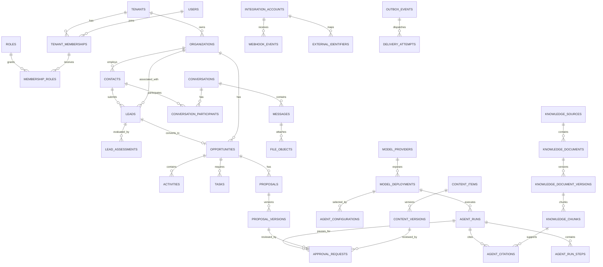

# 企业人工智能业务发展智能体平台

## 数据库设计

> 英文工程基线：[database-design.en.md](database-design.en.md)。中文版本用于内部审核；如有冲突，以英文版本为准。

**参考企业:** 印度尼西亚商用厨房工程公司，Sari Arta **数据库:** PostgreSQL 16+ **扩展:** `pgvector`、`pg_trgm`，以及可选的 `citext` **文档版本:** 1.0

> 中文审核入口：[中文架构审核指南](</Users/sujie/Documents/ChatGPT/Enterprise AI Business Development Agent Platform/docs/review-guide.zh-CN.md>)。重点参考其中“数据库设计如何审核”和“业务方必须确认的事项”。

## Phase 2.5 Schema 补充

迁移 `9f31c6a7d2b4` 实现了 `knowledge_sources`、`knowledge_bindings`、
`knowledge_documents`、`knowledge_ingestion_runs` 和 `knowledge_chunks`。每张表都有非空
`tenant_id`、强制 RLS 和 `tenant_isolation` 策略。文档字节保存在 PostgreSQL 之外。
知识片段保存 `vector(1536)` 向量、来源/文档/摄取血缘、页码和章节位置以及引用指纹。
HNSW 余弦索引加速候选检索，但租户、智能体绑定、来源、审批、就绪状态、提供商和模型等
关系过滤仍然是最终依据。完整状态和关系设计参见 `docs/knowledge-foundation-design.zh-CN.md`。

## 1. 设计目标

数据库支持租户隔离的CRM、全渠道沟通、AI辅助工作流程、知识检索、提案/内容生命周期、集成、审批和审计功能。

设计遵循以下规则：

- PostgreSQL 是官方记录系统。
- UUID 作为主键，可以防止可预测的连续标识符，并且在分布式写入者之间有效。
- 每个由租户拥有的单元楼都包含 `tenant_id`。
- 所有时间戳均使用 `timestamptz` 和 UTC 时间。
- 货币价值使用 `numeric(19,4)` 加上 ISO 4217 货币代码。
- 业务状态明确、受限且可审计。
- AI 的结果是版本化的产物，而不是对人类编写的事实进行无声覆盖。
- 大型二进制文件存储在对象存储中；PostgreSQL 存储元数据和完整性哈希。
- JSONB 专用于存储可变提供商元数据、策略和快照——而不是常规的关系型字段。
- 外键是必需的，除非仅用于审计的设计明确地存储一个历史标识符。

## 2. 命名和共享列

名称使用小写 `snake_case`。 表名使用复数形式。 外键使用 `<entity>_id`。

大多数可变租户表通常包含：

| 列 | 类型 | 规则 |
|---|---|---|
| `id` | `uuid` | 主键；由服务器端生成 |
| `tenant_id` | `uuid` | 必需的外键关联到 `tenants.id`；属于隔离和索引 |
| `created_at` | `timestamptz` | 必需；默认当前交易时间戳 |
| `updated_at` | `timestamptz` | 必需；更新于变异 |
| `created_by` | `uuid` | 可为空的外键指向 `users.id`，用于系统生成的数据 |
| `updated_by` | `uuid` | 可为空的外键关联到 `users.id` |
| `version` | `integer` | 必需的默认 `1`；乐观并发 |
| `deleted_at` | `timestamptz` | 可为空的软删除标记，用于需要恢复的情况 |

使用数据库检查约束来处理数值范围和有限状态值。 优先使用查找/配置表，当值集是租户可配置时； 谨慎使用 PostgreSQL 枚举，因为它们会使零停机更改变得复杂。

## 3. 实体关系设计



## 4. 核心租户和访问表

### 4.1 `tenants`

| 字段 | 类型 | 约束/目的 |
|---|---|---|
| `id` | `uuid` | PK |
| `slug` | `varchar(80)` | 独特的、规范化的公共标识符 |
| `name` | `varchar(200)` | 必需 |
| `status` | `varchar(30)` | `active`, `suspended`, `closed` |
| `default_locale` | `varchar(20)` | 默认 `en` |
| `default_timezone` | `varchar(64)` | IANA 名称，例如 `Asia/Jakarta` |
| `default_currency` | `char(3)` | ISO 4217，例如 `IDR` |
| `data_region` | `varchar(40)` | 部署/数据驻留指定 |
| `settings` | `jsonb` | 已验证租户的功能和策略设置 |
| `created_at`, `updated_at` | `timestamptz` | 必需 |

### 4.2 `users`

全球身份识别；授权基于租户-成员关系。

| 字段 | 类型 | 约束/目的 |
|---|---|---|
| `id` | `uuid` | PK |
| `identity_provider` | `varchar(50)` | 必需 |
| `external_subject` | `varchar(255)` | 必需；与提供商唯一 |
| `email` | `citext` | 必需 |
| `display_name` | `varchar(200)` | 必需 |
| `locale` | `varchar(20)` | 可为空 |
| `timezone` | `varchar(64)` | 可为空 |
| `status` | `varchar(30)` | `active`, `disabled` |
| `last_login_at` | `timestamptz` | 可为空 |
| `created_at`, `updated_at` | `timestamptz` | 必需 |

### 4.3 `tenant_memberships`

| 字段 | 类型 | 约束/目的 |
|---|---|---|
| `id`, `tenant_id` | `uuid` | PK; 租户 FK |
| `user_id` | `uuid` | FK `users`; 仅与租户相关 |
| `status` | `varchar(30)` | `invited`, `active`, `suspended` |
| `job_title` | `varchar(120)` | 可为空 |
| `manager_membership_id` | `uuid` | 可为空的自引用 |
| `invited_at`, `joined_at` | `timestamptz` | 可为空的生命周期日期 |
| `created_at`, `updated_at`, `version` | 混合 | 共享列 |

### 4.4 `roles`, `permissions`, `role_permissions`, `membership_roles`

| 表格 | 重要字段 |
|---|---|
| `roles` | `id`，`tenant_id` 可为空，用于平台模板，`code`，`name`，`description`，`is_system`，时间戳；唯一 `(tenant_id, code)` |
| `permissions` | `id`, `code` 独一无二, `description`, `risk_level` |
| `role_permissions` | `role_id`, `permission_id`; 组合主键 |
| `membership_roles` | `membership_id`, `role_id`, `granted_by`, `granted_at`, `expires_at`; 唯一的有效资助 |

## 5. CRM 表

### 5.1 `organizations`

表示潜在客户、客户、合作伙伴以及其他公司。

| 字段 | 类型 | 约束/目的 |
|---|---|---|
| 共享可变字段 | 混合 | 包括租户、审计、版本、软删除 |
| `legal_name` | `varchar(250)` | 必需 |
| `display_name` | `varchar(250)` | 必需 |
| `organization_type` | `varchar(30)` | `prospect`, `customer`, `partner`, `supplier`, `other` |
| `website_url` | `text` | 可为空; 规范化 |
| `domain` | `citext` | 可为空 |
| `industry` | `varchar(120)` | 可为空 |
| `employee_range` | `varchar(40)` | 可为空 |
| `country_code` | `char(2)` | ISO 3166-1 alpha-2  中文: |
| `city` | `varchar(120)` | 可为空 |
| `address` | `jsonb` | 验证的邮寄地址结构 |
| `preferred_language` | `varchar(20)` | 可为空 |
| `owner_membership_id` | `uuid` | 可为空的外键关联 |
| `lifecycle_stage` | `varchar(30)` | `prospect`, `qualified`, `customer`, `inactive` |
| `research_status` | `varchar(30)` | `not_started`, `draft`, `verified`, `stale` |
| `verified_at`, `verified_by` | 混合 | 可为空的人工验证 |
| `metadata` | `jsonb` | 有限的自定义属性 |

### 5.2 `contacts`

| 字段 | 类型 | 约束/目的 |
|---|---|---|
| 共享可变字段 | 混合 | 租户范围 |
| `organization_id` | `uuid` | 可为空的外键 |
| `first_name`, `last_name` | `varchar(120)` | 至少需要一个名称或渠道身份 |
| `job_title`, `department` | `varchar(120)` | 可为空 |
| `email` | `citext` | 可为空; 规范化 |
| `phone_e164` | `varchar(20)` | 可为空；E.164 |
| `whatsapp_e164` | `varchar(20)` | 可为空 |
| `country_code` | `char(2)` | 可为空 |
| `preferred_language` | `varchar(20)` | 可为空 |
| `preferred_channel` | `varchar(30)` | 可为空 |
| `marketing_consent_status` | `varchar(30)` | `unknown`, `granted`, `denied`, `withdrawn` |
| `marketing_consent_at` | `timestamptz` | 可为空 |
| `do_not_contact` | `boolean` | 必需，默认值为 false |
| `owner_membership_id` | `uuid` | 可为空的外键 |

为了避免全局唯一性，电子邮件/电话号码是故意不设的，因为不同的租户可能会知道同一个人。在定义了重复解决策略后，可以启用部分租户范围内的唯一性。

### 5.3 `leads`

| 字段 | 类型 | 约束/目的 |
|---|---|---|
| 共享可变字段 | 混合 | 租户范围 |
| `contact_id` | `uuid` | 可为空的外键 |
| `organization_id` | `uuid` | 可为空的外键 |
| `source_channel` | `varchar(30)` | `website`, `whatsapp`, `email`, `instagram`, `facebook`, `tiktok`, `manual`, `import`, `partner` |
| `source_detail` | `varchar(200)` | 活动/表单/账户详情 |
| `inquiry_summary` | `text` | 所需规范化摘要 |
| `status` | `varchar(30)` | `new`, `qualifying`, `qualified`, `nurture`, `disqualified`, `converted`, `archived` |
| `priority` | `varchar(20)` | `low`, `normal`, `high`, `urgent` |
| `owner_membership_id` | `uuid` | 可为空的外键 |
| `estimated_value` | `numeric(19,4)` | 可为空，非负数 |
| `currency` | `char(3)` | 当值存在时，则需要 |
| `target_timeline` | `varchar(100)` | 可为空 |
| `project_country_code` | `char(2)` | 可为空 |
| `qualification_score` | `numeric(5,2)` | 可为空，0–100；最新批准/确定性得分 |
| `qualified_at`, `disqualified_at`, `converted_at` | `timestamptz` | 可为空 |
| `disqualification_reason` | `varchar(200)` | 当被取消资格时，必须提供 |
| `converted_opportunity_id` | `uuid` | 可为空的唯一外键 |
| `last_activity_at` | `timestamptz` | 非规范排序字段 |

### 5.4 `lead_assessments`

仅限添加的AI或人类资格版本。

| 字段 | 类型 | 约束/目的 |
|---|---|---|
| `id`, `tenant_id`, 时间戳 | 混合 | 标准标识符 |
| `lead_id` | `uuid` | 必需的外键 |
| `assessment_version` | `integer` | 独一无二，含铅 |
| `assessor_type` | `varchar(20)` | `agent`, `human`, `rule` |
| `assessor_user_id` | `uuid` | 可为空的外键 |
| `agent_run_id` | `uuid` | 可为空的外键 |
| `score` | `numeric(5,2)` | 0–100 |
| `tier` | `varchar(20)` | 租户策略值，例如 `hot`、`warm`、`cold` |
| `need_summary` | `text` | 可为空 |
| `budget_status`, `authority_status`, `need_status`, `timeline_status` | `varchar(30)` | 资格尺寸 |
| `recommended_action` | `text` | 必需 |
| `missing_information` | `jsonb` | 已验证的字符串数组 |
| `evidence` | `jsonb` | 已验证的证据参考 |
| `confidence` | `numeric(5,4)` | 0–1 |
| `review_status` | `varchar(30)` | `not_required`, `pending`, `approved`, `rejected`, `superseded` |
| `reviewed_by`, `reviewed_at` | 混合 | 可为空 |

### 5.5 `opportunities`

| 字段 | 类型 | 约束/目的 |
|---|---|---|
| 共享可变字段 | 混合 | 租户范围 |
| `organization_id` | `uuid` | 必需的外键 |
| `primary_contact_id` | `uuid` | 可为空的外键 |
| `source_lead_id` | `uuid` | 可为空的唯一外键 |
| `name` | `varchar(250)` | 必需 |
| `description` | `text` | 可为空 |
| `stage` | `varchar(40)` | 租户可配置的控制值 |
| `status` | `varchar(20)` | `open`, `won`, `lost`, `cancelled` |
| `probability` | `numeric(5,2)` | 0–100 |
| `estimated_value` | `numeric(19,4)` | 非负 |
| `currency` | `char(3)` | 必需 |
| `expected_close_date` | `date` | 可为空 |
| `project_country_code`, `project_city` | 混合 | 项目地点 |
| `requirements` | `jsonb` | 已验证的商业厨房结构化需求 |
| `owner_membership_id` | `uuid` | 必需的外键 |
| `won_at`, `lost_at` | `timestamptz` | 可为空 |
| `loss_reason` | `varchar(200)` | 必需用于“已丢失”状态 |
| `last_activity_at` | `timestamptz` | 非规范化 |

### 5.6 `activities` 和 `tasks`

| 表格 | 字段 |
|---|---|
| `activities` | 共享字段；可为空的 `lead_id`、`opportunity_id`、`organization_id`、`contact_id`；`activity_type`、`occurred_at`、`subject`、`description`、`channel`、`actor_membership_id`、`source_message_id`、`metadata`。 约束要求至少有一个业务父级。 |
| `tasks` | 共享字段；可为空 `lead_id`、`opportunity_id`、`organization_id`、`title`、`description`、`status`、`priority`、`assigned_to`、`due_at`、`completed_at`、`reminder_at`、`source`、`automation_execution_id`。 |

## 6. 对话和文件表

### 6.1 `conversations`

| 字段 | 类型 | 约束/目的 |
|---|---|---|
| 共享可变字段 | 混合 | 租户范围 |
| `channel` | `varchar(30)` | 规范渠道 |
| `integration_account_id` | `uuid` | 可为空的外键 |
| `external_thread_id` | `varchar(255)` | 可为空; 仅限单个账户 |
| `subject` | `varchar(500)` | 可为空 |
| `status` | `varchar(20)` | `open`, `pending`, `closed`, `spam` |
| `lead_id`, `opportunity_id` | `uuid` | 可为空的外键 |
| `assigned_to` | `uuid` | 可为空的成员关系外键 |
| `last_message_at` | `timestamptz` | 必需 |
| `unread_count` | `integer` | 去规范化，非负 |

### 6.2 `conversation_participants`

| 字段 | 类型 | 约束/目的 |
|---|---|---|
| `id`, `tenant_id` | `uuid` | 标识符 |
| `conversation_id` | `uuid` | 必需的外键 |
| `participant_type` | `varchar(20)` | `contact`, `user`, `external` |
| `contact_id`, `user_id` | `uuid` | 精确地一个，对应类型 |
| `external_address` | `varchar(320)` | 电子邮件/电话/提供商身份 |
| `display_name` | `varchar(200)` | 可为空 |
| `joined_at`, `left_at` | `timestamptz` | 生命周期 |

### 6.3 `messages`

| 字段 | 类型 | 约束/目的 |
|---|---|---|
| `id`, `tenant_id`, 时间戳 | 混合 | 标识符 |
| `conversation_id` | `uuid` | 必需的外键 |
| `direction` | `varchar(10)` | `inbound`, `outbound`, `internal` |
| `sender_type` | `varchar(20)` | `contact`, `user`, `agent`, `system` |
| `sender_contact_id`, `sender_user_id` | `uuid` | 可为空的外键 |
| `external_message_id` | `varchar(255)` | 可为空; 仅限单个集成账户 |
| `idempotency_key` | `varchar(255)` | 可为空 |
| `content_type` | `varchar(30)` | `text`, `html`, `image`, `document`, `audio`, `template`, `event` |
| `body_text` | `text` | 已清理/原始形式 |
| `body_html` | `text` | 可为空，经过清理 |
| `language` | `varchar(20)` | 可为空 |
| `delivery_status` | `varchar(30)` | `received`, `draft`, `queued`, `sent`, `delivered`, `read`, `failed` |
| `sent_at`, `delivered_at`, `read_at` | `timestamptz` | 可为空 |
| `reply_to_message_id` | `uuid` | 可为空的自引用 |
| `agent_run_id` | `uuid` | 可为空的外键，用于生成的草稿 |
| `provider_metadata` | `jsonb` | 已删除提供者信息 |

### 6.4 `file_objects`

| 字段 | 类型 | 约束/目的 |
|---|---|---|
| 共享标识 | 混合 | 租户范围 |
| `message_id` | `uuid` | 可为空的外键 |
| `purpose` | `varchar(40)` | `attachment`, `knowledge_source`, `proposal`, `content`, `export`, `avatar` |
| `storage_provider`, `bucket`, `object_key` | 文本 | 必需；对象键在桶中必须是唯一的 |
| `original_filename` | `varchar(500)` | 必需，已进行清理，用于显示 |
| `media_type` | `varchar(150)` | 必需 |
| `size_bytes` | `bigint` | 非负 |
| `sha256` | `char(64)` | 必需 |
| `malware_status` | `varchar(30)` | `pending`, `clean`, `quarantined`, `failed` |
| `encryption_key_ref` | `varchar(255)` | 可为空的键引用，永远不要键材料 |
| `retention_until` | `timestamptz` | 可为空 |

## 7. 知识库表

### 7.1 `knowledge_sources`

| 字段 | 类型 | 约束/目的 |
|---|---|---|
| 共享可变字段 | 混合 | 租户范围 |
| `name` | `varchar(200)` | 必需 |
| `source_type` | `varchar(30)` | `upload`, `website`, `catalog`, `manual`, `integration` |
| `base_uri` | `text` | 可为空 |
| `status` | `varchar(30)` | `active`, `paused`, `error`, `archived` |
| `access_scope` | `varchar(30)` | `tenant`, `role_restricted`, `private` |
| `ingestion_config` | `jsonb` | 已验证的连接器/块策略，不包含密钥 |
| `last_synced_at` | `timestamptz` | 可为空 |

### 7.2 `knowledge_documents`

| 字段 | 类型 | 约束/目的 |
|---|---|---|
| 共享可变字段 | 混合 | 租户范围 |
| `source_id` | `uuid` | 必需的外键 |
| `external_key` | `varchar(500)` | 可为空; 唯一，按来源区分 |
| `title` | `varchar(500)` | 必需 |
| `document_type` | `varchar(50)` | 产品目录、案例研究、政策、能力等。 |
| `language` | `varchar(20)` | 必需 |
| `status` | `varchar(30)` | `draft`, `processing`, `active`, `quarantined`, `archived` |
| `access_policy` | `jsonb` | 已验证的角色/用户约束 |
| `effective_from`, `effective_until` | `timestamptz` | 可为空 |
| `current_version_id` | `uuid` | 在版本创建后设置可为空的外键 |

### 7.3 `knowledge_document_versions`

不可变的标准化版本。

| 字段 | 类型 | 约束/目的 |
|---|---|---|
| `id`, `tenant_id`, 时间戳 | 混合 | 标识符 |
| `document_id` | `uuid` | 必需的外键 |
| `version_number` | `integer` | 与文档独一无二 |
| `file_object_id` | `uuid` | 可为空的外键 |
| `content_sha256` | `char(64)` | 必需 |
| `extracted_text` | `text` | 可为空；受限访问 |
| `metadata` | `jsonb` | 页数，解析器，标题 |
| `processing_status` | `varchar(30)` | `pending`, `extracting`, `embedding`, `ready`, `failed` |
| `parser_version`, `chunking_version`, `embedding_model` | `varchar(120)` | 可重复性 |
| `approved_by`, `approved_at` | 混合 | 在主动检索之前必须完成 |

### 7.4 `knowledge_chunks`

| 字段 | 类型 | 约束/目的 |
|---|---|---|
| `id`, `tenant_id`, `created_at` | 混合 | 标识符 |
| `document_version_id` | `uuid` | 必需的外键 |
| `chunk_index` | `integer` | 与版本独一无二 |
| `content` | `text` | 必需 |
| `content_tsv` | `tsvector` | 生成的/存储的搜索向量 |
| `embedding` | `vector(N)` | 由选定的嵌入模型固定 |
| `token_count` | `integer` | 非负 |
| `page_start`, `page_end` | `integer` | 可为空 |
| `section_path` | `text[]` | 标题的来源 |
| `content_sha256` | `char(64)` | 必需 |
| `metadata` | `jsonb` | 受限的检索元数据 |

更改嵌入维度需要新的列/表迁移或并行嵌入表；不要在一个向量列中混合维度。

## 8. AI 智能表

### 8.1 `model_providers`、`model_deployments` 和 `model_routing_policies`

这些表格将智能体工作流程与特定的供应商或端点分开。

| 表格 | 字段 |
|---|---|
| `model_providers` | `id`，可选，用于租户拥有的提供商，`tenant_id`，`provider_key`，`provider_type`（`openai`，`qwen_cloud`，`openai_compatible`，`local`，`custom`），`name`，`status`，`credential_secret_ref`，`base_url_secret_ref`或已批准的内部端点引用，`data_region`，`external_processing`，`retention_policy`，`training_use_policy`，`settings`，时间戳。 不存储任何凭据值。 |
| `model_deployments` | `id`，可选 `tenant_id`，`model_provider_id`，`deployment_key`，`model_id`，`immutable_version`，`status` (`testing`，`active`，`degraded`，`disabled`，`retired`)，`capabilities`，`supported_languages`，`context_limit`，`output_limit`，`data_classifications_allowed`，`unit_cost_config`，`concurrency_limit`，`timeout_seconds`，`health_status`，`last_verified_at`，`evaluation_version`，时间戳；唯一的 `(tenant_id, deployment_key)`。 |
| `model_routing_policies` | `id`、`tenant_id`、`workflow_type`、`version_number`、`status`、`primary_deployment_id`、`fallback_deployment_ids` 排序后的 UUID 数组或规范化的子行，`required_capabilities`、`allowed_provider_types`、`allowed_data_regions`、`maximum_data_classification`、`fallback_behavior`、`budget_policy`、`activated_by`、`activated_at`、时间戳；唯一的`(tenant_id, workflow_type, version_number)`。 |

如果降级条件或按条目排序变得复杂，请使用规范化的`model_routing_policy_fallbacks`子表而不是数组。 即使本地模型部署仍然被视为应用程序数据库的外部执行依赖，并且不会接收数据库凭据。

### 8.2 `agent_configurations`

| 字段 | 类型 | 约束/目的 |
|---|---|---|
| `id`, `tenant_id`, 时间戳 | 混合 | 租户只能在平台模板中进行空值设置 |
| `agent_key` | `varchar(80)` | 例如：`lead_qualification`；与租户/版本唯一 |
| `version_number` | `integer` | 必需 |
| `status` | `varchar(20)` | `draft`, `active`, `retired` |
| `default_model_deployment_id` | `uuid` | 可为空的外键；当没有活动的租户路由策略覆盖它时使用 |
| `required_model_capabilities` | `jsonb` | 结构化输出、工具使用、视觉、语言、上下文以及其他要求 |
| `instructions_ref` | `varchar(255)` | 版本化提示/配置参考 |
| `tool_policy` | `jsonb` | 允许使用的工具名称和限制 |
| `guardrail_policy` | `jsonb` | 已验证的护栏配置 |
| `output_schema_version` | `varchar(50)` | 必需 |
| `runtime_config` | `jsonb` | 支持的温度/推理/预算 |
| `activated_by`, `activated_at` | 混合 | 可为空 |

### 8.3 `agent_runs`

| 字段 | 类型 | 约束/目的 |
|---|---|---|
| `id`, `tenant_id`, 时间戳 | 混合 | 租户范围 |
| `agent_configuration_id` | `uuid` | 必需的外键 |
| `workflow_type` | `varchar(80)` | 必需 |
| `status` | `varchar(30)` | `queued`, `running`, `awaiting_approval`, `succeeded`, `failed`, `cancelled` |
| `initiated_by_type` | `varchar(20)` | `user`, `automation`, `system`, `customer` |
| `initiated_by_user_id` | `uuid` | 可为空 |
| `service_account_id` | `uuid` | 可为空 |
| `lead_id`, `opportunity_id`, `conversation_id` | `uuid` | 可为空的范围内的业务外键 |
| `input_snapshot` | `jsonb` | 最小化、验证过的运行输入 |
| `output_result` | `jsonb` | 可为空的验证后的结构化输出 |
| `input_schema_version`, `output_schema_version` | `varchar(50)` | 必需 |
| `trace_id`, `provider_response_id` | `varchar(255)` | 可为空的关联 |
| `model_routing_policy_id` | `uuid` | 可为空的外部键，指向有效的路由策略版本 |
| `model_deployment_id` | `uuid` | 必需的外键，指向实际部署 |
| `provider_type`, `model_id`, `model_version` | `varchar(120)` | 不可变执行状态快照，用于审计 |
| `routing_reason`, `fallback_reason` | `varchar(255)` | 可为空的安全路由元数据 |
| `input_tokens`, `output_tokens` | `bigint` | 可为空，非负数 |
| `estimated_cost` | `numeric(19,6)` | 可为空 |
| `cost_currency` | `char(3)` | 可为空 |
| `started_at`, `completed_at` | `timestamptz` | 可为空 |
| `error_code`, `error_message_safe` | 文本 | 可为空 |
| `retention_until` | `timestamptz` | 可为空 |

### 8.4 `agent_run_steps`、`agent_citations` 和 `approval_requests`

| 表格 | 字段 |
|---|---|
| `agent_run_steps` | `id`, `tenant_id`, `agent_run_id`, `sequence_no`, `step_type` (`model`, `tool`, `handoff`, `guardrail`, `approval`, `retrieval`), `name`, `status`, `started_at`, `completed_at`, `input_redacted`, `output_redacted`, `tool_call_id`, `error_code`; 独特的 `(agent_run_id, sequence_no)` |
| `agent_citations` | `id`, `tenant_id`, `agent_run_id`, 可选的 `agent_run_step_id`, `knowledge_chunk_id`, `claim_key`, `quote_excerpt`，具有严格长度限制，`relevance_score`, `position`； 唯一的逻辑引用 |
| `approval_requests` | `id`、`tenant_id`，可选 `agent_run_id`、`proposal_version_id`、`content_version_id`； `action_type`、`action_digest`、`status`、`requested_by`、`assigned_to`、`requested_at`、`expires_at`、`decided_by`、`decided_at`、`decision_comment`、`preview_snapshot`。 必须提供一个主题。 |

## 9. 提案和内容表

### 9.1 `proposal_templates`、`proposals` 和 `proposal_versions`

| 表格 | 字段 |
|---|---|
| `proposal_templates` | 共享字段；`name`、`language`、`country_code`、`template_type`、`file_object_id`、`schema_version`、`status`、`is_default` |
| `proposals` | 共享字段； `opportunity_id`、`title`、`status` (`draft`、`in_review`、`approved`、`issued`、`accepted`、`rejected`、`expired`、`superseded`)、`current_version_id`、`owner_membership_id`、`valid_until`、`issued_at`、`accepted_at` |
| `proposal_versions` | `id`, `tenant_id`, 时间戳, `proposal_id`, `version_number`, `template_id`, `source_agent_run_id`, `language`, `currency`, `content` 符合版本化模式的 JSONB, `subtotal`, `tax_amount`, `total_amount`, `assumptions`, `rendered_file_id`, `content_sha256`, `created_by`; 唯一的 `(proposal_id, version_number)` |

商业总额由确定性服务计算和验证。 智能体可以提出项目描述，但不能进行权威的定价计算或批准。

### 9.2 `content_items` 和 `content_versions`

| 表格 | 字段 |
|---|---|
| `content_items` | 共享字段；`title`、`content_type`、`channel`、`campaign_name`、`status`（`draft`、`in_review`、`approved`、`scheduled`、`published`、`archived`）、`owner_membership_id`、`current_version_id`、`scheduled_at`、`published_at` |
| `content_versions` | `id`, `tenant_id`, 时间戳, `content_item_id`, `version_number`, `source_agent_run_id`, `language`, `body`, `structured_content`, `claims`, `content_sha256`, `created_by`; 唯一的 `(content_item_id, version_number)` |

## 10. 集成、自动化和可靠性表

### 10.1 `integration_accounts`

| 字段 | 类型 | 约束/目的 |
|---|---|---|
| 共享可变字段 | 混合 | 租户范围 |
| `provider` | `varchar(50)` | 必需 |
| `account_name` | `varchar(200)` | 必需 |
| `status` | `varchar(30)` | `pending`, `active`, `degraded`, `disabled` |
| `external_account_id` | `varchar(255)` | 可为空 |
| `credential_secret_ref` | `varchar(500)` | 仅供参考：秘密管理器 |
| `scopes` | `text[]` | 已授予提供者权限 |
| `webhook_secret_ref` | `varchar(500)` | 秘密参考 |
| `settings` | `jsonb` | 经过验证的非机密配置 |
| `last_verified_at`, `last_error_at` | `timestamptz` | 可为空 |
| `last_error_code` | `varchar(100)` | 可为空 |

### 10.2 集成支持表

| 表格 | 字段 |
|---|---|
| `external_identifiers` | `id`, `tenant_id`, `integration_account_id`, `entity_type`, `entity_id`, `external_id`, `external_url`, 时间戳；唯一标识 `(integration_account_id, entity_type, external_id)` |
| `webhook_events` | `id`、`tenant_id`、`integration_account_id`、`provider_event_id`、`event_type`、`received_at`、`signature_valid`、`payload`、`payload_sha256`、`status`、`attempt_count`、`processed_at`、`error_code`； 提供时，获取唯一的供应商事件 |
| `automation_executions` | `id`、`tenant_id`、`workflow_key`、`workflow_version`、`n8n_execution_id`、`trigger_type`、`trigger_ref`、`status`、`started_at`、`completed_at`、`error_code`；每个环境下的独特 n8n 执行 |

对原始 Webhook 负载的访问受到限制，并且仅在可配置的短时间内保留。

### 10.3 `outbox_events` 和 `delivery_attempts`

| 表格 | 字段 |
|---|---|
| `outbox_events` | `id` UUID, `tenant_id`, `aggregate_type`, `aggregate_id`, `event_type`, `event_version`, `payload`, `occurred_at`, `available_at`, `published_at`, `attempt_count`, `status`; 在与聚合变异相同的事务中创建 |
| `delivery_attempts` | `id`、`tenant_id`、`outbox_event_id`、`destination_type`、`destination_key`、`attempt_no`、`status`、`started_at`、`completed_at`、`response_code`、`error_code`、`next_retry_at`； 独特的 `(outbox_event_id, destination_key, attempt_no)` |

### 10.4 `idempotency_keys`

| 字段 | 类型 | 约束/目的 |
|---|---|---|
| `tenant_id` | `uuid` | 租户或指定公共入口租户 |
| `principal_key` | `varchar(255)` | 用户/服务/渠道身份 |
| `idempotency_key` | `varchar(255)` | 客户端密钥 |
| `request_hash` | `char(64)` | 检测不同请求下的关键重复使用 |
| `response_status` | `integer` | 存储成功响应 |
| `response_body` | `jsonb` | 尺寸限制 |
| `resource_type`, `resource_id` | 混合 | 创建资源参考 |
| `created_at`, `expires_at` | `timestamptz` | 生命周期 |

复合主键：`(tenant_id, principal_key, idempotency_key)`。

### 10.5 `import_jobs` 和 `export_jobs`

即使工人重启，导入和导出状态也能保持持久。

| 表格 | 字段 |
|---|---|
| `import_jobs` | `id`, `tenant_id`, 时间戳, `resource_type`, `source_file_id`, `mapping_version`, `duplicate_policy`, `status` (`uploaded`, `validating`, `validation_failed`, `ready`, `applying`, `completed`, `failed`, `cancelled`), `dry_run`, `validation_summary`, `result_file_id`, `row_count`, `success_count`, `failure_count`, `request_digest`, `requested_by`, `confirmed_by`, `confirmed_at`, `error_code` |
| `export_jobs` | `id`, `tenant_id`, 时间戳, `resource_type`, `format`, `filter_snapshot`, `field_set`, `purpose`, `status` (`queued`, `running`, `awaiting_approval`, `completed`, `failed`, `expired`, `cancelled`), `approval_request_id`, `result_file_id`, `row_count`, `requested_by`, `completed_at`, `expires_at`, `error_code` |

导入确认必须与已验证的 `request_digest` 匹配。 导出过滤器和字段由服务器验证，并以有限的快照形式存储； 不接受任意 SQL。

## 11. 审计和合规性表

### 11.1 `audit_events`

仅限应用角色，不可修改且不可变动。

| 字段 | 类型 | 约束/目的 |
|---|---|---|
| `id` | `uuid` | PK |
| `tenant_id` | `uuid` | 仅适用于平台事件，可为空 |
| `occurred_at` | `timestamptz` | 必需；分区键 |
| `actor_type` | `varchar(30)` | `user`, `service`, `agent`, `system`, `customer` |
| `actor_id` | `uuid` | 可为空 |
| `session_id` | `varchar(255)` | 可为空 |
| `action` | `varchar(120)` | 必需的命名空间操作名称 |
| `target_type`, `target_id` | 混合 | 可为空 |
| `outcome` | `varchar(20)` | `success`, `denied`, `failure` |
| `reason_code` | `varchar(100)` | 可为空 |
| `request_id`, `trace_id` | `varchar(255)` | 相关性 |
| `source_ip` | `inet` | 可为空；访问受限 |
| `user_agent` | `text` | 可为空，长度限制 |
| `before_summary`, `after_summary` | `jsonb` | 已删除/减少 |
| `metadata` | `jsonb` | 已验证的边界元数据 |
| `integrity_hash` | `char(64)` | 可选的防篡改链/哈希 |

### 11.2 `data_subject_requests`

跟踪出口、纠正、限制和删除操作。

| 字段 | 类型 | 约束/目的 |
|---|---|---|
| 共享字段 | 混合 | 租户范围 |
| `request_type` | `varchar(30)` | `access`, `export`, `correct`, `restrict`, `erase` |
| `contact_id` | `uuid` | 可为空的外键 |
| `requester_reference` | `varchar(255)` | 必需 |
| `status` | `varchar(30)` | `received`, `verifying`, `processing`, `completed`, `rejected` |
| `verified_at`, `due_at`, `completed_at` | `timestamptz` | 生命周期 |
| `result_file_id` | `uuid` | 可为空的外键 |
| `decision_reason` | `text` | 可为空 |
| `legal_hold` | `boolean` | 必需，默认值为 false |

## 12. 关系和删除规则

- 租户删除是一种受控的异步合规操作，而不是 `ON DELETE CASCADE`。
- CRM 客户删除通常使用软删除，并保留审计/历史记录。
- 不可变版本不能进行更新，除非是受限的处理/审批元数据；修正会创建一个新的版本。
- 一个潜在客户最多可以转化为一个机会；一个机会最多可以引用一个来源潜在客户。
- 一个提案属于恰好一个机会，并且有许多不可变的版本。
- 一个运行的智能体可能会引用多个业务对象，但必须引用一个租户和一个配置版本。
- 知识块的传播仅在未批准/失败的文档版本安全地被清除时发生。 激活版本删除遵循保留工作流程。
- 当 join 表的行没有独立的合规含义时，可以使用级联删除，例如角色-权限映射。
- 提供者标识符永远不会被用作内部主键。

复合外键技术或触发器应验证所引用的行具有相同的 `tenant_id`。 仓库测试也必须证明不能创建跨租户的引用。

## 13. 索引策略

### 13.1 通用规则

1. PostgreSQL 默认不创建外键索引；请索引所有经常关联或级联的外键。
2. 将`tenant_id`放在租户范围查询中使用的索引的首位。
3. 在范围/排序列之前，先匹配等值列。
4. 使用部分索引，用于活动/未删除的运营行。
5. 避免重复的索引，这些索引同时受到唯一约束或更宽索引的影响。
6. 确认与`EXPLAIN (ANALYZE, BUFFERS)`在生产环境中。
7. 跟踪未使用的、臃肿的和缺失的索引；同时创建大型索引。

### 13.2 必需的唯一索引

| 表格 | 索引  中文: |
|---|---|
| `tenants` | 独特的低/归一化的 `slug` |
| `users` | 独特的 `(identity_provider, external_subject)` |
| `tenant_memberships` | 独特的 `(tenant_id, user_id)` |
| `roles` | 独特的 `(tenant_id, code)`，分别处理平台模板 |
| `lead_assessments` | 独特的 `(tenant_id, lead_id, assessment_version)` |
| `conversations` | 独特的，部分`(tenant_id, integration_account_id, external_thread_id)`其中，外部ID不为null |
| `messages` | 独特的提供商/账户/消息标识符；唯一的范围内的幂等性密钥 |
| `knowledge_document_versions` | 独特的 `(tenant_id, document_id, version_number)` |
| `knowledge_chunks` | 独特的 `(tenant_id, document_version_id, chunk_index)` |
| `model_providers` | 独特的、基于范围的`(tenant_id, provider_key)`，具有针对不同平台提供商的单独规则 |
| `model_deployments` | 独特的范围`(tenant_id, deployment_key)` |
| `model_routing_policies` | 独特的 `(tenant_id, workflow_type, version_number)` |
| `agent_configurations` | 独特的 `(tenant_id, agent_key, version_number)` |
| `agent_run_steps` | 独特的 `(tenant_id, agent_run_id, sequence_no)` |
| `proposal_versions` | 独特的 `(tenant_id, proposal_id, version_number)` |
| `content_versions` | 独特的 `(tenant_id, content_item_id, version_number)` |
| `webhook_events` | 独特的部分 `(integration_account_id, provider_event_id)` |
| `external_identifiers` | 独特的 `(integration_account_id, entity_type, external_id)` |

### 13.3 运算型 B 树索引

| 查询 | 建议的索引 |
|---|---|
| 待处理工作队列 | `(tenant_id, status, owner_membership_id, priority, created_at desc) WHERE deleted_at IS NULL` |
| 未分配的潜在客户 | `(tenant_id, created_at) WHERE owner_membership_id IS NULL AND status IN ('new','qualifying') AND deleted_at IS NULL` |
| 潜在客户管道 | `(tenant_id, status, stage, owner_membership_id, expected_close_date) WHERE deleted_at IS NULL` |
| 组织域名查找 | `(tenant_id, domain) WHERE domain IS NOT NULL AND deleted_at IS NULL` |
| 查找联系方式（邮箱/电话） | `(tenant_id, email)` 和 `(tenant_id, phone_e164)` 部分 |
| 对话收件箱 | `(tenant_id, status, assigned_to, last_message_at desc) WHERE deleted_at IS NULL` |
| 消息时间线 | `(tenant_id, conversation_id, created_at desc, id desc)` |
| 待办事项 | `(tenant_id, assigned_to, status, due_at) WHERE status IN ('open','in_progress') AND deleted_at IS NULL` |
| 符合条件的型号部署 | `(tenant_id, status, health_status)` 与提供者/能力过滤，已验证与测量查询模式 |
| 活动路由策略 | `(tenant_id, workflow_type, status, version_number desc) WHERE status = 'active'` |
| 智能体队列/状态 | `(tenant_id, status, created_at)` 和全局工作者索引 `(status, created_at)` 在受限角色下 |
| 审批已通过的邮件收件箱 | `(tenant_id, assigned_to, status, expires_at) WHERE status = 'pending'` |
| 导入/导出工作队列 | `(status, created_at) WHERE status IN ('uploaded','validating','ready','applying','queued','running')` |
| 发送到外部 | `(status, available_at, occurred_at) WHERE status IN ('pending','retry')` |
| Webhook 处理 | `(status, received_at) WHERE status IN ('received','retry')` |
| 目标审计 | `(tenant_id, target_type, target_id, occurred_at desc)` |
| 由执行者进行审计 | `(tenant_id, actor_id, occurred_at desc)` |

仅在测量堆内存获取减少后使用`INCLUDE`列；避免预先创建宽索引。

### 13.4 文本和向量索引

- `GIN (content_tsv)` 在活动知识块上，通过关联或维护一个安全地保留的非规范化活动标志来强制执行文档状态。
- 用户界面上的组织名称、联系人名称和提案标题的模糊搜索，使用三元组 GIN 索引。
- 优先使用 HNSW pgvector 索引进行低延迟的近似余弦搜索，当语料库足够大时。使用召回评估来调整构建/搜索参数。
- 对于较小的语料库，精确的向量搜索可能更简单，并且速度也足够快。
- 检索查询始终会过滤租户和有效文档。 在假设全局近似索引能够良好工作之前，测试是否需要使用分区或按租户检索策略。

### 13.5 分区划分

请不要在初始阶段对普通 CRM 表进行分区。 考虑按月范围进行分区，用于：

- `audit_events`
- `webhook_events`
- `agent_run_steps`
- 高容量 `messages`
- `outbox_events` 归档后的数据量增长

仅在卷容量预测和查询计划证明了运营成本后进行分区。分区裁剪必须保留租户过滤器和保留操作。

## 14. 细粒度权限控制

启用对租户拥有的表的行级安全（RLS）。在令牌验证后，会设置一个事务范围内的租户上下文。策略要求：

```text
tenant_id = current_setting('app.tenant_id', true)::uuid
```

其他策略可以限制敏感表，但通过数据库角色进行细粒度的用户授权仍然在应用程序服务中实现。连接池必须使用事务本地设置，并在重用之前可靠地清除上下文。

迁移、紧急修复和数据修复的角色是独立的、非应用程序角色，并且具有经过审计的访问权限。

## 15. 迁移和数据质量策略

- 使用单一的迁移工具，并保持不可变且有序的迁移历史。
- 应用扩展/迁移/收缩，以实现无停机模式下的模式更改。
- 新的必填字段被引入，可以选择为可空或使用安全的默认值，批量填充，验证，然后进行约束。
- 使用 `CONCURRENTLY` 在事务边界之外构建大型索引。
- 使用检查约束作为`NOT VALID`，进行回填，然后在适当的时候进行验证。
- 保持种子/参考数据为版本化的迁移或受控的管理员配置。
- 执行跨租户外键、无效状态、孤立对象和当前版本指针的完整一致性检查。
- 生产维修使用经过审查、幂等脚本，并产生审计记录。

## 16. 备份、保留和恢复

- 持续的 WAL 归档和按时间点恢复。
- 每日加密快照，并进行跨账户复制。
- 对象存储版本与元数据保留时间保持一致。
- 至少每季度进行恢复测试。
- 恢复程序验证 RLS、密钥、后台工作进程、Outbox 重新播放以及提供商重置。
- 审计分区和法律保留数据分别遵循已批准的保留计划。
- 派生数据，如嵌入，可以重建，但原始版本和模型/配置元数据必须保留足够长的时间，以便能够重建它们。

## Phase 2.5.1 知识管理数据表

知识控制面新增 `knowledge_collections`、`managed_knowledge_documents`、`knowledge_document_versions` 和 `knowledge_document_agent_bindings`。每张表都限定租户并强制执行 RLS。逻辑文档保存生命周期和审批状态；版本行保存准确文件元数据与 SHA-256；绑定行组成默认拒绝的智能体允许清单。已有 Phase 2.5 检索表保持不变。

Phase 2.5.2 新增 `processing_status`、`knowledge_processing_runs` 和 `managed_knowledge_chunks`。运行记录保存准确版本、提取或分块或嵌入配置、状态、安全失败和来源元数据快照。分块引用租户、业务域、智能体、集合、文档、准确版本和运行，包含 `vector(1536)`，并保存引用元数据。两张新增表都强制执行 RLS。

## Phase 2.5.3 知识治理数据结构

迁移 `d3e5f7a9b2c4` 为 `managed_knowledge_documents` 增加明确的 `current_version_id`、`published_version_id` 和 `active_version_id` 外键，以及记录版本和发布/归档归因字段。`knowledge_document_versions` 现在保存准确版本审核状态、审核人归因和回滚来源。智能体绑定保存最近更新人和更新时间。

`knowledge_audit_logs` 是强制执行 RLS、按租户隔离的追加式治理账本。主要字段包括 `tenant_id`、`document_id`、可选的 `document_version_id`、`actor_user_id`、`action`、`before_metadata`、`after_metadata`、`details`、`correlation_id` 和 `created_at`。索引支持 `(tenant_id, document_id, created_at desc)` 和准确版本历史。

行锁、乐观并发 `record_version` 和唯一约束 `(tenant_id, document_id, version_number)` 共同保护版本编号。回滚创建版本 `N + 1`，不会覆盖记录或反向移动权威指针。参见 `knowledge-governance-design.zh-CN.md`。
