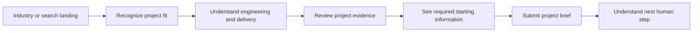

# Sari Arta Public Website Design Reference

## Nayati UX Analysis and Original Adaptation Direction

> Chinese translation: [design-reference.zh-CN.md](design-reference.zh-CN.md). This English document is the primary engineering baseline.

**Reference reviewed:** [nayati.com](https://www.nayati.com/)  
**Review date:** 2026-08-09  
**Target brand:** Sari Arta  
**Target positioning:** **Indonesia Commercial Kitchen Engineering Partner**  
**Status:** Design-analysis baseline only; no frontend implementation

## Reference-use boundary

Nayati is used only to study how an established commercial-kitchen business communicates manufacturing credibility, product scope, project references, service, and inquiry routes.

The Sari Arta website must not reproduce Nayati’s:

- Brand identity or red/white visual system.
- Logo, copy, slogans, images, videos, illustrations, or product names.
- Page layouts, navigation composition, animation, or distinctive interactions.
- Project references, credentials, claims, statistics, contact details, or form wording.

The proposed Sari Arta experience is based on Sari Arta’s different market role: an engineering and delivery partner connecting China manufacturing capability with Indonesia-based project coordination, installation, and service.

All Sari Arta claims, cases, geographic coverage, certifications, delivery performance, images, warranties, and service statements require business evidence and approval before publication.

## Executive design conclusion

Nayati presents a manufacturer-led story: authentic industrial imagery, broad equipment categories, long operating history, references by customer segment, and after-sales support. These elements reduce risk for professional buyers because they demonstrate that the company has products, a factory, project exposure, and a service organization.

Sari Arta should adopt the underlying trust pattern but change the content model and journey:

```text
Nayati reference pattern
Manufacturer credibility → products → references → service → inquiry

Original Sari Arta pattern
Project challenge → industry fit → engineering capability
→ China–Indonesia delivery model → verified project evidence
→ structured consultation request
```

The resulting website should feel like a project-engineering partner, not a catalogue reseller and not a copy of a kitchen-equipment manufacturer.

## 1. Brand positioning analysis

### 1.1 How Nayati positions itself

The live homepage positions Nayati around a complete food-service solution rather than a single appliance. Its visible message combines professional equipment, innovation, craftsmanship, worldwide professional use, Indonesia-based manufacturing, and after-sales support. The factory-led homepage image gives that message physical credibility. See the [Nayati homepage](https://www.nayati.com/).

The positioning has five visible layers.

#### Layer 1 — Category authority

Nayati immediately identifies itself with professional and commercial kitchen equipment. The language is broad enough to cover complete food-service environments while remaining anchored in physical equipment.

#### Layer 2 — Manufacturing origin

Indonesia-based design and manufacturing are treated as strategic proof, not background information. Factory imagery, the company story, and manufacturing language make production capability part of the brand.

#### Layer 3 — Product breadth

The [products page](https://www.nayati.com/products/) organizes the offer into recognizable equipment families including cooking, refrigeration, washing, ovens, stainless-steel furniture, and self-service systems. This signals that the company can address multiple kitchen zones.

#### Layer 4 — Experience and innovation

The homepage and [innovation page](https://www.nayati.com/inspire-and-innovate/) connect longevity, continuous improvement, craftsmanship, and long-term customer relationships. The brand is positioned as established but still technically progressive.

#### Layer 5 — Lifecycle service

The [service area](https://www.nayati.com/service/) expands the relationship beyond purchase through consultancy, showroom contact, technical service, downloads, warranty information, and after-sales support. This reduces buyer anxiety about maintaining professional equipment.

### 1.2 Positioning strengths

| Strength | Why it matters to a B2B buyer |
|---|---|
| Authentic factory context | Makes the manufacturing claim tangible |
| Clear professional category | Filters out residential/consumer expectations |
| Broad product families | Signals ability to cover complete kitchen zones |
| Long-history narrative | Reduces perceived supplier continuity risk |
| References by segment | Helps buyers recognize relevant market experience |
| After-sales visibility | Addresses lifecycle and downtime concerns |
| Multiple contact channels | Allows buyers with different urgency and preferences to respond |

### 1.3 Positioning limitations relevant to Sari Arta

These are not judgments about Nayati’s business quality; they identify where Sari Arta needs a different website strategy.

- The experience is primarily manufacturer- and product-led, while Sari Arta needs to lead with project engineering and delivery coordination.
- Equipment categories receive more structural prominence than buyer industries or project phases.
- Reference content is presented mainly as segment galleries, with limited visible project challenge, scope, process, and outcome narrative on the reviewed pages.
- The China-manufacturing plus Indonesia-installation model required by Sari Arta is a coordination story, not a single-origin manufacturing story.
- A buyer who does not yet know equipment terminology needs an industry/problem route before a product route.
- A premium project consultation should collect capacity, timeline, location, readiness, and scope—not only general interest in product categories.

### 1.4 Sari Arta positioning architecture

#### Core position

> **Indonesia Commercial Kitchen Engineering Partner**

#### Supporting proposition

Sari Arta helps institutional and industrial project owners plan, source, install, and commission commercial kitchens through coordinated engineering, China manufacturing resources, and local Indonesia project delivery.

This is a proposed direction, not approved public copy.

#### Brand pillars

| Pillar | Buyer meaning | Evidence required before publication |
|---|---|---|
| Engineering clarity | Requirements become a workable kitchen plan and equipment scope | Drawings, process examples, team capability, deliverables |
| Manufacturing advantage | China manufacturing access supports range, customization, or commercial value | Approved partners, QC method, factory evidence, sourcing controls |
| Local delivery confidence | Indonesia coordination reduces installation and communication risk | Local team, installation images, service area, commissioning process |
| Industry understanding | Sector requirements are understood before equipment is proposed | Verified school, hospital, factory/corporate, central-kitchen cases |
| Complete project ownership | One coordinated process connects discovery to commissioning | Responsibility matrix, delivery process, project artifacts |

#### Messaging hierarchy

```text
1. We understand your operating environment.
2. We engineer the kitchen as a complete workflow.
3. We coordinate appropriate manufacturing capability.
4. We install and commission locally in Indonesia.
5. We provide a clear project path and accountable human contact.
```

## 2. Website information architecture analysis

### 2.1 Nayati homepage structure

The reviewed homepage uses this visible hierarchy:

1. Transparent/sticky global header over an industrial hero.
2. Full-width factory/kitchen-equipment visual.
3. Broad total-solution statement.
4. Company/manufacturing story with an about link.
5. Professional-equipment solution introduction.
6. Manufacturing/value statement.
7. After-sales service section.
8. Utility-heavy footer with inquiry, downloads, manual, warranty, policies, social media, WhatsApp, and email.

The homepage relies on large industrial imagery and generous whitespace. It feels like a brand/manufacturer presentation more than a guided project-acquisition funnel.

### 2.2 Nayati navigation analysis

The visible primary navigation contains:

- Home.
- Products.
- Inspire and Innovate.
- Virtual Kitchen.
- References.
- Service.
- Contact Us.
- Search.

Contact expands into inquiry and sales-contact routes. The footer repeats inquiry and offers additional service resources.

#### What works

- Products, references, service, and contact cover core B2B evaluation tasks.
- Search supports a large product/content catalogue.
- References and service are top-level, signaling that proof and lifecycle support matter.
- Inquiry remains available in the footer across the site.

#### What Sari Arta should improve

- Navigation should begin with buyer needs and industries rather than internal brand concepts.
- `Solutions` and `Industries` should be distinct: one explains capability; the other explains sector-specific application.
- `Projects` should contain evidence-rich cases, not only galleries.
- `Request Consultation` should be a visually persistent primary CTA.
- Search is not essential until Sari Arta has enough public content to justify it.
- Experimental tools should not displace foundational trust content in the primary navigation.

### 2.3 Nayati content hierarchy

The reference site uses a broad-to-specific hierarchy:

```text
Brand/manufacturing promise
→ equipment families
→ industry references
→ service options
→ inquiry or sales contact
```

The product hierarchy is category-based. The references hierarchy is segment-based, including restaurants, hotels, hospitals, catering, institutions, and residential kitchens. See the [references index](https://www.nayati.com/references/) and [hospital reference page](https://www.nayati.com/references/hospitals/).

This is effective for visitors who already know they need commercial-kitchen equipment. It is less effective for early-stage project owners who need help defining capacity, workflow, utilities, hygiene zones, drawings, budget, and schedule.

### 2.4 Nayati customer journey

Two main paths are visible.

#### Product-led journey

```text
Homepage
→ product family
→ individual product exploration
→ inquiry / sales contact
```

#### Trust-led journey

```text
Homepage
→ company story or references
→ segment evidence or service
→ inquiry / WhatsApp / email
```

The customer can enter contact from global navigation, the footer, WhatsApp, or email. The journey provides options but does not strongly sequence the visitor toward a structured project brief.

### 2.5 Nayati conversion points

Observed conversion and contact points include:

- `Contact Us` navigation.
- A detailed [asking-for-information form](https://www.nayati.com/asking-for-information/).
- A separate sales-contact route.
- Footer inquiry link.
- WhatsApp contact.
- Direct email.
- Newsletter.
- Downloads, manuals, and warranty resources that support later-stage buyers.
- `Learn More` links from homepage company, references, and service content.

### 2.6 Information-architecture lesson for Sari Arta

Sari Arta should preserve three reference principles:

1. Proof and service deserve primary-level visibility.
2. Visitors need multiple contextual routes to a human conversation.
3. A broad capability must be decomposed into understandable categories.

But Sari Arta should use a different top-level structure:

```text
Home
Solutions
Industries
Projects / Case Studies
About Us
Contact / Request Consultation
```

`Solutions` explains what Sari Arta does across the project lifecycle. `Industries` explains why that capability is relevant to a buyer’s environment. `Projects` proves delivery.

## 3. Visual design analysis

### 3.1 Overall Nayati style

The visible site uses a clean industrial-corporate style:

- Full-width factory and equipment imagery.
- Large white/light-gray content areas.
- Thin dividers and generous vertical spacing.
- Restrained red accent tied closely to the logo.
- Simple rectangular CTA buttons.
- Uppercase primary navigation.
- Product/category imagery as navigation.
- A mix of brand presentation, catalogue, and utility/service pages.

The style communicates manufacturing scale and seriousness without consumer-style decoration.

### 3.2 Color direction

The observed color system is dominated by:

- Brand red for identity, selected navigation, arrows, and CTAs.
- White and light gray for content surfaces.
- Charcoal/dark gray headings.
- Medium gray body copy.
- Stainless-steel and neutral industrial photography.

The restrained palette lets real product and factory imagery carry much of the visual message.

### 3.3 Typography

The reviewed pages use a clean sans-serif system, with Myriad Pro visible in computed styles on the homepage. Headings are generally regular rather than extremely bold, and navigation uses uppercase labels.

The typography supports an established corporate tone, though some long line lengths and low-contrast gray copy should not be carried into the Sari Arta design.

### 3.4 Image usage

Nayati’s strongest visual trust device is authentic-looking industrial context:

- Factory/manufacturing floor.
- Stainless-steel kitchen equipment.
- Product-setting/category images.
- After-sales/service imagery.
- Reference galleries and embedded video.

The imagery shows physical capability rather than abstract promises. This is the most transferable design lesson.

Sari Arta must use its own approved images. AI-generated or stock project images must not be presented as evidence of completed work.

### 3.5 Layout style

Observed layout patterns include:

- Wide hero imagery behind or immediately below a transparent header.
- Centered statements with large whitespace.
- Alternating editorial text/image sections.
- Grid-based product categories.
- Page-title banners on inner pages.
- Sidebar subnavigation on references and service pages.
- Utility-heavy footer.

### 3.6 Trust-building elements

| Element | Trust effect |
|---|---|
| Factory hero | Demonstrates physical production environment |
| Indonesia manufacturing statement | Gives origin and operational identity |
| Long company history | Signals business continuity |
| Product-family breadth | Suggests complete kitchen coverage |
| Industry references | Provides category-relevant experience |
| After-sales service | Addresses lifecycle and maintenance risk |
| Manuals, downloads, warranty | Supports technical procurement and ownership |
| Video/social links | Adds company visibility beyond static claims |
| Direct WhatsApp/email | Shows reachable human contact |

### 3.7 Visual issues Sari Arta should avoid

- Reproducing a full-screen factory hero with the same overlay/navigation treatment.
- Copying the red accent, rounded logo framing, page-banner styling, or arrow motif.
- Using large empty spaces without a purposeful reading rhythm.
- Making product categories the dominant homepage story.
- Presenting references as images without project context.
- Using low-contrast gray body text.
- Showing all available interactions in the primary navigation.
- Adding dark-mode or novelty controls without a demonstrated buyer need.

## 4. Conversion strategy analysis

### 4.1 Nayati conversion model

The reference site uses a distributed conversion strategy. Instead of one dominant funnel, it offers several contact and information routes:

- General inquiry form.
- Sales contact.
- WhatsApp.
- Email.
- Newsletter.
- Downloads/manuals/warranty for buyers or existing customers.

This suits a broad manufacturer audience: dealers, consultants, designers, chefs, contractors, and end customers can self-select a contact route.

### 4.2 Inquiry-form strategy

The reviewed form requests:

- Name and title.
- Position and company.
- City and country.
- Email and phone.
- Business role.
- Equipment areas of interest.
- Message.
- Privacy consent.

It qualifies the visitor by business type and product interest. This supports a product-sales organization, but it creates a long form and is less aligned with an engineering-project brief.

### 4.3 Conversion strengths

- Multiple accessible human-contact options.
- Role and company collection helps route inquiries.
- Product-interest selection helps initial sales triage.
- Country and city support international visitors.
- Privacy consent is explicit.
- Service resources create conversion paths for later-stage users.

### 4.4 Conversion improvements for Sari Arta

Sari Arta should use a single dominant conversion objective: **request a project consultation**.

The form should qualify the project, not force the buyer to select equipment they may not understand. Ask for:

- Facility/industry.
- Project type.
- Location.
- Expected capacity.
- Timeline.
- Floor-plan readiness.
- Known equipment/service scope.
- Contact and company.

Use progressive disclosure so a buyer with incomplete requirements can still submit.

### 4.5 Sari Arta conversion funnel



### 4.6 CTA hierarchy

#### Primary CTA

`Request Project Consultation`

Use in:

- Global header.
- Hero.
- Industry pages.
- Case-study conclusions.
- Final page CTA.

#### Secondary CTAs

- `Explore Our Delivery Approach`.
- `View Relevant Projects`.
- `See Industry Solutions`.
- `Prepare Your Project Brief`.

#### Optional direct channels

WhatsApp or phone may be added only after Sari Arta approves ownership, response policy, consent handling, operating hours, and real external communication. It should complement—not replace—the CRM-connected form.

### 4.7 Conversion reassurance

Near the form, explain:

- Incomplete technical information is acceptable.
- A human specialist will review the project.
- Submission does not create a quotation or delivery commitment.
- Customer data is used for the stated follow-up purpose.
- The form will not display or communicate an internal AI score.

## 5. Adaptation for Sari Arta

### 5.1 Original creative direction

Use the design direction defined in `docs/ui-design.en.md`: **Precision workshop, tropical context**.

Nayati’s authentic industrial evidence inspires the use of real manufacturing and installation content. Sari Arta’s execution must differ through:

- Deep foundry green, copper, limestone, steel gray, and technical blue rather than red/white.
- Editorial split hero rather than a full-screen factory-video hero.
- Engineering diagrams and responsibility maps rather than product-setting grids as the primary visual system.
- Industry-first storytelling rather than product-first navigation.
- A China–Indonesia project-delivery narrative unique to Sari Arta.
- Structured case studies rather than general reference galleries.
- One strong consultation funnel connected to the lead-management platform.

### 5.2 Homepage positioning concept

#### Proposed eyebrow

`Indonesia Commercial Kitchen Engineering Partner`

#### Proposed message direction

Lead with the operational outcome: a commercial kitchen planned for the client’s capacity, workflow, facility, and delivery context.

Support with the coordinated model:

```text
Project engineering and site coordination in Indonesia
+ manufacturing capability in China
+ local installation and commissioning
```

Exact public wording requires business approval and proof.

### 5.3 What to retain, transform, and reject

| Reference pattern | Sari Arta decision |
|---|---|
| Real factory imagery | **Retain principle:** use Sari Arta/approved partner evidence with captions |
| Product-category breadth | **Transform:** present complete delivery capabilities first; equipment scope second |
| Segment references | **Transform:** build evidence-rich school, hospital, factory/corporate, and central-kitchen cases |
| Long-history statement | **Use only if verified:** never invent longevity |
| After-sales visibility | **Retain principle:** explain approved local support method |
| General inquiry form | **Transform:** progressive project consultation brief |
| Multiple direct contact routes | **Retain selectively:** one primary CRM form; approved direct alternatives |
| Full-screen industrial hero | **Reject as a template:** use an original editorial/technical hero |
| Red/white brand system | **Reject:** use Sari Arta’s own approved system |
| Product-interest checkbox wall | **Reject:** ask project context and readiness |

## 6. Proposed public website structure

```text
Home
├── Solutions
│   ├── Commercial kitchen planning and design
│   ├── Equipment engineering and manufacturing coordination
│   ├── Logistics and project coordination
│   ├── Installation and commissioning
│   └── Training and after-sales support
├── Industries
│   ├── School kitchens
│   ├── Hospital kitchen solutions
│   ├── Factory and corporate cafeterias
│   └── Central kitchens / commissaries
├── Projects / Case Studies
├── About Us
└── Contact / Request Consultation
```

The site should be available in English and Bahasa Indonesia. English supports overseas acquisition; Bahasa Indonesia supports local buyers and project stakeholders.

## 7. Page definitions

### 7.1 Home

#### Purpose

Establish Sari Arta as a credible Indonesia-based commercial-kitchen engineering and delivery partner, guide visitors to relevant industry evidence, and convert serious projects into consultation requests.

#### Key content

- Core positioning.
- Industry relevance.
- Complete project-delivery capability.
- China manufacturing and Indonesia delivery model.
- Verified case evidence.
- Delivery process.
- Consultation readiness.

#### Recommended sections

1. **Header and primary CTA** — simple navigation, language selector, consultation action.
2. **Editorial engineering hero** — outcome-led message, project/site visual, one technical annotation layer.
3. **Industry relevance strip** — school, hospital, factory/corporate, central kitchen.
4. **Why complete-kitchen engineering matters** — capacity, workflow, hygiene, utilities, equipment, installation.
5. **Delivery capability sequence** — discovery through after-sales.
6. **China–Indonesia responsibility map** — who handles engineering, manufacturing, QC, logistics, installation, and commissioning.
7. **Featured projects** — two or three approved cases with challenge, scope, and outcome.
8. **Industry solution previews** — concise sector-specific concerns and links.
9. **Project delivery process** — clear steps and customer inputs.
10. **Trust evidence** — team, technical outputs, approved credentials, service coverage.
11. **Project-readiness checklist** — what buyers can prepare.
12. **Consultation CTA** — structured project brief.
13. **FAQ and footer** — reduce friction, show company/policy details.

#### Required components

- Marketing header.
- Engineering hero.
- Industry cards.
- Capability/process rail.
- China–Indonesia delivery map with accessible text alternative.
- Case-study cards.
- Evidence cards.
- Readiness checklist.
- Consultation CTA.
- FAQ accordion.
- Bilingual footer.

### 7.2 Solutions

#### Purpose

Explain how Sari Arta contributes across the project lifecycle and clarify responsibility boundaries before a commercial discussion.

#### Key content

- Commercial-kitchen planning and workflow.
- Capacity and equipment-scope development.
- Manufacturing coordination and quality control.
- Logistics/site-readiness coordination.
- Installation and commissioning.
- Training and approved after-sales support.

#### Recommended sections — index

1. Solutions hero: complete delivery rather than equipment catalogue.
2. Project-lifecycle overview.
3. Capability cards.
4. Responsibility matrix.
5. Typical project inputs and deliverables.
6. Related project cases.
7. Consultation CTA.

#### Recommended sections — detail page

1. Buyer problem.
2. Sari Arta scope.
3. Required customer inputs.
4. Working method.
5. Deliverables.
6. Interfaces with owner, consultant, contractor, manufacturing partner, and site team.
7. Verified evidence.
8. Limitations/exclusions where appropriate.
9. Related industries and cases.
10. Contextual consultation CTA.

#### Required components

- Capability cards.
- Lifecycle diagram.
- Responsibility matrix.
- Deliverables list.
- Process steps.
- Evidence/case links.
- Contextual project CTA.

### 7.3 Industries

#### Purpose

Help buyers recognize that Sari Arta understands their operating environment before discussing equipment.

#### Key content

- Industry-specific operational challenges.
- Stakeholders and decision criteria.
- Kitchen zones and workflow considerations.
- Capacity, hygiene, service, or shift patterns.
- Relevant Sari Arta capability.
- Verified sector projects.

#### Recommended sections — index

1. Industry hero.
2. Four industry cards.
3. Shared engineering principles.
4. Sector evidence overview.
5. Consultation CTA.

#### School kitchens

- Meal volumes and serving windows.
- Age-appropriate and safe operation considerations.
- Receiving, storage, preparation, cooking, serving, and washing flow.
- Training and maintainability.
- Relevant verified project case.

#### Hospital kitchen solutions

- Hygiene and separation requirements.
- Diet/meal-production workflow.
- Reliability and cleaning considerations.
- Distribution and washing flow.
- Coordination with approved facility standards.
- Relevant verified project case.

Do not make clinical, regulatory, or hygiene-compliance guarantees without validated engineering and legal review.

#### Factory and corporate cafeterias

- Peak-shift throughput.
- Bulk preparation and serving.
- Staff flow and speed.
- Durability, maintenance, and cleaning.
- Expansion and shift flexibility.
- Relevant verified project case.

#### Central kitchens / commissaries

- High-volume production flow.
- Receiving, storage, preparation, cooking, chilling/holding, dispatch.
- Repeatability and expansion.
- Utility and logistics coordination.
- Relevant verified project case.

#### Required components

- Industry cards.
- Operational-flow diagram.
- Requirement checklist.
- Sector-specific evidence module.
- Related-solution cards.
- Industry-attributed consultation CTA.

### 7.4 Projects / Case Studies

#### Purpose

Prove delivery capability through structured, verifiable project narratives and help prospects find a comparable situation.

#### Key content

- Industry.
- Location.
- Customer type or approved name.
- Project challenge.
- Operating requirement/capacity when verified.
- Sari Arta scope.
- Delivery approach.
- Manufacturing and local-installation responsibility.
- Outcome and completion evidence.

#### Recommended sections — index

1. Projects hero.
2. Filters by industry, project type, and location only when enough cases exist.
3. Featured case.
4. Case-study grid.
5. Delivery-capability summary.
6. Consultation CTA.

#### Recommended sections — case detail

1. Case header with verified facts.
2. Project context.
3. Challenge and constraints.
4. Requirements summary.
5. Sari Arta responsibility.
6. Engineering and delivery approach.
7. China manufacturing and Indonesia installation role, when applicable.
8. Gallery with meaningful captions.
9. Verified result.
10. Related solution and industry.
11. `Discuss a similar project` CTA.

#### Required components

- Case-study card.
- Filter controls.
- Fact strip.
- Challenge/approach/outcome narrative.
- Captioned image gallery.
- Responsibility diagram.
- Related-content cards.
- Consultation CTA with case attribution.

If approved case content is unavailable, publish a smaller honest project library rather than fabricated or anonymous stock projects.

### 7.5 About Us

#### Purpose

Explain who Sari Arta is, how its China–Indonesia operating model works, and why customers can trust the team to coordinate a complex kitchen project.

#### Key content

- Company position and legal identity.
- Business story and verified milestones.
- Engineering and project-delivery philosophy.
- Indonesia team and responsibilities.
- China manufacturing-partner model.
- Quality and installation process.
- Approved service footprint.
- Contact and company credentials.

#### Recommended sections

1. Company-position hero.
2. Business story with verified timeline.
3. Operating-model diagram.
4. Team/role profiles.
5. How quality and accountability are managed.
6. Approved facilities, partners, credentials, or memberships.
7. Service-region explanation.
8. Project consultation CTA.

#### Required components

- Company timeline.
- Team cards.
- China–Indonesia operating map.
- Quality-check process.
- Credential/evidence cards.
- Service-region map with text alternative.
- Consultation CTA.

Do not imply ownership of a partner factory, certifications, or geographic coverage unless the relationship and wording are verified.

### 7.6 Contact / Request Consultation

#### Purpose

Convert a qualified visitor into a structured lead while making the next human step clear and protecting customer privacy.

#### Key content

- Who should use the form.
- What information is useful.
- Progressive project brief.
- Approved company contact details.
- Privacy and consent.
- What happens after submission.

#### Recommended sections

1. Consultation hero with low-friction reassurance.
2. Project-readiness checklist.
3. Four-step consultation form.
4. Alternate approved contact route.
5. Privacy explanation.
6. FAQ about the consultation process.

#### Required components

- Project-brief stepper.
- Field groups and validation summary.
- Industry/project selectors.
- Contact and company fields.
- Consent controls.
- Submission status.
- Safe error state.
- Confirmation page.
- Approved contact card.

## 8. Lead generation strategy

### 8.1 Lead sources

The website should capture and preserve attribution from:

- Organic search landing page.
- Industry page.
- Solution page.
- Project case.
- Campaign/referral UTM parameters.
- Direct navigation.

Attribution should be stored with the lead without exposing internal campaign or scoring logic to the visitor.

### 8.2 Lead quality strategy

Improve quality through context, not friction:

1. Let the visitor self-identify by industry.
2. Explain what a commercial-kitchen project requires.
3. Show relevant evidence.
4. Ask structured project questions.
5. Accept unknown values.
6. Confirm human review.

Do not run AI qualification automatically from the public form in Phase 1. The saved lead enters the internal workflow for human-managed review and optional AI qualification.

### 8.3 Contextual conversion modules

| Page context | CTA copy direction | Attribution captured |
|---|---|---|
| School industry | Discuss a school kitchen project | `industry=school` |
| Hospital industry | Discuss a hospital kitchen project | `industry=hospital` |
| Factory/corporate | Plan a high-volume cafeteria | `industry=corporate_cafeteria` |
| Central kitchen | Discuss production capacity and flow | `industry=central_kitchen` |
| Solution detail | Review this capability for your project | `solution=<slug>` |
| Case study | Discuss a similar project | `case_study=<slug>` |

Copy is directional and requires editorial review.

### 8.4 Lead magnets

The strongest first lead magnet is a practical `Commercial Kitchen Project Readiness Checklist`, delivered as visible web content and optionally as a downloadable file later.

Possible later topics:

- Information needed before a kitchen layout review.
- Capacity and workflow planning worksheet.
- Site-readiness checklist for installation.
- School/hospital/factory kitchen planning guide.

Do not gate every useful resource behind a form. Provide enough value publicly to establish competence.

### 8.5 Conversion measurement

- CTA click-through by page type.
- Form start and completion.
- Completion by step.
- Validation abandonment.
- Qualified inquiry rate by source/industry.
- Percentage with capacity, timeline, and location.
- Time to first human follow-up.

Use privacy-minimized analytics. Do not place customer messages, phone numbers, email addresses, or other inquiry PII into analytics events.

## 9. Contact form requirements

### 9.1 Recommended flow

Use four short steps.

#### Step 1 — Your organization

- Full name.
- Work email.
- Phone/WhatsApp number.
- Company/organization.
- Job title or role.
- Preferred language.

#### Step 2 — Your project

- Industry: school, hospital, factory/corporate cafeteria, central kitchen, other.
- Project type: new kitchen, renovation, expansion, equipment replacement.
- Country and city.
- Expected capacity or meals per period.
- Target opening/timeline.

#### Step 3 — Scope and readiness

- Project description.
- Known equipment/service scope.
- Floor-plan status: available, in progress, not available.
- Budget range: optional.
- Preferred contact method.

Secure file upload is postponed until the approved object-storage, malware-scanning, retention, and authorization lifecycle exists.

#### Step 4 — Review and consent

- Readable submission summary.
- Edit links.
- Required contact consent.
- Separate optional marketing consent.
- Privacy-policy version/link.
- Single submit action with pending state and duplicate-click protection.

### 9.2 Validation requirements

- Server and client validation.
- International country and phone handling.
- Work email is encouraged but not technically required if it excludes legitimate owners.
- Clear required/optional labels.
- Field-level messages plus summary.
- Preserve safe input after validation or network failure.
- Strict length and schema limits.
- Rate limiting and anti-abuse control.
- Idempotency key for duplicate submission.
- Accessible keyboard and screen-reader flow.
- English and Bahasa Indonesia copy.

### 9.3 Confirmation requirements

- Non-sensitive submission reference.
- Clear success message.
- Approved explanation of next human step.
- No promise of price, schedule, design completion, or response SLA unless approved.
- No AI score, sales owner, duplicate result, lead ID, or internal workflow status.
- Link to project-readiness information.

### 9.4 Current API alignment

The existing public lead endpoint already supports a safe, idempotent basic inquiry with contact, organization, location, message, attribution, and consent.

Before implementing the complete form, either:

1. Expand the strict API schema to accept the additional approved project fields; or
2. Launch a shorter first form containing only fields already supported.

The UI must not collect and silently discard capacity, industry, project type, role, floor-plan status, budget, or contact preference.

## 10. SEO content direction

### 10.1 Search intent strategy

Organize content around buyer tasks rather than a product-keyword catalogue.

#### Core commercial intent

- Commercial kitchen design Indonesia.
- Commercial kitchen contractor Indonesia.
- Commercial kitchen installation Indonesia.
- Industrial kitchen equipment Indonesia.
- Commercial kitchen engineering company Indonesia.
- Turnkey commercial kitchen project Indonesia, only if `turnkey` accurately describes the approved scope.

#### Industry intent

- School kitchen design Indonesia.
- Hospital kitchen design and equipment Indonesia.
- Factory cafeteria kitchen Indonesia.
- Corporate canteen kitchen design.
- Central kitchen design Indonesia.
- Commissary kitchen equipment and installation.

#### Process and educational intent

- How to plan commercial kitchen capacity.
- Commercial kitchen workflow planning.
- Kitchen site-readiness checklist.
- Commercial kitchen equipment sourcing China to Indonesia.
- Commercial kitchen installation and commissioning.

Keywords are research directions, not mandatory copy. Validate search demand and phrasing before publishing.

### 10.2 Page-level SEO direction

| Page | Primary search role |
|---|---|
| Home | Brand and broad Indonesia engineering intent |
| Solutions index | Complete project-delivery capability |
| Solution detail | Design, sourcing/manufacturing, installation, commissioning intent |
| Industry detail | High-specificity sector problem and solution intent |
| Project case | Proof, location, industry, and comparable-project intent |
| About | Brand, company, team, and operating-model trust |
| Contact | Branded consultation/conversion intent; not a content landing page |

### 10.3 SEO content rules

- One clear search intent per page.
- Original, expert-reviewed English and Bahasa content.
- Useful explanations of process, requirements, and limitations.
- No copied manufacturer descriptions.
- No pages generated only to target city/keyword permutations.
- No unsupported standards, performance, capacity, or coverage claims.
- Case studies use verified facts and customer permission.
- Internal links connect industry → capability → case → consultation.
- Use descriptive headings, image alt text, captions, and breadcrumb structure.

### 10.4 Technical SEO

- Server-render public content.
- Unique title, description, canonical URL, and social image.
- XML sitemap for public pages only.
- `robots` rules prevent indexing authenticated workspace routes.
- Correct language alternates for English and Bahasa Indonesia.
- Structured data for organization, service, breadcrumb, article/case, and FAQ only when visible content supports it.
- Responsive optimized images with fixed dimensions.
- Strong Core Web Vitals; avoid heavy autoplay video and excessive scripts.
- Accessible semantic HTML.
- Clean redirects when slugs change.

### 10.5 Recommended initial content set

Launch quality is more important than page count.

Minimum credible set:

1. Home.
2. Solutions index.
3. Commercial kitchen planning/design solution.
4. Installation/commissioning solution.
5. Four industry pages.
6. Two or more approved case studies, or an honest delivery-approach page if cases are not approved.
7. About Us.
8. Request Consultation.
9. Privacy notice.

## 11. Visual adaptation specification

### 11.1 Sari Arta visual concept

**Precision workshop, tropical context** combines technical rigor with local delivery confidence.

#### Palette direction

- Deep engineering green for authority and primary actions.
- Copper accent for fabrication, heat, and editorial highlights.
- Limestone/off-white for premium editorial space.
- Steel gray for diagrams and secondary information.
- Technical blue for process/information accents.

This direction is intentionally distinct from Nayati’s red/white system.

#### Typography direction

- Strong, highly legible sans serif for navigation, specifications, and body copy.
- Optional restrained editorial serif for selected public headlines.
- Tabular numerals for capacities and project facts.
- No imitation of Nayati’s typeface or uppercase-heavy navigation.

#### Image direction

- Sari Arta people, projects, installation, and engineering artifacts.
- Approved China manufacturing/quality-control evidence.
- Indonesia site coordination and commissioning.
- Captioned project images.
- Technical overlays inspired by plans, zones, workflow, and responsibility—not by Nayati’s layout.

### 11.2 Original homepage layout character

Use an asymmetric editorial grid:

```text
┌────────────────────────────────────────────────────────┐
│ Header                            Request Consultation │
├──────────────────────────────┬─────────────────────────┤
│ Positioning + CTA            │ Project/site evidence   │
│ Delivery summary             │ Technical annotations   │
├──────────────────────────────┴─────────────────────────┤
│ Industries / project-fit selector                      │
├────────────────────────────────────────────────────────┤
│ Engineering lifecycle + China–Indonesia responsibility │
├────────────────────────────────────────────────────────┤
│ Verified project stories                              │
└────────────────────────────────────────────────────────┘
```

Do not use the reference site’s full-screen factory visual, transparent navigation treatment, product-grid composition, or red CTA styling.

## 12. Content and evidence prerequisites

Before Next.js implementation reaches publishable content, Sari Arta should provide or approve:

- Legal company name and approved brand assets.
- Company description and positioning wording.
- Indonesia office/service contact details.
- Named contact owners and response policy.
- Verified engineering deliverables.
- China manufacturing relationship wording and evidence.
- Indonesia installation/commissioning scope and service area.
- School, hospital, factory/corporate, and central-kitchen project evidence.
- Approved case facts and customer permissions.
- Original/licensed project, team, factory, and installation images.
- Credentials, certifications, standards, and warranty wording.
- Privacy notice, consent wording, and retention policy.
- English and Bahasa Indonesia terminology review owner.

Missing evidence should produce a clearly marked content placeholder in design review, not a fabricated public claim.

## 13. Recommendation

Use Nayati as evidence that authentic industrial imagery, product breadth, segment references, after-sales visibility, and accessible contact routes build commercial-kitchen trust.

For Sari Arta, transform those principles into an original, project-led website centered on:

1. Buyer industry and operational challenge.
2. Commercial-kitchen engineering capability.
3. China manufacturing and quality coordination.
4. Indonesia local installation and commissioning.
5. Verified project-delivery evidence.
6. One structured `Request Project Consultation` journey connected to the existing lead platform.

No frontend code is created or modified by this document. Next.js implementation begins only after explicit approval of this direction.

## Reference pages reviewed

- [Nayati homepage](https://www.nayati.com/)
- [Products](https://www.nayati.com/products/)
- [Inspire and Innovate](https://www.nayati.com/inspire-and-innovate/)
- [References](https://www.nayati.com/references/)
- [Hospital references](https://www.nayati.com/references/hospitals/)
- [Service](https://www.nayati.com/service/)
- [Company profile](https://www.nayati.com/company-profile/)
- [Asking for information](https://www.nayati.com/asking-for-information/)
