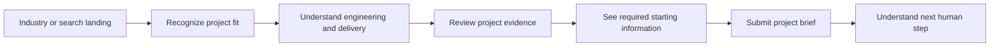

# Sari Arta 公共网站设计参考

## Nayati UX 分析及原始适应方向

> 英文工程基线：[design-reference.en.md](design-reference.en.md)。中文版本用于内部审核；如有冲突，以英文版本为准。

**已审查的参考资料：** [nayati.com](https://www.nayati.com/) **审查日期：** 2026-08-09 **目标品牌：** Sari Arta **目标定位：** **印度尼西亚商业厨房工程合作伙伴** **状态：** 仅为设计-分析基线；无前端实现

## 参考用途边界

Nayati 仅用于研究已建立的商业厨房业务如何沟通其生产可信度、产品范围、项目参考、服务以及咨询途径。

Sari Arta 网站不得复制 Nayati 的：

- 品牌标识或红/白视觉系统。
- Logo、标语、口号、图片、视频、插图或产品名称。
- 页面布局、导航结构、动画，或独特的交互方式。
- 项目参考资料、资质证明、声明、统计数据、联系方式或表单措辞。

拟议的 Sari Arta 体验基于 Sari Arta 在不同市场中的角色：作为工程和交付合作伙伴，将中国制造能力与印尼的项目协调、安装和服务的联系起来。

所有Sari Arta的索赔、案件、地理覆盖范围、认证、交付表现、图像、保修和服务声明，在发布前都需要提供商业证据和批准。

## 执行设计结论

Nayati 提供的是由制造商主导的故事：真实的工业图像、广泛的设备类别、悠久的运营历史、按客户细分的参考，以及售后支持。 这些元素降低了专业买家的风险，因为它们表明该公司拥有产品、工厂、项目经验以及服务组织。

Sari Arta 应该采用底层信任模式，但需要修改内容模型和流程：

```text
Nayati reference pattern
Manufacturer credibility → products → references → service → inquiry

Original Sari Arta pattern
Project challenge → industry fit → engineering capability
→ China–Indonesia delivery model → verified project evidence
→ structured consultation request
```

最终的网站应该给人一种项目工程合作伙伴的感觉，而不是一个目录经销商，也不是一个厨房设备制造商的复制品。

## 1. 品牌定位分析

### 1.1 Nayati 的定位

Nayati 的主页展示了它作为一个完整的餐饮解决方案，而不是单一的设备。其可见的信息结合了专业设备、创新、工艺、全球专业应用、印尼本地制造以及售后支持。由工厂主导的主页图片赋予了这一信息实际的依据。请查看 [Nayati 主页](https://www.nayati.com/)。

该定位有五个可见的层。

#### 第一层 — 类别权威

Nayati 立即将其与专业和商业厨房设备联系起来。 语言足够广泛，可以涵盖完整的餐饮环境，同时仍然保持对物理设备的关注。

#### 第二层 — 制造来源

印尼本地的设计和制造被视为战略性证明，而非背景信息。工厂图片、公司故事和制造语言，将生产能力作为品牌的一部分。

#### 层级 3 — 产品范围

[产品页面](https://www.nayati.com/products/)将产品组织成易于识别的设备系列，包括烹饪、制冷、清洗、烤箱、不锈钢家具和自助服务系统。 这表明该公司可以处理多个厨房区域。

#### 层级 4 — 经验与创新

主页和[创新页面](https://www.nayati.com/inspire-and-innovate/)将长寿、持续改进、精湛工艺和长期客户关系联系起来。该品牌定位为既成熟又在技术上具有前瞻性。

#### 第五层 — 生命周期服务

[服务区域](https://www.nayati.com/service/)扩展了与购买的关系，不仅仅是咨询，还包括展示厅联系、技术服务、下载、保修信息以及售后支持。这有助于减少买家对维护专业设备的不安。

### 1.2 优势定位

| 强度 | 对于 B2B 购买者的重要性 |
|---|---|
| 真实的工厂环境 | 使制造声明具有可操作性 |
| 清晰的专业分类 | 过滤掉住宅/消费者的期望 |
| 广泛的产品系列 | 能够覆盖完整的厨房区域 |
| 悠久的历史叙述 | 降低对供应商连续性的感知风险 |
| 按模块引用 | 帮助买方识别相关的市场经验 |
| 售后可见性 | 处理生命周期和停机问题 |
| 多个联系渠道 | 允许具有不同紧迫性和偏好的买家做出响应 |

### 1.3 与 Sari Arta 相关的定位限制

这些不是对Nayati公司业务质量的评价；它们指出萨里阿塔需要采用不同的网站策略。

- 这段体验主要由制造商和产品驱动，而 Sari Arta 则需要以项目工程和交付协调为核心。
- 设备类别比买方行业或项目阶段获得更高的结构性重要性。
- 参考内容主要以分段画廊形式呈现，在审查的页面上，对项目挑战、范围、流程和结果的描述有限。
- Sari Arta所要求的、由中国制造并在印度尼西亚安装的模式，是一种协调性的故事，而不是单一来源的制造故事。
- 一位尚未了解设备术语的买家，在确定产品路线之前，需要先了解行业/问题相关的路线。
- 一个高级项目咨询应收集容量、时间表、地点、准备情况和范围——不仅仅是对产品类别的一般兴趣。

### 1.4 萨里阿塔定位架构

#### 核心位置

> **印尼商业厨房工程合作伙伴**

#### 支持性陈述

Sari Arta 帮助机构和工业项目业主规划、采购、安装和调试商业厨房，通过协调的工程、中国制造资源和当地的印尼项目交付。

这是一个建议方向，并非已批准的公开版本。

#### 品牌核心

| 柱 | 买方含义 | 在发表前需要提供的证据 |
|---|---|---|
| 工程清晰度 | 要求应转化为可行的厨房计划和设备范围 | 图纸、流程示例、团队能力、交付成果 |
| 制造优势 | 中国制造访问支持范围、定制或商业价值 | 已批准的合作伙伴，质量控制方法，工厂证据，采购控制 |
| 本地送货的可靠性 | 印度尼西亚协调减少安装和通信风险 | 本地团队、安装图片、服务区域、调试流程 |
| 行业理解 | 在提出设备之前，必须先了解行业要求 | 已验证的学校、医院、工厂/企业、中央厨房案例 |
| 完全的项目所有权 | 一个协调的过程将发现与验收连接起来 | 责任矩阵、交付流程、项目产出 |

#### 消息层级

```text
1. We understand your operating environment.
2. We engineer the kitchen as a complete workflow.
3. We coordinate appropriate manufacturing capability.
4. We install and commission locally in Indonesia.
5. We provide a clear project path and accountable human contact.
```

## 2. 网站信息架构分析

### 2.1 Nayati 首页结构

已审查的主页使用以下可见的层级结构：

1. 透明/粘性全局头部，位于工业英雄之上。
2. 全宽工厂/厨房设备视觉效果。
3. 全面的整体解决方案声明。
4. 公司/制造故事，包含“关于”链接。
5. 专业设备解决方案介绍。
6. 生产/价值声明。
7. 售后服务部分。
8. 功能丰富的页脚，包含咨询、下载、手册、保修、政策、社交媒体、WhatsApp和电子邮件。

主页主要依赖于大型工业图片和大量的空白空间。它更像是一个品牌/制造商的展示，而不是一个引导用户完成项目采购流程的页面。

### 2.2 Nayati 导航分析

可见的主要导航包含：

- 首页。
- 产品。
- 激发和创新。
- 虚拟厨房。
- 参考文献。
- 服务。
- 联系我们。
- 搜索。

联系方式扩展到咨询和销售-联系渠道。页脚重复咨询，并提供额外的服务资源。

#### 哪些功能正常

- 产品、参考资料、服务和联系方式，涵盖核心的 B2B 评估任务。
- 搜索功能支持一个大型的产品/内容目录。
- 参考文献和服务是首要内容，表明证明和生命周期支持至关重要。
- 查询选项仍然可在网站的页脚中找到。

#### Sari Arta 应该改进的地方

- 导航应从买方的需求和行业出发，而不是从内部的品牌概念出发。
- `Solutions`和`Industries`应保持区分：前者解释能力；后者解释特定领域的应用。
- `Projects` 应包含内容丰富的案例，而不仅仅是图集。
- `Request Consultation` 应该是一个持久且醒目的主要行动号召按钮。
- 搜索功能在Sari Arta拥有足够的公开内容以证明其价值时才至关重要。
- 实验性工具不应取代主要导航中的基础信任内容。

### 2.3 Nayati 内容层级

参考站点采用从宽泛到具体的层级结构：

```text
Brand/manufacturing promise
→ equipment families
→ industry references
→ service options
→ inquiry or sales contact
```

产品层级基于类别。 参照层级基于细分，包括餐厅、酒店、医院、餐饮、机构和住宅厨房。 请参阅[参照索引](https://www.nayati.com/references/)和[医院参照页面](https://www.nayati.com/references/hospitals/)。

这对于那些已经知道需要商业厨房设备的人来说非常有效。对于处于项目初期，需要帮助定义容量、工作流程、水电、卫生区、图纸、预算和时间表的项目所有者来说，效果较差。

### 2.4 Nayati客户旅程

两种主要路径可见。

#### 产品驱动的旅程

```text
Homepage
→ product family
→ individual product exploration
→ inquiry / sales contact
```

#### 基于信任的旅程

```text
Homepage
→ company story or references
→ segment evidence or service
→ inquiry / WhatsApp / email
```

客户可以通过全局导航、页脚、WhatsApp 或电子邮件输入联系方式。该流程提供选项，但没有强迫访客按照结构化的项目简报进行操作。

### 2.5 Nayati 转换点

观察到的转换和接触点包括：

- `Contact Us` 导航。
- 一份详细的[索取信息表](https://www.nayati.com/asking-for-information/)。
- 一个独立的销售联系人渠道。
- 页脚咨询链接。
- WhatsApp 联系人。
- 直接发送电子邮件。
- 新闻通讯。
- 下载、手册和保修资源，旨在支持后期阶段的买家。
- `Learn More` 链接，来自公司主页、参考资料和服务内容。

### 2.6 关于 Sari Arta 的信息架构课程

Sari Arta 应该遵守以下三个基本原则：

1. 证明和售后服务应获得首要级别可见性。
2. 访客需要多种不同的上下文路径，以便与人工对话。
3. 一个广泛的能力必须分解成易于理解的类别。

但是Sari Arta应该使用不同的顶层结构：

```text
Home
Solutions
Industries
Projects / Case Studies
About Us
Contact / Request Consultation
```

`Solutions` 解释 Sari Arta 在项目生命周期的作用。 `Industries` 解释为什么这项能力对买方的环境具有相关性。 `Projects` 证明了交付。

## 3. 视觉设计分析

### 3.1 整体Nayati风格

该网站采用简洁的工业-企业风格：

- 全宽的工厂和设备图片。
- 大型的白色/浅灰色内容区域。
- 细分隔线和充足的垂直间距。
- 紧凑的红色强调色，与标志紧密相关。
- 简单的矩形行动号召（CTA）按钮。
- 大写主导航。
- 产品/类别图片作为导航。
- 品牌展示、目录和实用/服务页面的混合。

这种设计风格传达了生产规模和严肃性，而没有采用消费者的装饰风格。

### 3.2 颜色方向

观察到的颜色系统主要由以下因素决定：

- 品牌颜色选择为红色，用于标识、选择导航、箭头和行动号召按钮。
- 白色和浅灰色用于内容表面。
- 煤炭/深灰色标题。
- 中等灰色的正文。
- 不锈钢和中性工业摄影。

经过精心的色彩搭配，真实的产品和工厂图像能够承载大部分视觉信息。

### 3.3 字体

所审查的页面采用简洁的无衬线字体系统，主页上使用Myriad Pro字体，并应用于计算样式。标题通常采用常规字体，而不是非常粗体，导航栏使用大写字母标签。

排版风格支持了公司已有的品牌调性，但一些长行长度和低对比度的灰色文字内容不应应用到 Sari Arta 设计中。

### 3.4 图像使用

Nayati最强大的视觉信任设备是具有真实工业环境外观：

- 工厂/生产车间。
- 不锈钢厨房设备。
- 产品设置/分类图片。
- 售后/服务图片。
- 参考图库和嵌入式视频。

图片展示的是实际能力，而不是抽象的承诺。这是最具有可转移性的设计教训。

Sari Arta 必须使用其已批准的图片。由人工智能生成或来自库存的图片不得作为已完成工作的证据来呈现。

### 3.5 布局风格

观察到的布局模式包括：

- 在透明标题的后面或立即下方，使用宽大的英雄图片。
- 居中陈述，带有较大的空白。
- 交替的编辑文本/图像部分。
- 基于网格的产品分类。
- 在内页上的页面标题横幅。
- 侧边栏中的参考文献和服务的子导航。
- 功能丰富的页脚。

### 3.6 建立信任的要素

| 元素 | 信任效果 |
|---|---|
| 工厂英雄 | 演示实际生产环境 |
| 印度尼西亚制造声明 | 提供来源和运行身份 |
| 悠久的企业历史 | 信号业务连续性 |
| 产品系列广度 | 建议提供厨房全覆盖 |
| 行业参考 | 提供与类别相关的体验 |
| 售后服务 | 处理产品生命周期和维护风险 |
| 手册、下载、保修 | 支持技术采购和所有权 |
| 视频/社交链接 | 增加公司可见性，超越静态声明 |
| 直接通过 WhatsApp/电子邮件 | 显示可达的人类联系 |

### 3.7 视觉问题：Sari Arta应避免

- 重现全屏工厂主页，并采用与现有界面/导航相同的效果。
- 复制红色强调色、圆角标志框架、页面横幅样式或箭头图案。
- 在没有有目的的阅读节奏的情况下，使用过大的空白。
- 将产品类别作为首页的主要内容。
- 在不提供项目背景的情况下，将参考资料以图片形式呈现。
- 使用低对比度的灰色文字。
- 显示主导航中所有可用的交互。
- 在没有明确证明的买家需求的情况下，添加深色模式或新颖控制功能。

## 4. 转换策略分析

### 4.1 Nayati转换模型

该参考网站采用分布式转换策略。它提供多种联系和信息途径，而不是单一的主导路径：

- 通用咨询表单。
- 销售联系人。
- WhatsApp.
- 电子邮件。
- 新闻通讯。
- 下载/手册/保修信息，适用于购买者或现有客户。

这适用于广泛的制造商受众：经销商、顾问、设计师、厨师、承包商和最终客户均可自行选择联系方式。

### 4.2 问卷调查策略

所审查的表格要求：

- 名称和职称。
- 职位和公司。
- 城市和国家。
- 电子邮件和电话。
- 业务角色。
- 感兴趣的设备区域。
- 消息。
- 隐私同意。

它通过业务类型和产品兴趣对访客进行分类。这支持产品销售组织，但会产生较长的表单，并且与工程项目简报不太一致。

### 4.3 转换优势

- 提供多种易于接触的人员选项。
- 角色和公司信息收集有助于将咨询请求路由。
- 产品兴趣选择有助于初步的销售分拣。
- 支持国际游客的国家和城市。
- 隐私同意必须明确表示。
- 服务资源为后期阶段的用户创建转换路径。

### 4.4 对 Sari Arta 的转换改进

Sari Arta 应该采用单一的主导转化目标：**请求项目咨询服务**。

表单应明确项目，而不是强迫买方选择他们可能不理解的设备。请要求：

- 场所/行业。
- 项目类型。
- 位置。
- 预期容量。
- 时间线。
- 楼层设计准备就绪。
- 已知的设备/服务范围。
- 联系方式和公司信息。

使用逐步披露的方式，以便即使有不完整要求的买家也能提交。

### 4.5 Sari Arta转换漏斗



### 4.6 呼吁行动（CTA）层级结构

#### 主要行动号

`Request Project Consultation`

使用场景：

- 全局标题。
- Hero.
- 行业页面。
- 案例研究结论。
- 最终页行动号召。

#### 次要行动号

- `Explore Our Delivery Approach`。
- `View Relevant Projects`。
- `See Industry Solutions`。
- `Prepare Your Project Brief`。

#### 可选的直接渠道

WhatsApp 或电话只能在Sari Arta批准所有权、回复政策、同意处理、营业时间以及真实外部沟通后添加。它应作为 CRM 关联表单的补充，而不是替代。

### 4.7 转换的可靠性保证

在表单附近，请说明：

- 不完整的技术信息是可以接受的。
- 一名专业人员将审核该项目。
- 提交不会产生报价或交付承诺。
- 客户数据用于指定的后续用途。
- 此表将不会显示或传达内部 AI 评分。

## 5. 针对 Sari Arta 的适应性

### 5.1 原始创意方向

使用在`docs/ui-design.en.md`中定义的设计方向：**精密车间，热带环境**。

Nayati的真实工业证据，激发了使用真实制造和安装内容的运用。Sari Arta的执行必须有所不同，具体如下：

- 深绿色、铜色、石灰石色、钢灰色和技术蓝色，而不是红色/白色。
- 编辑部选择使用较小的英雄图片，而不是全屏工厂视频作为英雄图片。
- 工程图和责任图，而不是产品设置网格，作为主要的视觉系统。
- 采用行业首创的故事叙述方式，而不是以产品为中心的导航。
- 一个专属于Sari Arta的中国-印度尼西亚项目交付叙述。
- 采用结构化的案例研究，而不是一般的参考图集。
- 一个强大的咨询流程，与线索管理平台连接。

### 5.2 首页定位概念

#### 拟议的眉毛

`Indonesia Commercial Kitchen Engineering Partner`

#### 拟议的消息方向

以运营结果为先：根据客户的容量、工作流程、设施和交付环境，规划一个商业厨房。

支持协调模型：

```text
Project engineering and site coordination in Indonesia
+ manufacturing capability in China
+ local installation and commissioning
```

精确的公共措辞需要获得业务部门的批准和证明。

### 5.3 哪些内容需要保留、转换或拒绝

| 参考模式 | Sari Arta 决定 |
|---|---|
| 真实的工厂图像 | **保留原则：** 使用带有标题的 Sari Arta/已批准的合作伙伴证据 |
| 产品类别范围 | **转换：** 首先提供完整的交付能力；其次是设备范围。 |
| 分段引用 | **构建：** 构建包含丰富证据的学校、医院、工厂/企业和中央厨房案例 |
| 悠久的历史记录 | **仅在验证后使用：** 永远不要虚报寿命 |
| 售后可见性 | **保留原则：** 解释已批准的本地支持方法 |
| 通用咨询表 | **转型：** 逐步的项目咨询简报 |
| 多个直接接触路径 | **保留特定选项：** 仅保留一个主要 CRM 表单；保留已批准的直接替代方案 |
| 全屏工业级英雄 | **作为模板拒绝：使用原始的编辑/技术英雄** |
| 红/白品牌系统 | **拒绝：** 使用Sari Arta认可的系统 |
| 产品兴趣选择框墙 | **拒绝：** 询问项目背景和准备情况 |

## 6. 拟议的公共网站结构

```text
Home
├── Solutions
│   ├── Commercial kitchen planning and design
│   ├── Equipment engineering and manufacturing coordination
│   ├── Logistics and project coordination
│   ├── Installation and commissioning
│   └── Training and after-sales support
├── Industries
│   ├── School kitchens
│   ├── Hospital kitchen solutions
│   ├── Factory and corporate cafeterias
│   └── Central kitchens / commissaries
├── Projects / Case Studies
├── About Us
└── Contact / Request Consultation
```

该网站应提供英语和印尼语两种语言版本。英语版本支持海外采购；印尼语版本支持本地买家和项目相关方。

## 7. 页面定义

### 7.1 主页

#### 目的

将 Sari Arta 建立为一家在印度可信赖的商业厨房工程和交付合作伙伴，引导访问者了解相关行业证据，并将严肃的项目转化为咨询请求。

#### 关键内容

- 核心定位。
- 行业相关性。
- 具备完整的项目交付能力。
- 中国制造，印度尼西亚交付模式。
- 已验证的案件证据。
- 交付流程。
- 咨询准备就绪。

#### 推荐章节

1. **标题和主要行动号召按钮** — 简单的导航、语言选择器、咨询操作。
2. **编辑工程英雄** — 以结果为导向的信息，项目/网站视觉效果，一个技术注释层。
3. **行业应用示例** — 学校、医院、工厂/企业、中央厨房。
4. **为什么完整的厨房工程至关重要** — 容量、工作流程、卫生、供水、设备、安装。
5. **交付能力序列** — 通过售后服务进行发现。
6. **中国-印度尼西亚责任地图** — 负责工程、制造、质量控制、物流、安装和调试的方。
7. **重点项目** — 两个或三个已批准的案例，包含挑战、范围和结果。
8. **行业解决方案预览** — 简洁的特定行业问题和链接。
9. **项目交付流程** — 清晰的步骤和客户输入。
10. **信任证据** — 团队、技术输出、已批准的凭证、服务覆盖范围。
11. **项目准备清单** — 购买方可以准备的内容。
12. **咨询行动号召** — 结构化的项目简报。
13. **常见问题解答和页脚** — 减少摩擦，展示公司/政策详情。

#### 所需组件

- 营销标题。
- 工程领域的英雄。
- 行业卡。
- 能力/流程轨道。
- 中国-印度尼西亚交付地图，带有可访问的文本替代方案。
- 案例研究卡片。
- 证据卡。
- 准备清单。
- 咨询服务。
- 常见问题解答（展开式）。
- 双语页脚。

### 7.2 解决方案

#### 目的

解释 Sari Arta 在项目生命周期的各个阶段的贡献，并在进行商业讨论之前，明确责任范围。

#### 关键内容

- 商业厨房规划和工作流程。
- 容量和设备范围的开发。
- 生产协调和质量控制。
- 物流/场地准备协调。
- 安装和调试。
- 培训和获得批准的售后支持。

#### 推荐章节 — 索引

1. 解决方案主推：提供完整的交付方案，而不是设备目录。
2. 项目生命周期概述。
3. 能力卡。
4. 责任矩阵。
5. 典型的项目输入和交付成果。
6. 相关项目案例。
7. 咨询服务。

#### 推荐章节 — 详细页面

1. 买方问题。
2. Sari Arta 范围。
3. 所需客户输入。
4. 工作方法。
5. 交付成果。
6. 与业主、顾问、承包商、制造合作伙伴和现场团队进行沟通。
7. 已验证的证据。
8. 适用限制/排除情况。
9. 相关行业和案例。
10. 根据情境提供咨询，引导用户进行操作。

#### 所需组件

- 能力卡。
- 生命周期图。
- 责任矩阵。
- 交付清单。
- 流程步骤。
- 证据/案例关联。
- 根据上下文的项目行动号召。

### 7.3 行业

#### 目的

帮助买家认识到 Sari Arta 在讨论设备之前，已经了解了他们的运营环境。

#### 关键内容

- 行业特定运营挑战。
- 利益相关者和决策标准。
- 厨房区域和工作流程的考虑因素。
- 容量、卫生、服务或班次模式。
- 相关的 Sari Arta 能力。
- 已验证的行业项目。

#### 推荐章节 — 索引

1. 行业领袖。
2. 四张行业卡。
3. 共享的工程原则。
4. 行业证据概述。
5. 咨询服务。

#### 学校厨房

- 用餐份量和用餐时间窗口。
- 适合年龄段且安全的操作注意事项。
- 接收、储存、准备、烹饪、上菜和清洗流程。
- 培训和可维护性。
- 相关已验证的项目案例。

#### 医院厨房解决方案

- 卫生和隔离要求。
- 饮食/膳食生产工作流程。
- 可靠性和清洁方面的考虑。
- 分发和清洗流程。
- 与已批准的设施标准协调。
- 相关已验证的项目案例。

请不要在未经经过验证的工程和法律审查后，做出临床、监管或卫生合规方面的保证。

#### 工厂和企业食堂

- 峰值移位吞吐量。
- 批量准备和供应。
- 工作人员流动和速度。
- 耐用性、维护和清洁。
- 扩展和位移灵活性。
- 相关已验证的项目案例。

#### 中央厨房 / 供应仓库

- 高产量生产流程。
- 接收、储存、准备、烹饪、冷藏/保温、派送。
- 可重复性和扩展性。
- 工具和物流协调。
- 相关已验证的项目案例。

#### 所需组件

- 行业卡。
- 操作流程图。
- 需求清单。
- 特定领域的证据模块。
- 相关解决方案卡。
- 行业认可的咨询服务引导。

### 7.4 项目/案例研究

#### 目的

通过结构化的、可验证的项目叙述来证明交付能力，并帮助潜在客户找到类似情况。

#### 关键内容

- 行业。
- 位置。
- 客户类型或已批准的名称。
- 项目挑战。
- 验证后，运行要求/容量。
- Sari Arta 范围。
- 交付方式。
- 生产和本地安装的责任。
- 结果和完成证据。

#### 推荐章节 — 索引

1. 项目主页。
2. 仅在有足够数量的案例时，按行业、项目类型和位置进行筛选。
3. 重点案例。
4. 案例研究网格。
5. 交付能力总结。
6. 咨询服务。

#### 推荐章节 — 案例详情

1. 案例标题，包含已验证的事实。
2. 项目背景。
3. 挑战和限制。
4. 需求总结。
5. Sari Arta 的责任。
6. 工程和交付方法。
7. 中国制造和印度尼西亚安装，如果适用。
8. 带有有意义标题的画廊。
9. 已验证结果。
10. 相关解决方案和行业。
11. `Discuss a similar project` 行动号。

#### 所需组件

- 案例研究卡片。
- 过滤控件。
- 事实条。
- 挑战/方法/结果叙述。
- 带有标题的图片画廊。
- 责任图。
- 相关内容卡片。
- 咨询，带有案例归属的行动号召。

如果批准后的案例内容不可用，请发布一个较小的、真实的项目库，而不是虚构或匿名库存项目。

### 7.5 关于我们

#### 目的

解释Sari Arta是谁，其中国-印度运营模式是如何运作的，以及为什么客户可以信任该团队来协调复杂的厨房项目。

#### 关键内容

- 公司职位和法律身份。
- 业务故事和已验证的里程碑。
- 工程和项目交付的理念。
- 印度尼西亚团队及其职责。
- 中国制造合作伙伴模式。
- 质量和安装流程。
- 已批准的服务范围。
- 联系方式和公司资质。

#### 推荐章节

1. 公司核心人物。
2. 带有验证过的时间线的商业故事。
3. 运行模型图。
4. 团队/角色配置文件。
5. 质量和责任是如何管理的。
6. 已批准的设施、合作伙伴、资质或会员资格。
7. 服务区域说明。
8. 项目咨询服务，请点击。

#### 所需组件

- 公司时间线。
- 团队卡。
- 中国-印度尼西亚运行地图。
- 质量检查流程。
- 身份证明/证据卡。
- 服务区域地图，带有文字替代方案。
- 咨询服务。

除非关系和措辞得到验证，否则请勿暗示拥有合作伙伴的工厂、认证或地理覆盖范围。

### 7.6 联系 / 申请咨询

#### 目的

将合格的访问者转化为结构化的潜在客户，同时明确下一步操作并保护客户隐私。

#### 关键内容

- 使用该表的人群。
- 以下哪些信息是有用的。
- 逐步的项目概述。
- 已批准的公司联系方式。
- 隐私与同意。
- 提交后会发生什么。

#### 推荐章节

1. 咨询专家，提供低摩擦的安心保障。
2. 项目准备检查清单。
3. 四步咨询表单。
4. 备选批准的联系方式。
5. 隐私说明。
6. 咨询流程常见问题解答。

#### 所需组件

- 项目简报步骤器。
- 字段组和验证摘要。
- 行业/项目选择器。
- 联系方式和公司信息字段。
- 同意控制。
- 提交状态。
- 安全错误状态。
- 确认页面。
- 已批准的联系卡。

## 8. 潜在客户开发策略

### 8.1 来源

网站应收集并保存来自以下来源的署名信息：

- 有机搜索结果页面。
- 行业页面。
- 解决方案页面。
- 项目案例。
- 活动/推荐 UTM 参数。
- 直接导航。

应将归因信息存储在负责人处，同时避免向访客暴露内部的活动或评分逻辑。

### 8.2 铅质量策略

通过提供上下文来提高质量，而不是增加阻力：

1. 让访客自行选择所属行业。
2. 解释一个商业厨房项目的需求。
3. 显示相关证据。
4. 提出结构化的项目问题。
5. 接受未知的数值。
6. 确认人工审核。

在第一阶段的公共表单上，不要自动进行AI资格评估。已保存的潜在客户将进入内部工作流程，由人工进行审查，并可以选择进行AI资格评估。

### 8.3 上下文转换模块

| 页面上下文 | 行动号召文案方向 | 已记录归属 |
|---|---|---|
| 学校行业 | 讨论学校厨房项目 | `industry=school` |
| 医院行业 | 讨论医院厨房项目 | `industry=hospital` |
| 工厂/公司 | 规划一个高容量的食堂 | `industry=corporate_cafeteria` |
| 中央厨房 | 讨论生产能力和流程 | `industry=central_kitchen` |
| 解决方案详情 | 请评估此功能是否适用于您的项目 | `solution=<slug>` |
| 案例研究 | 讨论一个类似的方案 | `case_study=<slug>` |

内容具有方向性，需要进行编辑审查。

### 8.4 免费资源

最有效的第一个引流内容是实用性的`Commercial Kitchen Project Readiness Checklist`，以可见的网页内容形式呈现，并且可以选择稍后作为可下载的文件。

可能后续主题：

- 在厨房布局审查之前需要的信息。
- 容量和工作流程规划工作表。
- 安装前的站点准备检查清单。
- 学校/医院/工厂厨房规划指南。

不要将所有有用的资源都隐藏在表单后面。 提供足够的公共价值，以建立专业能力。

### 8.  5 转换测量

- 按页面类型统计点击次数。
- 开始和结束时间。
- 分步完成。
- 验证放弃。
- 按来源/行业划分的合格询价率。
- 包含容量、时间表和位置的百分比。
- 首次与人类的随访时间。

使用隐私保护型分析。不要将客户消息、电话号码、电子邮件地址或其他相关个人身份信息（PII）放入分析事件中。

## 9. 联络表的要求

### 9.1 推荐流程

使用四个简短步骤。

#### 第一步 — 您的组织

- 全称。
- 工作邮件。
- 电话/WhatsApp号码。
- 公司/组织。
- 职位或角色。
- 首选语言。

#### 步骤 2 — 您的项目

- 行业：学校、医院、工厂/企业食堂、中央厨房、其他。
- 项目类型：新建厨房、翻新、扩建、设备更换。
- 国家和城市。
- 预期容量或每期用餐次数。
- 目标开业/时间表。

#### 步骤 3 — 范围和准备

- 项目描述。
- 已知的设备/服务范围。
- 楼层规划状态：可用、进行中、不可用。
- 预算范围：可选。
- 首选联系方式。

安全的文件上传将推迟，直到经过批准的对象存储、恶意软件扫描、保留和授权生命周期存在。

#### 步骤 4 — 审查和同意

- 可读的提交摘要。
- 编辑链接。
- 需要获得联系人的同意。
- 单独的选定的营销同意。
- 隐私政策版本/链接。
- 单次提交操作，具有待处理状态和防重复点击功能。

### 9.2 验证要求

- 服务器和客户端验证。
- 国际国家和电话处理。
- 鼓励使用工作邮箱，但如果排除合法所有者，则技术上不需要。
- 明确显示必填/可选标签。
- 按字段级别的信息，以及摘要。
- 在验证或网络故障后，确保安全输入得以保留。
- 严格的长度和模式限制。
- 速率限制和反滥用控制。
- 幂等性键，用于重复提交。
- 可访问的键盘和屏幕阅读器流程。
- 英语和印尼语版本。  中文:

### 9.3 确认要求

- 非敏感提交参考。
- 清晰的成功提示信息。
- 已批准的下一步人类操作说明。
- 除非获得批准，否则不保证价格、时间表、设计完成或响应服务水平协议。
- 没有 AI 评分、销售负责人、重复结果、潜在客户 ID 或内部工作流程状态。
- 链接到项目准备信息。

### 9.4 当前 API 对齐

现有的公共 Lead 端点已经支持一种安全、幂等的基本查询，该查询包含联系方式、组织、位置、消息、归属以及同意。

在实施完整的表单之前，请选择以下一项：

1. 扩展严格的API模式以接受额外的已批准的项目字段；或
2. 启动一个更短的初始版本，仅包含已支持的字段。

用户界面不得收集和默默地丢弃容量、行业、项目类型、角色、楼层规划状态、预算或联系偏好信息。

## 10. 搜索引擎优化内容方向

### 10.1 搜索意图策略

围绕买方任务来组织内容，而不是产品-关键词目录。

#### 核心商业目标

- 商业厨房设计，印度尼西亚。
- 印尼商业厨房承包商
- 商业厨房安装，印度尼西亚。
- 工业厨房设备，印度尼西亚。
- 印尼商业厨房工程公司。
- 印尼全套商业厨房项目，前提是`turnkey`准确描述已批准的范围。

#### 行业目标

- 学校厨房设计，印度尼西亚。
- 医院厨房设计与设备，印度尼西亚。
- 工厂食堂厨房，印度尼西亚。
- 公司食堂厨房设计。
- 印尼中央厨房设计
- 军需仓库厨房设备及安装。

#### 流程和教育目的

- 如何规划商业厨房的容量。
- 商业厨房工作流程规划。
- 厨房设备准备检查清单。
- 从中国采购商业厨房设备，出口到印度尼西亚。
- 商业厨房安装和调试。

关键词是研究方向，而不是强制性的内容。在发布之前，请验证搜索需求和措辞。

### 10.2 页面级别的 SEO 指导

| 页面 | 主要搜索角色 |
|---|---|
| 首页 | 品牌和广泛的印度尼西亚工程意图 |
| 解决方案索引 | 完整的项目交付能力 |
| 解决方案详情 | 设计、采购/制造、安装、试运行意图 |
| 行业详情 | 高特异性领域问题及解决方案意图 |
| 项目案例 | 证明、地点、行业和类似项目的意图 |
| 关于 | 品牌、公司、团队和运营模式的信任 |
| 联系方式 | 带有品牌标识的咨询/转化意图；不是内容着陆页 |

### 10.3 搜索引擎优化（SEO）内容规则

- 每页只有一个明确的搜索意图。
- 原始、经过专家审核的英语和印尼语内容。
- 有用的关于流程、要求和限制的解释。
- 未复制制造商描述。
- 未生成任何页面，仅用于针对城市/关键词组合的目标。
- 未声称支持任何不受支持的标准、性能、容量或覆盖范围。
- 案例研究使用经过验证的事实和客户授权。
- 内部链接连接行业 → 能力 → 案例 → 咨询。
- 使用描述性的标题、图像的替代文本、标题和面包屑结构。

### 10.4 技术搜索引擎优化

- 服务器渲染公共内容。
- 独特的标题、描述、规范 URL 和社交图片。
- XML 站点地图仅适用于公共页面。
- `robots` 规则阻止对已验证的工作区路由进行索引。
- 正确地设置英语和印尼语的语言切换。
- 仅在内容可见时，提供结构化数据，用于组织、服务、面包屑导航、文章/案例以及常见问题解答。
- 响应式优化过的图片，具有固定尺寸。
- 强大的核心网络指标；避免使用过多的自动播放视频和过多的脚本。
- 可访问的语义 HTML。
- 在slug（URL片段）更改时，清理重定向。

### 10.5 推荐的初始内容集

发布质量比页面数量更重要。

最小可信集：

1. 首页。
2. 解决方案索引。
3. 商业厨房规划/设计解决方案。
4. 安装/调试解决方案。
5. 四个行业页面。
6. 两个或多个已批准的案例研究，或者如果案例未被批准，则提供一份诚实的交付方法页面。
7. 关于我们。
8. 请求咨询。
9. 隐私声明。

## 11. 视觉适应规范

### 11.1 Sari Arta视觉概念

**精密车间，热带环境** 结合了技术严谨性和本地交付的可靠性。

#### 调色板方向

- 深度工程，专用于管理和主要操作。
- 用于制造、热处理和编辑内容的铜色装饰。
- 高品质编辑空间用，石灰石/浅灰色
- 钢灰色用于图表和次要信息。
- 技术用途：用于流程/信息突出显示，颜色为蓝色。

这条方向是故意与奈雅蒂的红/白系统区分开来。

#### 排版方向

- 坚固、高度可读的无衬线字体，适用于导航、规格和正文内容。
- 可选的限制性编辑版衬线，用于已选的公共标题。
- 表格形式的容量和项目事实的数值。
- 不要模仿Nayati的字体或以大写字母为主的导航。

#### 图像方向

- Sari Arta人民、项目、安装和工程成果。
- 已批准的中国制造/质量控制证据。
- 印度尼西亚网站协调与启动。
- 带有标题的项目图片。
- 技术层，灵感来源于计划、区域、工作流程和责任，而不是Nayati的布局。

### 11.2 原始主页布局字符

使用非对称编辑网格：

```text
┌────────────────────────────────────────────────────────┐
│ Header                            Request Consultation │
├──────────────────────────────┬─────────────────────────┤
│ Positioning + CTA            │ Project/site evidence   │
│ Delivery summary             │ Technical annotations   │
├──────────────────────────────┴─────────────────────────┤
│ Industries / project-fit selector                      │
├────────────────────────────────────────────────────────┤
│ Engineering lifecycle + China–Indonesia responsibility │
├────────────────────────────────────────────────────────┤
│ Verified project stories                              │
└────────────────────────────────────────────────────────┘
```

请不要使用参考网站的完整全屏工厂视觉效果、透明导航、产品网格布局，或红色 CTA 样式。

## 12. 内容和证据要求

在Next.js实现达到可发布内容之前，Sari Arta应提供或批准：

- 法律认可的公司名称和已批准的品牌资产。
- 公司描述和定位措辞。
- 印度尼西亚办事处/服务联系方式。
- 指定联系人及响应策略。
- 已验证的工程交付成果。
- 中国制造关系措辞和证据。
- 印度尼西亚安装/调试范围和服务区域。
- 学校、医院、工厂/企业以及中央厨房项目的证据。
- 已批准的案件事实和客户权限。
- 原始/授权项目、团队、工厂和安装的图片。
- 凭证、认证、标准和保修条款。
- 隐私声明、同意措辞和保留政策。
- 英语和印尼语术语审查，由业主负责。

缺少证据应在设计审查中产生一个明确标记的内容占位符，而不是制造一个虚假的公共声明。

## 13. 建议

使用Nayati作为证据，证明真实的工业图像、产品范围、细分市场参考、售后服务可见性以及便捷的联系方式，能够建立商业厨房的信任。

对于Sari Arta，将这些原则转化为一个原创、以项目为中心的网站，重点关注：

1. 买方所属行业及运营挑战。
2. 商业厨房工程能力。
3. 中国制造和质量协调。
4. 印度尼西亚本地安装和调试。
5. 已验证的项目交付证据。
6. 一个结构化的`Request Project Consultation`旅程与现有的线索平台连接。

本文件不创建或修改任何前端代码。使用 Next.js 的实现仅在明确批准本方向后开始。

## 已审查的参考页面

- [Nayati 首页](https://www.nayati.com/)
- [产品](https://www.nayati.com/products/)
- [激发灵感，创新](https://www.nayati.com/inspire-and-innovate/)
- [参考文献](https://www.nayati.com/references/)
- [医院参考资料](https://www.nayati.com/references/hospitals/)
- [服务](https://www.nayati.com/service/)
- [公司简介](https://www.nayati.com/company-profile/)
- [请求信息](https://www.nayati.com/asking-for-information/)
