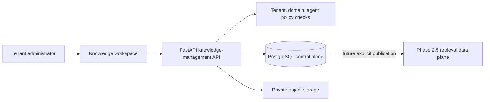
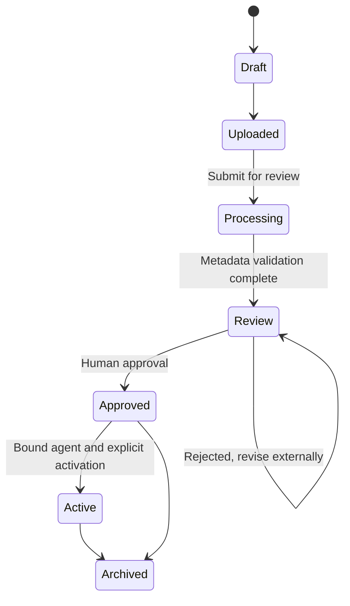

# Enterprise Knowledge Management Design

## 1. Purpose and boundary

Phase 2.5.1 adds the knowledge control plane used to organize, version, review, approve, activate, and authorize enterprise documents. It does not add a conversational Knowledge Assistant, generate embeddings, or invoke vector search.

The Phase 2.5 ingestion and retrieval foundation remains available as a separate data plane for compatibility. No Phase 2.5.1 API or UI action sends a managed document into that data plane. A future release may publish an eligible version only after an explicit release action.

## 2. Architecture



PostgreSQL stores canonical metadata, lifecycle state, exact versions, bindings, and audit events. Private object storage contains document bytes. The frontend never accesses either store directly.

## 3. Data model

| Model | Responsibility |
|---|---|
| `knowledge_collections` | Tenant- and domain-scoped grouping of documents |
| `managed_knowledge_documents` | Logical document, current lifecycle, language, type, ownership, and approval |
| `knowledge_document_versions` | Immutable file revision metadata and storage reference |
| `knowledge_document_agent_bindings` | Explicit allow-list between one document and one same-domain agent |
| `audit_events` | Upload, review, approval, activation, archive, and binding evidence |

Every control-plane row includes `tenant_id`. Documents also carry `domain_package_id`, optional `agent_id`, `collection_id`, `document_type`, `language`, `current_version_number`, lifecycle state, approval state, creator, approver, and timestamps.

The older `knowledge_sources`, `knowledge_documents`, `knowledge_chunks`, and ingestion tables remain unchanged. They are retrieval-plane structures and are not automatically populated by this release.

## 4. Permission model

```text
Tenant
└── Domain package
    └── Agent
        └── Knowledge collection
            └── Document and exact version
```

- All queries apply an explicit `tenant_id` predicate and set the database tenant context.
- PostgreSQL RLS is enabled and forced on every new tenant table.
- `knowledge:retrieve` permits listing and viewing metadata.
- `knowledge:manage` permits collection creation, upload, review, binding, activation, and archive.
- A binding is deny-by-default: absence of an enabled binding means no agent access.
- An agent may be bound only to a document in the same domain package.
- Activation requires both human approval and an enabled agent binding.
- Upload and consequential lifecycle actions create tenant-scoped audit events.

The production database application role must not be a superuser and must not have `BYPASSRLS`.

## 5. Document lifecycle



The current upload API creates version 1 and enters `uploaded`. Submitting for review performs the current metadata control step and ends in `review`. Approval and activation are separate commands. Rejection is recorded in `approval_status` while the lifecycle remains at `review`; a future version-upload command will reset the logical document to `uploaded`.

Only documents whose lifecycle is `approved` or `active` and whose approval status is `approved` are eligible for future publication. `Active` means permitted for the assigned agent; it does not mean that embeddings or a Knowledge Assistant exist.

## 6. API surface

| Method | Endpoint | Purpose |
|---|---|---|
| `POST` | `/api/v1/knowledge-management/collections` | Create a domain collection |
| `GET` | `/api/v1/knowledge-management/collections` | List and search tenant collections |
| `POST` | `/api/v1/knowledge-management/collections/{id}/documents` | Upload version 1 |
| `GET` | `/api/v1/knowledge-management/documents` | Search and filter document metadata |
| `GET` | `/api/v1/knowledge-management/documents/{id}` | View metadata, current version, and bindings |
| `POST` | `/api/v1/knowledge-management/documents/{id}/submit-review` | Run metadata processing and enter review |
| `POST` | `/api/v1/knowledge-management/documents/{id}/approval` | Approve or reject the exact current version |
| `POST` | `/api/v1/knowledge-management/documents/{id}/bindings` | Bind to a same-domain agent |
| `POST` | `/api/v1/knowledge-management/documents/{id}/activate` | Activate an approved, bound document |
| `POST` | `/api/v1/knowledge-management/documents/{id}/archive` | Remove an approved/active document from use |

Uploads accept PDF, UTF-8 text, and Markdown up to the configured size limit. File names are sanitized, content is hashed with SHA-256, and bytes are written to private storage before the database transaction commits. A failed database write removes the uploaded object.

## 7. User interface

The authenticated `/knowledge` workspace provides:

- Collection cards grouped by Commercial Kitchen or Laboratory Animal Facility / IVC.
- Collection creation and document upload forms.
- Title/type search and lifecycle status display.
- Explicit submit, approve, reject, bind, activate, and archive controls.
- English and Simplified Chinese UI copy, with Bahasa Indonesia metadata accepted for future UI localization.

The page does not expose document content to a model and does not call the legacy retrieval endpoint.

## 8. Synthetic demo data

The normal demo seed adds five explicitly synthetic, non-operational documents:

| Domain | Document |
|---|---|
| Commercial Kitchen | Company Profile |
| Commercial Kitchen | School Kitchen Case Study |
| Commercial Kitchen | Commercial Kitchen Product Catalogue |
| Laboratory Animal Facility | IVC Product Overview |
| Laboratory Animal Facility | Laboratory Animal Facility Case |

Every fixture is marked synthetic, approved only for demonstration, explicitly bound to its domain agent, and stored as an exact Markdown version. It contains no real customer information.

## 9. Future RAG integration

A future publication service should read only the current exact version where:

1. The tenant context matches.
2. The collection is active.
3. The document is `approved` or `active` and approval status is `approved`.
4. An enabled binding exists for the requested same-domain agent.
5. The content digest still matches the stored object.

That service may then copy an immutable publication snapshot to the existing extraction, chunking, embedding, and citation pipeline. Archiving or superseding a version must revoke its retrieval eligibility. Publication, embedding, vector retrieval, and conversational answers are intentionally outside Phase 2.5.1.

## 10. Phase 2.5.2 processing integration

Phase 2.5.2 adds an explicit **Process** command for approved/active, agent-bound current versions. It creates durable processing runs and agent-isolated pgvector chunks while preserving this control plane as the approval authority. It still does not implement retrieval or a conversational Knowledge Assistant. See `knowledge-processing-pipeline-design.en.md`.

## 11. Phase 2.5.3 governance implementation

Phase 2.5.3 supersedes the initial single-version governance limitations described above. The implemented control plane now supports metadata editing, replacement versions, explicit current/published/active pointers, exact-version review attribution, separate publication, archival restoration, immutable successor-version rollback, binding disable/re-enable, split knowledge permissions, and a document-centric `knowledge_audit_logs` timeline.

The original Phase 2.5.1 lifecycle diagrams remain the historical first implementation. The authoritative current lifecycle and API matrix are in `knowledge-governance-design.en.md`. Retrieval and conversational answers remain disabled.
