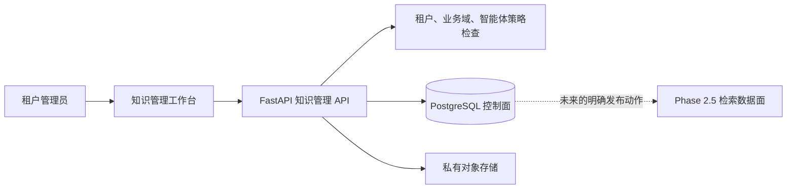
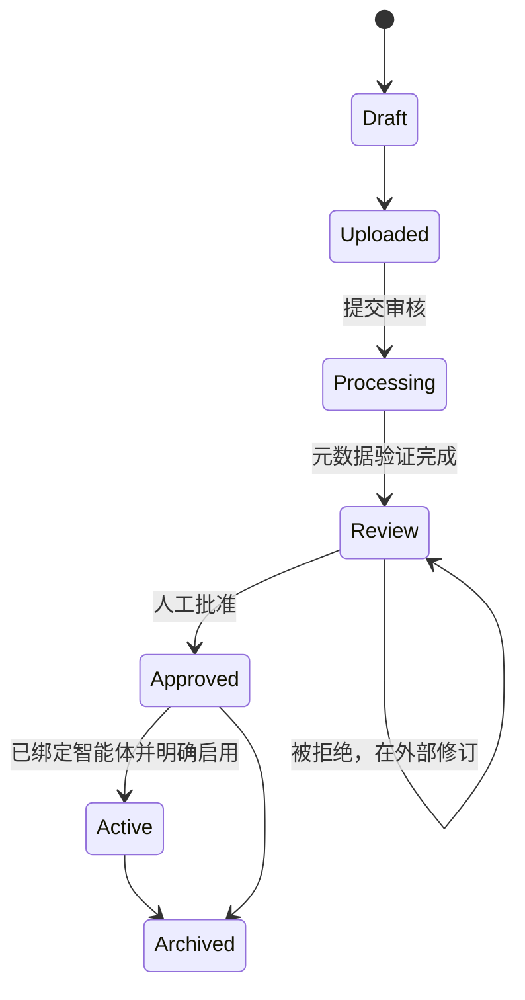

# 企业知识管理设计

## 1. 目的与边界

Phase 2.5.1 新增知识控制面，用于组织、版本化、审核、批准、启用和授权企业文档。本阶段不增加对话式知识助手，不生成嵌入，也不调用向量检索。

Phase 2.5 已有的摄取与检索基础作为独立数据面保留，以维持兼容性。Phase 2.5.1 的 API 或 UI 操作不会把受管文档自动送入该数据面。未来版本只能通过明确的发布动作发布符合条件的版本。

## 2. 架构



PostgreSQL 保存权威元数据、生命周期状态、准确版本、绑定和审计事件。私有对象存储保存文档字节。前端不会直接访问任何一个存储。

## 3. 数据模型

| 模型 | 职责 |
|---|---|
| `knowledge_collections` | 按租户和业务域划分的文档集合 |
| `managed_knowledge_documents` | 逻辑文档、当前生命周期、语言、类型、归属和审批 |
| `knowledge_document_versions` | 不可变的文件修订元数据和存储引用 |
| `knowledge_document_agent_bindings` | 文档与同业务域智能体之间的明确允许清单 |
| `audit_events` | 上传、审核、批准、启用、归档和绑定证据 |

控制面的每一行都包含 `tenant_id`。文档还包含 `domain_package_id`、可选 `agent_id`、`collection_id`、`document_type`、`language`、`current_version_number`、生命周期状态、审批状态、创建人、批准人和时间戳。

旧有 `knowledge_sources`、`knowledge_documents`、`knowledge_chunks` 和摄取表保持不变。它们属于检索数据面，本版本不会自动填充它们。

## 4. 权限模型

```text
租户
└── 业务域包
    └── 智能体
        └── 知识集合
            └── 文档及准确版本
```

- 所有查询都明确添加 `tenant_id` 条件并设置数据库租户上下文。
- 每张新增租户表都启用并强制执行 PostgreSQL RLS。
- `knowledge:retrieve` 允许列出和查看元数据。
- `knowledge:manage` 允许创建集合、上传、审核、绑定、启用和归档。
- 绑定默认拒绝：不存在已启用绑定，就意味着智能体无权访问。
- 智能体只能绑定到同一个业务域包内的文档。
- 启用需要人工批准和已启用的智能体绑定同时成立。
- 上传及重要生命周期动作都会创建租户范围内的审计事件。

生产数据库应用角色不得是超级用户，也不得拥有 `BYPASSRLS`。

## 5. 文档生命周期



当前上传 API 创建版本 1 并进入 `uploaded`。提交审核会执行当前的元数据控制步骤，随后进入 `review`。批准和启用是两个独立命令。拒绝记录在 `approval_status` 中，生命周期仍停留在 `review`；未来的版本上传命令会把逻辑文档重置为 `uploaded`。

只有生命周期为 `approved` 或 `active` 且审批状态为 `approved` 的文档，才有资格在未来发布。`Active` 表示允许分配的智能体使用，并不代表已经存在嵌入或知识助手。

## 6. API 范围

| 方法 | 端点 | 用途 |
|---|---|---|
| `POST` | `/api/v1/knowledge-management/collections` | 创建业务域集合 |
| `GET` | `/api/v1/knowledge-management/collections` | 列出并查找租户集合 |
| `POST` | `/api/v1/knowledge-management/collections/{id}/documents` | 上传版本 1 |
| `GET` | `/api/v1/knowledge-management/documents` | 查找并筛选文档元数据 |
| `GET` | `/api/v1/knowledge-management/documents/{id}` | 查看元数据、当前版本和绑定 |
| `POST` | `/api/v1/knowledge-management/documents/{id}/submit-review` | 执行元数据处理并进入审核 |
| `POST` | `/api/v1/knowledge-management/documents/{id}/approval` | 批准或拒绝准确的当前版本 |
| `POST` | `/api/v1/knowledge-management/documents/{id}/bindings` | 绑定同业务域智能体 |
| `POST` | `/api/v1/knowledge-management/documents/{id}/activate` | 启用已批准且已绑定的文档 |
| `POST` | `/api/v1/knowledge-management/documents/{id}/archive` | 停用并归档已批准或已启用的文档 |

上传支持 PDF、UTF-8 文本和 Markdown，并受配置的大小限制。文件名会被清理，内容使用 SHA-256 计算指纹，数据库事务提交前先把字节写入私有存储。数据库写入失败时会删除已上传对象。

## 7. 用户界面

已认证的 `/knowledge` 工作台提供：

- 按商用厨房或实验动物设施 / IVC 分组的集合卡片。
- 集合创建和文档上传表单。
- 按标题或类型查找，以及生命周期状态显示。
- 明确的提交、批准、拒绝、绑定、启用和归档操作。
- 英文和简体中文界面文案，并接受印尼语元数据，为未来界面本地化做准备。

该页面不会把文档内容暴露给模型，也不会调用旧有检索端点。

## 8. 合成演示数据

常规演示数据脚本会增加五份明确标注为合成且不可用于实际运营的文档：

| 业务域 | 文档 |
|---|---|
| 商用厨房 | 公司简介 |
| 商用厨房 | 学校厨房案例 |
| 商用厨房 | 商用厨房产品目录 |
| 实验动物设施 | IVC 产品概览 |
| 实验动物设施 | 实验动物设施案例 |

每个演示资料都标记为合成，只批准用于演示，明确绑定到所属业务域智能体，并保存为准确的 Markdown 版本。资料不包含真实客户信息。

## 9. 未来 RAG 集成

未来发布服务只能读取满足以下条件的当前准确版本：

1. 租户上下文一致。
2. 集合处于启用状态。
3. 文档为 `approved` 或 `active`，并且审批状态是 `approved`。
4. 请求的同业务域智能体存在已启用绑定。
5. 内容指纹仍与存储对象一致。

该服务随后可以把不可变发布快照复制到已有的提取、分块、嵌入和引用流水线。归档或被新版本替代的版本必须失去检索资格。发布、嵌入、向量检索和对话回答明确不属于 Phase 2.5.1。
