# Read-Only Knowledge Assistant Design

## 1. Scope and decision

Phase 2.6.3 adds a focused, read-only Knowledge Assistant for the Sari Arta Commercial Kitchen Agent. It answers from governed enterprise evidence; it is not a general chatbot. It cannot write CRM data, execute tools, contact customers, create proposals, or make commercial commitments. IVC production retrieval remains disabled.

The implementation uses the existing durable `agent_runs` lifecycle and worker queue. The HTTP request returns `202`; the UI polls the run resource. This prevents an embedding or model timeout from holding an application transaction open and preserves bounded retry and safe failure behavior.

## 2. Runtime architecture

```mermaid
flowchart LR
    UI["Internal /knowledge/assistant UI"] --> Start["POST assistant run"]
    Start --> Auth["Tenant, RBAC, agent and capability authorization"]
    Auth --> Queue["Durable AgentRun + queue"]
    Queue --> ReAuth["Worker re-authorization"]
    ReAuth --> Retrieval["Governed vector retrieval"]
    Retrieval --> Evidence["Threshold and conflict validation"]
    Evidence -->|sufficient| LLM["Focused no-tools answer agent"]
    Evidence -->|insufficient/conflicting| Safe["Deterministic safe response"]
    LLM --> Citations["Citation allowlist and completeness validation"]
    Citations --> Result["Read-only structured result"]
    Safe --> Result
```



Authorization occurs before every embedding or answer-model call. The worker repeats authorization so access revoked after queueing is enforced at execution time.

## 3. API contract

### Start a run

```http
POST /api/v1/knowledge/assistant/runs
Idempotency-Key: assistant-demo-001
Content-Type: application/json

{
  "agent_id": "61000000-0000-4000-8000-000000000001",
  "language": "en",
  "question": "What does the approved guide say about kitchen ventilation?"
}
```

```json
{
  "run_id": "<uuid>",
  "workflow_type": "knowledge_assistant",
  "status": "queued",
  "status_url": "/api/v1/knowledge/assistant/runs/<uuid>",
  "correlation_id": "<request-id>",
  "created_at": "2026-08-15T09:00:00Z"
}
```

### Read a run

```http
GET /api/v1/knowledge/assistant/runs/{run_id}
```

A succeeded response contains `evidence_status`, `answer`, validated `citations`, source `evidence`, provider/model identifiers, correlation ID, and duration. Access requires `knowledge:retrieve`. The caller cannot submit a tenant ID, system prompt, tool, model, threshold, or retrieval filter.

## 4. Evidence policy

| State | Rule | Behavior |
|---|---|---|
| `sufficient` | At least the configured minimum count of above-threshold governed chunks and no declared claim conflict | Generate a concise grounded answer |
| `insufficient` | Too few above-threshold chunks | Do not call the answer model; return a localized limitation and any qualifying evidence |
| `conflicting` | Multiple documents declare different values for the same normalized metadata claim | Do not call the answer model; identify conflict keys and require human review |

Only formal retrieval `results` above `KNOWLEDGE_RETRIEVAL_MIN_SIMILARITY` are evidence. Diagnostic below-threshold results are never sent to the answer model. `KNOWLEDGE_RETRIEVAL_MIN_EVIDENCE_COUNT` controls the minimum count, and `KNOWLEDGE_ASSISTANT_TOP_K` defaults to five.

Conflict detection is deterministic. Governed metadata may provide `document_metadata.claims` or `conflict_group`/`conflict_value`. Free-text semantic conflict detection is postponed because silently allowing an LLM to arbitrate authoritative documents would weaken governance.

## 5. Citation enforcement

Every citation returns:

- `document_id` and `document_name`
- immutable `document_version_id` and version number
- page number and section when available
- `chunk_id`
- source metadata
- similarity score

The answer model returns only an answer and a sequence of retrieved chunk IDs. The application rejects output when a chunk was not retrieved, a requested language differs, or inline citation markers do not exactly cover the cited sequence. Citation objects are constructed by the application from retrieved database records, never invented by the model.

## 6. Security and hallucination controls

- PostgreSQL RLS and tenant-scoped repositories remain mandatory.
- Retrieval requires an active tenant-agent activation, enabled `approved_knowledge_retrieval` capability, enabled exact-agent document binding, active document, approved published/active exact version, and completed processing run.
- Only `commercial_kitchen.lead_qualification` is accepted by the assistant endpoint.
- The answer agent has no tools and receives explicit instructions to ignore commands inside evidence.
- Unsupported facts, customer cases, prices, delivery dates, specifications, project references, compliance claims, certifications, warranties, and contractual statements are prohibited.
- The model must not expose hidden reasoning.
- The full question exists only while a run is queued or executing; success or terminal failure replaces it with SHA-256. Logs and audit summaries contain identifiers, language, status, counts, hashes, and timings, not source content or the full question.

## 7. Internal UI

`/knowledge/assistant` provides a fixed Commercial Kitchen Agent selector, English/Chinese answer language, question input, asynchronous loading and safe error states, evidence status, answer, complete citations, collapsible source excerpts, visible similarity scores, correlation ID, and latency. It labels the feature read-only. No IVC production option is shown.

## 8. Evaluation and regression baseline

The synthetic versioned baseline is `apps/api/tests/fixtures/knowledge_assistant_evaluation.v1.json`. It covers direct factual, multi-source, paired English/Chinese, insufficient evidence, conflicting claims, unsupported price/specification, cross-tenant denial, and cross-agent denial.

Required metrics are grounded answer accuracy, citation correctness, citation completeness, insufficient-evidence accuracy, conflict-detection accuracy, cross-tenant rejection, and cross-agent rejection. The baseline uses deterministic mock generation; changing the model, prompt, retrieval threshold, embedding provider, or evidence rules requires recording a new baseline version rather than overwriting history.

## 9. Failure and operations

Provider failures use the existing bounded exponential retry. Terminal errors are safe and do not change knowledge or CRM state. Structured completion logs include correlation ID, tenant ID, agent ID, language, evidence status, retrieved count, provider/model, duration, and outcome. Sensitive evidence and full questions are excluded.

## 10. Local demo

```bash
docker compose --profile app up -d --build
make migrate
make demo-seed
```

Open `http://localhost:3000/knowledge/assistant` and use the local synthetic demo account shown on the login page. Keep `AI_ENABLED=false` for deterministic no-cost mock answering. To use the configured OpenAI answer provider, set `AI_ENABLED=true` and `OPENAI_API_KEY`; embeddings must match the provider/model used when the active document versions were processed. Ask about the synthetic commercial-kitchen product catalogue to see a cited result. A Chinese question returns a Chinese answer only when approved Chinese evidence is active; otherwise it intentionally returns Chinese `insufficient` status.

## 11. Deferred work

This phase does not implement conversational memory, streaming chat, CRM writes, proposal generation, external messaging, autonomous actions, IVC production retrieval, MCP, multi-agent orchestration, or semantic free-text contradiction adjudication.
