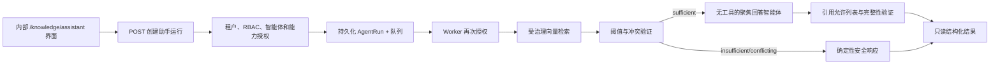

# 只读知识助手设计

## 1. 范围与决策

Phase 2.6.3 为 Sari Arta 商用厨房智能体增加一个聚焦的只读知识助手。它只根据受治理的企业证据回答，并不是通用聊天机器人。它不能写入 CRM、执行工具、联系客户、创建提案或作出商业承诺。IVC 生产检索继续禁用。

实现复用现有持久化 `agent_runs` 生命周期和 Worker 队列。HTTP 请求返回 `202`，界面轮询运行资源。这样嵌入或模型超时不会长期占用应用事务，同时保留有限重试和安全失败能力。

## 2. 运行时架构



每次嵌入或回答模型调用前都先完成授权。Worker 会重复授权，因此排队后被撤销的访问权也会在执行时生效。

## 3. API 契约

### 创建运行

```http
POST /api/v1/knowledge/assistant/runs
Idempotency-Key: assistant-demo-001
Content-Type: application/json

{
  "agent_id": "61000000-0000-4000-8000-000000000001",
  "language": "en",
  "question": "What does the approved guide say about kitchen ventilation?"
}
```

```json
{
  "run_id": "<uuid>",
  "workflow_type": "knowledge_assistant",
  "status": "queued",
  "status_url": "/api/v1/knowledge/assistant/runs/<uuid>",
  "correlation_id": "<request-id>",
  "created_at": "2026-08-15T09:00:00Z"
}
```

### 读取运行

```http
GET /api/v1/knowledge/assistant/runs/{run_id}
```

成功响应包含 `evidence_status`、`answer`、已验证 `citations`、来源 `evidence`、提供商/模型标识、关联 ID 和耗时。访问需要 `knowledge:retrieve`。调用者不能提交租户 ID、系统提示、工具、模型、阈值或检索过滤器。

## 4. 证据策略

| 状态 | 规则 | 行为 |
|---|---|---|
| `sufficient` | 达到配置的阈值以上受治理分块最小数量，且不存在已声明的事实冲突 | 生成简洁、有依据的回答 |
| `insufficient` | 阈值以上分块数量不足 | 不调用回答模型；返回本地化限制说明及现有合格证据 |
| `conflicting` | 多份文档对同一规范化元数据事实声明不同值 | 不调用回答模型；指出冲突键并要求人工审核 |

只有正式检索 `results` 中高于 `KNOWLEDGE_RETRIEVAL_MIN_SIMILARITY` 的结果才是证据。诊断用的低于阈值结果绝不会发送给回答模型。`KNOWLEDGE_RETRIEVAL_MIN_EVIDENCE_COUNT` 控制最小数量，`KNOWLEDGE_ASSISTANT_TOP_K` 默认值为五。

冲突检测是确定性的。受治理元数据可以提供 `document_metadata.claims` 或 `conflict_group`/`conflict_value`。自由文本语义冲突检测暂缓，因为让 LLM 静默裁决权威文档会削弱治理。

## 5. 引用强制执行

每条引用返回：

- `document_id` 和 `document_name`
- 不可变 `document_version_id` 和版本号
- 可用时的页码和章节
- `chunk_id`
- 来源元数据
- 相似度分数

回答模型只返回答案和检索分块 ID 序列。如果分块未被检索、请求语言不一致，或正文内引用编号没有准确覆盖引用序列，应用会拒绝输出。引用对象由应用根据检索到的数据库记录构建，模型不能自行编造。

## 6. 安全与幻觉防护

- PostgreSQL RLS 和租户范围 Repository 继续强制执行。
- 检索要求租户智能体已启用、`approved_knowledge_retrieval` 能力已启用、精确智能体文档绑定已启用、文档为 active、准确版本同时为已批准的 published/active 版本，并且处理运行已完成。
- 助手端点只接受 `commercial_kitchen.lead_qualification`。
- 回答智能体没有工具，并被明确要求忽略证据中的指令。
- 禁止不受支持的事实、客户案例、价格、交期、技术规格、项目引用、合规声明、认证、质保和合同陈述。
- 模型不得暴露隐藏推理。
- 完整问题只在运行排队或执行期间存在；成功或最终失败后会替换为 SHA-256。日志和审计摘要只包含标识、语言、状态、数量、哈希和耗时，不包含来源内容或完整问题。

## 7. 内部界面

`/knowledge/assistant` 提供固定的商用厨房智能体选择器、英文/中文回答语言、问题输入、异步加载和安全错误状态、证据状态、回答、完整引用、可展开来源摘录、可见相似度分数、关联 ID 和耗时。界面明确标记为只读，并且不显示 IVC 生产选项。

## 8. 评估与回归基线

合成的版本化基线位于 `apps/api/tests/fixtures/knowledge_assistant_evaluation.v1.json`。它覆盖直接事实、多来源、中英文配对、证据不足、事实冲突、不受支持的价格/规格、跨租户拒绝和跨智能体拒绝。

必测指标包括有依据回答准确率、引用正确率、引用完整率、证据不足准确率、冲突检测准确率、跨租户拒绝和跨智能体拒绝。基线使用确定性模拟生成；模型、提示、检索阈值、嵌入提供商或证据规则发生变化时，必须记录新的基线版本，不能覆盖历史。

## 9. 失败与运维

提供商失败沿用现有有限指数退避重试。最终错误安全结束，不会改变知识或 CRM 状态。结构化完成日志包含关联 ID、租户 ID、智能体 ID、语言、证据状态、检索数量、提供商/模型、耗时和结果；敏感证据与完整问题不会进入日志。

## 10. 本地演示

```bash
docker compose --profile app up -d --build
make migrate
make demo-seed
```

打开 `http://localhost:3000/knowledge/assistant`，使用登录页显示的本地合成演示账户。保持 `AI_ENABLED=false` 可使用确定性、无成本的模拟回答。若要使用已配置的 OpenAI 回答提供商，请设置 `AI_ENABLED=true` 和 `OPENAI_API_KEY`；嵌入提供商和模型必须与当前活动文档版本处理时使用的配置一致。询问合成商用厨房产品目录可以看到带引用结果。只有存在活动且已批准的中文证据时，中文问题才会得到中文知识回答；否则系统会有意返回中文 `insufficient` 状态。

## 11. 暂缓内容

本阶段不实现对话记忆、流式聊天、CRM 写入、提案生成、外部消息、自主动作、IVC 生产检索、MCP、多智能体编排或自由文本语义矛盾裁决。
