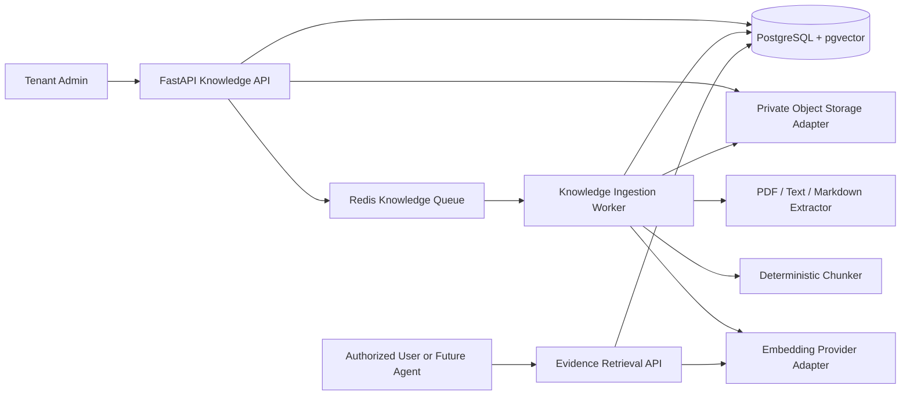
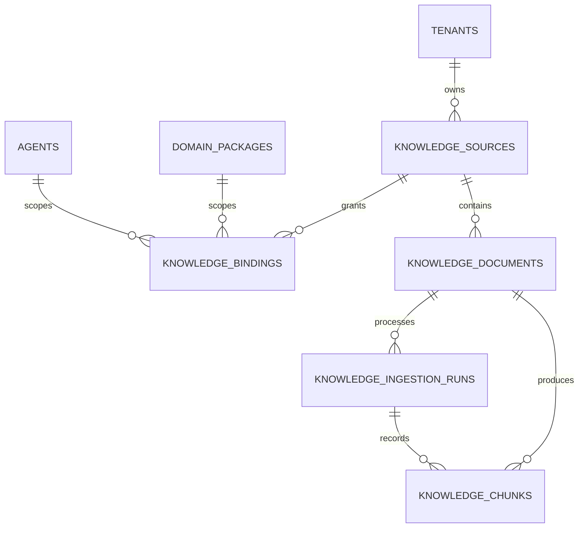
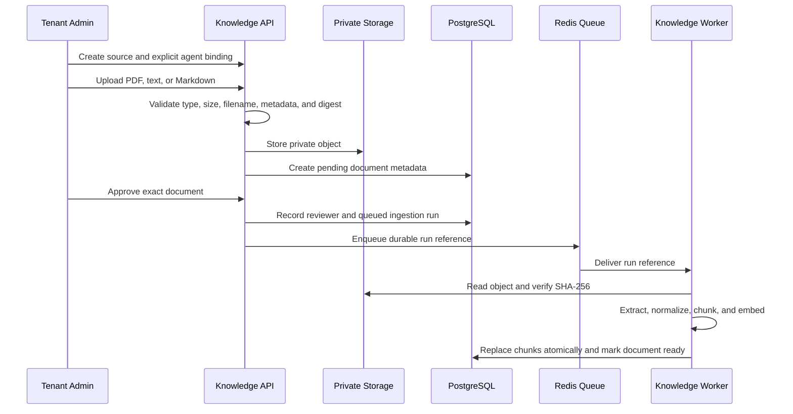

# Phase 2.5 Knowledge Foundation Design

> Chinese translation: [knowledge-foundation-design.zh-CN.md](knowledge-foundation-design.zh-CN.md). This English document is the primary engineering baseline.

**Status:** Implemented foundation; no conversational Knowledge Assistant  
**Scope:** Sari Arta synthetic or explicitly approved knowledge only  
**IVC status:** Production knowledge retrieval remains disabled  
**Version:** 1.0

## 1. Purpose and boundaries

Phase 2.5 provides reusable, tenant-scoped knowledge infrastructure for future RAG, content generation, and proposal assistants. It does not generate answers, content, proposals, prices, technical commitments, or external messages.

The foundation supports:

- Knowledge source registration.
- Document metadata and private object storage references.
- Tenant, domain, and agent bindings.
- Explicit human approval before ingestion.
- PDF, UTF-8 text, and Markdown extraction.
- Deterministic, overlapping text chunking.
- Pluggable embedding providers.
- PostgreSQL `pgvector` storage and cosine retrieval.
- Citation metadata and explicit insufficient-evidence behavior.

## 2. Security invariants

1. Knowledge access is deny-by-default.
2. Every source, binding, document, ingestion run, and chunk has a non-null `tenant_id`.
3. Every tenant-scoped knowledge table uses forced PostgreSQL Row Level Security; the production
   application role must be non-superuser and must not have `BYPASSRLS`.
4. A source must have an enabled binding to one exact domain and one exact agent.
5. The tenant agent activation, active configuration, runtime flag, and retrieval capability must all permit access.
6. Only documents with `approval_status = approved` and `ingestion_status = ready` can be retrieved.
7. Retrieval repeats tenant, domain, agent, binding, source, document, provider, and model filters in one database query.
8. IVC knowledge access remains disabled through its planned capability and `knowledge_enabled = false` runtime policy.
9. The API returns evidence candidates and citations, not a generated answer.
10. Empty retrieval produces `insufficient_evidence`; callers must not invent missing facts.

## 3. Component architecture



The local development adapter stores uploaded objects under `KNOWLEDGE_STORAGE_PATH`. Production must replace it with private S3-compatible storage without changing application or database contracts.

## 4. Database design

### 4.1 Tables

| Table | Purpose | Critical boundaries |
|---|---|---|
| `knowledge_sources` | Tenant-owned logical source and source provenance | Unique `(tenant_id, source_key)`; active/disabled state |
| `knowledge_bindings` | Explicit source-to-domain-to-agent grant | One exact tenant, source, domain, and agent; default is no row/no access |
| `knowledge_documents` | Uploaded file metadata and review state | Digest deduplication, private object key, approval and ingestion states |
| `knowledge_ingestion_runs` | Durable extraction/chunking/embedding attempt | Safe error fields, provider/model identity, correlation ID, chunk count |
| `knowledge_chunks` | Extracted evidence units and vectors | Source/document lineage, citation metadata, 1,536-dimensional vector |

### 4.2 Relationships



### 4.3 State model

```text
Document approval: pending → approved | rejected → retired
Document ingestion: not_started → queued → processing → ready | failed
Ingestion run: queued → processing → succeeded | failed
```

Approval is immutable for the current document record. A rejected document cannot be approved later; upload a new corrected document. An approved document with failed ingestion can create a new ingestion run.

### 4.4 Index strategy

- Tenant/status indexes support source and document administration.
- `(tenant_id, agent_id, domain_package_id, status)` resolves enabled bindings.
- `(tenant_id, document_id, chunk_index)` supports citation reconstruction.
- HNSW with `vector_cosine_ops` supports approximate similarity search.
- Relational filters remain authoritative even when HNSW supplies candidates.

## 5. Upload and approval workflow



The upload endpoint accepts a maximum configured size, currently 10 MiB. Binary file content is never stored in PostgreSQL. A failed database write removes the newly written local object.

## 6. Extraction and chunking

Supported media types are:

- `application/pdf`
- `text/plain`
- `text/markdown`
- `text/x-markdown`

PDF extraction preserves one-based page numbers. Text and Markdown use UTF-8. Phase 2.5 intentionally excludes OCR and Office document parsing.

Chunking defaults to 1,200 characters with 200-character overlap. It prefers paragraph or sentence boundaries, normalizes whitespace, preserves page/section metadata, and assigns a stable zero-based `chunk_index` within each ingestion result.

## 7. Embedding abstraction

The `KnowledgeEmbeddingProvider` contract exposes:

```text
provider_type
model_id
dimensions
embed(texts) → vectors
```

Two adapters exist:

- `mock`: deterministic token-hash vectors for local development and repeatable tests.
- `openai`: OpenAI Embeddings API, enabled only when explicitly configured with a key.

Phase 2.5 fixes vector dimensions at 1,536. Query retrieval filters chunks by the same provider and model used for the query, preventing mixed embedding spaces. Changing provider, model, or dimensions requires controlled re-ingestion.

## 8. Retrieval and evidence boundary

The retrieval request must name one `domain_key` and one `agent_key`. The repository verifies:

```text
authenticated tenant
AND active tenant agent activation
AND active tenant agent configuration
AND runtime_config.knowledge_enabled = true
AND approved_knowledge_retrieval capability = available
AND enabled source/domain/agent binding
AND active source
AND approved and ready document
AND matching embedding provider/model
```

Each result contains the evidence text, similarity, and:

- Source ID and source name.
- Document ID, title, and original filename.
- Page number when available.
- Section title when available.
- Chunk index.
- Chunk SHA-256 content fingerprint.

The similarity threshold is a candidate filter, not a factual confidence score. Future assistants must cite evidence and may still conclude that the evidence is insufficient.

## 9. API surface

| Method | Endpoint | Permission | Purpose |
|---|---|---|---|
| `POST` | `/api/v1/knowledge/sources` | `knowledge:manage` | Create a source |
| `GET` | `/api/v1/knowledge/sources` | `knowledge:retrieve` | List tenant sources |
| `POST` | `/api/v1/knowledge/sources/{id}/bindings` | `knowledge:manage` | Grant an exact domain/agent binding |
| `GET` | `/api/v1/knowledge/sources/{id}/bindings` | `knowledge:retrieve` | Inspect bindings |
| `POST` | `/api/v1/knowledge/sources/{id}/documents` | `knowledge:manage` | Upload a pending document |
| `GET` | `/api/v1/knowledge/documents` | `knowledge:retrieve` | List document metadata |
| `GET` | `/api/v1/knowledge/documents/{id}` | `knowledge:retrieve` | Read document metadata |
| `POST` | `/api/v1/knowledge/documents/{id}/reviews` | `knowledge:manage` | Approve or reject exact content |
| `POST` | `/api/v1/knowledge/documents/{id}/ingestion-runs` | `knowledge:manage` | Retry eligible ingestion |
| `GET` | `/api/v1/knowledge/ingestion-runs/{id}` | `knowledge:retrieve` | Read durable ingestion state |
| `POST` | `/api/v1/knowledge/retrieval/search` | `knowledge:retrieve` | Return cited evidence candidates |

Admins have management and retrieval permissions. Sales users can retrieve approved evidence but cannot create sources, bind agents, upload, approve, or retry ingestion.

## 10. Validation and remaining work

Automated validation covers:

- Deterministic chunk boundaries and citation location preservation.
- Source creation and exact Commercial Kitchen binding.
- Upload digest and pending status.
- No retrieval before approval.
- Approval, queueing, extraction, chunking, embedding, and persisted retrieval.
- Citation completeness and chunk fingerprinting.
- Sales management denial.
- Forced RLS on all five tenant knowledge tables.
- IVC capability and runtime retrieval denial.

Not included yet:

- Conversational or generative Knowledge Assistant.
- OCR, DOCX, spreadsheet, presentation, web crawler, or connector ingestion.
- Knowledge administration frontend.
- Production S3 adapter and antivirus service.
- Hybrid keyword/vector ranking, reranking, answer evaluation, or generation.
- IVC production knowledge retrieval.
