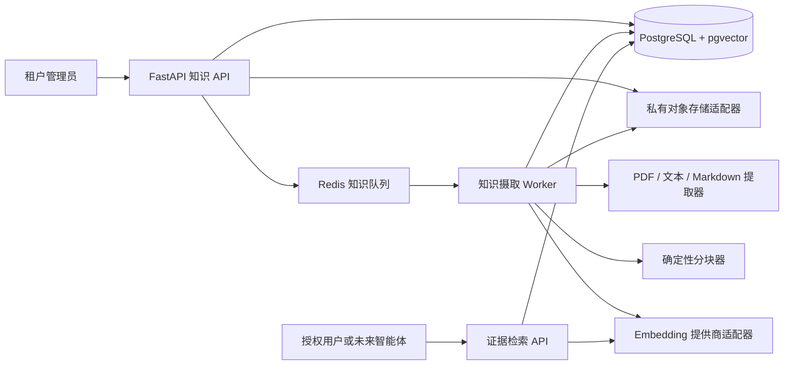
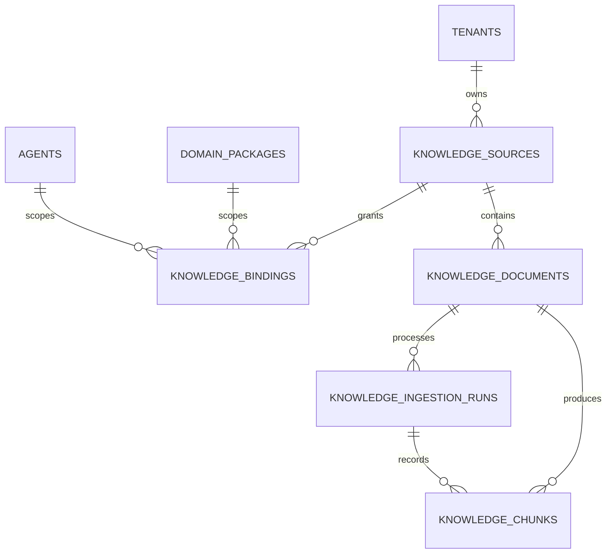
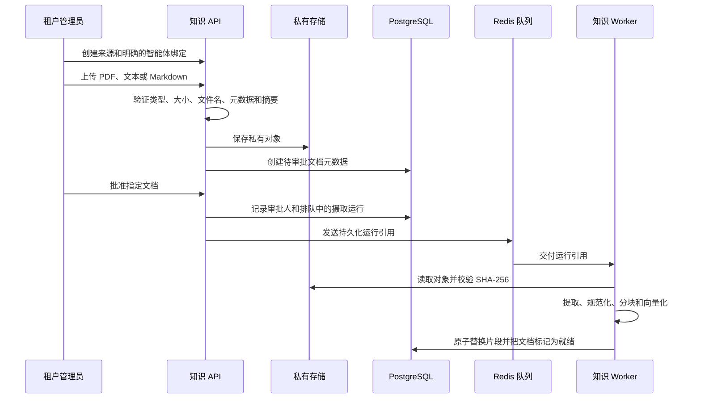

# Phase 2.5 知识基础设计

> 英文工程基线：[knowledge-foundation-design.en.md](knowledge-foundation-design.en.md)。中文版本用于内部审核；如有冲突，以英文版本为准。

**状态：** 基础能力已实现；尚无对话式知识助手  
**范围：** 仅限 Sari Arta 合成资料或明确批准的知识  
**IVC 状态：** 生产知识检索继续禁用  
**版本：** 1.0

## 1. 目的和边界

Phase 2.5 为未来 RAG、内容生成和提案助手提供可复用、租户隔离的知识基础设施。本阶段不生成回答、内容、提案、价格、技术承诺或对外消息。

知识基础支持：

- 知识来源注册。
- 文档元数据和私有对象存储引用。
- 租户、领域和智能体绑定。
- 摄取前的明确人工审批。
- PDF、UTF-8 纯文本和 Markdown 提取。
- 确定性重叠文本分块。
- 可替换的 Embedding 提供商。
- PostgreSQL `pgvector` 存储和余弦检索。
- 引用元数据和明确的证据不足行为。

## 2. 安全不变量

1. 知识访问默认拒绝。
2. 每个来源、绑定、文档、摄取运行和知识片段都必须具有非空 `tenant_id`。
3. 每张租户知识表都启用 PostgreSQL 强制行级安全；生产应用角色必须是非超级用户，并且
   不得拥有 `BYPASSRLS`。
4. 一个来源必须明确绑定到一个领域和一个智能体。
5. 租户智能体启用状态、活动配置、运行时开关和检索能力必须全部允许访问。
6. 只有 `approval_status = approved` 且 `ingestion_status = ready` 的文档可以被检索。
7. 检索在同一个数据库查询中再次执行租户、领域、智能体、绑定、来源、文档、提供商和模型过滤。
8. IVC 的能力仍为计划状态，运行策略保持 `knowledge_enabled = false`，因此无法访问知识。
9. API 只返回证据候选和引用，不生成回答。
10. 没有检索结果时返回 `insufficient_evidence`；调用方不得编造缺失事实。

## 3. 组件架构



本地开发适配器把上传对象保存在 `KNOWLEDGE_STORAGE_PATH`。生产环境必须替换为私有 S3 兼容存储，但不改变应用和数据库合同。

## 4. 数据库设计

### 4.1 数据表

| 数据表 | 用途 | 关键边界 |
|---|---|---|
| `knowledge_sources` | 租户拥有的逻辑知识来源和来源信息 | `(tenant_id, source_key)` 唯一；支持启用/禁用 |
| `knowledge_bindings` | 明确的来源—领域—智能体授权 | 精确限定租户、来源、领域和智能体；没有记录就没有权限 |
| `knowledge_documents` | 上传文件元数据和审核状态 | 摘要去重、私有对象键、审批和摄取状态 |
| `knowledge_ingestion_runs` | 持久化提取、分块和 Embedding 尝试 | 安全错误、提供商/模型、关联 ID 和片段数量 |
| `knowledge_chunks` | 提取的证据单元和向量 | 来源/文档血缘、引用元数据和 1,536 维向量 |

### 4.2 关系



### 4.3 状态模型

```text
文档审批：pending → approved | rejected → retired
文档摄取：not_started → queued → processing → ready | failed
摄取运行：queued → processing → succeeded | failed
```

当前文档记录的审批决定不可逆。被拒绝的文档不能随后批准，应上传修正后的新文档。已批准但摄取失败的文档可以创建新的摄取运行。

### 4.4 索引策略

- 租户/状态索引支持来源和文档管理。
- `(tenant_id, agent_id, domain_package_id, status)` 用于解析启用的绑定。
- `(tenant_id, document_id, chunk_index)` 支持引用重建。
- 使用 `vector_cosine_ops` 的 HNSW 支持近似相似度搜索。
- 即使 HNSW 提供候选结果，关系过滤仍然是最终授权依据。

## 5. 上传和审批流程



上传接口接受配置的最大文件大小，目前为 10 MiB。二进制文件内容不会存入 PostgreSQL。如果数据库写入失败，本地适配器会删除刚写入的对象。

## 6. 提取和分块

支持的媒体类型：

- `application/pdf`
- `text/plain`
- `text/markdown`
- `text/x-markdown`

PDF 提取保留从 1 开始的页码。文本和 Markdown 使用 UTF-8。Phase 2.5 有意不包含 OCR 和 Office 文档解析。

默认分块大小为 1,200 字符，重叠 200 字符。系统优先在段落或句子边界切分，规范化空白，保留页码/章节元数据，并为每次摄取结果分配稳定的从 0 开始的 `chunk_index`。

## 7. Embedding 抽象

`KnowledgeEmbeddingProvider` 合同提供：

```text
provider_type
model_id
dimensions
embed(texts) → vectors
```

目前有两个适配器：

- `mock`：确定性 Token Hash 向量，用于本地开发和可重复测试。
- `openai`：OpenAI Embeddings API，只有显式配置密钥后才会启用。

Phase 2.5 将向量维度固定为 1,536。查询检索只使用与查询相同提供商和模型生成的片段，避免混合不同向量空间。更换提供商、模型或维度时必须受控地重新摄取。

## 8. 检索和证据边界

检索请求必须指定一个 `domain_key` 和一个 `agent_key`。Repository 会验证：

```text
已认证租户
AND 活动的租户智能体启用记录
AND 活动的租户智能体配置
AND runtime_config.knowledge_enabled = true
AND approved_knowledge_retrieval 能力 = available
AND 已启用的来源/领域/智能体绑定
AND 活动知识来源
AND 已批准且摄取就绪的文档
AND 相同 Embedding 提供商/模型
```

每条结果包含证据文字、相似度和：

- 来源 ID 和来源名称。
- 文档 ID、标题和原始文件名。
- 可用时的页码。
- 可用时的章节标题。
- 片段序号。
- 片段 SHA-256 内容指纹。

相似度阈值只是候选过滤条件，不是事实置信度。未来助手必须引用证据，并且仍然可以判断证据不足。

## 9. API 接口

| 方法 | 接口 | 权限 | 用途 |
|---|---|---|---|
| `POST` | `/api/v1/knowledge/sources` | `knowledge:manage` | 创建知识来源 |
| `GET` | `/api/v1/knowledge/sources` | `knowledge:retrieve` | 列出租户来源 |
| `POST` | `/api/v1/knowledge/sources/{id}/bindings` | `knowledge:manage` | 授予精确的领域/智能体绑定 |
| `GET` | `/api/v1/knowledge/sources/{id}/bindings` | `knowledge:retrieve` | 查看绑定 |
| `POST` | `/api/v1/knowledge/sources/{id}/documents` | `knowledge:manage` | 上传待审批文档 |
| `GET` | `/api/v1/knowledge/documents` | `knowledge:retrieve` | 列出文档元数据 |
| `GET` | `/api/v1/knowledge/documents/{id}` | `knowledge:retrieve` | 读取文档元数据 |
| `POST` | `/api/v1/knowledge/documents/{id}/reviews` | `knowledge:manage` | 批准或拒绝指定内容 |
| `POST` | `/api/v1/knowledge/documents/{id}/ingestion-runs` | `knowledge:manage` | 重试符合条件的摄取 |
| `GET` | `/api/v1/knowledge/ingestion-runs/{id}` | `knowledge:retrieve` | 读取持久化摄取状态 |
| `POST` | `/api/v1/knowledge/retrieval/search` | `knowledge:retrieve` | 返回带引用的证据候选 |

管理员拥有管理和检索权限。销售用户可以检索已批准的证据，但不能创建来源、绑定智能体、上传、审批或重试摄取。

## 10. 验证和剩余工作

自动化验证覆盖：

- 确定性分块边界和引用位置保留。
- 来源创建和精确的 Commercial Kitchen 绑定。
- 上传摘要和待审批状态。
- 审批前无法检索。
- 审批、排队、提取、分块、Embedding 和持久化检索。
- 引用完整性和片段指纹。
- 销售角色无法管理知识。
- 五张租户知识表全部启用强制 RLS。
- IVC 能力和运行时检索拒绝。

尚未包含：

- 对话式或生成式知识助手。
- OCR、DOCX、电子表格、演示文稿、网页爬虫或连接器摄取。
- 知识管理前端。
- 生产 S3 适配器和杀毒服务。
- 混合关键词/向量排序、重排、回答评估或生成。
- IVC 生产知识检索。
