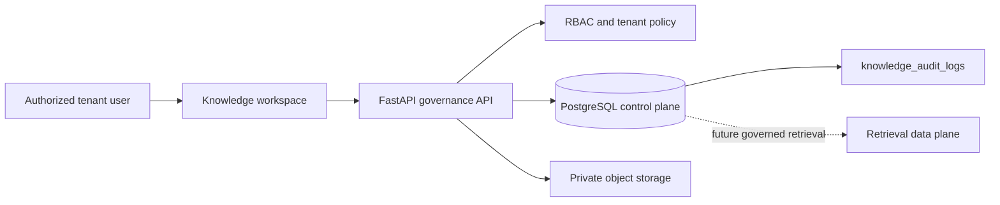

# Enterprise Knowledge Governance Design

## 1. Purpose and boundary

Phase 2.5.3 closes the document-governance gaps identified before Knowledge Retrieval is enabled. It governs exact document versions, separates approval from publication, preserves a tenant-scoped audit trail, and exposes the workflow in `/knowledge`.

This phase does **not** add similarity search, retrieval APIs, conversational answers, or a Knowledge Assistant. CRM, Agent Playground, and qualification workflows are unchanged.

## 2. Governance architecture

The application service owns lifecycle transitions and transaction boundaries. Document bytes remain immutable in private storage. PostgreSQL is the authority for the logical document, exact-version pointers, permissions, approval, publication, binding eligibility, and audit evidence.

## 3. Document and version authority

`managed_knowledge_documents` contains three explicit pointers:

| Pointer | Meaning |
|---|---|
| `current_version_id` | Exact version currently being edited, reviewed, or prepared |
| `published_version_id` | Exact version formally released by a publisher |
| `active_version_id` | Exact version enabled for its assigned agent; future retrieval must use this pointer |

`knowledge_document_versions` rows are immutable content records. Each version has a monotonically increasing `version_number`, checksum, object key, uploader, review decision, and optional `restored_from_version_id`.

Creating a replacement locks the logical document, verifies `If-Match`, creates version `N + 1`, and resets the current work to `uploaded`. An earlier active version remains explicitly identifiable until the replacement completes review, publication, and activation.

Rollback never moves a pointer backward. It copies the selected historical bytes and metadata into a new version `N + 1`, records its origin and reason, and requires fresh review. This preserves a monotonic, citable history.

## 4. Lifecycle and separation of duties

```mermaid
stateDiagram-v2
    [*] --> Draft
    Draft --> Uploaded: Upload version
    Uploaded --> Review: Submit for review
    Review --> Approved: Approver accepts exact version
    Review --> Review: Rejected; replacement required
    Approved --> Published: Publisher releases exact version
    Published --> Active: Publisher activates eligible binding
    Approved --> Archived
    Published --> Archived
    Active --> Archived
    Archived --> Approved: Restore published version
    Archived --> Review: Restore unapproved version
```

Approval applies to the exact current version and its checksum. Publication is a separate command and permission. Activation requires an approved, published version and at least one enabled same-domain agent binding. Metadata or content replacement invalidates the current approval where it could change business meaning.

Archiving requires a reason, clears the active pointer, and makes the document ineligible for future retrieval. Restore never silently reactivates content; the document returns to `approved` or `review` and must be published and activated again.

## 5. Permission model

The knowledge permission vocabulary is:

| Permission | Allowed operation |
|---|---|
| `knowledge:upload` | Upload version 1 and create replacement versions |
| `knowledge:edit` | Update metadata and manage agent bindings |
| `knowledge:submit_review` | Submit the current version for review |
| `knowledge:approve` | Approve or reject the exact current version |
| `knowledge:publish` | Publish and activate an approved version |
| `knowledge:archive` | Archive an approved, published, or active document |
| `knowledge:restore` | Restore an archived document and create rollback versions |
| `knowledge:process` | Start approved-version processing |
| `knowledge:audit_read` | Read the document governance timeline |
| `knowledge:retrieve` | Read collections and document metadata |

The current MVP Tenant Admin role receives all governance permissions. Sales roles retain read access only. The permissions are intentionally split now so future tenant roles can assign approver and publisher responsibilities independently without changing API contracts.

All ID-based reads and writes combine application-level tenant predicates with PostgreSQL RLS. The production application role must not be a superuser and must not have `BYPASSRLS`.

## 6. Audit model

`knowledge_audit_logs` is a tenant-scoped, forced-RLS governance ledger. It records:

- `upload`
- `metadata_update`
- `version_creation`
- `approval` and `rejection`
- `publish`
- `activate`
- `archive` and `restore`
- `rollback`
- agent binding creation, enable, and disable
- processing requests

Each row stores tenant, actor, action, target document, optional exact version, timestamp, correlation ID, before/after metadata snapshots where applicable, and safe action details. The API exposes audit rows read-only; normal application paths do not update or delete them.

Before/after snapshots contain governance metadata, pointers, states, identifiers, and checksums—not raw document content or secrets.

## 7. Concurrency and rollback safety

- Metadata, replacement-version, and rollback commands require `If-Match` with `record_version`.
- The repository locks the logical document before assigning the next version number.
- A stale writer receives `412 Precondition Failed` instead of overwriting another user.
- The unique `(tenant_id, document_id, version_number)` constraint is the final database invariant.
- Rollback creates new immutable content and cannot overwrite, delete, or reactivate a historical version.
- Object-storage cleanup runs when a database transaction for a new upload fails.

## 8. API surface

| Method | Endpoint | Permission | Purpose |
|---|---|---|---|
| `PATCH` | `/api/v1/knowledge-management/documents/{id}` | `knowledge:edit` | Update governed metadata with `If-Match` |
| `GET` | `/api/v1/knowledge-management/documents/{id}/versions` | `knowledge:retrieve` | List immutable version history |
| `GET` | `/api/v1/knowledge-management/documents/{id}/versions/{version_id}` | `knowledge:retrieve` | Read exact version metadata |
| `POST` | `/api/v1/knowledge-management/documents/{id}/versions` | `knowledge:upload` | Upload replacement version with `If-Match` |
| `POST` | `/api/v1/knowledge-management/documents/{id}/versions/{version_id}/rollback` | `knowledge:restore` | Create a new rollback version with `If-Match` |
| `POST` | `/api/v1/knowledge-management/documents/{id}/submit-review` | `knowledge:submit_review` | Enter review |
| `POST` | `/api/v1/knowledge-management/documents/{id}/approval` | `knowledge:approve` | Approve or reject exact current version |
| `POST` | `/api/v1/knowledge-management/documents/{id}/publish` | `knowledge:publish` | Set the published pointer |
| `POST` | `/api/v1/knowledge-management/documents/{id}/activate` | `knowledge:publish` | Set the active pointer after binding checks |
| `POST` | `/api/v1/knowledge-management/documents/{id}/archive` | `knowledge:archive` | Archive with required reason |
| `POST` | `/api/v1/knowledge-management/documents/{id}/restore` | `knowledge:restore` | Restore without automatic activation |
| `PATCH` | `/api/v1/knowledge-management/documents/{id}/bindings/{binding_id}` | `knowledge:edit` | Enable or disable binding with reason |
| `GET` | `/api/v1/knowledge-management/documents/{id}/audit-events` | `knowledge:audit_read` | Read governance audit timeline |

## 9. User interface

The `/knowledge` list links to `/knowledge/{id}`. The detail page displays:

- lifecycle plus current, published, and active version pointers;
- permission-aware review, approval, publication, activation, processing, archive, and restore actions;
- governed metadata editing with optimistic concurrency;
- replacement upload;
- immutable version and approval history;
- safe rollback that creates a successor version;
- agent-binding state and reasoned enable/disable controls;
- tenant-scoped governance audit timeline.

English and Simplified Chinese copy are available through the existing locale switch. The UI never exposes document bytes, vectors, or unrestricted prompts.

## 10. Retrieval gate

Future retrieval may use only `active_version_id` when all of the following are true:

1. Tenant, domain, agent, collection, and document authorization all match.
2. The version is approved and published.
3. The logical document is active.
4. An enabled same-domain agent binding exists.
5. The processed chunk references the same exact active version and checksum.

Phase 2.5.3 deliberately provides no endpoint that performs this retrieval.
