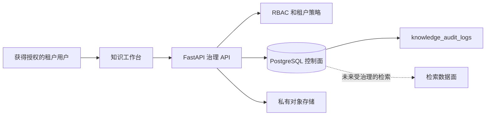
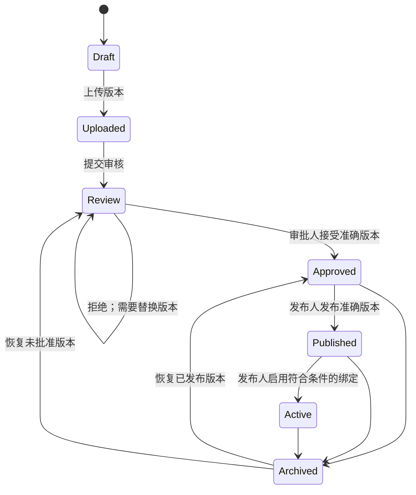

# 企业知识治理设计

## 1. 目的和边界

Phase 2.5.3 在启用知识检索前补齐文档治理差距。它治理准确文档版本、分离审批与发布、保存按租户隔离的审计历史，并在 `/knowledge` 中提供完整操作界面。

本阶段**不**增加相似度搜索、检索 API、对话式回答或知识助手。CRM、Agent Playground 和资格评估流程保持不变。

## 2. 治理架构

应用服务负责生命周期转换和事务边界。文档文件在私有存储中保持不可变。PostgreSQL 是逻辑文档、准确版本指针、权限、审批、发布、绑定资格和审计证据的权威来源。

## 3. 文档和版本权威

`managed_knowledge_documents` 包含三个明确指针：

| 指针 | 含义 |
|---|---|
| `current_version_id` | 当前正在编辑、审核或准备的准确版本 |
| `published_version_id` | 发布人员正式发布的准确版本 |
| `active_version_id` | 已向分配智能体启用的准确版本；未来检索必须使用该指针 |

`knowledge_document_versions` 行是不可变内容记录。每个版本都有单调递增的 `version_number`、校验和、对象键、上传人、审核决定和可选的 `restored_from_version_id`。

创建替换版本时，系统锁定逻辑文档、验证 `If-Match`、创建版本 `N + 1`，并把当前工作重置为 `uploaded`。在替换版本完成审核、发布和启用前，原生效版本仍可通过明确指针识别。

回滚不会把指针向后移动。系统把选中的历史文件和元数据复制为新版本 `N + 1`，记录来源和原因，并要求重新审核，从而保存单调、可引用的历史。

## 4. 生命周期和职责分离

审批作用于准确当前版本及其校验和。发布是独立的命令和权限。启用要求版本已经批准并发布，且至少存在一个已启用的同业务域智能体绑定。可能改变业务含义的元数据或内容替换会使当前审批失效。

归档必须填写原因，清除生效版本指针，并使文档不再符合未来检索条件。恢复不会自动重新启用内容；文档返回 `approved` 或 `review`，之后必须再次发布和启用。

## 5. 权限模型

知识权限词汇如下：

| 权限 | 允许的操作 |
|---|---|
| `knowledge:upload` | 上传版本 1 和创建替换版本 |
| `knowledge:edit` | 更新元数据和管理智能体绑定 |
| `knowledge:submit_review` | 提交当前版本审核 |
| `knowledge:approve` | 批准或拒绝准确当前版本 |
| `knowledge:publish` | 发布和启用已批准版本 |
| `knowledge:archive` | 归档已批准、已发布或已生效文档 |
| `knowledge:restore` | 恢复已归档文档和创建回滚版本 |
| `knowledge:process` | 启动已批准版本处理 |
| `knowledge:audit_read` | 阅读文档治理时间线 |
| `knowledge:retrieve` | 阅读集合和文档元数据 |

当前 MVP 的 Tenant Admin 角色获得全部治理权限。销售角色仍只有读取权限。现在拆分权限，是为了以后可以在不改变 API 合同的情况下，独立分配租户内的审批人与发布人职责。

所有基于 ID 的读写同时使用应用层租户条件和 PostgreSQL RLS。生产应用数据库角色不得是超级用户，也不得拥有 `BYPASSRLS`。

## 6. 审计模型

`knowledge_audit_logs` 是按租户隔离、强制执行 RLS 的治理账本。它记录：

- `upload`
- `metadata_update`
- `version_creation`
- `approval` 和 `rejection`
- `publish`
- `activate`
- `archive` 和 `restore`
- `rollback`
- 智能体绑定创建、启用和禁用
- 处理请求

每一行保存租户、执行人、操作、目标文档、可选的准确版本、时间戳、关联 ID、适用的变更前后元数据快照，以及安全的操作详情。API 仅提供审计读取；普通应用路径不会更新或删除审计记录。

变更前后快照只包含治理元数据、指针、状态、标识符和校验和，不包含文档原文或密钥。

## 7. 并发和回滚安全

- 元数据、替换版本和回滚命令要求使用带 `record_version` 的 `If-Match`。
- Repository 在分配下一个版本号前锁定逻辑文档。
- 过期写入者收到 `412 Precondition Failed`，不会覆盖其他用户。
- 唯一约束 `(tenant_id, document_id, version_number)` 是最终数据库不变量。
- 回滚创建新的不可变内容，不能覆盖、删除或自动重新启用历史版本。
- 新上传对应的数据库事务失败时，系统会清理对象存储文件。

## 8. API 表面

| 方法 | 端点 | 权限 | 用途 |
|---|---|---|---|
| `PATCH` | `/api/v1/knowledge-management/documents/{id}` | `knowledge:edit` | 使用 `If-Match` 更新受治理元数据 |
| `GET` | `/api/v1/knowledge-management/documents/{id}/versions` | `knowledge:retrieve` | 列出不可变版本历史 |
| `GET` | `/api/v1/knowledge-management/documents/{id}/versions/{version_id}` | `knowledge:retrieve` | 读取准确版本元数据 |
| `POST` | `/api/v1/knowledge-management/documents/{id}/versions` | `knowledge:upload` | 使用 `If-Match` 上传替换版本 |
| `POST` | `/api/v1/knowledge-management/documents/{id}/versions/{version_id}/rollback` | `knowledge:restore` | 使用 `If-Match` 创建新回滚版本 |
| `POST` | `/api/v1/knowledge-management/documents/{id}/submit-review` | `knowledge:submit_review` | 进入审核 |
| `POST` | `/api/v1/knowledge-management/documents/{id}/approval` | `knowledge:approve` | 批准或拒绝准确当前版本 |
| `POST` | `/api/v1/knowledge-management/documents/{id}/publish` | `knowledge:publish` | 设置已发布版本指针 |
| `POST` | `/api/v1/knowledge-management/documents/{id}/activate` | `knowledge:publish` | 完成绑定检查后设置生效版本指针 |
| `POST` | `/api/v1/knowledge-management/documents/{id}/archive` | `knowledge:archive` | 填写原因后归档 |
| `POST` | `/api/v1/knowledge-management/documents/{id}/restore` | `knowledge:restore` | 恢复但不自动启用 |
| `PATCH` | `/api/v1/knowledge-management/documents/{id}/bindings/{binding_id}` | `knowledge:edit` | 填写原因后启用或禁用绑定 |
| `GET` | `/api/v1/knowledge-management/documents/{id}/audit-events` | `knowledge:audit_read` | 读取治理审计时间线 |

## 9. 用户界面

`/knowledge` 列表链接到 `/knowledge/{id}`。详情页显示：

- 生命周期以及当前、已发布和已生效版本指针；
- 按权限显示的审核、审批、发布、启用、处理、归档和恢复操作；
- 带乐观并发控制的受治理元数据编辑；
- 替换版本上传；
- 不可变版本和审批历史；
- 创建后继版本的安全回滚；
- 智能体绑定状态和填写原因的启用/禁用操作；
- 按租户隔离的治理审计时间线。

页面通过现有语言开关提供英文和简体中文文案。UI 不会暴露文档文件、向量或不受限制的 Prompt。

## 10. 检索门槛

未来检索只有在以下条件全部满足时才能使用 `active_version_id`：

1. 租户、业务域、智能体、集合和文档授权全部匹配。
2. 该版本已经批准和发布。
3. 逻辑文档处于生效状态。
4. 存在已启用的同业务域智能体绑定。
5. 已处理分块引用同一准确生效版本和校验和。

Phase 2.5.3 有意不提供执行该检索的端点。
