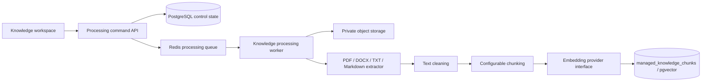
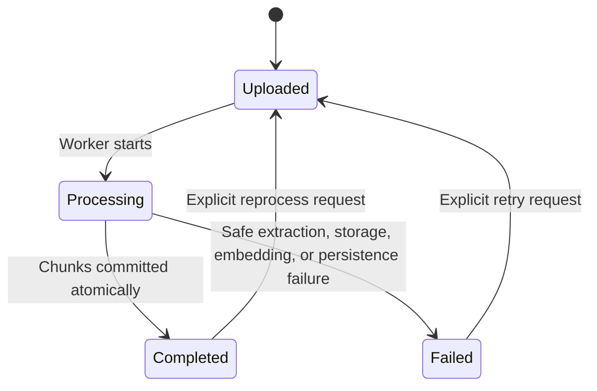

# Knowledge Processing Pipeline Design

## 1. Purpose and scope

Phase 2.5.2 converts an approved managed document version into tenant-, domain-, and agent-scoped AI-ready chunks. It adds extraction, cleaning, chunking, embedding, pgvector persistence, processing status, and citation metadata.

It does not expose retrieval to users, generate answers, or implement a conversational Knowledge Assistant. CRM, Agent Playground, and qualification workflows remain unchanged.

## 2. Architecture



The API creates a durable `knowledge_processing_runs` record before enqueueing a reference. The Worker reloads all canonical state from PostgreSQL and repeats eligibility checks before reading bytes or saving chunks.

## 3. Eligibility and isolation

A processing run is accepted only when:

1. `tenant_id` matches the authenticated principal.
2. The collection is active.
3. The logical document lifecycle is `approved` or `active`.
4. `approval_status` is `approved`.
5. The requested version is still the exact current version.
6. At least one enabled, same-domain document-agent binding exists.
7. No run for the document is already `uploaded` or `processing`.

The Worker repeats these checks at start and before completion. Every processing and chunk row has `tenant_id`, forced RLS, and explicit tenant predicates. Chunks are duplicated per authorized agent binding, making agent access deny-by-default without relying on post-query filtering.

## 4. Extraction and cleaning

| Format | Preserved structure |
|---|---|
| PDF | Page number and extracted page text |
| DOCX | Heading-derived section title, paragraphs, and table rows |
| Markdown | Heading-derived section title and section body |
| UTF-8 text | Clean normalized body |

Cleaning removes null bytes, normalizes line endings and horizontal whitespace, collapses excessive blank lines, and trims boundaries. Empty or unsupported documents fail safely. The source SHA-256 is verified against private storage before extraction.

## 5. Chunking

Chunk size and overlap come from `KNOWLEDGE_CHUNK_SIZE` and `KNOWLEDGE_CHUNK_OVERLAP`. Each run snapshots both values and its chunking version. The deterministic chunker prefers paragraph and sentence boundaries, preserves overlap, and assigns a stable zero-based `chunk_index` for that exact document version.

Every chunk preserves:

- Tenant, domain package, authorized agent, collection, logical document, exact document version, and processing run IDs.
- Language and document type.
- Page number or section title when available.
- Chunk content, character count, and SHA-256.
- Source metadata snapshot and complete citation metadata.

## 6. Embedding abstraction

`KnowledgeEmbeddingProvider` is the stable provider interface:

```python
class KnowledgeEmbeddingProvider(Protocol):
    provider_type: str
    model_id: str
    dimensions: int

    async def embed(self, texts: list[str]) -> list[list[float]]: ...
```

The OpenAI-compatible adapter uses the configured embeddings endpoint and exact dimensions. Development uses a deterministic local token-hash adapter that makes tests repeatable and incurs no external cost. A future local model adapter can implement the same interface; model routing and local inference infrastructure are not implemented.

Provider, model, and dimensions are saved on both run and chunk records. Phase 2.5 uses 1,536 dimensions and rejects mismatched vectors.

## 7. Vector storage and future retrieval boundary

`managed_knowledge_chunks.embedding` uses PostgreSQL `vector(1536)` with an HNSW cosine index. Access indexes begin with tenant, domain, agent, and document identifiers. No Phase 2.5.2 endpoint performs similarity search.

A future retrieval service must filter by tenant, domain, agent binding, active collection, approved/active current document version, language/access policy, provider, and model before ordering by vector distance. It must return stored `citation_metadata` with every result and treat no eligible evidence as a valid outcome.

## 8. Processing status

Processing state is separate from approval lifecycle:



The logical document exposes `processing_status`. Each durable run records start/end time, configuration snapshot, chunk count, safe error code/message, and correlation ID. A failed replacement run does not delete previously completed chunks because replacement happens only in the completion transaction.

## 9. API

| Method | Endpoint | Purpose |
|---|---|---|
| `POST` | `/api/v1/knowledge-management/documents/{id}/processing-runs` | Validate eligibility, create durable run, and enqueue it |
| `GET` | `/api/v1/knowledge-management/processing-runs/{run_id}` | Read processing status and safe result metadata |

The document management responses now include `processing_status`. Upload accepts PDF, DOCX, UTF-8 text, and Markdown. Processing commands require `knowledge:manage`; status reads require `knowledge:retrieve`.

## 10. Operations and failure handling

- Queue messages contain only run ID, tenant ID, and correlation ID.
- The Worker never trusts queue payloads as business state.
- Content digest, current version, approval, collection, and bindings are checked again.
- Chunk replacement is atomic and idempotent for the exact current version.
- Unsupported, empty, missing, mismatched, or provider-failed content records a safe failure without exposing document text or credentials.
- Real OpenAI embeddings require `KNOWLEDGE_EMBEDDING_PROVIDER=openai` and `OPENAI_API_KEY`; the default is deterministic mock mode.

## 11. Demo flow

Run the following commands, keeping the last three in separate terminals:

```bash
make services-up
make demo-seed
make api-dev
make worker-dev
make web-dev
```

Then:

1. Open `/knowledge` with the local admin account.
2. Select an approved/active synthetic document and choose **Process**.
3. Refresh until the processing label becomes **completed**.
4. Inspect `GET /api/v1/knowledge-management/processing-runs/{run_id}` for chunk count, provider, model, and timestamps.
5. Use database diagnostics to confirm chunks contain exact document/version citation references; no answer-generation screen exists.

Only synthetic or explicitly approved documents may be processed.

## 12. Phase 2.6.1 retrieval integration

Phase 2.6.1 now reads these processed assets through the governed `POST /api/v1/knowledge/search` boundary. Processing alone does not make a chunk retrievable: the logical document must also be active, the exact chunk version must equal both published and active pointers, and the requested active tenant agent must retain an enabled binding and retrieval capability. See `knowledge-retrieval-design.en.md`.
