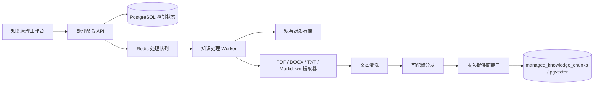
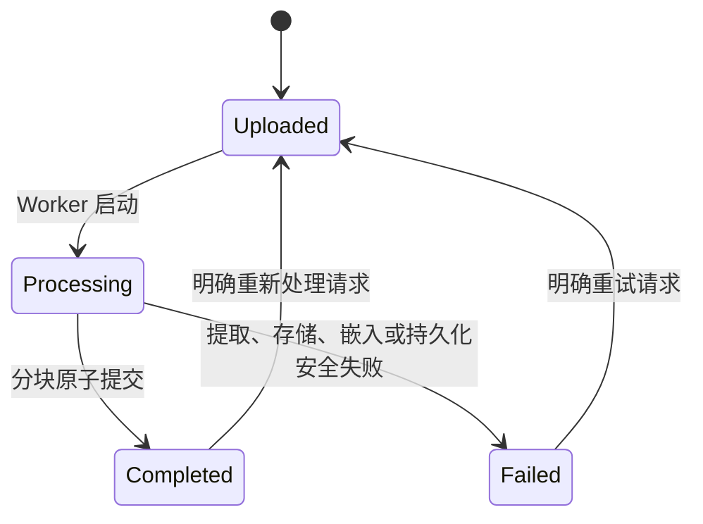

# 知识处理流水线设计

## 1. 目的与范围

Phase 2.5.2 把已批准的受管文档版本转换为按租户、业务域和智能体隔离的 AI 就绪分块。本阶段增加提取、清洗、分块、嵌入、pgvector 持久化、处理状态和引用元数据。

本阶段不向用户开放检索，不生成回答，也不实现对话式知识助手。CRM、Agent Playground 和资格评估工作流保持不变。

## 2. 架构



API 在发送引用到队列之前创建持久的 `knowledge_processing_runs` 记录。Worker 从 PostgreSQL 重新加载所有权威状态，并在读取字节或保存分块前再次执行资格检查。

## 3. 处理资格与隔离

只有满足以下条件才接受处理运行：

1. `tenant_id` 与认证主体一致。
2. 知识集合处于启用状态。
3. 逻辑文档生命周期为 `approved` 或 `active`。
4. `approval_status` 为 `approved`。
5. 请求版本仍然是准确的当前版本。
6. 至少存在一个已启用且属于同业务域的文档—智能体绑定。
7. 同一文档当前不存在 `uploaded` 或 `processing` 运行。

Worker 在启动和完成前都会重复这些检查。每条处理记录和分块记录都有 `tenant_id`、强制 RLS 和明确租户条件。分块按获授权的智能体绑定分别保存，因此智能体访问默认拒绝，不依赖查询后的二次过滤。

## 4. 提取与清洗

| 格式 | 保留的结构 |
|---|---|
| PDF | 页码和提取出的页面文字 |
| DOCX | 根据标题得到的章节标题、段落和表格行 |
| Markdown | 根据标题得到的章节标题和章节正文 |
| UTF-8 文本 | 清洗并规范化后的正文 |

清洗会移除空字节、统一换行和水平空白、合并过多空行，并清理边界。空文档或不支持的文档会安全失败。提取前会根据私有存储内容验证来源 SHA-256。

## 5. 分块

分块大小和重叠来自 `KNOWLEDGE_CHUNK_SIZE` 与 `KNOWLEDGE_CHUNK_OVERLAP`。每次运行都会保存这两个值及分块版本快照。确定性分块器优先使用段落和句子边界，保留重叠，并为准确文档版本分配稳定的从零开始的 `chunk_index`。

每个分块都会保留：

- 租户、业务域包、获授权智能体、集合、逻辑文档、准确文档版本和处理运行 ID。
- 语言和文档类型。
- 可用时的页码或章节标题。
- 分块内容、字符数和 SHA-256。
- 来源元数据快照和完整引用元数据。

## 6. 嵌入抽象

`KnowledgeEmbeddingProvider` 是稳定的提供商接口：

```python
class KnowledgeEmbeddingProvider(Protocol):
    provider_type: str
    model_id: str
    dimensions: int

    async def embed(self, texts: list[str]) -> list[list[float]]: ...
```

OpenAI 兼容适配器使用配置的嵌入端点和准确维度。开发环境使用确定性的本地 Token Hash 适配器，使测试可重复且不产生外部成本。未来本地模型适配器可以实现同一接口；本阶段不实现模型路由或本地推理基础设施。

提供商、模型和维度都会保存在运行与分块记录中。Phase 2.5 使用 1,536 维，并拒绝维度不一致的向量。

## 7. 向量存储与未来检索边界

`managed_knowledge_chunks.embedding` 使用 PostgreSQL `vector(1536)` 和 HNSW 余弦索引。访问索引以租户、业务域、智能体和文档标识开头。Phase 2.5.2 没有任何端点执行相似度搜索。

未来检索服务必须先按租户、业务域、智能体绑定、启用集合、已批准或已启用的当前文档版本、语言或访问策略、提供商和模型过滤，再按向量距离排序。每个结果都必须返回保存的 `citation_metadata`，没有合格证据也必须作为有效结果处理。

## 8. 处理状态

处理状态与审批生命周期分离：



逻辑文档对外提供 `processing_status`。每条持久运行记录都保存开始和结束时间、配置快照、分块数量、安全错误代码或信息及关联 ID。替换动作只在完成事务中发生，因此失败的重新处理不会删除之前成功的分块。

## 9. API

| 方法 | 端点 | 用途 |
|---|---|---|
| `POST` | `/api/v1/knowledge-management/documents/{id}/processing-runs` | 验证资格、创建持久运行并加入队列 |
| `GET` | `/api/v1/knowledge-management/processing-runs/{run_id}` | 读取处理状态和安全结果元数据 |

文档管理响应现在包含 `processing_status`。上传支持 PDF、DOCX、UTF-8 文本和 Markdown。处理命令需要 `knowledge:manage`，状态读取需要 `knowledge:retrieve`。

## 10. 运维与失败处理

- 队列消息只包含运行 ID、租户 ID 和关联 ID。
- Worker 不把队列载荷当作业务状态。
- 内容指纹、当前版本、审批、集合和绑定都会再次检查。
- 对准确当前版本的分块替换是原子且幂等的。
- 不支持、空白、缺失、指纹不一致或提供商失败的内容会记录安全失败，不暴露文档原文或凭据。
- 真实 OpenAI 嵌入需要 `KNOWLEDGE_EMBEDDING_PROVIDER=openai` 和 `OPENAI_API_KEY`；默认是确定性 Mock 模式。

## 11. 演示流程

运行以下命令，最后三个命令需要分别保留在独立终端中：

```bash
make services-up
make demo-seed
make api-dev
make worker-dev
make web-dev
```

然后：

1. 使用本地管理员账号打开 `/knowledge`。
2. 选择一份已批准或已启用的合成文档，然后点击 **开始处理**。
3. 刷新页面，直到处理标签变成 **已完成**。
4. 查看 `GET /api/v1/knowledge-management/processing-runs/{run_id}` 中的分块数量、提供商、模型和时间。
5. 使用数据库诊断确认分块包含准确的文档或版本引用；系统不存在回答生成页面。

只能处理合成资料或明确批准的资料。

## 12. Phase 2.6.1 检索集成

Phase 2.6.1 现在通过受治理的 `POST /api/v1/knowledge/search` 边界读取这些已处理资产。仅完成处理不会让分块自动具备检索资格：逻辑文档还必须处于生效状态，准确分块版本必须同时等于已发布和已生效指针，并且请求的活动租户智能体必须继续拥有已启用绑定和检索能力。参见 `knowledge-retrieval-design.zh-CN.md`。
