# Knowledge Retrieval Design

## 1. Purpose and boundary

Phase 2.6.1 provides a governed vector similarity search API for approved enterprise knowledge. It returns evidence chunks and exact source citations for authorized agents.

This phase does **not** implement a conversational Knowledge Assistant, answer generation, prompt assembly, autonomous tool use, or external communication. CRM, Agent Playground, qualification workflows, and Knowledge Governance transitions remain unchanged.

## 2. Retrieval architecture

```mermaid
flowchart LR
    Caller["Authorized user or agent runtime"] --> API["POST /api/v1/knowledge/search"]
    API --> Tenant["Tenant identity check"]
    Tenant --> Agent["Agent activation and capability check"]
    Agent --> Embed["Configured embedding provider"]
    Embed --> Search["Governed pgvector search"]
    Search --> Filters["Lifecycle, version, binding and language filters"]
    Filters --> Results["Evidence chunks and exact citations"]
```



Authorization occurs before the query is sent to an external embedding provider. This prevents an unauthorized agent request from transmitting query content or creating provider cost.

## 3. API contract

### 3.1 Endpoint

```http
POST /api/v1/knowledge/search
Content-Type: application/json
Authorization: Bearer <token>
X-Tenant-Id: <tenant-id>
```

The caller requires `knowledge:retrieve`.

### 3.2 Request

```json
{
  "tenant_id": "10000000-0000-4000-8000-000000000001",
  "agent_id": "61000000-0000-4000-8000-000000000001",
  "query": "commercial kitchen ventilation exhaust airflow",
  "language": "en",
  "top_k": 5
}
```

| Field | Rule |
|---|---|
| `tenant_id` | Must exactly match the authenticated workspace tenant |
| `agent_id` | Must be an active tenant agent with approved retrieval capability |
| `query` | 3–2,000 characters |
| `language` | `en`, `zh-CN`, or `id`; exact chunk-language filtering |
| `top_k` | 1–20, default 5 |

The server applies `KNOWLEDGE_RETRIEVAL_MIN_SIMILARITY`, default `0.15`. Ordinary callers cannot lower the evidence threshold.

### 3.3 Response

```json
{
  "evidence_status": "sufficient_candidates",
  "tenant_id": "10000000-0000-4000-8000-000000000001",
  "agent_id": "61000000-0000-4000-8000-000000000001",
  "language": "en",
  "results": [
    {
      "document_name": "Commercial Kitchen Ventilation Guide",
      "document_version": 3,
      "chunk_content": "The exhaust airflow must follow the engineered design...",
      "page_number": 7,
      "section": "Ventilation design",
      "metadata": {
        "document_type": "technical_reference",
        "language": "en",
        "chunk_index": 4
      },
      "similarity_score": 0.824531,
      "citation": {
        "document_id": "11111111-1111-4111-8111-111111111111",
        "document_name": "Commercial Kitchen Ventilation Guide",
        "document_version_id": "22222222-2222-4222-8222-222222222222",
        "document_version": 3,
        "chunk_id": "33333333-3333-4333-8333-333333333333",
        "page_number": 7,
        "section": "Ventilation design",
        "content_sha256": "0123456789abcdef0123456789abcdef0123456789abcdef0123456789abcdef"
      }
    }
  ]
}
```

No eligible result returns HTTP `200` with `evidence_status = insufficient_evidence` and an empty `results` list. This is a valid result, not a system failure.

## 4. Eligibility filters

A chunk is returned only when every condition is true:

1. `managed_knowledge_chunks.tenant_id` matches the authenticated tenant.
2. The requested agent has an active tenant activation, active configuration, `knowledge_enabled = true`, and available `approved_knowledge_retrieval` capability.
3. The chunk was created for the requested `agent_id`.
4. An enabled `knowledge_document_agent_bindings` row connects the exact document and agent.
5. The collection is active.
6. The document lifecycle is `active` and approval status is `approved`.
7. The chunk version equals both `published_version_id` and `active_version_id`.
8. The exact version review status is approved and version status is active.
9. The processing run is completed.
10. Language, embedding provider, embedding model, and minimum similarity match.

The search does not infer authorization from document metadata or citation JSON. All security conditions use relational columns and enforced joins.

## 5. Tenant and agent isolation

- The request `tenant_id` must equal the tenant resolved from the access token and `X-Tenant-Id` context.
- Repository queries repeat explicit tenant predicates on every tenant-owned table.
- PostgreSQL forced RLS remains enabled on collections, documents, versions, bindings, processing runs, and chunks.
- The production database role must not be a superuser and must not have `BYPASSRLS`.
- Unknown, draft, suspended, or retrieval-disabled agents receive `403` without revealing cross-tenant document existence.
- Disabling a document-agent binding immediately removes all of that document's chunks from eligible results without deleting history.

The IVC agent remains retrieval-disabled in this phase because its configuration and capability binding are still draft/planned.

## 6. Similarity search

The configured embedding abstraction generates one query vector using the same provider, model, and 1,536 dimensions recorded on processed chunks. PostgreSQL pgvector computes cosine distance and uses the existing HNSW `vector_cosine_ops` index where the planner determines it is beneficial.

Results are ordered by ascending cosine distance and converted to:

```text
similarity_score = 1 - cosine_distance
```

The database applies the server-controlled similarity threshold before `top_k`. Exact language filtering avoids silently mixing languages; future localized fallback requires a separate approved policy.

## 7. Citation and evidence boundaries

Every result includes stable identifiers for:

- logical source document;
- immutable document version;
- exact chunk;
- version number;
- page number when extraction provides one;
- section title when extraction provides one;
- chunk content SHA-256.

The result metadata is evidence context, not verified customer or commercial truth. A future Knowledge Assistant must cite these identifiers and treat an empty result as insufficient evidence. It must not cite a different current version or reconstruct citations from document names.

## 8. Failure behavior

| Condition | Result |
|---|---|
| Invalid or missing authentication | `401` or `403` from the identity layer |
| Request tenant differs from authenticated tenant | `403 Workspace access denied` |
| Agent is not enabled for retrieval | `403` |
| Invalid language, `top_k`, query, or extra field | `422` |
| No eligible or sufficiently similar evidence | `200 insufficient_evidence` |
| Embedding provider unavailable | Safe server error; no partial evidence is returned |

No response exposes SQL, object-storage keys, vectors, system prompts, or provider credentials.

## 9. Validation coverage

Automated integration tests verify:

- correct similarity retrieval and complete citation fields;
- exclusion of inactive, unpublished, unbound, wrong-language, and irrelevant chunks;
- cross-tenant request rejection;
- retrieval-disabled agent rejection;
- immediate revocation after binding disable;
- forced RLS on `managed_knowledge_chunks` and an empty other-tenant scope.

## 10. Future Knowledge Assistant integration

A future assistant may call this endpoint through a narrow typed tool and use returned chunks as evidence. It must add answer-generation guardrails, citation rendering, prompt-injection defenses, token budgeting, evaluation, and human review separately. Those behaviors are intentionally outside Phase 2.6.1.

