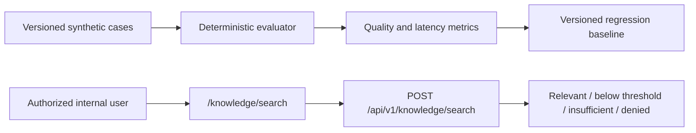

# Knowledge Retrieval Evaluation and Test Interface

## 1. Purpose and boundary

Phase 2.6.2 validates the governed retrieval layer before any model is allowed to generate knowledge answers. It adds a repeatable synthetic benchmark, bilingual consistency checks, safe retrieval observability, and an internal `/knowledge/search` inspection page.

This phase does not implement conversational RAG, answer generation, external communication, or IVC production retrieval.

## 2. Evaluation architecture



The versioned regression file is `apps/api/tests/fixtures/knowledge_retrieval_evaluation.v1.json`. It records the evaluation configuration, queries, expected evidence, captured observations, measured baseline, and acceptance thresholds. Future changes to the embedding provider, chunk size, overlap, `top_k`, similarity threshold, or language filtering must produce a new comparable run instead of silently replacing the baseline.

## 3. Evaluation cases

The first dataset uses synthetic Commercial Kitchen Agent knowledge only. It includes:

- a single-source ventilation question;
- a multi-chunk school-kitchen sizing question;
- paired English and Chinese ventilation questions;
- an unsupported lifetime-warranty question;
- API integration tests for cross-tenant rejection, IVC rejection, binding revocation, and RLS.

No real customer information is used. IVC retrieval remains disabled.

## 4. Metrics

| Metric | Definition | Acceptance baseline |
|---|---|---:|
| Recall@K | Relevant chunks returned divided by expected relevant chunks | >= 0.80 |
| Precision@K | Relevant chunks divided by all returned qualified chunks | >= 0.75 |
| Hit@1 | Queries whose first result is relevant | >= 0.80 |
| MRR | Mean reciprocal rank of the first relevant chunk | >= 0.85 |
| Citation completeness | Results with document, version, chunk, location when available, and hash | 1.00 |
| Insufficient-evidence accuracy | Unsupported queries correctly returning insufficient evidence | 1.00 |
| Same-source document rate | Bilingual pairs retrieving the same source document | 1.00 |
| Relevant chunk-set Jaccard | Overlap of the bilingual relevant chunk sets | >= 0.80 |
| Ranking consistency | Bilingual consistency based on shared-document rank distance | >= 0.80 |
| Retrieval latency | Mean and maximum server retrieval duration | maximum <= 1,000 ms locally |

Security metrics are pass/fail gates: cross-tenant rejection, retrieval-disabled agent rejection, binding enforcement, and forced RLS must all pass. A quality score cannot compensate for a failed security gate.

## 5. Bilingual consistency

English and Chinese paired queries have the same `bilingual_pair_id`. The evaluator compares the shared source document, Jaccard overlap of relevant chunk sets, and rank difference of the first shared source.

Exact language filtering remains active. The benchmark may use localized chunks from the same governed source version, but the API never performs implicit cross-language fallback.

## 6. Evidence threshold policy

```text
KNOWLEDGE_RETRIEVAL_MIN_SIMILARITY=0.15
KNOWLEDGE_RETRIEVAL_MIN_EVIDENCE_COUNT=1
KNOWLEDGE_RETRIEVAL_DIAGNOSTIC_CANDIDATES=5
```

Only results at or above the similarity threshold can enter `results`, and their count must meet the minimum evidence requirement. Otherwise the API returns `200 insufficient_evidence` with an empty `results` list.

The internal test page sends `include_diagnostics=true`, allowing the response to include authorized, governed candidates below the threshold in `below_threshold_results`. The flag defaults to `false`. These candidates are diagnostic only and must never be treated as answer evidence. Ordinary agent tools must omit the flag and consume `results` only.

Weak evidence produces insufficient evidence. Generic vector retrieval cannot reliably determine semantic conflict. Therefore conflicting evidence is also a mandatory insufficient-evidence outcome for the future Knowledge Assistant until a deterministic policy or human review resolves it.

## 7. Internal search interface

The `/knowledge/search` page supports agent, query, language, and `top_k` selection. It displays the evidence decision, threshold, similarity scores, qualified and below-threshold results, exact citations, duration, correlation ID, and distinct insufficient, denied, loading, empty, and error states.

The page is an internal diagnostic tool. It does not assemble prompts or generate answers.

## 8. Observability and privacy

Each successful search writes one structured event containing correlation ID, tenant ID, agent ID, language, result count, duration, and outcome. Logs do not contain the query, document text, embeddings, credentials, or object-storage keys.

Authorization and capability checks occur before the embedding provider is built or called. All formal and diagnostic candidates pass the same tenant, lifecycle, version, binding, processing, language, provider, and RLS filters.

## 9. Regression procedure

For a retrieval configuration change:

1. preserve the previous baseline file;
2. run the same cases using the proposed configuration;
3. store the new configuration and observations in a new versioned JSON file;
4. calculate all quality, bilingual, security, and latency metrics;
5. compare absolute thresholds and regressions against the previous baseline;
6. reject the change if any security gate fails or unsupported-answer behavior worsens.

## 10. Phase 2.6.3 recommendation

**GO for a bounded Knowledge Assistant implementation**, subject to keeping the Phase 2.6.2 suite as a release gate. The deterministic baseline meets the declared quality and security thresholds, citations remain exact, and insufficient evidence is a first-class outcome.

This approval is limited to an internal, read-only assistant. Phase 2.6.3 must require citations, ignore diagnostic candidates, return insufficient evidence for weak or conflicting sources, defend against prompt injection in retrieved documents, and perform no CRM write or external communication.
