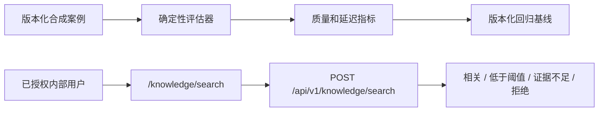

# 知识检索评估与测试界面

## 1. 目的与边界

Phase 2.6.2 在允许模型生成知识回答前，验证受治理的检索层。本阶段增加可重复执行的合成基准、中英文一致性检查、安全检索可观测性，以及内部 `/knowledge/search` 检查页面。

本阶段不实现对话式 RAG、答案生成、外部通信或 IVC 生产知识检索。

## 2. 评估架构



版本化回归文件为 `apps/api/tests/fixtures/knowledge_retrieval_evaluation.v1.json`。它保存评估配置、问题、预期证据、已记录观察结果、测量基线和验收阈值。以后修改嵌入提供商、分块大小、重叠、`top_k`、相似度阈值或语言过滤时，必须生成新的可比较运行，不能静默覆盖当前基线。

## 3. 评估案例

第一版数据集仅使用商用厨房智能体的合成知识，包括：

- 单一来源的通风问题；
- 需要多个分块的学校厨房容量问题；
- 成对的英文和中文通风问题；
- 没有证据支持的终身保修问题；
- 跨租户拒绝、IVC 拒绝、绑定撤销和 RLS 的 API 集成测试。

不使用真实客户信息。IVC 检索继续保持禁用。

## 4. 指标

| 指标 | 定义 | 验收基线 |
|---|---|---:|
| Recall@K | 返回的相关分块数除以预期相关分块数 | >= 0.80 |
| Precision@K | 相关分块数除以全部合格返回分块数 | >= 0.75 |
| Hit@1 | 第一条结果相关的问题比例 | >= 0.80 |
| MRR | 第一条相关分块排名倒数的平均值 | >= 0.85 |
| 引用完整率 | 结果包含文档、版本、分块、可用位置和哈希的比例 | 1.00 |
| 证据不足准确率 | 无支持问题被正确判为证据不足的比例 | 1.00 |
| 相同来源文档率 | 中英文问题检索到相同来源文档的比例 | 1.00 |
| 相关分块集合 Jaccard | 中英文相关分块集合的重合度 | >= 0.80 |
| 排名一致性 | 根据共享文档排名距离计算的中英文一致性 | >= 0.80 |
| 检索延迟 | 服务端检索平均和最大耗时 | 本地最大 <= 1,000 ms |

安全指标属于通过/失败门槛：跨租户拒绝、检索未启用智能体拒绝、绑定执行和强制 RLS 必须全部通过。质量分数不能抵消安全门槛失败。

## 5. 中英文一致性

成对的英文和中文问题使用同一个 `bilingual_pair_id`。评估器比较共享来源文档、相关分块集合的 Jaccard 重合度，以及第一条共享来源的排名差异。

系统继续执行严格语言过滤。基准可以使用同一受治理来源版本的本地化分块，但 API 不会执行隐式跨语言回退。

## 6. 证据阈值策略

```text
KNOWLEDGE_RETRIEVAL_MIN_SIMILARITY=0.15
KNOWLEDGE_RETRIEVAL_MIN_EVIDENCE_COUNT=1
KNOWLEDGE_RETRIEVAL_DIAGNOSTIC_CANDIDATES=5
```

只有达到或超过相似度阈值的结果才能进入 `results`，且数量必须达到最低证据要求。否则 API 返回 `200 insufficient_evidence`，并且 `results` 为空。

内部测试页面发送 `include_diagnostics=true`，使响应可以在 `below_threshold_results` 中包含经过授权和治理、但低于阈值的候选内容。该标志默认为 `false`。这些内容仅供诊断，绝不能作为回答证据。普通智能体工具必须省略该标志，并且只能使用 `results`。

证据较弱时返回证据不足。通用向量检索无法可靠判断语义冲突。因此，在确定性策略或人工审核解决冲突前，未来 Knowledge Assistant 遇到冲突证据也必须返回证据不足。

## 7. 内部检索界面

`/knowledge/search` 页面支持选择智能体、输入问题、选择语言和 `top_k`，并展示证据判定、阈值、相似度分数、合格和低于阈值的结果、准确引用、耗时、关联 ID，以及不同的证据不足、拒绝、加载、空白和错误状态。

该页面是内部诊断工具，不组装提示词，也不生成回答。

## 8. 可观测性与隐私

每次成功检索写入一条结构化事件，包含关联 ID、租户 ID、智能体 ID、语言、结果数量、耗时和结果状态。日志不记录问题文本、文档内容、向量、凭据或对象存储键。

系统在构建或调用嵌入提供商前完成授权和能力检查。正式和诊断候选执行相同的租户、生命周期、版本、绑定、处理、语言、提供商和 RLS 过滤。

## 9. 回归流程

修改检索配置时：

1. 保留上一版基线文件；
2. 使用新配置运行相同案例；
3. 将新配置和观察结果保存为新的版本化 JSON 文件；
4. 计算全部质量、中英文、安全和延迟指标；
5. 同时比较绝对阈值和相对上一版的回归；
6. 任一安全门槛失败，或不受支持回答行为恶化时，拒绝该修改。

## 10. Phase 2.6.3 建议

**建议 GO，可以开始受限的 Knowledge Assistant 实现**，前提是继续把 Phase 2.6.2 验收套件作为发布门槛。当前确定性基准满足已声明的质量和安全阈值，引用保持准确，并且“证据不足”是一等结果。

该建议仅适用于内部只读助手。Phase 2.6.3 必须强制引用、忽略诊断候选、在证据较弱或冲突时返回证据不足、防御检索文档中的提示注入，并且不得写入 CRM 或执行外部通信。
