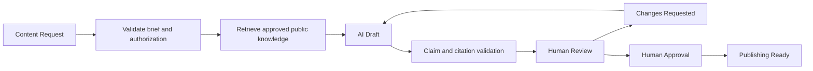
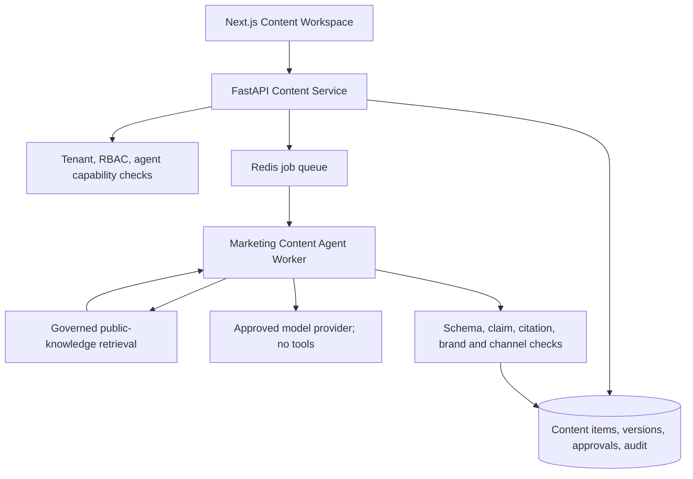

# Governed Marketing Content Agent Design

**Status:** Phase 3.2 design specification; not implemented  
**Primary engineering baseline:** English  
**Review translation:** `marketing-content-agent-design.zh-CN.md`

## 1. Purpose

The Governed Marketing Content Agent helps Sari Arta create qualified B2B marketing drafts from approved public knowledge. It translates verified company capabilities, services, product categories, and case evidence into channel-appropriate content while preserving human editorial and publishing control.

The agent is not a general chatbot, autonomous publisher, quotation tool, or source of commercial commitments. Its outputs remain drafts until a human reviews and approves the exact version.

Business objectives:

- Reduce the time required to prepare consistent B2B content.
- Improve relevance for institutional and industrial project audiences.
- Reuse approved public knowledge with traceable citations.
- Prevent invented cases, specifications, prices, certifications, or delivery claims.
- Produce reviewable multilingual material without bypassing brand governance.

## 2. Target Audiences

| Audience | Typical need | Suitable themes |
|---|---|---|
| Indonesia schools | Safe, maintainable meal production and concentrated service periods | Workflow planning, capacity discovery, hygiene zoning, local installation |
| Hospitals | Reliable institutional food service and operational separation | Production flow, washing flow, phased upgrades, commissioning support |
| Factories and corporate cafeterias | High-volume service around shift peaks | Capacity planning, durable equipment categories, delivery coordination |
| Central kitchen projects | Coordinated production, packing, storage, and dispatch | End-to-end workflow, manufacturing coordination, logistics, installation |
| Project owners and facility managers | Clear scope, risk, timeline, and accountability | Project discovery, site readiness, engineering process, after-sales planning |

Content requests must identify one primary audience. The agent may suggest missing audience information but must not infer a private customer profile.

## 3. Knowledge Access Boundary

### 3.1 Allowed knowledge

- Approved public company information.
- Approved and explicitly public case studies.
- Approved public product categories and product information.
- Approved public service information.
- Approved brand voice, terminology, visual-copy, and claims guidelines.
- Approved public contact and consultation calls to action.

### 3.2 Forbidden knowledge

- Internal prices, discounts, margins, quotations, or commercial terms.
- Supplier identities, contracts, cost structures, or private manufacturing information.
- Private customer data, CRM records, messages, leads, opportunities, or project files.
- Internal SOP, engineering work instructions, security procedures, or staff-only policies.
- Unpublished cases, confidential project references, internal performance data, or unsupported certifications.

### 3.3 Enforcement model

The agent must use a dedicated `public_marketing_content` capability and an explicit same-agent knowledge binding. Retrieval remains deny-by-default and occurs only after tenant, role, agent, and capability authorization.

An eligible knowledge version must be:

```text
same tenant
+ same domain
+ explicitly bound to the Marketing Content Agent
+ classified for public marketing use
+ approved
+ published
+ active
+ successfully processed
+ language eligible
+ above the retrieval evidence threshold
```

The existing internal Knowledge Assistant binding is not sufficient. Before implementation, knowledge governance must provide an explicit public-marketing visibility classification or a dedicated approved public collection policy. Missing classification produces `insufficient_evidence`, not a fallback to internal knowledge.

Every factual claim derived from enterprise knowledge must retain one or more exact citations. General creative language may be uncited only when it introduces no factual business claim.

## 4. Content Types

| Content type | Required structure | Governance notes |
|---|---|---|
| Website article | Title, summary, headings, body, CTA, SEO title, description, keywords | All capability, case, and technical claims cited |
| Case study | Context, challenge, approved scope, delivery approach, outcome, CTA | Only approved public cases; no invented results or customer identity |
| TikTok script | Hook, scenes, voice-over, on-screen text, CTA, duration guidance | Draft only; no generated customer footage or unsupported demonstrations |
| Instagram Reel script | Hook, shot list, captions, voice-over, CTA, hashtags | Brand and claims review required |
| Facebook post | Lead text, body, CTA, optional creative brief | No automatic publishing or audience targeting |
| Email draft | Subject, preview text, body, CTA, compliance footer placeholder | Draft only; no recipient selection, personalization from CRM, or sending |

Phase 3.2 should initially support English and Simplified Chinese. Bahasa Indonesia can be activated after an approved terminology set, localized brand guidance, and evaluation cases are available.

## 5. Content Request and Output Contract

### 5.1 Request

- Content type and target channel.
- Primary audience and industry.
- Language.
- Business objective and topic.
- Desired call to action.
- Optional campaign name and length/tone constraints.
- Optional approved knowledge collections or public case IDs.

Callers cannot submit a system prompt, model name, arbitrary tools, unrestricted URLs, raw CRM data, or private document identifiers.

### 5.2 Structured draft

- Title or hook.
- Channel-specific content body.
- Call to action.
- SEO or channel metadata where relevant.
- Factual claims mapped to citations.
- Evidence status: `sufficient`, `insufficient`, or `conflicting`.
- Missing information and review warnings.
- Language, agent version, model/provider, and safe run metadata.

If evidence is insufficient or conflicting, the run may return an annotated partial outline but cannot mark the content as review-ready.

## 6. Workflow



Recommended lifecycle:

```text
requested
→ generating
→ draft
→ in_review
→ changes_requested | approved
→ publishing_ready
→ archived
```

`scheduled` and `published` are reserved for a future controlled publishing integration. Phase 3.2 does not send, schedule, or publish content.

Generation runs asynchronously. Provider failure must leave the request recoverable and must never remove a previous approved version. Users can create or edit a manual draft when AI is unavailable.

## 7. Content Governance

### 7.1 Attribution and separation of duties

- **Creator:** creates the brief or manual draft.
- **AI run initiator:** requests generation and remains accountable for the brief.
- **Reviewer:** checks accuracy, audience fit, citations, tone, and compliance.
- **Approver:** approves the exact immutable version for publishing readiness.
- **Publisher:** future separate permission; not included in Phase 3.2.

By default, a creator cannot approve their own AI-generated version. Tenant policy may require a separate technical reviewer for technical claims or a manager for named cases.

### 7.2 Version history

- Every AI generation or material edit creates an immutable content version.
- The content item points to `current_version_id` and `approved_version_id`.
- Approval records the exact version ID and content checksum.
- Editing approved text creates a successor version and invalidates publishing readiness until reapproval.
- Rollback creates a new successor version based on an earlier version; history is never overwritten.

### 7.3 Approval states

| Status | Meaning |
|---|---|
| `draft` | Editable and not approved |
| `in_review` | Exact version submitted for human review |
| `changes_requested` | Reviewer returned actionable feedback |
| `approved` | Exact version and citations approved |
| `publishing_ready` | Approved version passed deterministic channel and policy checks |
| `archived` | No longer available for new publishing activity |

### 7.4 Audit logs

Audit events must record creator, initiator, reviewer, approver, timestamp, tenant, agent/version, content item/version, action, outcome, correlation ID, and safe before/after metadata. Required actions include request, generation, manual edit, review submission, changes requested, approval, rejection, readiness check, archive, restore, and future publication events.

Do not store hidden model reasoning or unnecessary source text in audit logs.

## 8. Roles and Permissions

| Permission | Purpose |
|---|---|
| `content:create` | Create a brief or manual content item |
| `content:generate` | Start an approved Marketing Content Agent run |
| `content:edit` | Create a successor content version |
| `content:submit_review` | Submit the exact version for review |
| `content:review` | Request changes or recommend approval |
| `content:approve` | Approve the exact version and checksum |
| `content:publish_ready` | Run deterministic readiness checks |
| `content:archive` | Archive or restore content |
| `content:audit_read` | View content history and governance events |
| `content:publish` | Future external publishing permission; not active in Phase 3.2 |

Tenant Admin receives administrative rights. Marketing users may create, generate, edit, and submit. Review and approval permissions should be independently assigned. Sales users and viewers receive only explicitly granted read access.

## 9. Proposed Architecture



The FastAPI application service owns lifecycle transitions and transactions. The agent receives no database, CRM, publishing, email, WhatsApp, shell, arbitrary HTTP, or secret-reading tool. Model calls occur outside database transactions.

The future implementation may realize the long-term `content_items` and `content_versions` design already described in the database architecture, but every schema and API change requires a separate implementation review and migration.

## 10. Integration Boundaries

### Public Consultation Agent

Future aggregate, anonymized inquiry themes may inform content planning. Raw visitor conversations, contact details, or individual lead records must not enter marketing prompts. No automatic content request is created from a public conversation.

### CRM

Phase 3.2 does not read customer records or write CRM activity. Future campaign attribution may connect an approved content/campaign identifier to new lead source metadata without exposing lead data to the content model.

### Knowledge Assistant

Both features may reuse the governed retrieval service, but they require different agent identities, capabilities, bindings, knowledge visibility, and evaluation suites. The Marketing Content Agent cannot inherit the internal assistant's access.

### WhatsApp and email

Content remains a draft. Future delivery services may accept only an exact `publishing_ready` content version, valid approval checksum, consent/policy result, and idempotency key. The generation agent never sends messages.

### n8n

n8n may later orchestrate scheduling or notifications through restricted service APIs. It cannot approve content, modify lifecycle state directly, query production tables, or choose arbitrary content versions.

## 11. Security and Safety

- Enforce tenant isolation in application services and PostgreSQL RLS.
- Apply RBAC, object-level authorization, and Agent Registry capability checks.
- Authorize before retrieval, embedding, queueing, or model calls.
- Filter retrieval by explicit public-marketing visibility and same-agent binding.
- Treat briefs, retrieved text, and model output as untrusted.
- Enforce length, language, schema, claim, citation, prohibited-topic, and channel-policy validation.
- Block unsupported prices, specifications, certifications, customer outcomes, warranties, delivery dates, and comparative claims.
- Minimize external-provider data and keep private CRM/customer information out of prompts.
- Record safe run metadata, duration, outcome, provider, token/cost estimates, and correlation ID without sensitive content.
- Apply bounded time, output, retry, and cancellation limits.
- Require reapproval after every material change.

## 12. Evaluation and Acceptance Criteria

Synthetic evaluation cases should cover every content type, audience, and supported language, including insufficient evidence, conflicting public sources, private-data requests, price/specification requests, invented case pressure, prompt injection, cross-tenant access, and cross-agent binding denial.

Minimum measures:

- Grounded factual claim accuracy.
- Citation correctness and completeness.
- Unsupported-claim rejection.
- Public/private knowledge boundary enforcement.
- Brand terminology and channel-format compliance.
- Bilingual semantic consistency.
- Cross-tenant and cross-agent rejection.
- Draft generation latency and failure recovery.

Phase 3.2 is accepted only when an authorized user can create a brief, generate a cited draft, request changes, approve an exact version, and mark it publishing-ready without any external publication or CRM mutation.

## 13. Future Roadmap

- Bahasa Indonesia generation after terminology and quality approval.
- Controlled social scheduling and publishing through separate channel services.
- Approved email and WhatsApp delivery with consent and template enforcement.
- Campaign calendars, reusable content templates, and asset governance.
- Campaign performance ingestion and human-reviewed optimization suggestions.
- Lead attribution using campaign/content identifiers without exposing private lead data to the model.
- A/B draft variants with explicit approval for each released version.

No future integration may convert draft approval into autonomous publication by the generation agent.

## 14. Documentation Maintenance

This design pair must be updated together when Phase 3.2 implementation changes the approved architecture, lifecycle, permissions, knowledge boundary, API contract, or evaluation requirements. `PROJECT_CONTEXT` is not updated for this design-only milestone. `CHANGELOG` must be updated only after the capability is implemented and validated.
