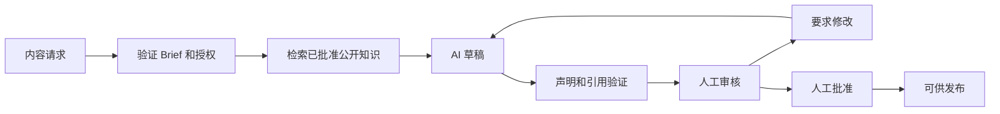
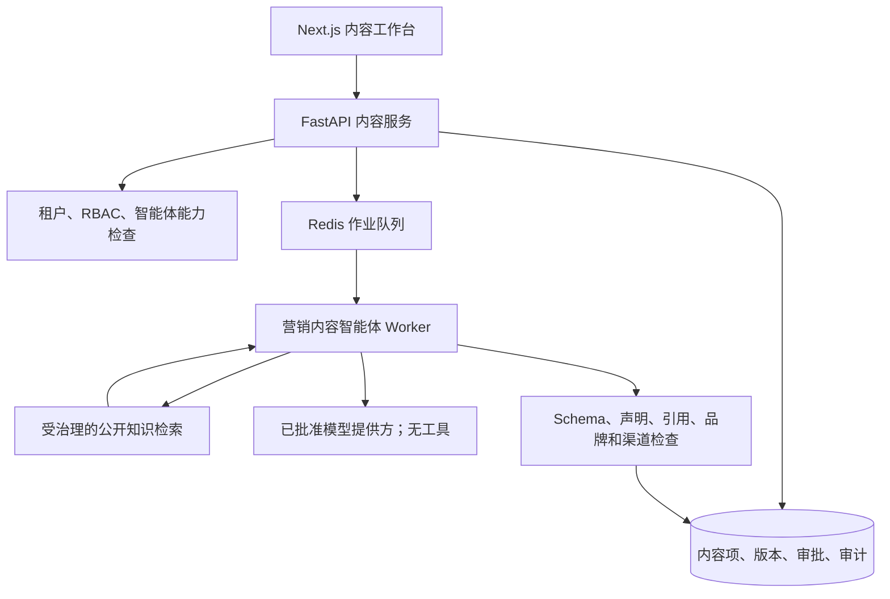

# 受治理的营销内容智能体设计

**状态：** Phase 3.2 设计基线；开发环境已实现生成和确定性评估，生产激活保持 pending
**主要工程基线：** 英文  
**审核译本：** `marketing-content-agent-design.zh-CN.md`

## 1. 目的

受治理的营销内容智能体帮助 Sari Arta 使用已批准的公开知识创建高质量 B2B 营销草稿。它把经过验证的公司能力、服务、产品类别和案例证据转化为适合不同渠道的内容，同时保留人工编辑和发布控制。

该智能体不是通用聊天机器人、自主发布工具、报价工具或商业承诺来源。只有人工审核并批准准确版本后，输出才不再只是草稿。

业务目标：

- 减少准备一致 B2B 内容所需的时间。
- 提高内容对机构和工业项目受众的相关性。
- 复用带有可追溯引用的已批准公开知识。
- 防止虚构案例、参数、价格、认证或交付声明。
- 在不绕过品牌治理的情况下生成可审核的多语言材料。

## 2. 目标受众

| 受众 | 典型需求 | 适合主题 |
|---|---|---|
| 印度尼西亚学校 | 安全、易维护的供餐生产和集中用餐时段 | 流程规划、产能发现、卫生分区、本地安装 |
| 医院 | 可靠的机构餐饮服务和运营分离 | 生产流程、洗涤流程、分阶段改造、调试支持 |
| 工厂和企业食堂 | 面向换班高峰的大批量供餐 | 产能规划、耐用设备类别、交付协调 |
| 中央厨房项目 | 协调生产、包装、储存和配送 | 端到端流程、制造协调、物流、安装 |
| 项目业主和设施经理 | 清晰的范围、风险、时间和责任 | 项目发现、现场准备、工程流程、售后规划 |

内容请求必须指定一个主要受众。智能体可以提示缺失的受众信息，但不能推断私有客户画像。

## 3. 知识访问边界

### 3.1 允许的知识

- 已批准的公开公司信息。
- 已批准且明确公开的案例。
- 已批准的公开产品类别和产品信息。
- 已批准的公开服务信息。
- 已批准的品牌语气、术语、视觉文案和声明指南。
- 已批准的公开联系和项目咨询 CTA。

### 3.2 禁止的知识

- 内部价格、折扣、利润、报价或商业条款。
- 供应商身份、合同、成本结构或私有制造信息。
- 私有客户数据、CRM 记录、消息、线索、商机或项目文件。
- 内部 SOP、工程作业说明、安全程序或仅员工可见政策。
- 未发布案例、保密项目引用、内部绩效数据或无依据认证。

### 3.3 强制执行模型

该智能体必须使用专用 `public_marketing_content` 能力以及明确的同智能体知识绑定。检索继续默认拒绝，并且只在租户、角色、智能体和能力授权完成后发生。

合格的知识版本必须满足：

```text
同租户
+ 同领域
+ 明确绑定营销内容智能体
+ 分类为可用于公开营销
+ 已批准
+ 已发布
+ 已启用
+ 已成功处理
+ 语言合格
+ 高于检索证据阈值
```

现有内部知识助手绑定并不充分。实施前，知识治理必须提供明确的公开营销可见性分类，或专用的已批准公开集合政策。缺少分类时返回 `insufficient_evidence`，不能回退到内部知识。

每项来自企业知识的事实声明都必须保留一个或多个准确引用。只有在不引入任何业务事实声明时，一般创意语言才可以不引用。

## 4. 内容类型

| 内容类型 | 必需结构 | 治理说明 |
|---|---|---|
| 网站文章 | 标题、摘要、章节、正文、CTA、SEO 标题、描述、关键词 | 所有能力、案例和技术声明必须引用 |
| 案例 | 背景、挑战、已批准范围、交付方式、结果、CTA | 只能使用已批准公开案例；不得虚构结果或客户身份 |
| TikTok 脚本 | Hook、镜头、旁白、屏幕文字、CTA、时长建议 | 仅草稿；不得生成客户影像或无依据演示 |
| Instagram Reel 脚本 | Hook、镜头清单、字幕、旁白、CTA、Hashtag | 需要品牌和声明审核 |
| Facebook 帖子 | 开场文案、正文、CTA、可选创意说明 | 不自动发布或选择受众 |
| 邮件草稿 | 主题、预览文本、正文、CTA、合规页脚占位 | 仅草稿；不从 CRM 选择收件人、个性化或发送 |

Phase 3.2 初期应支持英文和简体中文。Bahasa Indonesia 只有在具备已批准术语集、本地化品牌指南和评估案例后才能启用。

## 5. 内容请求和输出合同

### 5.1 请求

- 内容类型和目标渠道。
- 主要受众和行业。
- 语言。
- 业务目标和主题。
- 期望 CTA。
- 可选 Campaign 名称以及长度/语气限制。
- 可选已批准知识集合或公开案例 ID。

调用者不能提交系统 Prompt、模型名称、任意工具、不受限 URL、原始 CRM 数据或私有文档 ID。

### 5.2 结构化草稿

- 标题或 Hook。
- 渠道专用正文。
- CTA。
- 相关 SEO 或渠道元数据。
- 映射到引用的事实声明。
- 证据状态：`sufficient`、`insufficient` 或 `conflicting`。
- 缺失信息和审核警告。
- 语言、智能体版本、模型/提供方和安全运行元数据。

如果证据不足或冲突，运行可以返回带有说明的部分提纲，但不能把内容标记为可以审核。

## 6. 工作流



推荐生命周期：

```text
requested
→ generating
→ draft
→ in_review
→ changes_requested | approved
→ publishing_ready
→ archived
```

`scheduled` 和 `published` 保留给未来受控发布集成。Phase 3.2 不发送、排期或发布内容。

生成运行采用异步方式。提供方失败时请求必须可以恢复，并且不能删除以前已批准的版本。AI 不可用时，用户仍可以创建或编辑人工草稿。

## 7. 内容治理

### 7.1 归属和职责分离

- **创建者：** 创建 Brief 或人工草稿。
- **AI 运行发起人：** 请求生成，并继续对 Brief 负责。
- **审核人：** 检查准确性、受众适配、引用、语气和合规。
- **批准人：** 批准可以进入发布准备的准确不可变版本。
- **发布人：** 未来独立权限；不包括在 Phase 3.2 内。

默认情况下，创建者不能批准自己创建的 AI 版本。租户政策可以要求技术声明由独立技术审核人确认，或要求具名案例由经理审核。

### 7.2 版本历史

- 每次 AI 生成或实质编辑都创建不可变内容版本。
- 内容项指向 `current_version_id` 和 `approved_version_id`。
- 审批记录准确版本 ID 和内容校验和。
- 编辑已批准文本会创建后继版本，并使发布准备状态失效，直至重新批准。
- 回滚通过基于旧版本创建新的后继版本完成；历史永不覆盖。

### 7.3 审批状态

| 状态 | 含义 |
|---|---|
| `draft` | 可以编辑且尚未批准 |
| `in_review` | 准确版本已提交人工审核 |
| `changes_requested` | 审核人返回可执行修改意见 |
| `approved` | 准确版本和引用已批准 |
| `publishing_ready` | 已批准版本通过确定性渠道和政策检查 |
| `archived` | 不再用于新的发布活动 |

### 7.4 审计日志

审计事件必须记录创建者、发起人、审核人、批准人、时间戳、租户、智能体/版本、内容项/版本、动作、结果、Correlation ID 和安全的变更前后元数据。必需动作包括请求、生成、人工编辑、提交审核、要求修改、批准、拒绝、发布准备检查、归档、恢复和未来发布事件。

审计日志不得保存模型隐藏推理或不必要的来源原文。

## 8. 角色和权限

| 权限 | 用途 |
|---|---|
| `content:create` | 创建 Brief 或人工内容项 |
| `content:generate` | 启动已批准的营销内容智能体运行 |
| `content:edit` | 创建后继内容版本 |
| `content:submit_review` | 提交准确版本审核 |
| `content:review` | 要求修改或建议批准 |
| `content:approve` | 批准准确版本和校验和 |
| `content:publish_ready` | 执行确定性发布准备检查 |
| `content:archive` | 归档或恢复内容 |
| `content:audit_read` | 查看内容历史和治理事件 |
| `content:publish` | 未来外部发布权限；Phase 3.2 不启用 |

Tenant Admin 获得管理权限。营销人员可以创建、生成、编辑和提交。审核和批准权限应独立分配。销售用户和 Viewer 只能获得明确授予的读取权限。

## 9. 建议架构



FastAPI 应用服务负责生命周期转换和事务。智能体不获得数据库、CRM、发布、邮件、WhatsApp、Shell、任意 HTTP 或密钥读取工具。模型调用发生在数据库事务之外。

未来实现可以采用数据库架构中已经描述的长期 `content_items` 和 `content_versions` 设计，但每项 Schema 和 API 变更都需要独立的实现审核和迁移。

## 10. 集成边界

### 公开项目咨询智能体

未来聚合和匿名化的询盘主题可以辅助内容规划。原始访客对话、联系方式或单条线索记录不得进入营销 Prompt。公开对话不会自动创建内容请求。

### CRM

Phase 3.2 不读取客户记录，也不写入 CRM 活动。未来 Campaign Attribution 可以把已批准内容/Campaign 标识符连接到新线索来源元数据，同时不向内容模型暴露线索数据。

### 知识助手

两个功能可以复用受治理检索服务，但必须使用不同的智能体身份、能力、绑定、知识可见性和评估套件。营销内容智能体不能继承内部助手的访问权。

### WhatsApp 和邮件

内容保持为草稿。未来发送服务只能接收准确的 `publishing_ready` 内容版本、有效审批校验和、授权/政策结果和幂等键。生成智能体永远不发送消息。

### n8n

n8n 未来可以通过受限服务 API 编排排期或通知。它不能批准内容、直接修改生命周期状态、查询生产表或选择任意内容版本。

## 11. 安全和防护

- 在应用服务和 PostgreSQL RLS 中强制租户隔离。
- 应用 RBAC、对象级授权和 Agent Registry 能力检查。
- 在检索、嵌入、排队或模型调用前授权。
- 按照明确公开营销可见性和同智能体绑定过滤检索。
- 将 Brief、检索文本和模型输出视为不可信内容。
- 强制执行长度、语言、Schema、声明、引用、禁止主题和渠道政策验证。
- 阻止无依据的价格、参数、认证、客户结果、质保、交期和对比声明。
- 最小化发送给外部提供方的数据，不在 Prompt 中包含私有 CRM/客户信息。
- 记录安全运行元数据、耗时、结果、提供方、Token/成本估算和 Correlation ID，但不记录敏感内容。
- 使用有限时间、输出、重试和取消限制。
- 每次实质修改后都必须重新批准。

## 12. 评估和验收标准

合成评估案例应覆盖每种内容类型、受众和支持语言，包括证据不足、公开来源冲突、私有数据请求、价格/参数请求、要求虚构案例、提示注入、跨租户访问和跨智能体绑定拒绝。

最低指标：

- 有依据事实声明准确率。
- 引用正确率和完整率。
- 无依据声明拒绝率。
- 公开/私有知识边界执行。
- 品牌术语和渠道格式合规。
- 双语语义一致性。
- 跨租户和跨智能体拒绝。
- 草稿生成延迟和失败恢复。

只有当授权用户可以创建 Brief、生成带引用草稿、要求修改、批准准确版本并将其标记为可供发布，同时不发生任何外部发布或 CRM 修改时，Phase 3.2 才通过验收。

## 13. 未来路线图

- 术语和质量批准后的 Bahasa Indonesia 生成。
- Phase 3.2.4 只能把以明确公开知识为依据、经过人工批准的准确版本，转化为搜索可见的解决方案、行业、项目/案例、指南、FAQ 和业务问题页面。搜索可见性不会授予生成智能体发布权限。
- 通过独立渠道服务执行受控社交媒体排期和发布。
- 具有授权和模板控制的已批准邮件与 WhatsApp 发送。
- Campaign 日历、可复用内容模板和素材治理。
- Campaign 绩效接入和经人工审核的优化建议。
- 使用 Campaign/内容标识符进行线索归因，不向模型暴露私有线索数据。
- A/B 草稿变体，每个发布版本都需要明确审批。

任何未来集成都不得让生成智能体把草稿批准自动转变为自主发布。

## 14. 文档维护

当 Phase 3.2 实现改变已批准的架构、生命周期、权限、知识边界、API 合同或评估要求时，必须同步更新本设计文档对。`PROJECT_CONTEXT` 不因这次仅设计里程碑而更新。`CHANGELOG` 只有在能力实现并验证后才更新。
