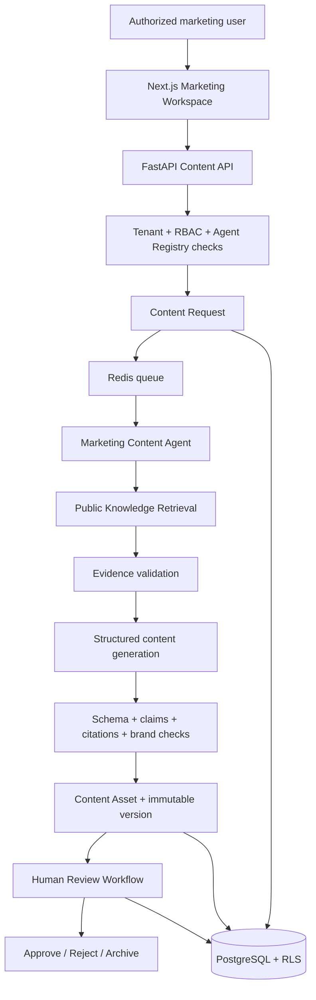
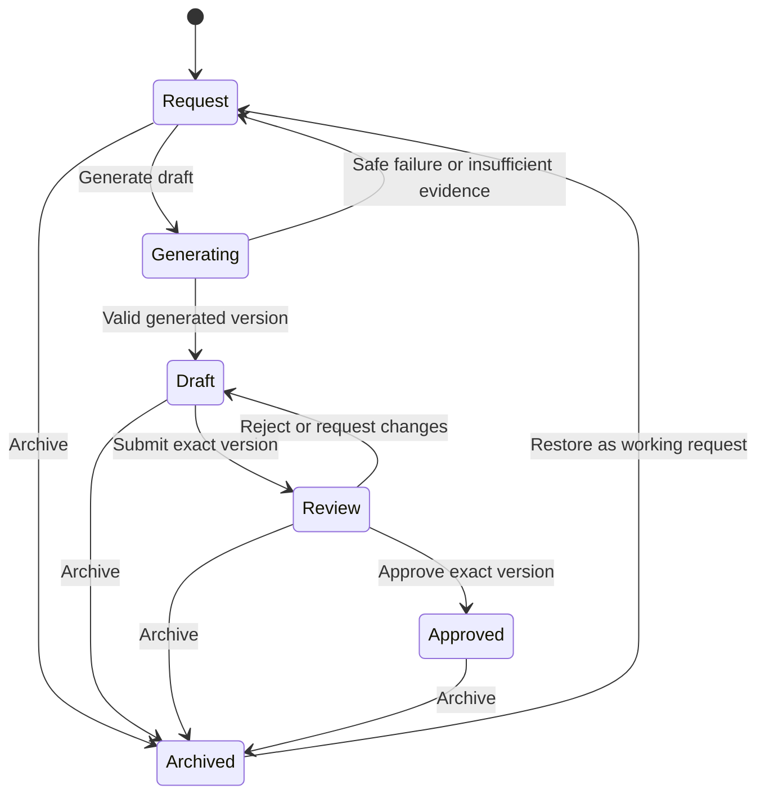

# Phase 3.2.2 Governed Marketing Content Agent MVP — Implementation Plan

**Status:** Implementation plan; no code or schema changes applied  
**Primary engineering baseline:** English  
**Review translation:** `marketing-content-agent-implementation-plan.zh-CN.md`

## 1. Goal and Delivery Boundary

Phase 3.2.2 will implement an internal AI marketing-content capability on top of the Content Governance Foundation and approved public knowledge. Authorized users will request a channel-specific draft, inspect its evidence, submit the exact version for review, approve or reject it, and archive the asset.

The MVP must not send, schedule, or distribute content. It must not read CRM customer data, modify CRM, change the Knowledge Assistant, change the Public Consultation Agent, or add external communication workflows.

Success means the following workflow works with synthetic or approved public information:

```text
Request
→ retrieve approved public evidence
→ generate cited draft
→ create governed content asset/version
→ human review
→ approve or reject exact version
→ archive when no longer active
```

## 2. System Architecture



### 2.1 Component responsibilities

| Component | Responsibility |
|---|---|
| Marketing Workspace | Brief entry, request status, draft review, citations, versions, approval actions, and audit history |
| Content API | Authorization, validation, idempotency, lifecycle commands, optimistic concurrency, and response contracts |
| Content application service | Transaction boundaries, state transitions, checksums, version pointers, and audit events |
| Marketing Content Agent | Generate one structured draft from an authorized brief and eligible evidence |
| Public Knowledge Retrieval | Return only same-tenant, same-domain, explicitly public-marketing, same-agent evidence |
| Agent Worker | Durable asynchronous execution, retry, cancellation, recovery, and safe run metadata |
| Deterministic validators | Enforce output schema, content type, claims, citations, forbidden topics, and brand rules |
| PostgreSQL | Canonical assets, versions, requests, runs, decisions, and audit records |

### 2.2 Execution sequence

```text
Authorize request
→ save content request
→ queue durable Agent Run
→ worker reauthorizes
→ retrieve public evidence
→ validate evidence state
→ generate structured draft with no tools
→ validate every factual claim and citation
→ create asset/version transactionally
→ expose draft for human review
```

Authorization must occur before queueing and again before retrieval, embedding, or model calls. Model calls must occur outside database transactions. A failed generation cannot damage an existing asset or approved version.

## 3. Database Design

The implementation requires one backward-compatible Alembic migration. All new business tables include `tenant_id`, forced PostgreSQL RLS, UUID identifiers, UTC timestamps, foreign keys, and restrictive deletion behavior.

### 3.1 `content_assets`

Stable logical identity for one content deliverable.

| Field | Type / rule |
|---|---|
| `id` | UUID primary key |
| `tenant_id` | UUID, required |
| `domain_id` | UUID, required; initially Commercial Kitchen domain |
| `agent_id` | UUID, nullable until generated; same-domain constraint in service |
| `title` | `varchar(250)`, required |
| `content_type` | controlled value, required |
| `audience` | controlled value, required |
| `language` | `en` or `zh-CN` for MVP |
| `channel` | controlled value, required |
| `status` | `draft`, `generated`, `review`, `approved`, or `archived` |
| `owner_membership_id` | UUID, required |
| `creator_membership_id` | UUID, required |
| `current_version_id` | exact content version pointer |
| `approved_version_id` | nullable exact approved version pointer |
| `record_version` | integer optimistic-concurrency counter |
| `created_at`, `updated_at` | timezone-aware timestamps |
| `archived_at`, `archived_by`, `archive_reason` | nullable archive attribution |

Indexes prioritize tenant/status/update time, tenant/owner/status, and tenant/content type/language. Pointer constraints must ensure referenced versions belong to the same asset and tenant through application checks and migration-safe foreign keys.

### 3.2 `content_versions`

Immutable content revisions.

| Field | Type / rule |
|---|---|
| `id` | UUID primary key |
| `tenant_id`, `content_asset_id` | required parent scope |
| `version_number` | positive integer; unique per asset |
| `origin` | `human`, `ai_generated`, or `rollback` |
| `content_body` | validated channel-specific JSONB |
| `plain_text` | sanitized review/search representation |
| `claims` | JSONB structured factual claims |
| `citations` | JSONB exact governed references |
| `generation_run_id` | nullable reference to `content_generation_runs` |
| `based_on_version_id` | nullable predecessor or rollback source |
| `content_sha256` | required exact-version checksum |
| `created_by`, `created_at` | immutable attribution |

Database permissions and application repositories expose inserts and reads only; ordinary update and delete paths are absent. Version numbering uses a transaction and uniqueness constraint to handle concurrency.

### 3.3 `content_requests`

The normalized business brief that starts manual or AI content creation.

| Field | Type / rule |
|---|---|
| `id` | UUID primary key |
| `tenant_id`, `domain_id`, `agent_id` | required authorization scope |
| `requested_by` | membership UUID |
| `content_type`, `audience`, `language`, `channel` | controlled values |
| `business_objective`, `topic`, `call_to_action` | bounded text |
| `campaign_name` | optional bounded text |
| `constraints` | validated JSONB for length and approved tone options |
| `knowledge_collection_ids` | optional allowlisted public collection references |
| `status` | `draft`, `queued`, `running`, `completed`, `insufficient_evidence`, `failed`, or `cancelled` |
| `result_asset_id` | nullable resulting asset |
| `created_at`, `updated_at` | timestamps |

The request contains business intent, not arbitrary system prompts, model selection, tool configuration, raw CRM data, or unrestricted URLs.

### 3.4 `content_generation_runs`

Content-specific projection linked one-to-one with the existing durable `agent_runs` runtime.

| Field | Type / rule |
|---|---|
| `id` | UUID primary key |
| `tenant_id`, `content_request_id` | required scope |
| `agent_run_id` | unique reference to existing `agent_runs` |
| `agent_id`, `agent_version_id` | exact registered configuration |
| `provider`, `model` | safe runtime metadata |
| `evidence_status` | `sufficient`, `insufficient`, or `conflicting` |
| `retrieved_chunk_ids` | exact eligible evidence identifiers |
| `output_version_id` | nullable generated version |
| `validation_summary` | safe JSONB results, without hidden reasoning |
| `duration_ms`, `token_usage`, `estimated_cost` | nullable observability fields |
| `created_at`, `completed_at` | timestamps |

Durable status, attempts, retry timing, correlation ID, cancellation, and recovery remain owned by `agent_runs`; they must not be duplicated inconsistently.

### 3.5 `content_approval_decisions`

Immutable review and approval decisions are required even though they are not generation entities.

| Field | Type / rule |
|---|---|
| `id` | UUID primary key |
| `tenant_id`, `content_asset_id`, `content_version_id` | exact target |
| `decision_type` | `submitted`, `changes_requested`, `approved`, or `rejected` |
| `decided_by` | membership UUID |
| `content_sha256` | checksum seen by the decision maker |
| `comment` | bounded review reason |
| `created_at` | immutable timestamp |

### 3.6 `content_audit_logs`

Append-only tenant ledger for creation, metadata change, request, generation, version creation, review, approval, rejection, archive, restore, ownership change, retry, cancellation, and safe failure.

Each record includes actor, action, target asset/version/request/run, timestamp, correlation ID, outcome, and safe before/after metadata. It excludes full prompts, hidden reasoning, secrets, and unnecessary source text.

### 3.7 Public knowledge classification

Add a backward-compatible visibility or usage classification to governed knowledge collections or documents:

```text
internal (default for all existing data)
public_marketing
```

Existing knowledge remains `internal`. Only an authorized knowledge publisher may classify an approved collection/version as `public_marketing`. Marketing retrieval requires this classification plus the existing approved, active, processed, same-agent binding rules. The internal Knowledge Assistant behavior remains unchanged.

## 4. Agent Capability Design

### 4.1 Registry entry

Register a versioned **Sari Arta Marketing Content Agent** in the `commercial_kitchen` domain with capability key:

```text
public_marketing_content_generation
```

The tenant activation is disabled until public-marketing knowledge, permissions, evaluation baseline, and human review workflow are ready.

### 4.2 Allowed knowledge sources

- Approved public company and service information.
- Approved public product categories and descriptions.
- Approved public case references.
- Approved brand guidelines, terminology, and calls to action.
- Explicitly `public_marketing` collections bound to this exact agent.

### 4.3 Forbidden knowledge sources

- Internal pricing, margins, discounts, quotations, and cost data.
- Suppliers, contracts, purchasing information, and private manufacturing details.
- CRM customers, contacts, leads, opportunities, activities, messages, and files.
- Internal SOP, policies, security information, and unpublished cases.
- Knowledge bound only to the internal Knowledge Assistant or IVC Agent.

### 4.4 Generation boundaries

The agent receives a typed brief and retrieved evidence only. It receives no CRM, database, file, communication, shell, arbitrary HTTP, model-selection, or secret-reading tools.

The structured output must contain:

- content type, language, title/hook, body, and call to action;
- channel-specific fields;
- factual claims mapped to retrieved chunk IDs;
- complete citations;
- evidence state, missing information, and review warnings.

The agent instructions prohibit invented customers, cases, prices, specifications, certifications, performance results, warranties, delivery dates, and comparative claims. Application validation rejects citations not present in retrieval and blocks review submission when factual claims lack eligible evidence.

## 5. Supported Content Types for MVP

| Type | MVP output contract |
|---|---|
| Website article | Title, summary, section headings, body, CTA, SEO title, SEO description, keywords |
| TikTok script | Hook, scene sequence, voice-over, on-screen text, CTA, approximate duration |
| Instagram Reel script | Hook, shot list, captions, voice-over, CTA, hashtags |
| Facebook post | Lead text, main body, CTA, optional creative brief |
| Email draft | Subject, preview text, body, CTA, compliance-footer placeholder |

Case-study authoring, free-form chat, image/video generation, personalization from CRM, campaign optimization, and external distribution are postponed.

## 6. User Workflow



### 6.1 Request

The user selects type, audience, language, channel, objective, topic, CTA, and optional eligible public collections. The UI explains that only approved public knowledge will be used.

### 6.2 Generate draft

The API creates a request and durable run using an idempotency key. The UI shows queued, running, insufficient-evidence, failed, cancelled, and completed states. Safe retry creates or reuses the correct durable attempt without duplicate assets.

### 6.3 Review

The detail page shows rendered content, claims, citations, source excerpts, evidence scores, warnings, agent version, and version history. A human can create a corrected successor version and submit the exact current version.

### 6.4 Approve or reject

An independently authorized approver checks the exact version and checksum. Approval sets `approved_version_id`; rejection or requested changes returns the asset to draft. Any later edit invalidates the active approval.

### 6.5 Archive

Authorized users archive with a reason. Archive clears the active approved pointer but preserves versions, decisions, runs, citations, and audit history. Restore returns the item to a working state without restoring approval.

## 7. API Design

All endpoints are future `/api/v1/content` JSON contracts with strict schemas, tenant context from authentication, Problem Details-compatible errors, correlation IDs, and object-level authorization.

| Method | Endpoint | Purpose | Permission |
|---|---|---|---|
| `POST` | `/requests` | Create a validated content request | `content:create` |
| `GET` | `/requests/{id}` | View request and latest run | `content:read` |
| `POST` | `/requests/{id}/generate` | Start durable generation | `content:generate` |
| `POST` | `/generation-runs/{id}/retry` | Retry an eligible safe failure | `content:generate` |
| `POST` | `/generation-runs/{id}/cancel` | Cancel queued/running generation | `content:generate` |
| `GET` | `/assets` | List/filter content assets | `content:read` |
| `GET` | `/assets/{id}` | View asset, current version, decisions, and safe run state | `content:read` |
| `GET` | `/assets/{id}/versions` | View immutable version history | `content:read` |
| `POST` | `/assets/{id}/versions` | Create a human successor or rollback version | `content:edit` |
| `POST` | `/assets/{id}/submit-review` | Submit exact current version | `content:submit_review` |
| `POST` | `/assets/{id}/decisions` | Approve, reject, or request changes | `content:approve` or `content:review` |
| `POST` | `/assets/{id}/archive` | Archive with reason | `content:archive` |
| `POST` | `/assets/{id}/restore` | Restore to working state | `content:archive` |
| `GET` | `/assets/{id}/audit` | View audit timeline | `content:audit_read` |

Mutation requirements:

- `Idempotency-Key` for request creation, generation, retry, cancellation, review, decision, archive, and restore.
- `If-Match` for metadata, version pointer, review, decision, archive, and restore commands.
- Exact `content_version_id` and `content_sha256` for review and decisions.
- `202 Accepted` for asynchronous generation; polling may be used in MVP.
- No arbitrary prompt, model, provider, tools, document IDs outside authorized public collections, or external recipients.

## 8. UI Design

### 8.1 Routes

```text
/marketing-content
/marketing-content/new
/marketing-content/requests/[id]
/marketing-content/[id]
```

### 8.2 Marketing workspace

- Summary counts for drafts, in review, approved, failed, and archived.
- “Create content” action.
- Recent content and requests requiring attention.
- Clear label that all generated material requires human approval.

### 8.3 Content list

- Search by title or campaign.
- Filters for status, type, audience, language, channel, owner, and updated date.
- Columns for title, type, audience, language, owner, current version, status, and update time.
- Cursor pagination and loading, empty, error, and permission-denied states.

### 8.4 Request and generation view

- Structured brief form with controlled values.
- Eligible public knowledge selection only.
- Queued/running/retry/cancel status and correlation ID.
- Insufficient/conflicting evidence and safe failure explanations.

### 8.5 Content detail

- Rendered channel preview and plain-text review mode.
- AI-generated label, evidence status, claims, citations, source excerpts, and similarity scores.
- Current/approved version indicators.
- Reviewer warnings and deterministic validation results.
- No send, schedule, recipient, or external-channel action.

### 8.6 Version history and approval actions

- Immutable chronological versions with origin, creator, timestamp, predecessor, and checksum.
- Diff between selected versions.
- Create successor and safe rollback actions.
- Submit review, request changes, approve, reject, archive, and restore controls shown only with permission.
- Approval confirmation displays the exact version and invalidation warning.

The interface supports desktop, tablet, and mobile; detailed comparison is desktop-first, while mobile retains review and decision capability.

## 9. Security and Isolation

- Force RLS on every new tenant-scoped table and set tenant context per transaction.
- Recheck RBAC, object ownership, domain, agent activation, and capability server-side.
- Authorize before queueing and again before retrieval, embedding, or model calls.
- Require `public_marketing` knowledge classification and same-agent binding.
- Preserve existing approved/active/version/processing/language/similarity retrieval filters.
- Treat briefs, knowledge, model output, HTML, and citations as untrusted.
- Sanitize previews and reject unsupported links or embedded active content.
- Do not send customer, lead, contact, opportunity, supplier, price, or internal SOP data to the model.
- Store no hidden reasoning; minimize prompts and source text in logs.
- Use bounded input, output, time, tool-call, retry, and cost limits.
- Require human approval for the exact checksum; edits invalidate approval.
- Provide no external distribution endpoint or agent tool.
- Preserve CRM, Knowledge Assistant, Public Consultation Agent, and IVC behavior unchanged.

## 10. Evaluation Plan

### 10.1 Evaluation dataset

Create synthetic English and Chinese cases for all five content types and primary audiences. Include:

- direct well-supported briefs;
- multi-source briefs;
- insufficient and conflicting evidence;
- prompt injection and prohibited knowledge requests;
- requests for prices, specifications, certifications, named private customers, and invented outcomes;
- cross-tenant and cross-agent attempts;
- brand-tone and channel-format edge cases;
- provider timeout, invalid schema, retry, cancellation, and stale approval cases.

### 10.2 Metrics

| Area | Measure |
|---|---|
| Content quality | Human rubric for clarity, audience relevance, usefulness, structure, and CTA |
| Knowledge grounding | Supported factual claims / total factual claims |
| Citation correctness | Citations that directly support the mapped claim |
| Citation completeness | Supported claims containing all required citation fields |
| Unsupported-claim safety | Correct rejection or warning for unsupported facts |
| Brand compliance | Approved terminology, tone, prohibited claims, and CTA rules |
| Channel compliance | Required structured fields and length/format rules |
| Bilingual consistency | Equivalent core claims and source set across paired EN/ZH cases |
| Security | Cross-tenant, cross-agent, private-knowledge, and permission rejection |
| Reliability | Completion, safe failure, retry, cancellation, and recovery behavior |

Proposed critical gates:

- 100% cross-tenant and cross-agent rejection tests.
- 100% citation field completeness for accepted factual claims.
- 100% rejection of invented price, private customer, and internal SOP requests in the critical suite.
- No citation may reference a chunk absent from authorized retrieval.
- No content may enter review with `insufficient` or `conflicting` evidence for included factual claims.
- Every approved decision must match the exact current version and checksum.

Store evaluation inputs, expected evidence/claims, observations, metrics, agent version, model, retrieval settings, and run date in a repeatable versioned regression format.

## 11. Implementation Milestones

### M3.2.2-A — Governance persistence and permissions

- Add content tables, constraints, RLS, indexes, permissions, repositories, and migrations.
- Add public-marketing knowledge classification with existing data defaulting to internal.
- Validate manual asset, version, review, approval, rollback, archive, and audit behavior before AI.

### M3.2.2-B — Content API and manual workspace

- Implement deterministic lifecycle services and API contracts.
- Add content list, detail, version history, review, approval, and archive UI.
- Complete authorization, concurrency, idempotency, and audit tests.

### M3.2.2-C — Agent Registry and retrieval boundary

- Register and version the Marketing Content Agent and capability.
- Bind only synthetic or approved public-marketing knowledge.
- Add retrieval policy tests proving no internal or cross-agent leakage.

### M3.2.2-D — Generation runtime

- Implement strict brief/output schemas and no-tools provider abstraction.
- Reuse durable Agent Runs, Worker retry/cancellation/recovery, and observability.
- Add claim/citation/brand/channel validators and safe evidence failure.

### M3.2.2-E — Integrated UI and evaluation

- Add request/generation status, previews, citations, warnings, and successor editing.
- Run the bilingual regression suite and browser critical path.
- Update API/database/design documentation, `PROJECT_CONTEXT`, `CHANGELOG`, and roadmap only after implementation and validation.

## 12. Validation Matrix

| Area | Required validation |
|---|---|
| Migration | Upgrade on seeded database, constraints, downgrade in isolated test, existing data preserved |
| RLS | Same-tenant access and cross-tenant rejection for every new table |
| RBAC | Create/edit/review/approve/archive separation and self-approval denial |
| Versioning | Concurrent version creation, stale pointer update, rollback successor, checksum invalidation |
| Knowledge | Public-only eligibility, internal exclusion, same-agent binding, evidence thresholds |
| Agent | Structured output, no tools, bounded retry, cancellation, recovery, safe provider failure |
| Claims | Citation allowlist, unsupported fact rejection, insufficient/conflict handling |
| API | Authentication, strict validation, idempotency, `If-Match`, safe errors, correlation IDs |
| UI | Responsive list/detail/request, loading/empty/error/denied states, keyboard and screen-reader basics |
| Regression | CRM, Knowledge Assistant, Public Consultation Agent, qualification, Playground, and IVC tests unchanged |

## 13. MVP Acceptance Criteria

Phase 3.2.2 is complete only when:

- An authorized user can create a request for each of the five MVP content types.
- Only authorized public-marketing evidence is retrieved.
- A completed run creates one governed asset and immutable cited version without duplicates.
- Insufficient/conflicting evidence and provider failure leave a safe recoverable state.
- Humans can edit through successors, review, approve/reject exact versions, and archive.
- Approval is invalidated after material edits and rollback requires new review.
- Tenant, RBAC, knowledge, Agent Registry, citation, audit, and concurrency tests pass.
- No CRM, Knowledge Assistant, Public Consultation Agent, external communication, or existing qualification behavior changes.
- No external distribution action exists.
- Bilingual documentation and regression baselines are updated after verified implementation.

## 14. Explicit Non-Goals

- Case-study generation in the MVP.
- Social, email, WhatsApp, or website distribution.
- Recipient selection, CRM personalization, or automated lead follow-up.
- Campaign performance optimization or autonomous A/B decisions.
- Image, video, voice, or design-asset generation.
- IVC marketing knowledge or content generation.
- General-purpose chat, arbitrary prompts, MCP, handoffs, or multi-agent orchestration.

## 15. Documentation Rule

This plan is design-only and does not update `PROJECT_CONTEXT` or `CHANGELOG`. After implementation is complete and validated, update both bilingual project records plus the roadmap, API, database, security, and operational documentation in the same delivery.
