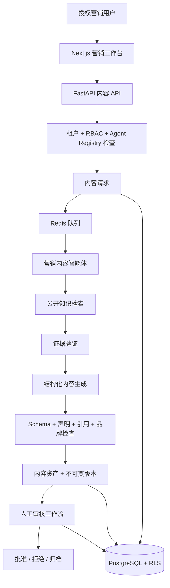
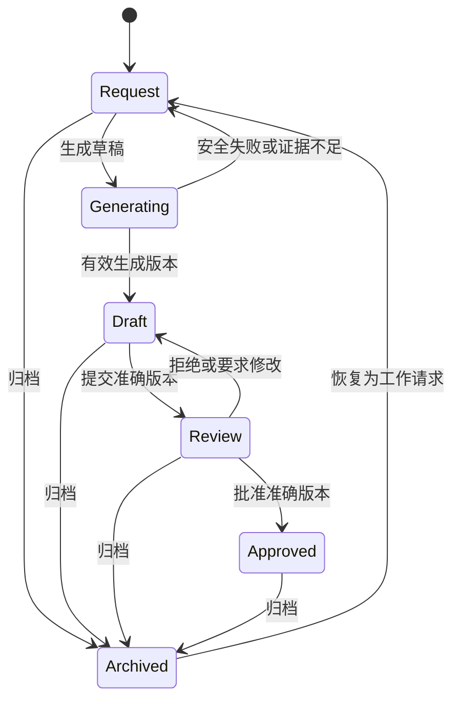

# Phase 3.2.2 受治理营销内容智能体 MVP — 实施计划

**状态：** 实施计划；治理持久化、人工工作台、Agent Registry 身份和公开营销知识策略已实现；生成尚未实现
**主要工程基线：** 英文  
**审核译本：** `marketing-content-agent-implementation-plan.zh-CN.md`

## 1. 目标和交付边界

Phase 3.2.2 将在内容治理基础和已批准公开知识之上，实现内部 AI 营销内容能力。授权用户可以请求渠道专用草稿、检查证据、提交准确版本审核、批准或拒绝，并归档资产。

MVP 不得发送、排期或分发内容。不得读取 CRM 客户数据、修改 CRM、改变知识助手、改变公开项目咨询智能体或增加外部沟通工作流。

成功意味着以下流程可以使用合成或已批准公开信息运行：

```text
请求
→ 检索已批准公开证据
→ 生成带引用草稿
→ 创建受治理内容资产/版本
→ 人工审核
→ 批准或拒绝准确版本
→ 不再使用时归档
```

## 2. 系统架构



### 2.1 组件职责

| 组件 | 职责 |
|---|---|
| 营销工作台 | Brief 输入、请求状态、草稿审核、引用、版本、审批动作和审计历史 |
| 内容 API | 授权、验证、幂等、生命周期命令、乐观并发和响应合同 |
| 内容应用服务 | 事务边界、状态转换、校验和、版本指针和审计事件 |
| 营销内容智能体 | 根据授权 Brief 和合格证据生成一个结构化草稿 |
| 公开知识检索 | 只返回同租户、同领域、明确公开营销、同智能体证据 |
| Agent Worker | 持久异步执行、重试、取消、恢复和安全运行元数据 |
| 确定性验证器 | 强制执行输出 Schema、内容类型、声明、引用、禁止主题和品牌规则 |
| PostgreSQL | 正式资产、版本、请求、运行、决定和审计记录 |

### 2.2 执行顺序

```text
授权请求
→ 保存内容请求
→ 将持久 Agent Run 放入队列
→ Worker 重新授权
→ 检索公开证据
→ 验证证据状态
→ 使用无工具模型生成结构化草稿
→ 验证每项事实声明和引用
→ 在事务中创建资产/版本
→ 向人工开放草稿审核
```

授权必须在排队前发生，并且在检索、嵌入或模型调用前再次执行。模型调用必须发生在数据库事务之外。生成失败不能损坏任何现有资产或已批准版本。

## 3. 数据库设计

实现需要一个向后兼容的 Alembic Migration。所有新业务表都包含 `tenant_id`、强制 PostgreSQL RLS、UUID 标识符、UTC 时间戳、外键和限制性删除行为。

### 3.1 `content_assets`

一个内容交付物的稳定逻辑身份。

| 字段 | 类型 / 规则 |
|---|---|
| `id` | UUID 主键 |
| `tenant_id` | UUID，必需 |
| `domain_id` | UUID，必需；初始为商用厨房领域 |
| `agent_id` | UUID，生成前可为空；应用服务检查同领域 |
| `title` | `varchar(250)`，必需 |
| `content_type` | 受控值，必需 |
| `audience` | 受控值，必需 |
| `language` | MVP 为 `en` 或 `zh-CN` |
| `channel` | 受控值，必需 |
| `status` | `draft`、`generated`、`review`、`approved` 或 `archived` |
| `owner_membership_id` | UUID，必需 |
| `creator_membership_id` | UUID，必需 |
| `current_version_id` | 准确内容版本指针 |
| `approved_version_id` | 可为空的准确已批准版本指针 |
| `record_version` | 整数乐观并发计数器 |
| `created_at`, `updated_at` | 带时区时间戳 |
| `archived_at`, `archived_by`, `archive_reason` | 可为空的归档归属信息 |

索引优先支持租户/状态/更新时间、租户/所有人/状态和租户/内容类型/语言。指针约束必须通过应用检查和迁移安全外键确保被引用版本属于同一资产和租户。

### 3.2 `content_versions`

不可变内容修订版本。

| 字段 | 类型 / 规则 |
|---|---|
| `id` | UUID 主键 |
| `tenant_id`, `content_asset_id` | 必需父级范围 |
| `version_number` | 正整数；资产内唯一 |
| `origin` | `human`、`ai_generated` 或 `rollback` |
| `content_body` | 已验证渠道专用 JSONB |
| `plain_text` | 已清理的审核/搜索表示 |
| `claims` | JSONB 结构化事实声明 |
| `citations` | JSONB 准确受治理引用 |
| `generation_run_id` | 可为空的 `content_generation_runs` 引用 |
| `based_on_version_id` | 可为空的前任版本或回滚来源 |
| `content_sha256` | 必需的准确版本校验和 |
| `created_by`, `created_at` | 不可变归属信息 |

数据库权限和应用 Repository 只提供插入和读取；不存在普通更新和删除路径。版本编号使用事务和唯一约束处理并发。

### 3.3 `content_requests`

启动人工或 AI 内容创建的标准化业务 Brief。

| 字段 | 类型 / 规则 |
|---|---|
| `id` | UUID 主键 |
| `tenant_id`, `domain_id`, `agent_id` | 必需授权范围 |
| `requested_by` | Membership UUID |
| `content_type`, `audience`, `language`, `channel` | 受控值 |
| `business_objective`, `topic`, `call_to_action` | 有长度限制的文本 |
| `campaign_name` | 可选受限文本 |
| `constraints` | 用于长度和已批准语气选项的验证 JSONB |
| `knowledge_collection_ids` | 可选白名单公开集合引用 |
| `status` | `draft`、`queued`、`running`、`completed`、`insufficient_evidence`、`failed` 或 `cancelled` |
| `result_asset_id` | 可为空的结果资产 |
| `created_at`, `updated_at` | 时间戳 |

请求包含业务意图，不包含任意系统 Prompt、模型选择、工具配置、原始 CRM 数据或不受限 URL。

### 3.4 `content_generation_runs`

与现有持久 `agent_runs` 运行时一对一关联的内容专用投影。

| 字段 | 类型 / 规则 |
|---|---|
| `id` | UUID 主键 |
| `tenant_id`, `content_request_id` | 必需范围 |
| `agent_run_id` | 指向现有 `agent_runs` 的唯一引用 |
| `agent_id`, `agent_version_id` | 准确注册配置 |
| `provider`, `model` | 安全运行元数据 |
| `evidence_status` | `sufficient`、`insufficient` 或 `conflicting` |
| `retrieved_chunk_ids` | 准确合格证据标识符 |
| `output_version_id` | 可为空的生成版本 |
| `validation_summary` | 安全 JSONB 结果，不含隐藏推理 |
| `duration_ms`, `token_usage`, `estimated_cost` | 可为空的可观测字段 |
| `created_at`, `completed_at` | 时间戳 |

持久状态、尝试次数、重试时间、Correlation ID、取消和恢复继续由 `agent_runs` 负责；不得不一致地重复保存。

### 3.5 `content_approval_decisions`

尽管不属于生成实体，仍然需要不可变审核和审批决定。

| 字段 | 类型 / 规则 |
|---|---|
| `id` | UUID 主键 |
| `tenant_id`, `content_asset_id`, `content_version_id` | 准确目标 |
| `decision_type` | `submitted`、`changes_requested`、`approved` 或 `rejected` |
| `decided_by` | Membership UUID |
| `content_sha256` | 决定人看到的校验和 |
| `comment` | 有长度限制的审核原因 |
| `created_at` | 不可变时间戳 |

### 3.6 `content_audit_logs`

用于创建、元数据变更、请求、生成、版本创建、审核、批准、拒绝、归档、恢复、所有权变更、重试、取消和安全失败的追加写入租户账本。

每条记录包括操作人、动作、目标资产/版本/请求/运行、时间戳、Correlation ID、结果和安全的变更前后元数据。排除完整 Prompt、隐藏推理、密钥和不必要的来源原文。

### 3.7 公开知识分类

为受治理的知识集合或文档增加向后兼容的可见性或使用分类：

```text
internal（所有现有数据的默认值）
public_marketing
```

现有知识保持 `internal`。只有授权知识发布人员可以把已批准集合/版本分类为 `public_marketing`。营销检索要求该分类以及现有的批准、活动、已处理、同智能体绑定规则。内部知识助手行为保持不变。

## 4. 智能体能力设计

### 4.1 Registry 记录

在 `commercial_kitchen` 领域中注册版本化的 **Sari Arta Marketing Content Agent**，能力 Key 为：

```text
public_marketing_content_generation
```

在公开营销知识、权限、评估基线和人工审核工作流准备完成前，租户启用状态保持关闭。

### 4.2 允许的知识来源

- 已批准的公开公司和服务信息。
- 已批准的公开产品类别和说明。
- 已批准的公开案例引用。
- 已批准的品牌指南、术语和 CTA。
- 明确为 `public_marketing` 并绑定准确智能体的集合。

### 4.3 禁止的知识来源

- 内部价格、利润、折扣、报价和成本数据。
- 供应商、合同、采购信息和私有制造详情。
- CRM 客户、联系人、线索、商机、活动、消息和文件。
- 内部 SOP、政策、安全信息和未发布案例。
- 只绑定内部知识助手或 IVC 智能体的知识。

### 4.4 生成边界

智能体只接收强类型 Brief 和检索证据。它不获得 CRM、数据库、文件、沟通、Shell、任意 HTTP、模型选择或密钥读取工具。

结构化输出必须包含：

- 内容类型、语言、标题/Hook、正文和 CTA；
- 渠道专用字段；
- 映射到检索 Chunk ID 的事实声明；
- 完整引用；
- 证据状态、缺失信息和审核警告。

智能体指令禁止虚构客户、案例、价格、参数、认证、绩效结果、质保、交期和对比声明。应用验证会拒绝检索结果中不存在的引用，并且在事实声明缺少合格证据时阻止提交审核。

## 5. MVP 支持的内容类型

| 类型 | MVP 输出合同 |
|---|---|
| 网站文章 | 标题、摘要、章节标题、正文、CTA、SEO 标题、SEO 描述、关键词 |
| TikTok 脚本 | Hook、镜头顺序、旁白、屏幕文字、CTA、大致时长 |
| Instagram Reel 脚本 | Hook、镜头清单、字幕、旁白、CTA、Hashtag |
| Facebook 帖子 | 开场文字、主要正文、CTA、可选创意说明 |
| 邮件草稿 | 主题、预览文本、正文、CTA、合规页脚占位 |

案例生成、自由聊天、图片/视频生成、CRM 个性化、Campaign 优化和外部分发暂缓。

## 6. 用户工作流



### 6.1 请求

用户选择类型、受众、语言、渠道、目标、主题、CTA 和可选合格公开集合。UI 说明只会使用已批准公开知识。

### 6.2 生成草稿

API 使用幂等键创建请求和持久运行。UI 显示排队、运行、证据不足、失败、取消和完成状态。安全重试会创建或复用正确持久尝试，而不会产生重复资产。

### 6.3 审核

详情页显示渲染内容、声明、引用、来源摘录、证据分数、警告、智能体版本和版本历史。人工可以创建修正后继版本，并提交准确当前版本。

### 6.4 批准或拒绝

独立授权的批准人检查准确版本和校验和。批准设置 `approved_version_id`；拒绝或要求修改会把资产返回草稿。后续任何编辑都会使新的当前版本失去批准资格，同时保留上一个已批准版本指针用于治理对比。

### 6.5 归档

授权用户使用原因归档。归档会保留上一个已批准版本指针、版本、决定、运行、引用和审计历史，但生命周期状态会阻止归档内容被视为获准使用。恢复会把项目返回 `draft`，但不会批准其当前版本。

## 7. API 设计

所有端点都是未来 `/api/v1/content` JSON 合同，使用严格 Schema、从认证获取租户上下文、兼容 Problem Details 的错误、Correlation ID 和对象级授权。

| 方法 | 端点 | 用途 | 权限 |
|---|---|---|---|
| `POST` | `/requests` | 创建已验证内容请求 | `content:create` |
| `GET` | `/requests/{id}` | 查看请求和最新运行 | `content:read` |
| `POST` | `/requests/{id}/generate` | 启动持久生成 | `content:generate` |
| `POST` | `/generation-runs/{id}/retry` | 重试合格安全失败 | `content:generate` |
| `POST` | `/generation-runs/{id}/cancel` | 取消排队/运行生成 | `content:generate` |
| `GET` | `/assets` | 列出/筛选内容资产 | `content:read` |
| `GET` | `/assets/{id}` | 查看资产、当前版本、决定和安全运行状态 | `content:read` |
| `GET` | `/assets/{id}/versions` | 查看不可变版本历史 | `content:read` |
| `POST` | `/assets/{id}/versions` | 创建人工后继或回滚版本 | `content:edit` |
| `POST` | `/assets/{id}/submit-review` | 提交准确当前版本 | `content:submit_review` |
| `POST` | `/assets/{id}/decisions` | 批准、拒绝或要求修改 | `content:approve` 或 `content:review` |
| `POST` | `/assets/{id}/archive` | 使用原因归档 | `content:archive` |
| `POST` | `/assets/{id}/restore` | 恢复为工作状态 | `content:archive` |
| `GET` | `/assets/{id}/audit` | 查看审计时间线 | `content:audit_read` |

修改要求：

- 请求创建、生成、重试、取消、审核、决定、归档和恢复使用 `Idempotency-Key`。
- 元数据、版本指针、审核、决定、归档和恢复命令使用 `If-Match`。
- 审核和决定需要准确 `content_version_id` 和 `content_sha256`。
- 异步生成返回 `202 Accepted`；MVP 可以轮询。
- 不接受任意 Prompt、模型、提供方、工具、授权公开集合之外的文档 ID 或外部收件人。

## 8. UI 设计

### 8.1 路由

```text
/marketing-content
/marketing-content/new
/marketing-content/requests/[id]
/marketing-content/[id]
```

### 8.2 营销工作台

- 草稿、审核中、已批准、失败和已归档摘要数量。
- “创建内容”动作。
- 最近内容和需要处理的请求。
- 明确标记所有生成材料都需要人工批准。

### 8.3 内容列表

- 按标题或 Campaign 搜索。
- 按状态、类型、受众、语言、渠道、所有人和更新时间筛选。
- 标题、类型、受众、语言、所有人、当前版本、状态和更新时间列。
- 游标分页，以及加载、空、错误和权限拒绝状态。

### 8.4 请求和生成界面

- 带有受控值的结构化 Brief 表单。
- 只能选择合格公开知识。
- 排队/运行/重试/取消状态和 Correlation ID。
- 证据不足/冲突和安全失败说明。

### 8.5 内容详情

- 渠道渲染预览和纯文本审核模式。
- AI 生成标签、证据状态、声明、引用、来源摘录和相似度分数。
- 当前/已批准版本标识。
- 审核警告和确定性验证结果。
- 不提供发送、排期、收件人或外部渠道动作。

### 8.6 版本历史和审批动作

- 带来源、创建者、时间戳、前任版本和校验和的不可变时间顺序版本。
- 所选版本之间的 Diff。
- 创建后继和安全回滚动作。
- 只有具备权限时才显示提交审核、要求修改、批准、拒绝、归档和恢复控制。
- 审批确认显示准确版本和失效警告。

界面支持桌面、平板和手机；详细对比以桌面为主，手机仍保留审核和决定能力。

## 9. 安全和隔离

- 在每个新租户范围表上强制 RLS，并在每个事务设置租户上下文。
- 在服务端重新检查 RBAC、对象所有权、领域、智能体启用和能力。
- 在排队前授权，并在检索、嵌入或模型调用前再次授权。
- 要求 `public_marketing` 知识分类和同智能体绑定。
- 保留现有批准/活动/版本/处理/语言/相似度检索过滤。
- 将 Brief、知识、模型输出、HTML 和引用视为不可信。
- 清理预览并拒绝不受支持链接或嵌入活动内容。
- 不向模型发送客户、线索、联系人、商机、供应商、价格或内部 SOP 数据。
- 不保存隐藏推理；最小化日志中的 Prompt 和来源文本。
- 使用有限输入、输出、时间、工具调用、重试和成本限制。
- 准确校验和需要人工审批；编辑会使审批失效。
- 不提供外部分发端点或智能体工具。
- 保持 CRM、知识助手、公开咨询智能体和 IVC 行为不变。

## 10. 评估计划

### 10.1 评估数据集

为所有五种内容类型和主要受众创建合成英文和中文案例，包括：

- 直接且证据充分的 Brief；
- 多来源 Brief；
- 证据不足和冲突；
- 提示注入和禁止知识请求；
- 价格、参数、认证、具名私有客户和虚构结果请求；
- 跨租户和跨智能体尝试；
- 品牌语气和渠道格式边界案例；
- 提供方超时、无效 Schema、重试、取消和过期审批案例。

### 10.2 指标

| 领域 | 指标 |
|---|---|
| 内容质量 | 清晰度、受众相关性、实用性、结构和 CTA 的人工评分 |
| 知识依据 | 有支持事实声明 / 全部事实声明 |
| 引用正确性 | 直接支持所映射声明的引用 |
| 引用完整性 | 包含所有必需引用字段的已支持声明 |
| 无依据声明安全 | 对无依据事实进行正确拒绝或警告 |
| 品牌合规 | 已批准术语、语气、禁止声明和 CTA 规则 |
| 渠道合规 | 必需结构化字段和长度/格式规则 |
| 双语一致性 | 成对 EN/ZH 案例中的等价核心声明和来源集合 |
| 安全 | 跨租户、跨智能体、私有知识和权限拒绝 |
| 可靠性 | 完成、安全失败、重试、取消和恢复行为 |

建议关键门槛：

- 跨租户和跨智能体拒绝测试 100% 通过。
- 接受的事实声明引用字段完整率 100%。
- 关键测试中的虚构价格、私有客户和内部 SOP 请求 100% 被拒绝。
- 任何引用不得指向授权检索结果中不存在的 Chunk。
- 对包含事实声明的内容，证据为 `insufficient` 或 `conflicting` 时不得进入审核。
- 每个批准决定都必须匹配准确当前版本和校验和。

以可重复版本化回归格式保存评估输入、预期证据/声明、观察结果、指标、智能体版本、模型、检索设置和运行日期。

## 11. 实施里程碑

### M3.2.2-A — 治理持久化和权限

- 增加内容表、约束、RLS、索引、权限、Repository 和 Migration。
- 增加公开营销知识分类，现有数据默认保持内部。
- 在 AI 前验证人工资产、版本、审核、批准、回滚、归档和审计行为。

### M3.2.2-B — 内容 API 和人工工作台

- 实现确定性生命周期服务和 API 合同。
- 增加内容列表、详情、版本历史、审核、批准和归档 UI。
- 完成授权、并发、幂等和审计测试。

### M3.2.2-C — Agent Registry 和检索边界

- 注册并版本化营销内容智能体和能力。
- 只绑定合成或已批准公开营销知识。
- 增加证明没有内部或跨智能体泄漏的检索政策测试。

### M3.2.2-D — 生成运行时

- 实现严格 Brief/输出 Schema 和无工具提供方抽象。
- 复用持久 Agent Run、Worker 重试/取消/恢复和可观测性。
- 增加声明/引用/品牌/渠道验证器和安全证据失败。

### M3.2.2-E — 集成 UI 和评估

- 增加请求/生成状态、预览、引用、警告和后继编辑。
- 运行双语回归套件和浏览器关键路径。
- 只有在实现并验证后才更新 API/数据库/设计文档、`PROJECT_CONTEXT`、`CHANGELOG` 和路线图。

## 12. 验证矩阵

| 领域 | 必需验证 |
|---|---|
| Migration | 在种子数据库上升级、约束、隔离测试中降级、现有数据保留 |
| RLS | 每个新表的同租户访问和跨租户拒绝 |
| RBAC | 创建/编辑/审核/批准/归档分离和禁止自我批准 |
| 版本 | 并发版本创建、过期指针更新、回滚后继、校验和失效 |
| 知识 | 公开资格、内部排除、同智能体绑定、证据阈值 |
| 智能体 | 结构化输出、无工具、有限重试、取消、恢复、安全提供方失败 |
| 声明 | 引用白名单、无依据事实拒绝、证据不足/冲突处理 |
| API | 认证、严格验证、幂等、`If-Match`、安全错误、Correlation ID |
| UI | 响应式列表/详情/请求、加载/空/错误/拒绝状态、基础键盘和屏幕阅读器支持 |
| 回归 | CRM、知识助手、公开咨询智能体、资格评估、Playground 和 IVC 测试不变 |

## 13. MVP 验收标准

只有满足以下条件，Phase 3.2.2 才算完成：

- 授权用户可以为五种 MVP 内容类型分别创建请求。
- 只检索授权公开营销证据。
- 完成的运行创建一个受治理资产和一个不可变带引用版本，不产生重复。
- 证据不足/冲突和提供方失败保留安全可恢复状态。
- 人工可以通过后继版本编辑、审核、批准/拒绝准确版本和归档。
- 实质编辑后审批失效，回滚需要重新审核。
- 租户、RBAC、知识、Agent Registry、引用、审计和并发测试通过。
- CRM、知识助手、公开咨询智能体、外部沟通或现有资格评估行为均不改变。
- 不存在任何外部分发动作。
- 在验证实现后更新双语文档和回归基线。

## 14. 明确非目标

- MVP 中生成案例。
- 社交媒体、邮件、WhatsApp 或网站内容分发。
- 收件人选择、CRM 个性化或自动线索跟进。
- Campaign 绩效优化或自主 A/B 决策。
- 图片、视频、语音或设计素材生成。
- IVC 营销知识或内容生成。
- 通用聊天、任意 Prompt、MCP、Handoff 或多智能体编排。

## 15. 文档规则

本计划仅属于设计，不更新 `PROJECT_CONTEXT` 或 `CHANGELOG`。实现完成并验证后，在同一交付中更新两个双语项目记录以及路线图、API、数据库、安全和运营文档。
