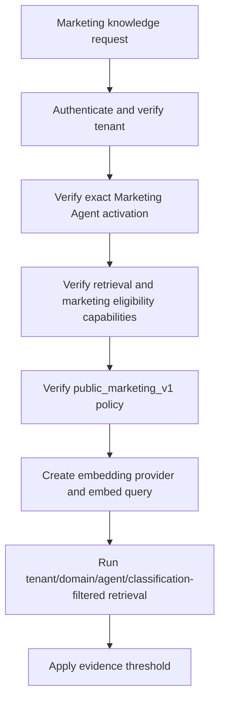

# Marketing Content Agent Registry and Knowledge Access Policy

**Status:** Phase 3.2.3.3 implemented
**Primary engineering baseline:** English
**Review translation:** `marketing-knowledge-access-policy.zh-CN.md`

## 1. Purpose and Scope

This policy establishes the identity, capability eligibility, and knowledge boundary for the Sari Arta Marketing Content Agent before AI generation is enabled.

This phase does not generate content, call an LLM, approve content, publish, schedule, send messages, or write CRM data. It makes a future generation request safe to authorize and retrieve evidence without creating a second knowledge system.

## 2. Agent Registry Entry

| Property | Value |
|---|---|
| Stable agent ID | `61000000-0000-4000-8000-000000000003` |
| Stable agent key | `commercial_kitchen.marketing_content` |
| Display name | Sari Arta Marketing Content Agent |
| Domain | `commercial_kitchen` |
| Agent type | `marketing_content` |
| Implementation key | `marketing_content_policy_v1` |
| Supported locales | `en`, `zh-CN` |
| Development activation | `active`, policy validation only |
| Production activation | `pending`, 0% rollout |
| Generation runtime | Disabled |
| External actions | Disabled |

The agent is a separate registry identity. It does not reuse or inherit the identity, activation, configuration, capability bindings, or knowledge bindings of:

- `commercial_kitchen.lead_qualification`;
- the internal Knowledge Assistant;
- the public Commercial Kitchen Consultation Agent;
- `laboratory_animal_facility.ivc_business_development`.

## 3. Capability Boundary

The registered capability is:

```text
public_marketing_content_generation
```

The capability means only that the registered agent is eligible to create a future governed marketing draft after all policy checks pass. The current runtime keeps `generation_enabled=false` and `execution_enabled=false`.

The capability grants no authority to:

- approve or review content;
- publish or schedule content;
- send email, WhatsApp, or social messages;
- select recipients or campaigns;
- read or write CRM records;
- bypass Content Governance;
- use arbitrary tools, prompts, providers, or external URLs.

The configuration also requires `approved_knowledge_retrieval` and `human_review`. Capability bindings are tenant-scoped and protected by existing forced PostgreSQL RLS.

## 4. Public Marketing Knowledge Classification

The policy reuses the existing Knowledge Governance metadata and binding model. No parallel knowledge store is introduced.

An eligible collection must contain:

```json
{
  "visibility": "public_marketing"
}
```

An eligible document must contain one of these `document_metadata.knowledge_class` values:

| Allowed class | Intended content |
|---|---|
| `public_company_profile` | Approved public company capabilities and introduction |
| `public_case_study` | Cases explicitly cleared for public use |
| `public_product_service` | Public product categories and service descriptions |
| `public_brand_guideline` | Approved terminology, voice, claims, and CTA guidance |
| `public_marketing_reference` | Other approved public marketing reference material |

Missing visibility or knowledge-class metadata is denied. Existing knowledge therefore remains internal by default and is not automatically exposed to the Marketing Content Agent.

## 5. Denied Knowledge Classes

The Marketing Content Agent cannot retrieve:

- `internal_pricing`;
- `supplier_information`;
- `private_customer_information`;
- `crm_record`;
- `opportunity_data`;
- `internal_sop`;
- `internal_engineering_note`;
- `confidential_commercial_terms`;
- `unpublished_knowledge`;
- any unknown, missing, or unclassified knowledge class.

Classification alone never makes a document eligible. The document must still pass the complete governance boundary.

## 6. Complete Retrieval Eligibility

Marketing evidence is returned only when all conditions are true:

```text
authenticated tenant matches request tenant
+ Marketing Agent development activation is active
+ Agent, domain, and configuration are available/active
+ approved_knowledge_retrieval capability is available
+ public_marketing_content_generation capability is available
+ runtime knowledge_policy is public_marketing_v1
+ collection domain matches the agent domain
+ document and chunk domain match the agent domain
+ collection visibility is public_marketing
+ document knowledge_class is allowlisted
+ document is explicitly bound to this exact agent
+ binding is enabled
+ document is approved and active
+ exact published version equals exact active version
+ version review is approved and version status is active
+ processing run is completed
+ language and embedding configuration match
+ evidence exceeds retrieval thresholds
```

Any failed condition produces denial or no evidence. The system does not fall back to another agent, domain, tenant, unclassified collection, or internal document.

## 7. Authorization Flow



Tenant, activation, capability, and policy authorization happens before embedding-provider creation, vector retrieval, or any future model call. A denied request consumes no embedding or model capacity.

## 8. Isolation and IVC Boundary

- Tenant-scoped registry, activation, capability binding, document binding, and chunk tables continue using PostgreSQL RLS.
- The policy requires exact domain IDs on the collection, document, and chunk.
- The policy requires an explicit binding to the Marketing Content Agent ID.
- Another agent's binding never grants access.
- The IVC Agent remains unchanged and cannot use this Marketing Content capability or policy.
- IVC production marketing retrieval and generation remain disabled.

## 9. Observability

Safe policy decision logs contain:

- correlation ID;
- tenant ID;
- agent ID;
- capability key;
- allow/deny outcome;
- safe policy reason.

Logs exclude document content, source excerpts, prompts, private metadata, credentials, and hidden reasoning.

## 10. Production Activation Boundary

Production activation remains `pending` with 0% rollout. It must not become active until a later approved milestone has:

- approved and deliberately classified public marketing knowledge;
- a representative grounding and safety evaluation baseline;
- deterministic claim and citation validation;
- the governed generation runtime;
- human review and approval integration;
- explicit production release approval.

Phase 3.2.3.3 does not satisfy or bypass those production gates.
