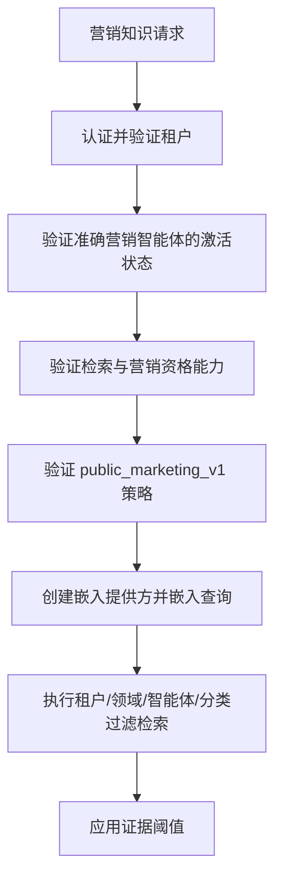

# 营销内容智能体注册与知识访问策略

**状态：** Phase 3.2.3.3 已实现
**主要工程基线：** 英文
**审核译本：** `marketing-knowledge-access-policy.zh-CN.md`

## 1. 目的与范围

本策略在启用 AI 生成之前，为 Sari Arta 营销内容智能体建立身份、能力资格和知识边界。

本阶段不生成内容、不调用 LLM、不批准内容，也不发布、排期、发送消息或写入 CRM。它使未来的生成请求能够安全地完成授权和证据检索，同时不创建第二套知识系统。

## 2. 智能体注册记录

| 属性 | 值 |
|---|---|
| 稳定智能体 ID | `61000000-0000-4000-8000-000000000003` |
| 稳定智能体 Key | `commercial_kitchen.marketing_content` |
| 显示名称 | Sari Arta 营销内容智能体 |
| 领域 | `commercial_kitchen` |
| 智能体类型 | `marketing_content` |
| 实现 Key | `marketing_content_policy_v1` |
| 支持语言 | `en`、`zh-CN` |
| 开发环境激活 | `active`，仅用于策略验证 |
| 生产环境激活 | `pending`，0% rollout |
| 生成运行时 | 已禁用 |
| 外部动作 | 已禁用 |

该智能体拥有独立的注册身份，不会复用或继承以下对象的身份、激活、配置、能力绑定或知识绑定：

- `commercial_kitchen.lead_qualification`；
- 内部知识助手；
- 公开商用厨房项目咨询智能体；
- `laboratory_animal_facility.ivc_business_development`。

## 3. 能力边界

注册的能力是：

```text
public_marketing_content_generation
```

该能力仅表示：所有策略检查通过后，已注册智能体有资格在未来创建受治理的营销草稿。当前运行配置保持 `generation_enabled=false` 和 `execution_enabled=false`。

该能力不授予以下权限：

- 批准或审核内容；
- 发布或排期内容；
- 发送邮件、WhatsApp 或社交消息；
- 选择收件人或营销活动；
- 读取或写入 CRM 记录；
- 绕过内容治理；
- 使用任意工具、Prompt、提供方或外部 URL。

该配置还要求 `approved_knowledge_retrieval` 和 `human_review`。能力绑定具有租户范围，并继续受到现有 PostgreSQL 强制 RLS 保护。

## 4. 公开营销知识分类

本策略复用现有知识治理元数据和绑定模型，不引入并行知识存储。

合格的知识集合必须包含：

```json
{
  "visibility": "public_marketing"
}
```

合格文档的 `document_metadata.knowledge_class` 必须是以下值之一：

| 允许类别 | 适用内容 |
|---|---|
| `public_company_profile` | 经批准的公开公司能力与介绍 |
| `public_case_study` | 明确获准公开使用的案例 |
| `public_product_service` | 公开产品类别与服务说明 |
| `public_brand_guideline` | 经批准的术语、语调、声明和 CTA 指南 |
| `public_marketing_reference` | 其他经批准的公开营销参考资料 |

缺少可见性或知识类别元数据时默认拒绝。因此，现有知识默认保持内部属性，不会自动暴露给营销内容智能体。

## 5. 禁止的知识类别

营销内容智能体不能检索：

- `internal_pricing`；
- `supplier_information`；
- `private_customer_information`；
- `crm_record`；
- `opportunity_data`；
- `internal_sop`；
- `internal_engineering_note`；
- `confidential_commercial_terms`；
- `unpublished_knowledge`；
- 任何未知、缺失或未分类的知识类别。

仅有分类永远不足以让文档合格。文档仍必须通过完整治理边界。

## 6. 完整检索资格

只有以下全部条件成立时，系统才会返回营销证据：

```text
认证租户与请求租户一致
+ 营销智能体开发环境激活状态为 active
+ 智能体、领域和配置为 available/active
+ approved_knowledge_retrieval 能力可用
+ public_marketing_content_generation 能力可用
+ 运行时 knowledge_policy 为 public_marketing_v1
+ 集合领域与智能体领域一致
+ 文档和 Chunk 领域与智能体领域一致
+ 集合 visibility 为 public_marketing
+ 文档 knowledge_class 位于允许列表
+ 文档明确绑定到该准确智能体
+ 绑定状态为 enabled
+ 文档已批准且已启用
+ 准确发布版本与准确启用版本一致
+ 版本审核已批准且版本状态为 active
+ 处理运行已完成
+ 语言和嵌入配置匹配
+ 证据超过检索阈值
```

任何条件失败都会导致拒绝或无证据。系统不会回退到其他智能体、领域、租户、未分类集合或内部文档。

## 7. 授权流程



租户、激活、能力和策略授权发生在创建嵌入提供方、向量检索或任何未来模型调用之前。被拒绝的请求不会消耗嵌入或模型资源。

## 8. 隔离与 IVC 边界

- 租户范围的注册、激活、能力绑定、文档绑定和 Chunk 表继续使用 PostgreSQL RLS。
- 策略要求集合、文档和 Chunk 使用准确的领域 ID。
- 策略要求明确绑定到营销内容智能体 ID。
- 其他智能体的绑定永远不会授予访问权限。
- IVC 智能体保持不变，不能使用本营销内容能力或策略。
- IVC 生产营销检索和生成仍保持禁用。

## 9. 可观测性

安全策略决定日志包含：

- Correlation ID；
- 租户 ID；
- 智能体 ID；
- 能力 Key；
- 允许/拒绝结果；
- 安全策略原因。

日志不包含文档内容、来源摘录、Prompt、私有元数据、凭证或隐藏推理。

## 10. 生产激活边界

生产激活保持 `pending` 和 0% rollout。只有后续获批里程碑完成以下事项后，才能启用生产环境：

- 已批准并经过明确分类的公开营销知识；
- 有代表性的有依据性与安全评估基线；
- 确定性的声明与引用校验；
- 受治理的生成运行时；
- 人工审核和批准集成；
- 明确的生产发布批准。

Phase 3.2.3.3 不满足也不绕过这些生产门槛。
