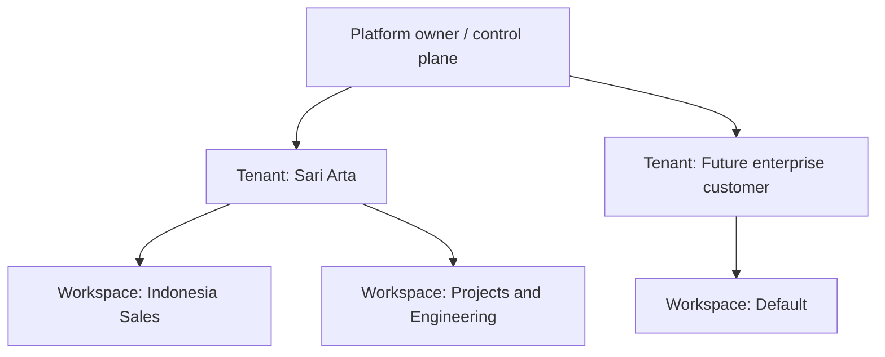
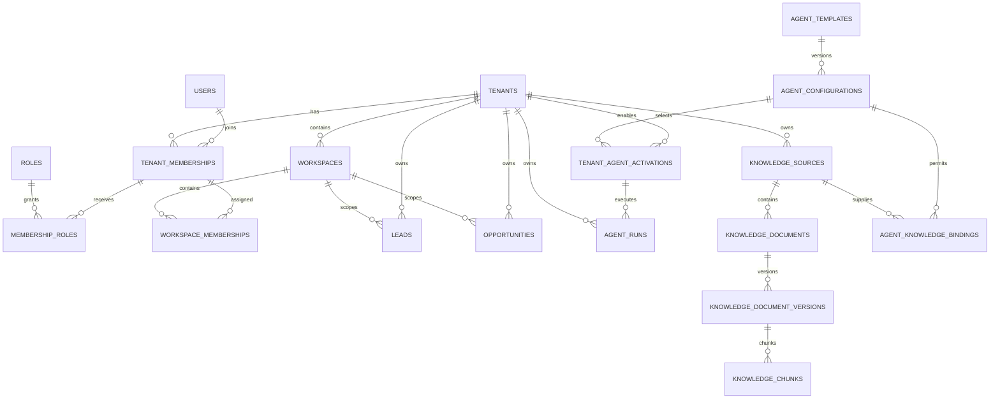

# Multi-Tenant Security Architecture Design

> Chinese translation: [multi-tenant-security-design.zh-CN.md](multi-tenant-security-design.zh-CN.md). This English document is the primary engineering baseline.

**Project:** Enterprise AI Business Development Agent Platform  
**Status:** Design proposal; no implementation changes are authorized by this document  
**Applies after:** Phase 2.3 Agent Playground  
**Primary references:** `docs/technical-architecture.en.md`, `docs/database-design.en.md`, `docs/phase-2-agent-framework-design.en.md`

## 1. Purpose and Scope

This document defines the future multi-tenant security architecture for turning the current Sari Arta implementation into a platform that can host multiple business organizations and domain agents safely.

It covers:

- Platform, tenant, and workspace boundaries.
- User membership, roles, permissions, and authorization scope.
- Agent templates, tenant activation, and user access.
- PostgreSQL Row Level Security (RLS) and application authorization.
- CRM, Agent Run, and future knowledge/RAG isolation.
- Migration of the existing Commercial Kitchen and IVC agents.
- Authentication, authorization, and audit requirements.

This is a design-only deliverable. It does **not** authorize or include application code, database schema, API, migration, deployment, or production-policy changes.

## 2. Design Principles

1. **The tenant is the hard security boundary.** Data must never cross tenants unless an explicitly designed platform operation authorizes it.
2. **A workspace is an organizational boundary inside one tenant.** It helps teams organize work but never replaces tenant isolation.
3. **Authorization is deny-by-default.** A valid login is not sufficient; the caller needs an active membership, role permission, resource scope, and any required approval.
4. **PostgreSQL and application checks provide defense in depth.** RLS prevents cross-tenant database access; FastAPI services enforce business and object-level rules.
5. **The platform control plane is separate from tenant business data.** Platform operators manage templates and service health without receiving routine access to customer records.
6. **Agents inherit the caller's authority.** An agent cannot access data or execute tools that its initiating user could not access.
7. **Knowledge access is the intersection of all policies.** Tenant, workspace, agent binding, document permission, user permission, and provider policy must all allow retrieval.
8. **Configuration is versioned and auditable.** Role grants, agent activation, knowledge binding, and consequential actions retain who, what, when, and why.
9. **No shared prompt or vector index is trusted as an isolation mechanism.** Authorization is enforced before data enters model context.
10. **The migration must be additive and reversible.** Existing Sari Arta workflows remain operational until equivalent multi-tenant behavior is proven.

## 3. Tenant Model

### 3.1 Hierarchy



The hierarchy has three distinct concepts:

| Level | Meaning | Security responsibility |
|---|---|---|
| Platform owner | Operator of the application and global control plane | Operates platform templates, tenant lifecycle, service safety, and audited support procedures |
| Tenant organization | A customer organization with its own people, CRM records, agents, policies, and knowledge | Primary data ownership and RLS boundary |
| Workspace | A team, region, business unit, or operating group inside exactly one tenant | Optional collaboration and object-access scope inside the tenant |

### 3.2 Platform owner

The platform owner controls the global control plane, including:

- Tenant provisioning, suspension, and closure.
- Platform-owned role and agent templates.
- Domain package availability.
- Platform safety policies and global emergency stops.
- Service health, metering, and non-content operational telemetry.
- Break-glass support under a separate, time-limited, audited process.

The platform owner does not automatically own or browse tenant CRM content, uploaded documents, model inputs, or model outputs. Platform Super Admin access must not bypass tenant isolation during ordinary application use.

### 3.3 Tenant organization

A tenant represents one legal or operational customer organization. Examples are Sari Arta or a future enterprise laboratory-equipment company.

A tenant owns:

- Memberships, tenant role grants, and workspaces.
- Companies, contacts, leads, opportunities, tasks, and activities.
- Tenant agent configurations and activations.
- Agent Runs and their business-linked outputs.
- Knowledge sources, documents, chunks, permissions, and bindings.
- Integration accounts, approvals, audit records, and retention policies.
- Locale, timezone, currency, data-region, AI-provider, and budget policies.

Tenant lifecycle states should remain `active`, `suspended`, and `closed`:

- `active`: normal authorized use.
- `suspended`: tenant data remains retained but ordinary logins, writes, agent starts, and integrations are blocked according to policy.
- `closed`: access is disabled and controlled retention/export/deletion procedures apply.

Tenant deletion must never be a normal cascading database operation.

### 3.4 Workspace concept

A workspace is a tenant-internal collaboration scope. Typical examples are:

- Indonesia Sales.
- China Sourcing.
- Project Engineering.
- A regional sales office.
- A dedicated strategic-account team.

Rules:

- Every workspace belongs to exactly one tenant.
- Every tenant receives one `Default` workspace during migration.
- A user must have an active tenant membership before receiving workspace access.
- CRM objects may belong to one workspace and may later be shared with additional workspaces through explicit grants if a real business requirement proves necessary.
- Tenant administrators can view all tenant workspaces by permission; other users normally see only assigned workspaces.
- Workspace IDs are never accepted as proof of tenant identity. The server derives and validates tenant ownership.
- Cross-tenant workspaces and cross-tenant object sharing are prohibited.

For the first multi-tenant release, use one primary `workspace_id` per lead and opportunity rather than implementing arbitrary many-to-many sharing. Companies and contacts may remain tenant-wide so duplicate customer records are not created by separate teams. Object-specific visibility can be added only after a demonstrated need.

### 3.5 Proposed logical entities

The future logical model may include:

| Entity | Important attributes |
|---|---|
| `tenants` | Existing tenant identity, status, locale, timezone, currency, data region, validated settings |
| `workspaces` | `id`, `tenant_id`, stable key, name, status, default flag, timestamps |
| `tenant_memberships` | Existing global-user-to-tenant membership and lifecycle |
| `workspace_memberships` | `tenant_id`, `workspace_id`, `tenant_membership_id`, status, timestamps |
| `workspace_object_grants` | Postponed; only if explicit cross-workspace sharing becomes necessary |

All workspace-related foreign keys must prove same-tenant ownership with composite tenant-aware constraints or equivalent database validation.

## 4. User and RBAC Model

### 4.1 Identity and membership

`users` is a global identity profile. It does not grant tenant access by itself.

Effective tenant access requires:

```text
authenticated user
+ active user account
+ active tenant
+ active tenant membership
+ assigned role
+ required permission
+ permitted workspace/object scope
+ satisfied approval or policy condition
```

A single person may belong to more than one tenant. Their roles and workspace memberships are evaluated independently for each tenant. The frontend must show the active tenant clearly and must never combine business data from multiple tenants in one ordinary screen or API response.

### 4.2 Required roles

Roles are permission bundles, not hard-coded conditional branches. System role templates provide safe defaults; tenants may receive configurable custom roles later without changing the six baseline roles.

#### Platform Super Admin

Scope: platform control plane only by default.

- Provision, suspend, and close tenants.
- Manage platform-owned domain packages and agent templates.
- Apply global safety stops.
- View platform operational health and tenant-safe aggregate metrics.
- Initiate a separate break-glass support session when approved.
- Cannot routinely read tenant CRM or knowledge content.

#### Tenant Admin

Scope: all workspaces and resources inside one tenant.

- Manage tenant settings, users, roles, and workspace membership.
- Enable or suspend tenant agents from approved platform templates.
- Manage integrations and tenant AI policy when separately permitted.
- Manage knowledge sources and document permissions.
- Review tenant audit events.
- Does not receive platform-control permissions.

#### Sales Manager

Scope: assigned workspaces, normally including all sales objects in those workspaces.

- View and manage companies, contacts, leads, opportunities, tasks, and activities.
- Assign owners and change sales stages within business rules.
- Start qualification agents and review results.
- Approve defined sales actions when the approval policy permits.
- View team pipeline and operational reports.
- Cannot manage tenant security, global agent templates, or platform configuration.

#### Sales User

Scope: assigned workspaces and normally owned/assigned records, with team visibility controlled by tenant policy.

- Create and update permitted companies, contacts, leads, opportunities, tasks, and activities.
- Start enabled qualification or assistance agents on accessible records.
- View Agent Runs they are authorized to see.
- Cannot activate agents, change role grants, or approve restricted management actions.

#### Technical User

Scope: assigned workspaces, projects, and approved technical knowledge.

- View permitted customer/project context required for technical work.
- Add or validate technical requirements and approved knowledge.
- Run technical or knowledge agents that the tenant has enabled.
- Review technical claims where assigned.
- Cannot change commercial ownership, pricing, discounts, sales status, or tenant administration unless separately granted.

#### Viewer

Scope: explicitly assigned workspaces and permitted records.

- Read dashboards and business records allowed by scope.
- View approved, non-sensitive AI results and knowledge.
- Cannot edit records, start consequential agents, manage knowledge, export sensitive data, or perform approvals.

### 4.3 Baseline permission matrix

`✓` means included in the baseline role template. `Scoped` means only within an assigned workspace/object scope. `Controlled` means an additional policy, approval, or break-glass procedure is required.

| Capability | Platform Super Admin | Tenant Admin | Sales Manager | Sales User | Technical User | Viewer |
|---|---:|---:|---:|---:|---:|---:|
| Manage tenants | ✓ | — | — | — | — | — |
| Manage platform agent templates | ✓ | — | — | — | — | — |
| Read tenant business content | Controlled | ✓ | Scoped | Scoped | Scoped | Scoped read |
| Manage tenant members and roles | — | ✓ | — | — | — | — |
| Manage workspaces | — | ✓ | — | — | — | — |
| Manage CRM records | — | ✓ | Scoped | Scoped | Technical fields only | — |
| Assign leads/opportunities | — | ✓ | Scoped | — | — | — |
| Start enabled qualification agents | — | ✓ | Scoped | Scoped | If capability allows | — |
| View authorized Agent Runs | Controlled | ✓ | Scoped | Scoped | Scoped | Approved results only |
| Enable/suspend tenant agents | — | ✓ | — | — | — | — |
| Manage tenant knowledge | — | ✓ | Optional | — | Scoped curator | — |
| Approve sales decisions | — | Policy-defined | Scoped | — | — | — |
| Validate technical claims | — | Policy-defined | — | — | Scoped | — |
| Export tenant data | — | Controlled | Controlled | — | — | — |
| View audit events | Platform events | ✓ | Limited team events | Own relevant events | Own relevant events | — |

### 4.4 Permission naming

Permissions should be stable action keys, for example:

```text
tenant.members.read
tenant.members.manage
workspace.manage
crm.organization.read
crm.organization.write
crm.lead.read
crm.lead.write
crm.lead.assign
crm.opportunity.stage_change
agent.catalog.read
agent.run.start
agent.run.read
agent.activation.manage
knowledge.document.read
knowledge.document.manage
knowledge.document.approve
audit.read
data.export.request
```

High-risk permissions such as tenant administration, export, agent activation, knowledge approval, and integration-secret management should be separate rather than implied by broad CRUD permissions.

### 4.5 Scoped authorization

RBAC answers whether an action type is allowed. Scope rules answer which records the action may affect.

The authorization service must evaluate:

1. Platform or tenant principal type.
2. Active tenant context and membership.
3. Effective role permissions, including expiry.
4. Workspace membership or tenant-wide scope.
5. Object ownership, team assignment, and sensitivity.
6. Agent, knowledge, or tool-specific policy.
7. Approval requirements for consequential actions.

No role name should be trusted directly in route handlers. Routes call a centralized authorization service with a stable permission and resource context.

### 4.6 Separation of duties

The following actions should support or require different actors where practical:

- A user who uploads sensitive knowledge should not be the only approver making it active.
- A user who changes an Agent Configuration should not unilaterally approve and activate it in a production tenant.
- Export of sensitive or bulk customer data should require an approved purpose.
- Break-glass support should require platform approval, tenant notification according to policy, and immutable audit evidence.

For small tenants, policy may allow the Tenant Admin to hold multiple duties, but the system must record that the same actor performed them.

## 5. Agent Access Control

### 5.1 Three-layer model

Agent access is evaluated at three layers:

| Layer | Ownership | Purpose |
|---|---|---|
| Agent template | Platform | Defines a reviewed capability/domain identity and allowed configuration family |
| Tenant enabled agent | Tenant | Selects an approved configuration, locales, limits, tools, knowledge bindings, and operating status |
| User permission and scope | User membership | Determines who can discover, start, inspect, cancel, approve, or administer the enabled agent |

### 5.2 Agent template

An Agent Template is a platform control-plane definition. It contains:

- Stable `agent_key`, domain key, capability type, and implementation key.
- Supported workflow and schema contracts.
- Supported locales and minimum model capabilities.
- Default guardrails, tool risk ceilings, and human-review rules.
- Lifecycle state: `draft`, `available`, `suspended`, `deprecated`, or `retired`.
- Versioned configuration options and evaluation evidence.

An Agent Template contains no tenant credentials and retrieves no tenant knowledge by itself. Platform availability means only that a tenant may be allowed to enable it.

### 5.3 Tenant enabled agents

`tenant_agent_activations` represents the exact Agent Configuration enabled for a tenant and environment.

Activation must verify:

- The tenant is active and entitled to the domain/capability.
- The template and exact configuration are approved and compatible.
- Requested locales and provider/data-region policy are supported.
- All required tool and knowledge bindings are valid.
- The tenant's AI budget, retention, and data-classification policies are satisfied.
- Evaluation and security gates pass for the exact configuration.
- No global or tenant emergency stop blocks activation.

Tenant activation may strengthen platform controls but may never weaken mandatory platform safety rules. Suspension blocks new runs but preserves historical runs and manual CRM access.

Workspace availability may be represented by an additional activation scope or grant, but the tenant remains the owner of the activation. A workspace cannot enable an agent that the tenant has not enabled.

### 5.4 User permissions for agents

Recommended permission split:

| Permission | Purpose |
|---|---|
| `agent.catalog.read` | Discover agents enabled for the active tenant and workspace |
| `agent.run.start` | Start an eligible agent on an accessible business object |
| `agent.run.read` | Read authorized run status and approved output |
| `agent.run.cancel` | Cancel a run the caller owns or manages |
| `agent.run.retry` | Retry a failed run under idempotency and policy controls |
| `agent.output.review` | Accept/reject an AI recommendation as a human decision |
| `agent.activation.manage` | Enable, upgrade, suspend, or roll back tenant agents |
| `agent.configuration.read` | Inspect safe configuration metadata, not secrets or hidden instructions |

Starting an agent requires all of the following:

```text
tenant active
AND membership active
AND agent activation active
AND user has agent.run.start
AND user can read the target object
AND workspace scope permits the target
AND requested workflow is allowed
AND tool/knowledge/provider policy permits execution
AND human approval policy can be satisfied
```

The browser cannot supply a trusted `tenant_id`, system prompt, arbitrary model, arbitrary tool list, database query, or knowledge collection. The backend derives runtime context from the authenticated principal and server-side registry.

### 5.5 Agent runtime authority

The effective permissions of a run are the intersection of:

```text
initiating user permissions
∩ tenant agent activation policy
∩ workspace/object scope
∩ configuration tool bindings
∩ knowledge permissions
∩ platform safety policy
```

Agents do not receive a general service identity with broader tenant access. Background Workers carry a restricted technical identity and the immutable authorization snapshot needed to continue the approved run. Before every tool call or state-changing step, the runtime revalidates current tenant, activation, cancellation, object, and approval status.

## 6. Data Isolation Strategy

### 6.1 Tenant-scoped data

Every tenant-owned row must include a non-null `tenant_id`. This includes direct business records, join tables, history, jobs, agent records, audit events, files, integrations, and knowledge metadata.

Examples:

- Organizations and contacts.
- Leads, lead assessments, activities, and tasks.
- Opportunities and proposals.
- Agent configurations, activations, runs, steps, citations, and approvals.
- Knowledge sources, documents, versions, chunks, and bindings.
- Files, imports, exports, webhooks, outbox events, and deliveries.

Global tables are limited to reviewed control-plane data such as global identities, permission definitions, platform role templates, installed domain packages, and platform Agent Templates. A table is not global merely because sharing it would be convenient.

### 6.2 PostgreSQL RLS

Enable and force RLS on every tenant-owned table:

```sql
ALTER TABLE tenant_owned_table ENABLE ROW LEVEL SECURITY;
ALTER TABLE tenant_owned_table FORCE ROW LEVEL SECURITY;
```

Conceptual policy:

```sql
USING (
  tenant_id = current_setting('app.tenant_id', true)::uuid
)
WITH CHECK (
  tenant_id = current_setting('app.tenant_id', true)::uuid
);
```

The exact SQL will be designed during implementation. Required behavior is:

- API transactions set `app.tenant_id` from the verified membership, never from an untrusted request field.
- Use `SET LOCAL` or `set_config(..., true)` inside each transaction so pooled connections cannot retain another tenant's context.
- Missing or invalid tenant context returns no tenant rows and prevents writes.
- Tenant context is set before any tenant-table query, including validation and background processing.
- Application roles do not own tables, have no `BYPASSRLS`, and cannot disable RLS.
- Table owners, migration roles, data-repair roles, and break-glass roles are separate from runtime roles.
- Worker queue claiming uses a narrowly scoped database role or security-definer operation that can discover runnable IDs without gaining unrestricted business-data access; processing then switches to the run's tenant context.

RLS is a tenant barrier, not the complete authorization system. Workspace, ownership, field, permission, and business-state checks remain in application services.

### 6.3 Cross-tenant relationship protection

A row with the correct `tenant_id` must not reference another tenant's parent row. Protect relationships using one or more of:

- Composite unique keys such as `(tenant_id, id)` on parent tables.
- Composite foreign keys such as `(tenant_id, lead_id)`.
- Database constraints or narrowly reviewed triggers for polymorphic relationships.
- Application validation in the same transaction.
- Repository tests that attempt cross-tenant inserts and updates.

The database must reject, for example, a Sari Arta opportunity referencing another tenant's lead even if both UUIDs are valid.

### 6.4 Leads and opportunities

Leads and opportunities always carry `tenant_id` and, after workspace introduction, a primary `workspace_id`.

Rules:

- Website inquiry ingress resolves a server-owned tenant destination; the public request cannot select an arbitrary tenant ID.
- Duplicate detection runs only inside the resolved tenant unless an explicit platform abuse-control process uses irreversibly minimized signals.
- Lead conversion requires source lead and new opportunity to share tenant and workspace rules.
- Owner and assignee memberships must belong to the same tenant and be eligible for the object's workspace.
- Search, counts, dashboard metrics, exports, and uniqueness constraints are tenant-scoped.
- Changing workspace is an authorized business command with an audit event, not a direct field edit.

### 6.5 Agent Runs

Every Agent Run belongs to exactly one tenant and records the exact activation/configuration version used.

Required isolation:

- `agent_runs.tenant_id` is non-null and immutable after creation.
- Linked lead, opportunity, conversation, configuration, activation, steps, citations, and approvals share the same tenant.
- `input_snapshot` contains only minimized data the initiating principal and active configuration were authorized to use.
- `output_result` is visible only to users permitted to see the run and its subject; sensitive technical or management-only fields may require stronger permissions.
- Provider request/response IDs do not grant access and are never exposed as lookup keys to ordinary clients.
- Queue messages contain run ID, tenant ID, workflow key, and correlation metadata only; PostgreSQL remains canonical.
- Retry and recovery preserve the original tenant, configuration, authorization snapshot, and idempotency boundary.
- Cancellation or tenant/agent suspension prevents further model/tool steps according to policy.
- Agent Runs started in the demonstration Playground remain explicitly marked as demo runs and have no authority to write CRM or call external communication tools.

### 6.6 Application and cache isolation

- Every repository method receives tenant context through a trusted request/unit-of-work boundary.
- Cache and Redis keys include environment and tenant ID; sensitive cached values should be minimized and encrypted where appropriate.
- Object-storage keys use non-guessable identifiers and a tenant prefix for operations; tenant identity is also verified against database metadata before issuing signed URLs.
- Signed URLs are short-lived and generated only after authorization.
- Search indexes, analytics, traces, logs, metrics, and backups must preserve tenant classification and access restrictions.
- Do not place raw customer content in ordinary logs, metric labels, queue names, or error messages.

### 6.7 Isolation tests

The future implementation is not acceptable until automated tests prove:

- Tenant A cannot select, update, delete, count, search, or export Tenant B records.
- Tenant A cannot create a child row referencing Tenant B data.
- A user with membership in two tenants sees only the active tenant per request.
- Reused database connections do not leak the previous transaction's tenant context.
- Worker retry/recovery cannot process a run under the wrong tenant.
- Cache keys and object URLs cannot be reused across tenants.
- Platform Super Admin ordinary mode cannot query tenant content.
- Suspension blocks new work without deleting history.

## 7. Knowledge Isolation and Future RAG

### 7.1 Required identifiers and bindings

Every retrievable knowledge artifact must be traceable through:

```text
tenant_id
→ knowledge_source_id
→ knowledge_document_id
→ immutable document_version_id
→ knowledge_chunk_id
```

Agent eligibility is added through an explicit binding:

```text
tenant_id
+ agent_id or agent_configuration_id
+ knowledge_source/document scope
+ purpose
+ status/effective dates
+ permission policy
```

The required fields include:

- `tenant_id`: non-null owner and RLS boundary.
- `agent_id`: stable Agent Template/capability identity or exact configuration binding where required.
- `workspace_id`: optional internal scope when knowledge belongs to one business team.
- `access_scope`: tenant-wide, role-restricted, workspace-restricted, or private.
- `access_policy`: validated role, membership, workspace, classification, and purpose constraints.
- `approved_by`, `approved_at`, status, effective dates, retention, and classification.
- Version, source provenance, checksum, language, page/section metadata, and processing versions.

### 7.2 Retrieval authorization

Retrieval eligibility is the intersection—not the union—of:

```text
active tenant
∩ active membership and user permission
∩ workspace/object access
∩ active tenant agent activation
∩ agent knowledge binding
∩ active, approved, effective document version
∩ document access policy and classification
∩ model-provider/data-region policy
```

Authorization filtering must occur inside PostgreSQL before chunk text or embeddings leave the database. Post-filtering an already retrieved cross-tenant candidate list is not acceptable.

### 7.3 Vector and full-text isolation

Initial RAG should use PostgreSQL full-text search and pgvector in the tenant-owned knowledge tables.

- Every full-text and vector query includes a tenant predicate enforced by RLS.
- Candidate selection additionally filters agent binding, document approval, effective dates, language, workspace, access policy, and data classification.
- Index strategy starts with shared physical indexes containing tenant-aware filtering; use per-tenant partitions or indexes only after measured scale requires them.
- Approximate vector search must be evaluated to ensure tenant filters do not reduce recall or cause unsafe candidate behavior.
- Embedding-provider jobs run under the document tenant context and never combine multiple tenants' source text in one request batch unless an approved provider/data policy explicitly supports secure separation.
- Shared platform or domain reference knowledge is not retrieved cross-tenant initially. A reviewed release is copied/materialized into each tenant's source with provenance and digest preserved.

### 7.4 Document permissions

Recommended permission levels:

| Scope | Meaning |
|---|---|
| Tenant | All authorized knowledge users and bound agents in the tenant |
| Role restricted | Only memberships holding specified permission/role criteria |
| Workspace restricted | Only assigned workspaces and eligible tenant administrators |
| Private | Explicit memberships or a business object team only |

Agent access never overrides document permissions. A user asking an agent a question cannot retrieve a document the same user is not permitted to read for that purpose.

### 7.5 RAG output security

- Outputs cite source, immutable version, page/section, and chunk.
- Agent Run citations remain tenant-scoped and reference same-tenant chunks.
- Retrieved document instructions are untrusted content and cannot override system policy.
- Context is minimized to the task and provider policy.
- Sensitive values are redacted or excluded before external model processing where required.
- The agent returns `insufficient_evidence` rather than searching another tenant or inventing an answer.
- Revocation stops future retrieval immediately; historical run evidence follows retention and legal-hold policy.

## 8. Authentication, Authorization, and Audit Security

### 8.1 Authentication

Production human authentication should use a standards-based identity provider with OIDC Authorization Code + PKCE.

Requirements:

- MFA is required for Platform Super Admin and Tenant Admin, and recommended for all users.
- Browser sessions use `HttpOnly`, `Secure`, `SameSite` cookies; long-lived tokens are not stored in `localStorage`.
- Access tokens have short lifetimes and include immutable subject/audience/issuer data, not trusted mutable authorization snapshots.
- Tenant membership, role grants, agent activation, and suspension are checked against current server data for sensitive actions.
- Service accounts are separate principals with narrow permissions, tenant scope where applicable, credential rotation, and no interactive login.
- Webhooks use provider signature validation, timestamp/replay protection, and tenant-bound integration-account resolution rather than human tokens.
- Login, tenant switch, MFA, recovery, session revocation, and failed authentication events are audited safely.

### 8.2 Tenant selection

The tenant context must be unambiguous for every authenticated request:

- A user selects from their active memberships.
- The backend validates the selection and creates a tenant-bound session or validates an explicit tenant context against the session.
- A request header, route slug, or cookie may identify the intended tenant, but it is never authoritative without membership validation.
- Sensitive commands should include the resolved tenant in the idempotency scope.
- Changing active tenant invalidates tenant-scoped cached UI and server data.

### 8.3 Authorization enforcement points

Authorization occurs at multiple layers:

1. **Edge/session layer:** authenticate the principal and establish intended tenant.
2. **FastAPI dependency/service layer:** validate membership and stable permission.
3. **Application service:** enforce workspace, object ownership, business state, field, agent, and approval rules.
4. **Repository transaction:** set transaction-local tenant context.
5. **PostgreSQL RLS:** block cross-tenant rows even if an application query is defective.
6. **Tool/retrieval gateway:** revalidate agent-specific data and action permissions.
7. **External adapter:** minimize outbound data and enforce tenant-specific provider/integration policy.

Frontend visibility improves usability but is never an authorization control.

### 8.4 Audit logging

Audit records are append-only to ordinary application roles and include:

- `tenant_id` for tenant events, nullable only for genuine platform events.
- Actor type and stable actor ID.
- Impersonation/break-glass actor and session ID when applicable.
- Action, target type/ID, workspace, result, timestamp, and correlation ID.
- Request source, safe reason, policy/permission decision, and approval reference.
- Before/after field names or redacted values for sensitive changes.
- Exact Agent Configuration/activation and content/action digest for AI approvals.

Mandatory audit events include:

- Tenant lifecycle and settings changes.
- Membership invitations, suspensions, role grants, and workspace changes.
- Agent activation, upgrade, suspension, rollback, and emergency stop.
- Agent Run start, retry, cancellation, failure, approval, and consequential tool use.
- Knowledge upload, permission change, approval, activation, revocation, and deletion.
- Lead assignment, status changes, opportunity conversion/stage changes, and exports.
- Integration and secret-reference configuration changes.
- Break-glass request, approval, access, viewed targets, and termination.

Application logs and traces are operational telemetry, not a replacement for audit events. They must avoid secrets, raw credentials, unrestricted prompts, full documents, and unnecessary personal data.

### 8.5 Platform administration and break-glass

Platform Super Admin has no silent tenant impersonation.

A break-glass design should require:

- A documented support or security reason.
- Strong reauthentication and MFA.
- Tenant and target scope.
- Approval according to support policy.
- Short expiry and read-only access by default.
- A visible support-session indicator.
- Tenant notification where policy or contract requires it.
- Immutable audit events for every accessed resource and action.
- Immediate revocation and post-access review.

Break-glass credentials and database repair roles remain outside normal application sessions.

## 9. Migration Strategy

### 9.1 Current-state assumptions

The accepted implementation already has future-compatible foundations:

- One seeded Sari Arta tenant/workspace experience.
- Tenant IDs on current CRM and Agent Run records.
- A simplified `admin`/`sales` membership role model.
- Agent Registry records and tenant-scoped agent configurations/activations.
- Sari Arta Commercial Kitchen qualification workflow.
- IVC Facility qualification workflow and Agent Playground demonstration.

The migration must not reinterpret historical outputs, expose IVC demonstration data as production knowledge, or change current Phase 1 routes before parity is proven.

### 9.2 Stage 0 — Baseline and decisions

- Record the accepted schema revision, test suite, seeded tenant ID, agent keys, configurations, activations, routes, and demo behavior.
- Inventory every tenant-owned table and every query path, including Workers, scripts, exports, and tests.
- Define role permission keys, workspace ownership rules, retention, data region, break-glass policy, and identity-provider choice.
- Add characterization tests before any runtime resolution or authorization change.

### 9.3 Stage 1 — Normalize tenancy and workspace

Future implementation should use additive migrations:

- Keep the existing Sari Arta tenant as the canonical tenant record.
- Add one `Default` Sari Arta workspace.
- Add nullable workspace references only to records that truly need workspace scope.
- Backfill existing leads, opportunities, tasks, activities, and relevant Agent Runs to the default workspace when appropriate.
- Validate counts and tenant/workspace invariants before enforcing non-null constraints.
- Do not add workspace columns to tables that should remain tenant-wide without a proven access need.

### 9.4 Stage 2 — Expand roles without breaking access

- Retain current `admin` and `sales` behavior during transition.
- Create the six system role templates and stable permission catalog.
- Map existing Sari Arta `admin` memberships to `Tenant Admin`.
- Map existing `sales` memberships to `Sales User`; explicitly grant `Sales Manager` where required.
- Backfill all active memberships into the Default workspace.
- Dual-evaluate old role checks and new permissions in shadow mode, logging mismatches without changing results.
- Switch endpoint authorization by bounded capability after parity tests pass.
- Remove legacy role branches only in a later reviewed release.

Platform Super Admin must be introduced as a separate platform principal/grant, not as a tenant membership role.

### 9.5 Stage 3 — Enforce database isolation

- Add tenant-aware composite constraints to high-risk relationships first.
- Create RLS policies table-by-table using a dedicated non-owner application role.
- Run RLS in test/staging with adversarial two-tenant fixtures.
- Verify transaction-local context with the production pooling mode.
- Enable and force RLS in bounded groups, starting with CRM reads, then writes, Agent Runs, and knowledge tables.
- Keep a documented rollback that disables the new application path without deleting tenant identifiers or historical data.

No production cutover occurs until all normal API and Worker paths function without `BYPASSRLS`.

### 9.6 Stage 4 — Migrate the Commercial Kitchen Agent

Represent the current Sari Arta implementation as:

```text
Tenant: Sari Arta
Workspace: Default
Domain: commercial_kitchen
Agent Template: Sari Arta Commercial Kitchen Agent
Capability: lead qualification
Tenant activation: current approved configuration
Locales: current approved locales
Knowledge bindings: none until future RAG is separately approved
```

- Preserve existing `agent_configuration_id` and historical Agent Runs.
- Link the tenant activation to the exact current configuration.
- Resolve the current lead-qualification route through the new tenant authorization path behind a feature flag.
- Shadow-compare the selected agent/configuration and input context.
- Preserve existing idempotency, retry, cancellation, dashboard output, and human-review behavior.
- Roll back to the existing resolver if parity fails; no historical data rewrite is required.

### 9.7 Stage 5 — Migrate the IVC Agent

Represent the second domain as:

```text
Domain: laboratory_animal_facility
Agent Template: IVC Facility Business Development Agent
Capability: qualification
Tenant activation: explicit per tenant; disabled by default for unrelated tenants
Knowledge bindings: none until an approved IVC corpus and RAG release exist
```

- Keep the platform template global and tenant-neutral.
- Activate it only for tenants entitled to the IVC domain.
- Do not automatically enable IVC for Sari Arta merely because the current Playground can demonstrate it.
- Keep synthetic IVC demo cases separate from tenant production knowledge and CRM records.
- Require each production tenant's locale, model-provider, evaluation, data-region, and human-review policy to pass activation gates.

### 9.8 Stage 6 — Introduce knowledge isolation

- Add tenant-owned sources, immutable documents/versions/chunks, document permissions, and explicit Agent Knowledge Bindings.
- Start with synthetic and approved tenant documents in an isolated environment.
- Prove tenant, workspace, role, agent, approval, expiry, and classification filtering before external model use.
- Activate RAG per tenant and per agent; there is no global default corpus.
- Preserve citation evidence and provide immediate future-retrieval revocation.

### 9.9 Stage 7 — Multi-tenant acceptance

Before onboarding a second real tenant, verify:

- Cross-tenant RLS and relationship tests pass for all relevant tables.
- Existing Sari Arta workflows pass unchanged.
- IVC is visible only to explicitly enabled tenants/users.
- Role and workspace behavior matches the approved matrix.
- Backup and restore can recover one environment without weakening isolation.
- Logging, audit, exports, object storage, Worker recovery, and AI-provider calls retain tenant context.
- Tenant suspension and agent emergency stop work without damaging CRM data.
- Break-glass access is time-limited and fully audited.

## 10. Recommended Logical Relationship Model



`AGENT_TEMPLATES` is the conceptual platform name for the stable global `agents` registry entity already described in the Phase 2 framework. A duplicate physical table should not be created merely to use this label.

## 11. Operational Security Requirements

- Use separate development, test, staging, and production identities, data, keys, storage, queues, and provider projects.
- Encrypt traffic with TLS and data at rest using managed encryption and tenant-appropriate region controls.
- Store secret references only in PostgreSQL; secret values belong in a managed secret store.
- Apply per-tenant rate, concurrency, AI-token, cost, import/export, and storage limits.
- Provide platform-wide and tenant-specific AI/automation emergency stops.
- Back up PostgreSQL and object storage separately; regularly test restore and verify RLS after recovery.
- Define retention separately for CRM, messages, uploaded documents, Agent Runs, traces, audit records, exports, and backups.
- Protect exports with permission, purpose, approval where required, expiry, watermarking where appropriate, and audit.
- Monitor denied authorization, repeated tenant-switch failures, unusual exports, RLS-policy errors, agent-tool denials, and break-glass use.
- Never use real tenant data in synthetic evaluation suites, demonstrations, screenshots, or development fixtures without explicit approval and an approved handling method.

## 12. Implementation Gates and Deferred Decisions

This design should be reviewed before implementation against these decisions:

1. Whether companies and contacts are tenant-wide while leads/opportunities are workspace-scoped, as recommended.
2. Which identity provider and MFA policy are approved for production.
3. Whether tenants may define custom roles in the first multi-tenant release or only use system templates.
4. Which actions require manager, technical, or dual approval.
5. Whether any tenant requires regional data residency or tenant-owned model-provider credentials.
6. Which user groups may upload, approve, bind, retrieve, export, and delete knowledge.
7. Audit and retention periods for CRM, Agent Runs, knowledge, traces, exports, and break-glass evidence.
8. Whether the Agent Playground remains tenant-authenticated, becomes a platform demo tenant, or is disabled in production.

Until those decisions and an implementation plan are approved:

- The current Sari Arta tenant and workflows remain the operational baseline.
- Commercial Kitchen and IVC Playground behavior remains a demonstration layer.
- No self-service tenant provisioning is introduced.
- No RAG knowledge corpus is activated.
- No application, schema, API, migration, or production-policy change is implied by this document.

## 13. Security Acceptance Criteria

A future multi-tenant implementation is acceptable only when:

- Tenant context is derived from verified authentication and active membership.
- All tenant-owned tables use forced RLS under non-bypass application roles.
- Cross-tenant foreign references are rejected by database and application checks.
- The six baseline roles pass positive and negative authorization tests.
- Workspace scoping cannot expose another tenant or unauthorized team.
- Tenant agent activation and user permission are both required to start an agent.
- Agent tools and knowledge retrieval cannot exceed the initiating principal's authority.
- Leads, opportunities, Agent Runs, citations, and knowledge remain same-tenant end to end.
- RAG filters tenant, agent binding, document permission, approval, validity, classification, and locale before content leaves PostgreSQL.
- Platform administration cannot silently impersonate or routinely browse tenants.
- Sensitive changes and AI actions produce immutable, correlation-linked audit evidence.
- Existing Sari Arta workflows remain backward compatible during migration.
- IVC is enabled only by explicit tenant activation and continues to use synthetic data until a separate knowledge release is approved.
