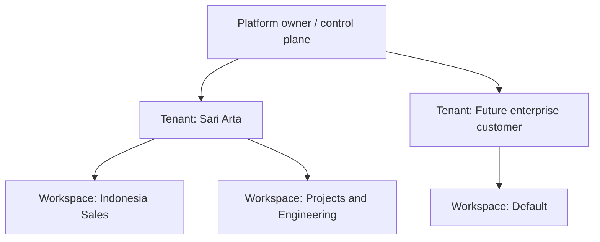
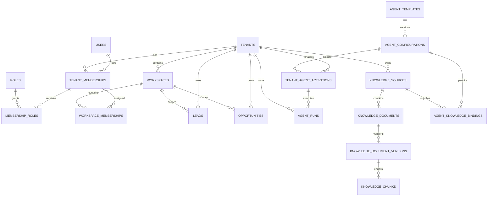

# 多租户安全架构设计

> 英文工程基线：[multi-tenant-security-design.en.md](multi-tenant-security-design.en.md)。中文版本用于内部审核；如有冲突，以英文版本为准。

**项目：** 企业人工智能业务发展智能体平台 **状态：** 设计方案；本文件未授权任何实施变更 **适用后：** 阶段 2.3 智能体体验场 **主要参考：** `docs/technical-architecture.en.md`, `docs/database-design.en.md`, `docs/phase-2-agent-framework-design.en.md`

## 1. 目的和范围

本文件定义了将当前 Sari Arta 实现转化为一个能够安全地托管多个企业组织和域智能体的平台，从而实现多租户安全架构的未来方案。

它涵盖：

- 平台、租户和工作区边界。
- 用户会员资格、角色、权限以及授权范围。
- 智能体模板、租户激活以及用户访问权限。
- PostgreSQL 逐行级别安全 (RLS) 和应用程序授权。
- CRM、智能体运行以及未来的知识/RAG隔离。
- 现有商业厨房和IVC智能体的迁移。
- 身份验证、授权和审计要求。

这是一个仅包含设计内容的交付物。它**不**包含任何应用程序代码、数据库模式、API、迁移、部署或生产策略更改。

## 2. 设计原则

1. **租户是坚实的安全边界。** 数据绝不能跨越租户，除非明确设计的平台操作授权这样做。
2. **工作空间是一个在单个租户内部的组织边界。** 它有助于团队组织工作，但不会取代租户隔离。
3. **默认情况下，授权是拒绝。** 即使登录有效，也并非足够。调用者还需要具有有效的会员身份、角色权限、资源范围，以及任何必需的批准。
4. **PostgreSQL 和应用程序检查提供多层防御。** RLS 阻止跨租户数据库访问； FastAPI 服务强制执行业务和对象层级的规则。
5. **平台控制平面与租户的业务数据是分离的。** 平台管理员负责管理模板和服务的健康状况，而无需定期访问客户记录。
6. **智能体继承调用者的权限。** 智能体不能访问或执行其发起用户的任何数据或工具。
7. **知识访问是所有策略的交集。** 租户、工作区、智能体绑定、文档权限、用户权限以及提供商策略，必须都允许检索。
8. **配置具有版本控制和可审计性。** 角色权限、智能体启用、知识绑定以及后续操作都保留了“谁”、“什么”、“何时”和“原因”等信息。
9. **不信任共享提示或向量索引作为隔离机制。** 在数据进入模型上下文之前，会强制执行授权。
10. **迁移必须是增量的，并且可逆。** 现有的 Sari Arta 工作流程将在等效的多租户行为被证明之前继续保持运行。

## 3. 租户模型

### 3.1 层次结构



这个层次结构包含三个不同的概念：

| 级别 | 含义 | 安全责任 |
|---|---|---|
| 平台所有者 | 应用程序和全局控制平面操作员 | 运行平台模板、租户生命周期、服务安全以及经过审计的支持流程 |
| 租户组织 | 一个拥有自身员工、CRM记录、智能体、政策和知识的客户组织 | 主要数据所有权和 RLS 边界 |
| 工作空间 | 一个位于单个租户内的团队、区域、业务单元或运营组 | 可选的协作和对象访问范围，在租户内部 |

### 3.2 平台所有者

平台所有者控制全局控制平面，包括：

- 租户的配置、暂停和关闭。
- 平台拥有的角色和智能体模板。
- 域名软件包可用性。
- 平台安全策略和全球紧急停止。
- 服务健康、计量和非内容运营的遥测。
- 在单独、有时间限制且经过审计的流程下提供紧急支持。

平台所有者不会自动拥有或浏览租户的CRM内容、上传的文档、模型输入或模型输出。 平台超级管理员权限不得在普通应用使用中绕过租户隔离。

### 3.3 租户组织

一个租户代表一个法律或运营客户组织。例如，Sari Arta 或一个未来的企业实验室设备公司。

租户拥有：

- 会员、租户角色权限和工作区。
- 公司、联系人、潜在客户、商机、任务和活动。
- 租户智能体配置和激活。
- 智能体运行及其与业务相关的输出。
- 知识来源、文档、片段、权限和绑定。
- 集成账户、审批、审计记录和保留策略。
- 区域、时区、货币、数据区域、AI提供商以及预算政策。

租户生命周期状态应保持为`active`、`suspended`和`closed`：

- `active`：正常授权使用。
- `suspended`：租户数据仍然保留，但根据策略，普通登录、写入、智能体启动和集成功能将被阻止。
- `closed`：访问已禁用，并适用控制后的保留/导出/删除程序。

租户删除绝不能作为正常的数据库级操作。

### 3.4 工作空间概念

工作空间是一个租户内部的协作范围。 典型的例子包括：

- 印度尼西亚销售。
- 中国采购。
- 项目工程
- 一个区域销售办事处。
- 一个专门负责战略客户的团队。

规则：

- 每个工作空间都属于恰好一个租户。
- 每个租户在迁移过程中都会获得一个`Default`工作空间。
- 用户必须拥有有效的租户会员资格，才能获得工作空间访问权限。
- CRM 对象可能属于一个工作区，并且如果实际业务需求需要，可以通过明确授权的方式，将这些对象共享给其他工作区。
- 租户管理员可以根据权限查看所有租户工作区；其他用户通常只能看到已分配的工作区。
- 工作区ID永远不能被用作租户身份的证明。服务器会根据租户来验证其所有权。
- 跨租户工作区和跨租户对象共享是被禁止的。

对于首次多租户发布，请使用每个潜在客户和商机上的一个主要`workspace_id`，而不是实施任意的任意多对多的共享。公司和联系人可以保持在整个租户范围内，从而避免由不同的团队创建重复的客户记录。仅在明确的需求存在时，才能添加对象级别的可见性。

### 3.5 拟议的逻辑实体

未来的逻辑模型可能包括：

| 实体 | 重要属性 |
|---|---|
| `tenants` | 现有的租户身份、状态、区域、时区、货币、数据区域、已验证的设置 |
| `workspaces` | `id`, `tenant_id`, 稳定的密钥, 名称, 状态, 默认标志, 时间戳 |
| `tenant_memberships` | 现有的全球用户到租户的成员资格和生命周期 |
| `workspace_memberships` | `tenant_id`, `workspace_id`, `tenant_membership_id`, 状态, 时间戳 |
| `workspace_object_grants` | 已推迟；仅在明确的跨工作空间共享成为必要时才执行 |

所有与工作空间相关的外键必须证明与同一租户的所有权，通过复合的租户感知约束或等效的数据库验证。

## 4. 用户和基于角色的访问控制 (RBAC) 模型

### 4.1 身份和成员资格

`users` 是一种全局身份标识。它本身不授予租户访问权限。

有效租户访问需要：

```text
authenticated user
+ active user account
+ active tenant
+ active tenant membership
+ assigned role
+ required permission
+ permitted workspace/object scope
+ satisfied approval or policy condition
```

一个人可以同时属于多个租户。他们的角色和工作空间成员资格将分别针对每个租户进行评估。前端必须清晰地显示当前租户，并且绝不能在单个普通屏幕或 API 响应中合并来自多个租户的业务数据。

### 4.2 必需角色

角色是权限集合，而不是硬编码的条件分支。系统角色模板提供安全的默认设置；租户可以在不更改六个基本角色的情况下，稍后接收可配置的自定义角色。

#### 平台超级管理员

范围：默认情况下仅限于平台控制平面。

- 提供、暂停和关闭租户。
- 管理平台拥有的域名包和智能体模板。
- 应用全局安全停止。
- 查看平台运营健康状况和安全聚合指标。
- 在获得批准后，启动单独的紧急支持会话。
- 无法常规地读取租户的CRM或知识内容。

#### 租户管理员

范围：所有工作区和资源，位于一个租户内部。

- 管理租户设置、用户、角色和工作区成员。
- 启用或暂停从已批准的平台模板中的租户智能体。
- 管理独立允许的集成和租户 AI 策略。
- 管理知识来源和文档权限。
- 审查租户审计事件。
- 未获得平台控制权限。

#### 销售经理

范围：指已分配的工作空间，通常包括这些工作空间中的所有销售对象。

- 查看和管理公司、联系人、潜在客户、商机、任务和活动。
- 在业务规则中指定负责人并更改销售阶段。
- 开始评估智能体并审查结果。
- 在批准策略允许的情况下，批准已定义的销售行动。
- 查看团队流程和运营报告。
- 无法管理租户安全、全局智能体模板或平台配置。

#### 销售用户

范围：已分配的工作空间以及通常由用户/团队拥有的/分配的记录，团队可见性受租户策略控制。

- 创建和更新允许的公司、联系人、潜在客户、商机、任务和活动。
- 启动已启用或协助的智能体，在可访问的记录上进行操作。
- 查看用户可以访问的智能体运行。
- 无法激活智能体、更改角色权限或批准受限的管理操作。

#### 技术用户

范围：已分配的工作空间、项目以及已批准的技术知识。

- 查看所需的技术工作所需要的客户/项目上下文。
- 添加或验证技术要求和已批准的知识。
- 运行租户启用的技术或知识智能体。
- 审核并确认已分配的技术陈述。
- 除非另有明确授权，否则无法更改商业所有权、定价、折扣、销售状态或租户管理。

#### 查看器

范围：明确指定的工作区和允许的记录。

- 读取由权限范围允许的仪表盘和业务记录。
- 查看已批准、不敏感的 AI 结果和知识。
- 无法编辑记录、启动相关智能体、管理知识、导出敏感数据或执行审批。

### 4.3 基础权限矩阵

`✓` 表示包含在基本角色模板中。 `Scoped` 表示仅限于已分配的工作空间/对象范围。 `Controlled` 表示需要额外的策略、审批或紧急处理程序。

| 能力 | 平台超级管理员 | 租户管理员 | 销售经理 | 销售用户 | 技术用户 | 查看器 |
|---|---:|---:|---:|---:|---:|---:|
| 管理租户 | ✓ | — | — | — | — | — |
| 管理平台智能体模板 | ✓ | — | — | — | — | — |
| 读取租户的业务内容 | 受控 | ✓ | 限定范围 | 限定范围 | 限定范围 | 限定范围的读取 |
| 管理租户成员和角色 | — | ✓ | — | — | — | — |
| 管理工作区 | — | ✓ | — | — | — | — |
| 管理 CRM 记录 | — | ✓ | 限定范围 | 限定范围 | 仅限技术领域 | — |
| 分配潜在客户/商机 | — | ✓ | 限定范围 | — | — | — |
| 启动已启用资格智能体 | — | ✓ | 限定范围 | 限定范围 | 如果条件允许 | — |
| 查看授权智能体运行 | 受控 | ✓ | 限定范围 | 限定范围 | 限定范围 | 仅限已批准的结果 |
| 启用/暂停租户智能体 | — | ✓ | — | — | — | — |
| 管理租户知识 | — | ✓ | 可选 | — | 范围内的策展人 | — |
| 批准销售决策 | — | 策略定义 | 限定范围 | — | — | — |
| 验证技术主张 | — | 策略定义 | — | — | 限定范围 | — |
| 导出租户数据 | — | 受控 | 受控 | — | — | — |
| 查看审计事件 | 平台活动 | ✓ | 有限的团队活动 | 拥有相关的活动 | 拥有相关的活动 | — |

### 4.4 权限命名

权限应是稳定的操作键，例如：

```text
tenant.members.read
tenant.members.manage
workspace.manage
crm.organization.read
crm.organization.write
crm.lead.read
crm.lead.write
crm.lead.assign
crm.opportunity.stage_change
agent.catalog.read
agent.run.start
agent.run.read
agent.activation.manage
knowledge.document.read
knowledge.document.manage
knowledge.document.approve
audit.read
data.export.request
```

高风险权限，如租户管理、导出、智能体启用、知识审批和集成-密钥管理，应与宽泛的 CRUD 权限分开，而不是由宽泛的 CRUD 权限暗示。

### 4.5 范围授权

RBAC 确定一个操作类型是否被允许。 范围规则确定该操作可能影响哪些记录。

授权服务必须评估：

1. 平台或租户主类型。
2. 当前租户上下文和成员身份。
3. 有效的角色权限，包括过期时间。
4. 工作区成员资格或租户范围。
5. 对象所有权、团队分配和敏感性。
6. 针对智能体、知识或工具的特定策略。
7. 对后续行动的审批要求。

不应直接在路由处理程序中使用任何角色名称。 路由会调用一个集中式的授权服务，该服务具有稳定的权限和资源上下文。

### 4.6 职责分离

以下操作应支持或要求不同的参与者，在可行的情况下：

- 上传包含敏感信息的用户，不应是唯一的审批人，从而激活该信息。
- 当用户更改智能体配置时，不应在生产租户中单方面批准并激活它。
- 导出敏感或大量客户数据应需要经过批准的目的。
- 紧急支持需要平台批准、根据政策通知租户，以及不可篡改的审计证据。

对于小型租户，政策可能允许租户管理员承担多项职责，但系统必须记录相同的执行者执行了这些职责。

## 5. 智能体访问控制

### 5.1 三层模型

智能体访问权限评估分为三个层面：

| 层 | 所有权 | 目的 |
|---|---|---|
| 智能体模板 | 平台 | 定义已审查的 ⟦P0001⟧ 能力/领域身份以及允许的配置族 |
| 租户启用智能体 | 租户 | 选择已批准的配置、区域、限制、工具、知识绑定以及运行状态 |
| 用户权限和权限范围 | 用户会员资格 | 确定哪些人可以发现、启动、检查、取消、批准或管理启用的智能体 |

### 5.2 智能体模板

一个智能体模板是一个平台控制面定义。它包含：

- 稳定 `agent_key`，域名密钥，能力类型，以及实现密钥。
- 支持的流程和模式合同。
- 支持的区域和最低模型能力。
- 默认的安全措施、工具风险限制以及人工审核规则。
- 生命周期状态：`draft`、`available`、`suspended`、`deprecated` 或 `retired`。
- 带有版本号的配置选项和评估证据。

一个智能体模板不包含任何租户凭据，并且本身不会获取任何租户知识。平台可用性仅意味着允许一个租户启用它。

### 5.3 租户启用的智能体

`tenant_agent_activations`代表租户和环境上启用的精确智能体配置。

验证必须确认：

- 租户处于活动状态，并有权使用该域名/功能。
- 该模板和确切配置已获得批准，并且是兼容的。
- 支持的区域和提供者/数据区域政策。
- 所有必需的工具和知识绑定都有效。
- 租户的AI预算、保留策略和数据分类策略均已满足。
- 评估和安全检查，确保配置完全正确。
- 未激活任何全局或租户级别的紧急停止功能。

租户激活可能会加强平台控制，但永远不会削弱强制性的平台安全规则。 暂停会阻止新的运行，但会保留历史运行记录和手动 CRM 访问。

工作空间的可访问性可能由额外的激活范围或授权来表示，但租户仍然是激活的拥有者。工作空间不能启用租户尚未启用的智能体。

### 5.4 智能体用户的权限

推荐的权限分割：

| 权限 | 目的 |
|---|---|
| `agent.catalog.read` | 发现适用于当前租户和工作区的启用智能体 |
| `agent.run.start` | 在可访问的业务对象上启动一名符合条件的智能体 |
| `agent.run.read` | 读取授权运行状态和已批准的输出 |
| `agent.run.cancel` | 取消调用者拥有的或管理的运行 |
| `agent.run.retry` | 在保持幂等性和政策控制的前提下，重试失败的运行 |
| `agent.output.review` | 接受/拒绝作为人类决定的 AI 建议 |
| `agent.activation.manage` | 启用、升级、暂停或回滚租户智能体 |
| `agent.configuration.read` | 检查安全配置元数据，而不是密钥或隐藏指令 |

启动智能体需要满足以下所有条件：

```text
tenant active
AND membership active
AND agent activation active
AND user has agent.run.start
AND user can read the target object
AND workspace scope permits the target
AND requested workflow is allowed
AND tool/knowledge/provider policy permits execution
AND human approval policy can be satisfied
```

浏览器无法提供可信的 `tenant_id`、系统提示、任意模型、任意工具列表、数据库查询或知识收集。 后端根据已认证的身份验证者和服务器端注册表，推断运行时上下文。

### 5.5 智能体运行时权限

一个运行的有效权限是以下内容的交集：

```text
initiating user permissions
∩ tenant agent activation policy
∩ workspace/object scope
∩ configuration tool bindings
∩ knowledge permissions
∩ platform safety policy
```

智能体不会获得具有更广泛租户访问权限的通用服务身份。后台工作进程携带受限的技术身份，以及用于继续已批准运行所需的不可变授权快照。在每次工具调用或状态更改步骤之前，运行时会重新验证当前的租户、激活、取消、对象和批准状态。

## 6. 数据隔离策略

### 6.1 租户范围的数据

每个属于租户的行必须包含一个非空 `tenant_id`。 这包括直接的业务记录、关联表、历史记录、作业、智能体记录、审计事件、文件、集成以及知识元数据。

示例：

- 组织和联系人。
- 负责、评估、活动和任务。
- 机会与提案。
- 智能体配置、激活、运行、步骤、引用和批准。
- 知识来源、文档、版本、片段和绑定。
- 文件、导入、导出、Webhooks、出站事件和交付。

全局表仅限于已审查的控制平面数据，例如全局身份、权限定义、平台角色模板、已安装的域软件包和平台智能体模板。一个表之所以被认为是全局的，并非仅仅因为共享它会很方便。

### 6.2 PostgreSQL 细粒度访问控制 (RLS)

启用并强制在所有由租户拥有的表中启用行级安全（RLS）：

```sql
ALTER TABLE tenant_owned_table ENABLE ROW LEVEL SECURITY;
ALTER TABLE tenant_owned_table FORCE ROW LEVEL SECURITY;
```

概念性政策：

```sql
USING (
  tenant_id = current_setting('app.tenant_id', true)::uuid
)
WITH CHECK (
  tenant_id = current_setting('app.tenant_id', true)::uuid
);
```

确切的 SQL 将在实施过程中进行设计。 必需的行为是：

- API 交易从已验证的会员信息中设置`app.tenant_id`，绝不从不受信任的请求字段中设置。
- 在每个交易中使用 `SET LOCAL` 或 `set_config(..., true)`，以防止聚合连接保留另一个租户的上下文。
- 缺少或无效的租户上下文将返回无租户行，并阻止写入操作。
- 租户上下文在进行任何租户表查询之前设置，包括验证和后台处理。
- 应用程序角色不拥有表，没有`BYPASSRLS`，并且不能禁用 RLS。
- 表所有者、迁移角色、数据修复角色和紧急维护角色与运行时角色是不同的。
- 工作队列获取使用具有狭窄权限的数据库角色或安全定义操作，从而能够发现可执行的ID，而无需获得不受限制的业务数据访问权限；然后，处理会切换到运行的租户上下文。

RLS 是一种租户隔离机制，而不是完整的授权系统。 工作区、所有权、字段、权限和业务状态检查仍然在应用程序服务中进行。

### 6.3 跨租户关系保护

一行中必须包含正确的 `tenant_id`，并且不能引用其他租户的父行。 使用以下方法保护关系：

- 复合唯一键，例如在父表中定义的 `(tenant_id, id)`。
- 复合外键，例如 `(tenant_id, lead_id)`。
- 数据库约束或针对多态关系的严格审查过的触发器。
- 在同一事务中进行应用验证。
- 仓库测试，尝试进行跨租户的插入和更新操作。

数据库必须拒绝，例如，即使两个 UUID 都是有效的，但一个 Sari Arta 机会也引用了另一个租户的潜在客户。

### 6.4 潜在的机遇和方向

领导和机会总是伴随着`tenant_id`，并在工作空间介绍后，会产生一个主要的`workspace_id`。

规则：

- 网站查询入口解决的是由服务器管理的租户目的地；公众请求不能选择任意租户ID。
- 重复检测仅在已解决的租户内部运行，除非明确的平台滥用控制流程使用不可逆的极简信号。
- 将潜在客户转化为实际客户，需要共享来源潜在客户和新的机会，以便共享租户和工作空间规则。
- 所有者和被指定成员必须属于同一个租户，并且必须符合该对象的 workspaces 的要求。
- 搜索、计数、仪表板指标、导出以及唯一性约束都具有租户范围。
- 更改工作空间是一个经过授权的业务命令，具有审计事件，而不是直接的字段编辑。

### 6.5 智能体运行

每个Agent运行都属于恰好一个租户，并记录使用的确切激活/配置版本。

必需的隔离：

- `agent_runs.tenant_id`在创建后，必须是非空且不可变。
- 以下内容： 关联的潜在客户、机会、对话、配置、激活、步骤、引用和批准共享相同的租户。
- `input_snapshot` 仅包含经过授权的、由发起方和当前配置所允许使用的最小化数据。
- `output_result`仅对被授权查看运行及其对象的用户可见；敏感的技术或仅限管理人员才能查看的字段可能需要更严格的权限。
- 提供方请求/响应 ID 不授予访问权限，并且永远不会作为普通客户端的查找键暴露。
- 队列消息仅包含运行 ID、租户 ID、工作流程键和相关元数据；PostgreSQL 仍然是标准。
- 重试和恢复会保留原始租户、配置、授权快照以及幂等性边界。
- 取消或租户/智能体暂停会阻止根据政策执行进一步的模型/工具步骤。
- Agent 运行在演示 Playground 中，仍然明确标记为演示运行，并且没有权限写入 CRM 或调用外部通信工具。

### 6.6 应用和缓存隔离

- 每个仓库方法都通过一个可信的请求/工作单元边界来接收租户上下文。
- 缓存和Redis键包括环境ID和租户ID；敏感的缓存值应尽量减少，并在适当情况下进行加密。
- 对象存储键使用不可猜测的标识符和租户前缀进行操作；租户身份在发出签名 URL 之前，也需要与数据库元数据进行验证。
- 签名 URL 具有有限的有效期，并且仅在经过授权后生成。
- 搜索索引、分析、跟踪、日志、指标和备份必须保留租户分类和访问限制。
- 请勿将原始客户内容放入普通日志、指标标签、队列名称或错误消息中。

### 6.7 隔离测试

未来的实施方案在自动化测试证明以下内容之前是不被接受的：

- 租户 A 无法选择、更新、删除、计数、搜索或导出租户 B 的记录。
- 租户 A 无法创建引用租户 B 数据的子行。
- 一位拥有两个租户会员的用户，每次请求只会看到其中一个活跃的租户。
- 重复使用的数据库连接不会泄露先前事务的租户上下文。
- 工人重试/恢复无法处理错误的租户下的运行。
- 缓存键和对象 URL 不能在不同租户之间重复使用。
- 平台超级管理员普通模式下，无法查询租户内容。
- 悬停功能允许在不删除历史记录的情况下开始新的工作。

## 7. 知识隔离与未来检索增强生成 (RAG)

### 7.1 必需的标识符和绑定

每个可检索的知识制品必须通过以下方式进行追溯：

```text
tenant_id
→ knowledge_source_id
→ knowledge_document_id
→ immutable document_version_id
→ knowledge_chunk_id
```

智能体资格通过明确约定来添加：

```text
tenant_id
+ agent_id or agent_configuration_id
+ knowledge_source/document scope
+ purpose
+ status/effective dates
+ permission policy
```

所需字段包括：

- `tenant_id`：非空所有者和访问控制列表（RLS）边界。
- `agent_id`：确保智能体模板/能力身份或精确配置与所需情况绑定。
- `workspace_id`：可选的内部范围，适用于知识属于一个业务团队的情况。
- `access_scope`：适用于整个租户、基于角色的、基于工作空间的、或私有的。
- `access_policy`：已验证的角色、成员资格、工作区、分类和目的约束。
- `approved_by`、`approved_at`、状态、有效日期、保留期限和分类。
- 版本, 来源, 校验和, 语言, 页面/章节元数据, 以及处理版本。

### 7.2 检索授权

符合检索条件的资格是：交集，而不是并集：

```text
active tenant
∩ active membership and user permission
∩ workspace/object access
∩ active tenant agent activation
∩ agent knowledge binding
∩ active, approved, effective document version
∩ document access policy and classification
∩ model-provider/data-region policy
```

授权过滤必须在 PostgreSQL 内部进行，在文本或嵌入数据离开数据库之前。在检索后已获取的跨租户候选列表进行过滤是不允许的。

### 7.3 向量和全文隔离

初始的 RAG 应该使用 PostgreSQL 的全文搜索功能和 pgvector，在租户拥有的知识表中。

- 每个全文和向量查询都包含一个由 RLS 强制执行的租户谓词。
- 候选人选择还进一步过滤了智能体绑定、文档审批、生效日期、语言、工作区、访问策略和数据分类。
- 索引策略从开始时使用共享的物理索引，这些索引包含租户感知过滤功能；仅在经过测量后，租户规模达到要求时，才使用按租户划分的索引或仅索引。
- 近似向量搜索必须进行评估，以确保租户过滤器不会降低召回率或导致不安全的结果。
- 嵌入式提供者的工作在文档租户的上下文中运行，并且不会在单个请求批次中组合来自多个租户的源文本，除非经过批准的提供者/数据策略明确支持安全隔离。
- 共享平台或域名参考知识在初始阶段不会被跨租户检索。经过审查的发布版本会被复制/应用于每个租户的源，同时保留来源和哈希值。

### 7.4 文档权限

推荐的权限级别：

| 范围 | 含义 |
|---|---|
| 租户 | 租户中的所有授权知识用户和受约束的智能体 |
| 角色权限受限 | 仅限拥有指定权限/角色的会员 |
| 工作空间受限 | 仅限已分配的工作空间以及符合条件的租户管理员 |
| 私有 | 仅限显式成员或业务对象团队 |

智能体访问权限永远不会覆盖文档权限。 任何用户向智能体提问时，都不能获取该用户本身没有权限读取的文档。

### 7.5 RAG 输出的安全

- 输出引用来源、不可变版本、页面/章节以及区块。
- 智能体运行的引用仍然具有租户范围，并引用同一租户的块。
- 从检索到的文档的说明内容不可信，并且不能覆盖系统策略。
- 上下文被限制为任务和提供商的政策。
- 在需要时，敏感值在外部模型处理之前会被删除或排除。
- 智能体返回`insufficient_evidence`，而不是搜索另一个租户或编造答案。
- 撤销操作会立即停止未来的检索；历史运行证据将遵循保留和法律保留策略。

## 8. 身份验证、授权和审计安全

### 8.1 身份验证

生产环境的人员身份验证应使用基于标准的身份提供程序，并使用 OIDC 授权码 + PKCE。

要求：

- 平台超级管理员和租户管理员需要启用 MFA，建议所有用户启用。
- 浏览器会话使用 `HttpOnly`、`Secure`、`SameSite` Cookie；长效令牌不存储在 `localStorage` 中。
- 访问令牌具有较短的有效期，并且包含不可变的主体/受众/颁发者的数据，而不是可信的、可变的可授权快照。
- 租户成员资格、角色权限、智能体启用和暂停等操作，会根据当前服务器数据进行检查，以确保敏感操作的安全性。
- 服务账户是具有有限权限、适用于特定情况的租户范围、凭证轮换以及无交互登录的独立身份。
- Webhooks 使用提供商签名验证、时间戳/防重机制以及与租户关联的集成账户解析，而不是人工令牌。
- 登录、租户切换、多因素身份验证、恢复、会话撤销以及身份验证失败事件均安全地进行审计。

### 8.2 租户选择

租户上下文必须在每次经过身份验证的请求中都具有明确性：

- 用户可以选择其已激活的会员。
- 后端验证选择，并创建与租户关联的会话，或者验证显式租户上下文与会话。
- 一个请求头、路由别名或 cookie 可能会标识目标租户，但如果没有进行身份验证，它们永远不会具有权威性。
- 敏感命令应将已解决的租户包含在幂等性范围内。
- 更改活动租户会使租户范围内的缓存UI和服务器数据失效。

### 8.3 授权验证点

授权发生在多个层面：

1. **边缘/会话层：** 验证主体并建立目标租户。
2. **FastAPI 依赖/服务层：** 验证成员身份和稳定的权限。
3. **应用服务：** 强制执行工作区、对象所有权、业务状态、字段、智能体和审批规则。
4. **仓库事务：** 设置事务本地租户上下文。
5. **PostgreSQL RLS：** 即使应用程序查询存在缺陷，也能阻止跨租户行访问。
6. **工具/检索网关：** 验证并重新确认特定智能体的数据和操作权限。
7. **外部适配器：** 减少向外传输的数据，并强制执行租户特定的提供商/集成策略。

前端可见性可以提高可用性，但它永远不是一个授权控制。

### 8.4 审计日志记录

审计记录仅对普通应用程序角色进行追加，并包含：

- `tenant_id` 用于租户事件，仅对真实的平台事件才允许为空值。
- 演员类型和稳定的演员ID。
- 冒用者/紧急情况操作员以及适用时的会话ID。
- 操作、目标类型/ID、工作区、结果、时间戳和相关ID。
- 请求来源、安全原因、政策/权限决定以及审批参考。
- 在/后字段名称或已删除的敏感值。
- 精确的智能体配置/激活以及用于AI审批的内容/操作摘要。

强制审计事件包括：

- 租户生命周期和设置更改。
- 会员邀请、停用、角色授予以及工作空间变更。
- 智能体启用、升级、暂停、回滚和紧急停止。
- 智能体运行的启动、重试、取消、失败、批准以及相关工具的使用。
- 知识上传、权限变更、审批、激活、撤销和删除。
- 分配负责人、状态变更、机会转化/阶段变更，以及导出。
- 集成和密钥引用配置更改。
- 紧急请求、批准、访问、查看目标、以及终止。

应用程序日志和跟踪是运营的遥测数据，而不是审计事件的替代品。它们必须避免包含秘密、原始凭证、不受限制的提示、完整文档以及不必要的个人数据。

### 8.5 平台管理和紧急情况处理

平台超级管理员不支持静默租户冒用。

一个“打破玻璃”的设计应要求：

- 经过记录的，与支持或安全相关的理由。
- 强大的重新验证和多因素身份验证。
- 租户和目标范围。
- 根据支持政策批准。
- 默认情况下，有效期短，且只能读取。
- 一个可见的辅助会话指示器。
- 租户通知，当政策或合同要求时。
- 对每个访问的资源和操作的不可变审计事件。
- 立即撤销并进行访问后审查。

紧急情况下的凭证和数据库修复角色仍然在非正常应用程序会话之外。

## 9. 迁移策略

### 9.1 现状假设

已接受的实现方案已经具备了未来兼容的基础：

- 一个预配置的 Sari Arta 租户/工作空间体验。
- 当前 CRM 和 Agent Run 记录中的租户 ID。
- 一个简化的 `admin`/`sales` 成员角色模型。
- 智能体注册表记录和租户范围内的智能体配置/激活。
- Sari Arta商业厨房资格认证工作流程。
- IVC 设施资格认证工作流程演示及智能体游戏演示。

迁移过程不得重新解释历史输出，不得将 IVC 演示数据作为生产知识，或在达到一致性之前改变当前第一阶段的路线。

### 9.2 0 阶段 — 基础和决策

- 记录已接受的模式修订、测试套件、初始租户 ID、智能体密钥、配置、激活、路由以及演示行为。
- 对所有由租户拥有的表格以及所有查询路径进行盘点，包括 Workers、脚本、导出和测试。
- 定义角色权限键、工作区所有权规则、保留策略、数据区域、紧急情况处理策略以及身份提供商选择。
- 在进行任何运行时分辨率或授权更改之前，请先添加字符化测试。

### 9.3 第一阶段 — 规范租赁和工作空间

未来的实现应该使用增量迁移：

- 保留现有的 Sari Arta 租户作为标准租户记录。
- 添加一个 `Default` Sari Arta 工作区。
- 仅将可为空的工作空间引用添加到真正需要工作空间范围的记录中。
- 在适当情况下，将现有的潜在客户、商机、任务、活动以及相关智能体运行记录，填充到默认工作空间。
- 在强制执行非空约束之前，验证计数和租户/工作区不变性。
- 不要在表格中添加工作区列，除非这些表格需要保持在整个租户范围内的使用，并且必须有已证明的访问需求。

### 9.4 第二阶段 — 在不中断访问的情况下，扩展角色

- 在过渡期间，保持当前的 `admin` 和 `sales` 行为。
- 创建六个系统角色模板和稳定的权限目录。
- 将现有的 Sari Arta `admin` 会员身份映射到 `Tenant Admin`。
- 将现有的 `sales` 成员关系映射到 `Sales User`；在需要时，明确授予 `Sales Manager`。
- 将所有活跃的会员关系全部填充到默认工作空间。
- 同时评估旧角色检查和新权限，在影模式下进行，并记录不匹配的情况，而无需更改结果。
- 在通过平测后，通过有限能力来授权交换端点。
- 仅在后续经过审查的发布中移除旧的权限分支。

平台超级管理员必须作为单独的平台主体/权限引入，而不是作为租户成员角色。

### 9.5 第三阶段 — 强制数据库隔离

- 首先，为高风险关系添加具有租户意识的复合约束。
- 使用专门的非所有者应用程序角色，逐个创建 RLS 策略表。
- 在测试/环境中使用对抗性双租户配置运行 RLS。
- 使用生产级池化模式验证事务本地上下文。
- 启用并强制在有限范围内使用细粒度权限控制（RLS），从 CRM 读取开始，然后是写入、智能体运行和知识表。
- 保留一份经过记录的恢复方案，该方案可以禁用新的应用程序路径，而无需删除租户标识符或历史数据。

生产切换不会发生，直到所有正常的API和Worker路径都正常运行，且没有`BYPASSRLS`错误。

### 9.6 第 4 阶段 — 迁移商业厨房智能体

表示当前的 Sari Arta 实现为：

```text
Tenant: Sari Arta
Workspace: Default
Domain: commercial_kitchen
Agent Template: Sari Arta Commercial Kitchen Agent
Capability: lead qualification
Tenant activation: current approved configuration
Locales: current approved locales
Knowledge bindings: none until future RAG is separately approved
```

- 保留现有的 `agent_configuration_id` 以及历史 Agent 运行。
- 将租户激活与确切的当前配置关联起来。
- 通过新的租户授权路径，在功能标志的保护下，解决当前的潜在客户筛选流程。
- 比较选定的智能体/配置以及输入上下文。
- 保留现有的幂等性、重试、取消、仪表盘输出以及人工审核行为。
- 如果校验失败，则回退到现有的解析器；无需重写历史数据。

### 9.7 阶段 5 — 迁移 IVC 智能体

表示第二个域为：

```text
Domain: laboratory_animal_facility
Agent Template: IVC Facility Business Development Agent
Capability: qualification
Tenant activation: explicit per tenant; disabled by default for unrelated tenants
Knowledge bindings: none until an approved IVC corpus and RAG release exist
```

- 保持平台模板的全局性和与租户无关性。
- 仅激活适用于拥有IVC域名的租户。
- 不要仅仅因为当前的 Playground 可以演示，就自动启用 Sari Arta 上的 IVC。
- 请将合成的IVC演示案例与租户的生产知识和CRM记录分开。
- 要求每个生产租户的区域、模型提供商、评估、数据区域和人工审核策略都必须通过激活门。

### 9.8 6 阶段 — 引入知识隔离

- 添加租户拥有的数据源，不可变动的文档/版本/块，文档权限，以及明确的 Agent 知识绑定。
- 从一个隔离的环境中，开始使用合成且已批准的租户文档。
- 在使用外部模型之前，请先验证租户、工作区、角色、智能体、审批、到期和分类过滤。
- 按租户和按智能体启用 RAG；不存在全局默认语料库。
- 保留引用证据，并提供即时撤销检索功能。

### 9.9 7级 — 多租户验收

在添加第二个真实租户之前，请验证：

- 跨租户的RLS和关系测试已通过，适用于所有相关表。
- 现有的 Sari Arta 工作流程保持不变。
- IVC 仅对明确启用的租户/用户可见。
- 角色和工作空间行为符合已批准的矩阵。
- 备份和恢复可以在不削弱隔离的情况下恢复一个环境。
- 日志记录、审计、导出、对象存储、Worker 恢复以及与 AI 供应商的调用，均保留租户上下文。
- 租户暂停和智能体紧急停止工作，而不会损坏 CRM 数据。
- 紧急访问权限仅在特定时间内有效，并且经过全面审计。

## 10. 推荐的逻辑关系模型



`AGENT_TEMPLATES`是用于稳定全球`agents`注册项的，并且已经在第 2 阶段框架中描述的，概念性平台名称。仅仅为了使用这个标签，不应创建重复的物理表。

## 11. 运营安全要求

- 使用独立的开发、测试、预发布和生产身份、数据、密钥、存储、队列和提供商项目。
- 使用 TLS 加密流量，以及使用托管加密和适合租户的区域控制来加密静态数据。
- 仅在 PostgreSQL 中存储秘密引用；秘密值应存储在受管理的秘密存储中。
- 应用按租户定价、并发、AI-令牌、成本、导入/导出以及存储限制。
- 提供平台级和租户级的 AI/自动化紧急停止功能。
- 分别备份 PostgreSQL 和对象存储；定期测试恢复并验证 RLS（运行时权限），恢复后。
- 分别定义 CRM、消息、上传文档、智能体运行、跟踪、审计记录、导出和备份的保留策略。
- 在必要时，获得授权、明确目的、获得批准、设置到期日、适当地进行水印，并进行审计，以保护出口。
- 监控系统被拒绝授权，多次出现租户切换失败，出现异常导出，RLS-策略错误，智能体工具被拒绝，以及紧急情况下的使用。
- 绝对不要在合成评估套件、演示、屏幕截图或开发环境中，未经明确批准和已批准的处理方法，使用真实的租户数据。

## 12. 实施门和推迟的决策

在实施前，应根据以下决策对该设计进行审查：

1. 公司和联系人是否在整个租户范围内，而潜在客户/机会则仅限于工作空间，如建议。
2. 以下身份验证提供商和多因素身份验证（MFA）策略已批准用于生产环境。
3. 租户在首次多租户版本中是否可以定义自定义角色，或者仅使用系统模板？
4. 哪些操作需要经理、技术或双重审批？
5. 是否需要任何租户要求区域数据驻留或租户拥有的模型提供商凭证。
6. 哪些用户组可以上传、批准、绑定、检索、导出和删除知识？
7. 对 CRM、智能体运行、知识、跟踪、导出和紧急情况证据的审计和保留期限。
8. 无论 Agent Playground 是否保持租户认证状态、成为平台演示租户，还是在生产环境中被禁用。

在相关决策和实施计划获得批准之前：

- 当前的 Sari Arta 租户和工作流程仍然是运营的基准。
- 商业厨房和IVC游乐场的行为仍然是一个演示层。
- 未引入自助式租户配置功能。
- 未激活任何 RAG 知识库。
- 本文件不暗示任何应用程序、模式、API、迁移或生产策略的变更。

## 13. 安全接受标准

一个未来多租户的实现方案，只有在以下情况下才被接受：

- 租户上下文是从经过验证的身份验证和活跃的成员身份中获得的。
- 所有由租户拥有的表都使用强制的 RLS，在非绕过应用程序角色下。
- 跨租户的外部引用被数据库和应用程序检查所拒绝。
- 六个基线角色都通过了正向和反向授权测试。
- 工作区范围划分不能暴露其他租户或未授权的团队。
- 为了启动智能体，需要同时激活租户智能体并设置用户权限。
- 智能体工具和知识检索不能超出发起方的权限。
- Leads、机会、智能体运行、引用和知识均在同一租户内实现全流程。
- 在内容离开 PostgreSQL 之前，RAG 过滤器会进行租户、智能体绑定、文档权限、审批、有效性、分类和区域设置的过滤。
- 平台管理不能悄悄地冒充身份或定期浏览租户。
- 对敏感变更和AI操作产生不可变、关联性强的审计证据。
- 现有的 Sari Arta 工作流程在迁移过程中仍然保持向后兼容。
- IVC 仅在明确的租户激活后启用，并且在获得单独的知识发布批准之前，仍会使用合成数据。
