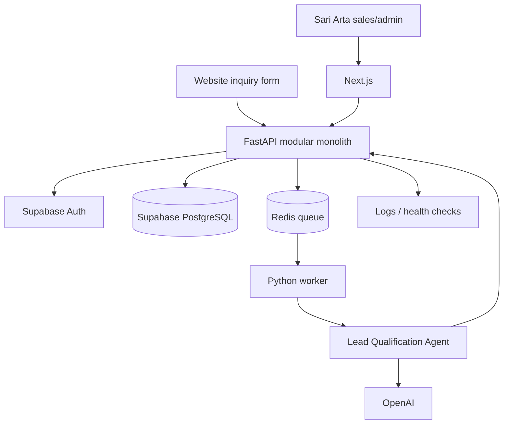

# Enterprise AI Business Development Agent Platform

## Phase 1 MVP Architecture Review and Scope

**Reference business:** Sari Arta, Indonesia commercial-kitchen engineering  
**Target:** First usable business-development assistant  
**Delivery team:** One developer or a small team  
**Roadmap authority:** `docs/roadmap.md`  
**Document version:** 1.1

## 1. MVP objectives

Phase 1 delivers one complete, usable workflow:

```text
Capture lead
→ organize customer and project information
→ plan follow-up
→ run AI qualification
→ human review
→ convert to opportunity
→ track progress on the dashboard
```

The MVP must:

- Help Sari Arta record and follow up real project inquiries.
- Replace scattered lead spreadsheets or personal notes with shared business records.
- Demonstrate an AI Agent using controlled application tools and structured output.
- Remain usable when AI is unavailable.
- Be understandable in a short portfolio demonstration.
- Be achievable without microservices, Kubernetes, omnichannel integration, or a large platform team.

### Product statement

> A Sari Arta salesperson can capture a commercial-kitchen inquiry, organize the customer and project requirements, receive a structured AI qualification, review the recommendation, convert a qualified lead into an opportunity, and see the resulting work and follow-ups in one dashboard.

### Success criteria

Phase 1 succeeds when:

- A salesperson can complete the core workflow without developer help.
- No separate spreadsheet is required for the demonstrated lead workflow.
- AI qualification uses the saved lead data and returns the required schema.
- Users can accept, reject, or rerun AI output.
- AI never converts or disqualifies a lead automatically.
- CRM work continues if OpenAI, Redis, or the worker is temporarily unavailable.
- The critical path has automated tests.
- A realistic demonstration completes in five to seven minutes.

## 2. Version 1 features

### 2.1 Authentication and access

Include:

- Supabase Auth using email/password or magic link.
- One seeded Sari Arta workspace.
- Two application roles:
  - `admin`: user access, configuration, and all sales operations.
  - `sales`: lead, contact, company, task, qualification, and opportunity work.
- Secure logout and basic user profile.
- Server-side authorization on every protected API operation.

Do not include enterprise SSO, SCIM, configurable roles, tenant switching, or self-service onboarding.

### 2.2 Lead capture

Include:

- Manual lead creation by an authenticated user.
- Public website inquiry endpoint and simple form.
- Server-side validation and rate limiting.
- Idempotency for public submission.
- Source, original inquiry, project location, target timeline, and available project details.
- Duplicate warning based on email, phone, or company domain.

The public form creates a lead but does not run AI automatically.

### 2.3 Lead management

Include:

- Lead list with search and filters for status, priority, owner, and created date.
- Lead detail and edit.
- Ownership and next-action visibility.
- Notes, tasks, activity history, and qualification history.
- Optimistic concurrency for edits.
- Status flow:

```text
new → qualifying → qualified → converted
                  ↘ disqualified
```

Disqualification and conversion are explicit human actions.

Minimum lead/project fields:

- Customer company and primary contact.
- Inquiry source and original inquiry text.
- Project country and city.
- Kitchen or project type.
- Expected capacity or usage when known.
- Required equipment or service scope when known.
- Target timeline.
- Budget and currency when known.
- Floor plan or supporting-document availability.
- Owner, priority, and next follow-up.

### 2.4 Companies and contacts

Include:

- Create, edit, view, and search customer companies.
- Create, edit, view, and search contacts.
- Link a lead or opportunity to one company and one primary contact.
- Record email, phone, WhatsApp number, preferred language, job title, and basic contact-consent status.

Do not include enrichment, complex buying committees, account hierarchies, or merge tooling.

### 2.5 Tasks and activity history

Include:

- Create, assign, complete, and reschedule tasks.
- Due date, priority, owner, and related lead or opportunity.
- Manual activity notes.
- Automatic events for:
  - Lead creation and material changes.
  - Qualification start and result.
  - Qualification acceptance or rejection.
  - Lead conversion or disqualification.
  - Opportunity stage changes.

### 2.6 Opportunity conversion and tracking

Include:

- Convert a qualified lead into an opportunity without duplicating the company or contact.
- Preserve a link to the source lead.
- Opportunity list and detail.
- Stage, owner, value, currency, probability, expected close date, project requirements, tasks, and notes.
- Stage flow:

```text
discovery → requirements_confirmed → proposal
→ negotiation → won / lost
```

Phase 1 tracks the `proposal` stage but does not generate proposal documents.

### 2.7 Dashboard

Include an actionable dashboard showing:

- New and unassigned leads.
- Leads requiring qualification review.
- Overdue and upcoming tasks.
- Lead counts by status and priority.
- Opportunity counts and value by stage.
- Recent activity.
- Clear links from every metric to the relevant work list.

Advanced forecasting, custom reports, and analytics warehousing are postponed.

### 2.8 AI Lead Qualification Agent

Include:

- A visible `Run AI qualification` action.
- Asynchronous execution with `queued`, `running`, `succeeded`, `failed`, and `cancelled` states.
- One versioned Sari Arta qualification rubric.
- Read-only, typed tools for the saved lead, company, contact, tasks, and relevant activity.
- Schema-validated output containing:
  - Score from 0 to 100.
  - Tier: `hot`, `warm`, or `cold`.
  - Project and need summary.
  - Budget, authority, need, and timeline assessment.
  - Missing information.
  - Recommended next action.
  - Confidence.
- Saved run and assessment metadata.
- Human accept, reject, and rerun actions.
- Safe timeout, retry, and error behavior.

The agent cannot execute SQL, call unrestricted HTTP, alter CRM state, send messages, or choose arbitrary models or tools.

Default qualification weights:

| Dimension | Weight |
|---|---:|
| Need and project fit | 35 |
| Timeline | 25 |
| Budget | 20 |
| Authority | 20 |

Default tiers:

- `hot`: 75–100.
- `warm`: 45–74.
- `cold`: 0–44.

Unknown budget or authority lowers confidence but does not automatically disqualify a potentially valuable project.

### 2.9 Agent-run visibility

Users see:

- Workflow and current status.
- Start and completion times.
- Safe failure message and correlation ID.
- Structured result.
- Model/provider identifier.
- Retry eligibility.
- Human-review status.

Do not display hidden model reasoning or put sensitive prompt contents in ordinary logs.

### 2.10 Minimum operational and security controls

Include:

- TLS in production.
- Secrets outside source control.
- Server-side validation and authorization.
- Public-form and AI-run rate limits.
- Minimal audit events for login and consequential business changes.
- Structured logs with request and agent-run correlation IDs.
- Health and readiness checks.
- Database backups with a tested restore procedure.
- Synthetic or anonymized development and demonstration data.

Phase 1 does not require business file storage. When Phase 2 introduces uploads, uploaded objects require a separate backup/export process because database backups do not contain the object contents.

## 3. Features postponed from Version 1

### Phase 2 — AI Enhancement

- Knowledge-document upload and approval.
- Text extraction, chunking, embeddings, and pgvector retrieval.
- RAG Knowledge Assistant and citations.
- Content Generation Agent.
- Proposal Assistant.
- Proposal versions and document export.

The database may enable pgvector during foundation work, but Phase 1 does not need a user-facing knowledge base.

### Phase 3 — Business Automation

- WhatsApp integration.
- Email integration or automated email delivery.
- n8n follow-up workflows.
- Omnichannel conversations.
- Automated outbound campaigns.
- Delivery and read receipts.

### Phase 4 — Advanced Agent System

- Customer Research Agent.
- Coordinator agent and handoffs.
- Multi-agent orchestration.
- MCP integration.
- Dynamic multi-model routing.
- Qwen or local-model production execution.
- Autonomous external follow-up.

### Platform and enterprise features

- Self-service multi-tenant SaaS.
- Subscription and billing.
- Enterprise SSO and SCIM.
- Configurable role and policy builders.
- Multiple pipelines and custom-field builders.
- Pricing engine, ERP, accounting, contracts, and e-signatures.
- Kubernetes, multi-region deployment, and separate vector databases.

OpenAI is the first Phase 1 provider. Keep a small provider boundary so Qwen or an approved local model can be introduced in Phase 4 without embedding OpenAI-specific calls throughout business services.

## 4. Simplified MVP architecture



### Component responsibilities

| Component | Phase 1 responsibility |
|---|---|
| Next.js | Authentication flow, dashboard, CRM screens, qualification review |
| FastAPI | Business API, authorization, validation, state transitions, audit |
| PostgreSQL | Canonical users, CRM, tasks, opportunities, agent runs, assessments |
| Redis and worker | Durable asynchronous qualification execution |
| OpenAI Agents SDK | Lead Qualification Agent, typed tools, structured result |
| OpenAI model | Model inference through one approved configuration |
| Docker Compose | Repeatable local and application-service deployment |

### Backend modules

```text
auth
crm
tasks
agents
audit
```

### Minimum database subset

| Area | Tables |
|---|---|
| Identity | `users`, simple memberships/roles |
| CRM | `organizations`, `contacts`, `leads`, `opportunities` |
| Work | `tasks`, `activities` |
| AI | `agent_configurations`, `agent_runs`, `lead_assessments` |
| Reliability | `idempotency_keys`, minimal job metadata |
| Audit | `audit_events` |

Keep a seeded `tenant_id` for future compatibility, but do not build tenant-management behavior.

### Minimum API groups

- Session/current user.
- Organizations and contacts.
- Leads and public inquiry submission.
- Tasks and activities.
- Qualification start, status, result, acceptance, rejection, and retry.
- Lead conversion.
- Opportunities and stage changes.
- Dashboard summary.
- Health and readiness.

### Frontend pages

1. Login.
2. Dashboard.
3. Leads list.
4. Lead create/edit/detail and qualification review.
5. Companies and contacts.
6. Opportunity list and detail.
7. Small admin access page.

Use tabs or panels for tasks, activity, and AI runs rather than separate applications.

## 5. Development priorities

### Priority 1 — Reliable foundation

- Repository application structure.
- Docker Compose development environment.
- Next.js and FastAPI shells.
- Supabase Auth integration.
- PostgreSQL migrations.
- CI-quality linting, types, and tests.

### Priority 2 — Usable CRM

- Companies and contacts.
- Manual and public lead capture.
- Lead list, detail, filtering, ownership, and status.
- Tasks and activity history.
- Opportunity conversion and tracking.
- Dashboard.

The application must be useful before AI is added.

### Priority 3 — Lead Qualification Agent

- Durable asynchronous execution.
- Versioned prompt/configuration.
- Typed read-only tools.
- Structured assessment.
- Human acceptance/rejection.
- Evaluation cases and safe failure.

### Priority 4 — Operational readiness

- Authorization tests.
- Rate limits.
- Audit events.
- Logs and health checks.
- Backup/restore validation.
- Seeded synthetic demo.
- Critical end-to-end test and demo script.

## 6. Recommended implementation order

### Step 1 — Scaffold and local environment

Deliver:

- Next.js, FastAPI, worker, Redis, and Docker Compose structure.
- Environment-variable templates without secrets.
- Health endpoints and basic validation commands.

Exit: all local services start and report healthy.

### Step 2 — Authentication and database foundation

Deliver:

- Supabase Auth integration.
- Admin and sales authorization.
- Initial SQLAlchemy models and Alembic migrations.
- Seeded workspace and synthetic users/data.

Exit: authenticated requests reach protected API operations and role checks are tested.

### Step 3 — CRM vertical slice

Deliver:

- Company, contact, and lead create/list/detail/update.
- Public inquiry endpoint/form.
- Search, filters, ownership, status, and duplicate warning.

Exit: a lead can be captured and managed entirely through the application.

### Step 4 — Work tracking and opportunity conversion

Deliver:

- Tasks and activity timeline.
- Qualification placeholders/status area.
- Transactional lead conversion.
- Opportunity list, detail, and stage changes.

Exit: a user can follow up and convert a lead without duplicated business records.

### Step 5 — Dashboard

Deliver:

- Actionable lead and task queues.
- Opportunity summary.
- Recent activity.
- Links from metrics to filtered records.

Exit: a salesperson can identify the next work item from the dashboard.

### Step 6 — Asynchronous agent runtime

Deliver:

- Redis-backed queue and worker.
- Agent-run persistence.
- Status polling or server events.
- Timeouts, retry rules, cancellation, and correlation IDs.

Exit: a test job survives browser refresh and reports a terminal state.

### Step 7 — AI Lead Qualification

Deliver:

- Versioned agent configuration.
- Typed read-only CRM tools.
- Structured output validation.
- Assessment display and history.
- Human accept, reject, and rerun.
- Representative synthetic evaluation cases.

Exit: representative leads produce reviewable results without automatic business-state changes.

### Step 8 — Hardening and demonstration

Deliver:

- Authorization, validation, API, agent-contract, and critical end-to-end tests.
- Rate limiting, audit events, logs, backups, and restore documentation.
- Loading, empty, error, and AI-unavailable states.
- Synthetic Sari Arta demo data and short demo script.

Exit: all Phase 1 roadmap acceptance criteria pass.

## 7. Recommended delivery size

For one experienced full-stack developer, plan approximately **5–8 focused weeks**:

| Workstream | Relative effort |
|---|---:|
| Foundation, auth, and database | 20% |
| CRM and opportunity workflow | 35% |
| Dashboard | 10% |
| Agent runtime and qualification | 20% |
| Testing, hardening, and demo | 15% |

This is an estimate, not a commercial delivery commitment. Production access, real business data, and external service costs still require human approval.

## 8. Final Phase 1 boundary

Phase 1 is complete with:

- One Sari Arta workspace.
- Secure admin and sales access.
- Manual and website lead capture.
- Companies, contacts, leads, tasks, activities, and opportunities.
- An actionable dashboard.
- Structured AI lead qualification with human review.
- Observable agent runs and safe retry.
- Docker-based operation, tests, logging, health checks, and database recovery.

Phase 1 does not include:

- RAG or a knowledge assistant.
- Content or proposal generation.
- WhatsApp, email, or n8n automation.
- Customer research.
- Multi-agent orchestration.
- MCP integration.
- Qwen/local-model production support.
- General enterprise SaaS.

This boundary is the current implementation authority.
