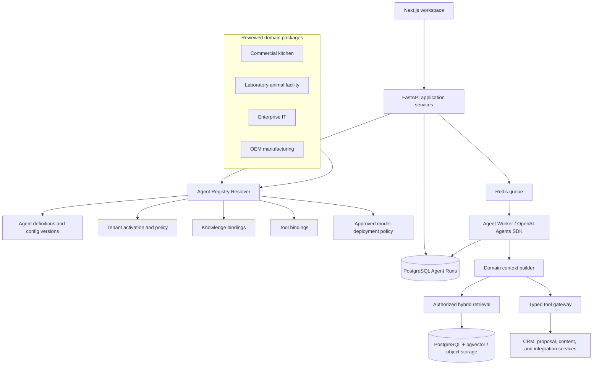
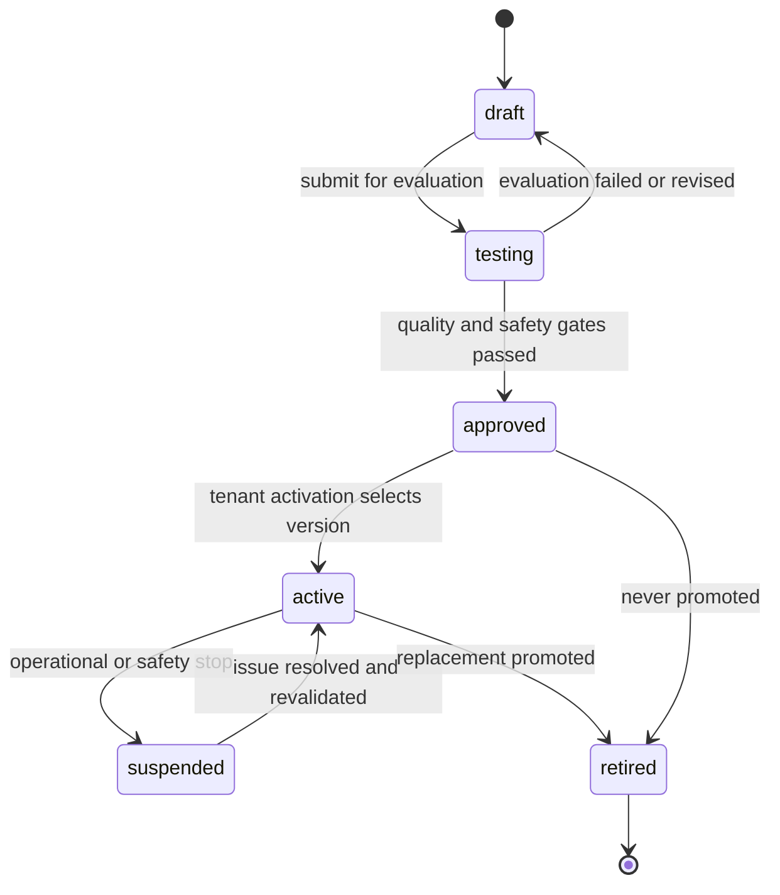
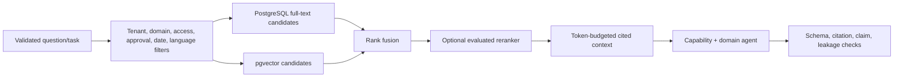
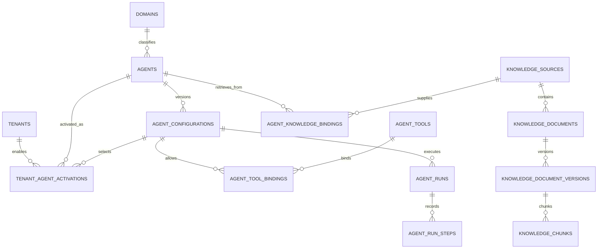

# Phase 2 Agent Framework Design

## Reusable Multi-Domain AI Business Development Platform

**Status:** Planning baseline; no implementation is authorized by this document  
**Current production baseline:** Phase 1 Sari Arta MVP accepted through M8  
**Primary stack:** Next.js, FastAPI, PostgreSQL/pgvector, Redis Worker, OpenAI Agents SDK, n8n, Docker  
**Document version:** 1.0

> 中文审阅版：[Phase 2 智能体框架设计（中文）](phase-2-agent-framework-design.zh-CN.md)。本英文文档保留为字段、表名、接口和后续实施的正式技术基线。

## 1. Purpose

Phase 2 turns the working Sari Arta lead-to-opportunity assistant into a reusable framework for several business-development domains without replacing or destabilizing the Phase 1 application.

The intended model is:

```text
Shared CRM and Agent Runtime
        +
Versioned Domain Package
        +
Approved Knowledge Bindings
        +
Least-privilege Tool Bindings
        =
Activated Domain Agent
```

Example domain packages include:

- Sari Arta Commercial Kitchen Agent.
- Laboratory Animal Facility Agent.
- Enterprise IT Solution Agent.
- OEM Manufacturing Agent.

The framework must reuse identity, CRM, Agent Run reliability, human review, logging, audit, and deployment capabilities from Phase 1. A domain package changes business vocabulary, qualification policy, knowledge, schemas, and allowed tools; it does not receive a separate database, unrestricted code execution, or permission to bypass shared controls.

## 2. Scope and non-goals

### 2.1 Phase 2 planning scope

- A registry for discoverable, versioned agents.
- A safe domain-package contract.
- Tenant-specific agent activation and configuration.
- Knowledge-source, document, version, chunk, and agent-binding design.
- Typed tool registration and least-privilege agent bindings.
- A migration path for the current Lead Qualification Agent.
- Compatibility with future OpenAI, Qwen, and approved private model deployments through the existing provider-adapter direction.

### 2.2 Non-goals

- No dynamic upload or execution of Python/JavaScript agent code.
- No marketplace or self-service SaaS billing.
- No unrestricted prompt editor for ordinary users.
- No arbitrary SQL, shell, HTTP, file, n8n workflow, or MCP access.
- No autonomous customer communication, pricing, technical guarantees, or proposal issuance.
- No multi-agent coordinator until individual capability agents and their tools pass evaluation.
- No Phase 1 table rename or destructive migration merely for naming consistency.

## 3. Architectural principles

1. **Preserve the working vertical slice.** The current qualification API and Worker remain operational while the registry is introduced behind them.
2. **Stable identity, immutable versions.** An agent has a stable identity; instructions, schemas, tools, model requirements, and policies belong to immutable configuration versions.
3. **Domain is configuration plus reviewed code.** Database records select approved domain behavior. They never contain executable plugin code.
4. **Capabilities are explicit.** Agents declare workflow, model, knowledge, language, and tool requirements; activation validates every dependency.
5. **Tenant activation is separate from platform availability.** A registered agent is not usable by a tenant until explicitly activated for that tenant.
6. **Knowledge is deny-by-default.** A document being active does not make it available to every agent. An active, authorized binding is also required.
7. **Tools are server-owned capabilities.** Tool names resolve to reviewed application adapters and receive an unforgeable runtime principal.
8. **Runs are reproducible.** Every run records exact agent/config, knowledge-policy, tool-policy, schema, model deployment, and business-object versions.
9. **Human control survives reuse.** A new domain cannot weaken approval rules owned by the platform or tenant.
10. **Measure before generalizing.** Sari Arta becomes the first domain package; a second domain proves the abstraction before more are added.

## 4. Target component architecture



The resolver assembles a `ResolvedAgentSpec` from database configuration and a reviewed code registry. The Worker receives that resolved snapshot or immutable identifiers—not an arbitrary prompt supplied by the browser.

## 5. Agent Registry

### 5.1 Agent model

An agent is represented at four levels:

| Level | Responsibility | Example |
|---|---|---|
| Domain | Business vocabulary, schemas, rules, UI labels, evaluation corpus | `commercial_kitchen` |
| Agent | Stable capability identity and owner | `sari_arta.lead_qualification` |
| Configuration | Immutable executable policy version | version 2 of the qualification instructions and output schema |
| Activation | Tenant-specific selection and operating limits | Sari Arta activates configuration v2 in English and Chinese |

The stable `Agent` definition contains:

- `agent_key`: globally stable machine key.
- `display_name` and description.
- `domain_key`.
- `agent_type`: `qualification`, `knowledge`, `content`, `proposal`, or future specialist.
- Supported workflow types and input/output contract keys.
- Owning team/module and code implementation key.
- Platform status and deprecation information.

An agent definition does not contain mutable prompt text, credentials, or runtime secrets.

### 5.2 Configuration model

Each configuration version freezes:

- Instruction/prompt artifact reference and content digest.
- Input and output schema versions.
- Required model capabilities and allowed routing policy.
- Tool binding policy and per-tool limits.
- Knowledge retrieval policy.
- Guardrails and approval policy.
- Time, turn, token, retrieval, and cost budgets.
- Supported locales.
- Evaluation suite version and minimum score.
- Creator, approval, activation, and retirement metadata.

Editing an active configuration creates a new draft version. Existing runs continue to reference the old version.

### 5.3 Lifecycle



The stable agent may be `available`, `suspended`, `deprecated`, or `retired`. Configuration status is separate so one bad version can be suspended without deleting the agent or its run history.

### 5.4 Activation

Activation is a transactional command, not a direct status edit. The activation service checks:

1. Agent and configuration are approved and compatible.
2. The tenant is entitled to the domain and workflow.
3. Required permissions and approval policies exist.
4. Bound tools are active and their versions satisfy the configuration.
5. Knowledge bindings reference active, approved sources/documents.
6. At least one evaluated model deployment satisfies capabilities, data region, classification, language, latency, and budget constraints.
7. Required evaluation suite passed for the exact configuration/tool/model combination.
8. No global or tenant emergency-stop policy blocks activation.

Activation records the actor, time, reason, exact configuration, effective policy digests, and optional rollout percentage. Only one configuration may be primary for a `(tenant, agent, environment)` tuple. Rollback selects the previous approved configuration; it never edits history.

### 5.5 Runtime resolution

The runtime resolver accepts server-controlled inputs:

```text
tenant + workflow_type + business_object + initiating_principal
```

It returns:

```text
agent_id
agent_config_id and immutable digest
domain package/version
input/output schemas
model requirements/routing policy
allowed tool bindings
knowledge bindings/retrieval limits
guardrails and approval requirements
execution budgets
```

Resolution fails closed when the requested workflow is inactive, ambiguous, incompatible, or missing a required dependency. Ordinary callers cannot select system instructions, tools, provider, model, or knowledge collections.

## 6. Domain Agent Architecture

### 6.1 Domain package contract

A domain package is a reviewed application module plus versioned data. It implements a common contract:

- Stable `domain_key` and semantic version.
- Business labels and supported locales.
- Domain-specific lead/project profile schema.
- Qualification rubric and structured output schema.
- Context-mapping functions from shared CRM records.
- Knowledge taxonomy and required document types.
- Allowed capability/tool keys.
- Guardrail additions and human-approval rules.
- Representative synthetic evaluation cases.
- UI presentation hints that cannot alter authorization or business rules.

Packages are deployed with the application. A database record can activate an installed package but cannot install code.

### 6.2 Shared versus domain-specific responsibilities

| Shared platform | Domain package |
|---|---|
| Identity, roles, tenant context | Domain terminology and field labels |
| Companies, contacts, leads, opportunities, tasks | Project profile schema and validation |
| Agent Run queue, retry, cancellation, recovery | Qualification rubric and output interpretation |
| Model routing and budgets | Required model/language capabilities |
| Tool authorization and audit | Allowlisted domain tool selection |
| Knowledge ingestion/retrieval pipeline | Knowledge taxonomy and retrieval filters |
| Approval engine | Additional domain risk/approval rules |
| Logging, audit, metrics, backup | Synthetic evaluation corpus and thresholds |

Shared CRM fields remain relational. Variable domain requirements use a versioned domain profile rather than adding every industry's fields to `leads` or storing an undocumented JSON object.

Recommended future record:

```text
business_object_domain_profiles
- tenant_id
- domain_id
- subject_type: lead | opportunity | organization
- subject_id
- schema_key and schema_version
- validated_data jsonb
- created_at, updated_at, version
```

Frequently filtered fields should later graduate into typed columns or domain child tables based on measured query needs.

### 6.3 Example packages

#### Sari Arta Commercial Kitchen Agent

- Project types: schools, hospitals, factories/corporate cafeterias, central kitchens.
- Core signals: meals/capacity, facility type, floor plan, utilities, hygiene zoning, service scope, location, timeline, budget, authority.
- Knowledge: engineering capability, approved equipment catalogues, cases, installation scope, exclusions, service policies.
- Tools: CRM reads, tasks, approved knowledge search, qualification draft save; later proposal-draft save.
- Guardrails: no invented pricing, delivery date, utility calculation, compliance guarantee, or completed-project claim.

#### Laboratory Animal Facility Agent

- Core signals: species, capacity, biosafety level, facility zones, HVAC/environmental requirements, accreditation context, commissioning timeline.
- Knowledge: approved standards, equipment manuals, facility design guidance, validated organizational capabilities.
- Guardrails: no unsupported animal-welfare, biosafety, regulatory, engineering, or certification claims; domain-expert review required.

#### Enterprise IT Solution Agent

- Core signals: users/sites, current architecture, security/compliance needs, integrations, migration constraints, SLA, budget, procurement path.
- Knowledge: approved solution architectures, service catalogue, compatibility matrices, case studies, security statements.
- Guardrails: no unapproved security assurance, license price, SLA, data-residency, or compatibility commitment.

#### OEM Manufacturing Agent

- Core signals: product category, drawings/specification maturity, materials, tolerances, certifications, MOQ, target cost, volume, tooling, quality and delivery requirements.
- Knowledge: approved processes, machine capabilities, material rules, quality systems, capacity statements, case studies.
- Guardrails: no manufacturability, tolerance, certification, cost, capacity, or delivery guarantee without engineering/commercial verification.

### 6.4 Capability agents versus domain agents

Do not create a separate implementation of every capability for every industry. Use two axes:

- **Capability agent:** qualification, knowledge answering, content drafting, proposal drafting.
- **Domain package:** commercial kitchen, laboratory facility, enterprise IT, OEM.

An activated agent combines both, for example:

```text
qualification capability + commercial_kitchen domain
knowledge_assistant capability + enterprise_it domain
proposal_drafting capability + oem_manufacturing domain
```

The first Phase 2 implementation should prove this composition with Sari Arta qualification and knowledge assistance. A second domain should initially reuse only qualification and knowledge assistance; it should not trigger a generic multi-agent coordinator.

## 7. Knowledge Architecture

### 7.1 Knowledge layers

| Layer | Examples | Ownership |
|---|---|---|
| Platform policy | Safety, approval, citation rules | Platform operator |
| Domain reference | Public standards taxonomy, domain glossary, generic methods | Domain owner; licensing reviewed |
| Tenant knowledge | Sari Arta capabilities, approved catalogues, policies, cases | Tenant knowledge manager |
| Opportunity context | Customer brief, drawings, requirements, meeting notes | Authorized opportunity team |

These layers remain distinct in storage and retrieval. Domain knowledge is never silently treated as a tenant's own capability, and one tenant's material is never shared with another.

For the first implementation, all retrievable records remain tenant-scoped. A reviewed domain-reference release is copied/materialized into a tenant-owned source with its origin and release digest preserved. A cross-tenant shared retrieval library is postponed until licensing, update propagation, RLS, and revocation behavior are proven necessary.

### 7.2 Source and document lifecycle

```text
registered source
→ uploaded/synchronized file
→ malware and type validation
→ immutable document version
→ extraction and language detection
→ chunking
→ embedding and full-text indexing
→ human approval
→ eligible for bound-agent retrieval
→ superseded/expired/archived
```

Only clean, approved, effective, non-quarantined versions are retrievable. Reprocessing creates a new processing artifact/version or embedding set; it does not overwrite evidence used by an earlier Agent Run.

### 7.3 Knowledge sources

Supported source classes should be added incrementally:

1. Manual text and controlled file upload.
2. Approved website snapshot/import.
3. Product catalogue or document repository integration.
4. Later, approved CRM/opportunity documents.

Each source records tenant/domain scope, owner, source type, access policy, synchronization policy, data classification, retention, default language, and safe connector configuration. Credentials remain in a secret manager.

### 7.4 Agent knowledge binding

An agent does not query every source in its tenant. `agent_knowledge_bindings` specifies:

- Agent and optional configuration version.
- Source, document collection, or taxonomy scope.
- Binding purpose such as `qualification_evidence`, `answering`, `content_claims`, or `proposal_scope`.
- Required/optional status.
- Allowed document types and languages.
- Maximum data classification.
- Retrieval policy: top-k, candidate cap, hybrid weights, reranker, score floor, context-token budget.
- Citation requirement.
- Binding status and effective dates.

Runtime authorization intersects, rather than unions, tenant policy, user/object access, agent binding, document access, and provider data policy.

### 7.5 Future RAG design

Retrieval uses PostgreSQL full-text search plus pgvector initially:



Requirements:

- Apply authorization filters before text leaves PostgreSQL.
- Cite document, immutable version, page/section, and chunk.
- Record retrieved chunk IDs and scores on the Agent Run.
- Exclude prompt-like instructions found in retrieved content from system policy.
- Return `insufficient_evidence` when the approved corpus does not support an answer.
- Evaluate retrieval recall, citation correctness, faithfulness, answer completeness, latency, and cost per domain/language.
- Support parallel embedding versions if dimensions/models change; never mix incompatible vectors in one column.

## 8. Tool Architecture

### 8.1 Tool categories

| Category | Examples | Default risk |
|---|---|---|
| Read | `get_lead_context`, `get_opportunity`, `list_open_tasks` | Low, still authorized/audited where sensitive |
| Retrieval | `search_approved_knowledge`, `get_citation_source` | Low to medium |
| Draft write | `save_assessment_draft`, `save_content_draft`, `save_proposal_draft` | Medium; validated and versioned |
| Business command | `create_task`, `submit_for_approval` | Medium/high; deterministic service owns transition |
| External action | future `send_approved_message`, `publish_approved_content` | High; human approval and policy check required |
| Workflow | `start_approved_workflow` | Depends on allowlisted workflow and effects |

### 8.2 Tool contract

Every registered tool has:

- Stable `tool_key`, semantic version, implementation key, and owner.
- Strict JSON input/output schemas.
- Required platform permissions and supported subject types.
- Risk class and side-effect class.
- Idempotency, timeout, retry, and rate-limit policy.
- Approval policy and data-classification limit.
- Redaction and audit policy.
- Availability and deprecation status.

The model supplies only validated business arguments. The runtime injects tenant, principal, agent/config, run, correlation, locale, and allowed-object context. A tool cannot accept a model-selected tenant ID, secret reference, database connection, base URL, or raw access token.

### 8.3 Tool gateway

The gateway performs, in order:

1. Resolve the bound tool/version for the active configuration.
2. Verify run status and cancellation.
3. Verify platform permission, tenant, object, ownership, and domain constraints.
4. Validate and normalize arguments.
5. Enforce approval, idempotency, budget, rate, timeout, and concurrency policies.
6. Call a narrow FastAPI application service or approved integration adapter.
7. Validate and minimize the result.
8. Record redacted execution/audit metadata.

Tool exceptions become stable safe codes. Raw provider, SQL, network, or secret errors are never returned to the model or ordinary user.

### 8.4 External integrations

External services remain behind canonical adapters:

- CRM/application tools call in-process application services.
- Knowledge tools call the authorized retrieval service.
- Provider tools use configured integration accounts and secret references.
- n8n is invoked only through allowlisted workflow definitions with typed input/output schemas.
- Future MCP servers are treated as integration adapters, not trusted extensions; every exposed MCP operation still requires a registered tool wrapper and policy enforcement.

No agent receives generic `http_request`, arbitrary n8n workflow ID, or unrestricted MCP discovery in production.

### 8.5 Workflow execution

Long-running tools and workflows use the durable Agent Run/Worker pattern:

```text
tool request validated
→ durable execution/step saved
→ queued
→ adapter execution
→ retry or approval pause
→ validated result
→ Agent Run resumes
```

Consequential workflows pause with a content/action digest. Approval applies to the exact action. Changed arguments invalidate the approval.

## 9. Database Changes

All changes are additive. Existing `agent_configurations` and `agent_runs` are retained.

### 9.1 Core registry tables

#### `domains`

| Field | Purpose |
|---|---|
| `id`, timestamps | UUID identity and audit timestamps |
| `domain_key` | Unique stable key such as `commercial_kitchen` |
| `display_name`, `description` | Administrative presentation |
| `package_key`, `package_version` | Reviewed code package identity |
| `profile_schema_key`, `profile_schema_version` | Domain data contract |
| `status` | `draft`, `available`, `suspended`, `deprecated`, `retired` |
| `owner`, `metadata` | Bounded governance metadata |

#### `agents`

| Field | Purpose |
|---|---|
| `id`, timestamps | Stable UUID identity |
| `agent_key` | Globally unique immutable key |
| `domain_id` | Nullable for domain-neutral capability; FK to `domains` |
| `agent_type` | Qualification, knowledge, content, proposal, specialist |
| `display_name`, `description` | Administrative presentation |
| `implementation_key` | Reviewed server implementation; not executable source |
| `input_contract_key`, `output_contract_key` | Schema registry keys |
| `status` | `draft`, `available`, `suspended`, `deprecated`, `retired` |
| `owner`, `deprecated_at`, `replacement_agent_id` | Lifecycle governance |

Indexes: unique `agent_key`; `(domain_id, agent_type, status)`.

#### Existing `agent_configurations` (`agent_configs` logical name)

The requested `agent_configs` concept already exists physically as `agent_configurations`. Do not create a duplicate table or rename it during Phase 2. Add:

| Field | Purpose |
|---|---|
| `agent_id` | Required FK to stable `agents` after backfill |
| `config_digest` | Unique immutable digest of effective configuration |
| `input_schema_version` | Complements existing output schema version |
| `required_model_capabilities` | Validated JSON policy |
| `tool_policy_version`, `knowledge_policy_version` | Reproducibility |
| `guardrail_policy`, `approval_policy` | Validated policies |
| `supported_locales` | Constrained array or child table |
| `evaluation_suite_version`, `evaluation_result_id` | Promotion evidence |
| `created_by`, `approved_by`, `approved_at`, `activated_at` | Governance |

Change uniqueness from `(tenant_id, agent_key, version_number)` only after backfill to `(tenant_id, agent_id, version_number)`. Retain `agent_key` temporarily for compatibility, then deprecate it after all code reads through `agents`.

#### `tenant_agent_activations`

| Field | Purpose |
|---|---|
| `id`, `tenant_id`, `agent_id` | Tenant-scoped activation |
| `agent_configuration_id` | Exact selected version |
| `environment` | `development`, `staging`, `production` |
| `status` | `pending`, `active`, `suspended`, `retired` |
| `locale_policy`, `model_routing_policy_id` | Tenant runtime policy |
| `rollout_percentage` | Controlled rollout, normally 100 for MVP tenants |
| `activated_by`, `activated_at`, `suspended_at`, `reason` | Audit |

Unique active activation for `(tenant_id, agent_id, environment)`. Index `(tenant_id, status, agent_id)`.

### 9.2 Knowledge tables

Use the existing enterprise names:

- `knowledge_sources`.
- `knowledge_documents`.
- `knowledge_document_versions`.
- `knowledge_chunks`.
- Optional `knowledge_embedding_sets` when multiple embedding models/dimensions are needed.
- `agent_knowledge_bindings` to connect an agent/configuration to allowed knowledge.

`agent_knowledge_bindings` fields:

| Field | Purpose |
|---|---|
| `id`, `tenant_id`, timestamps | Tenant-scoped identity |
| `agent_id`, optional `agent_configuration_id` | Default or version-specific binding |
| `knowledge_source_id` | Required source FK; optional collection/document child bindings later |
| `purpose` | Qualification, answering, content, proposal |
| `status`, effective dates | Lifecycle |
| `required` | Activation fails if required source is unavailable |
| `document_type_filter`, `language_filter` | Validated filters |
| `maximum_classification` | Data-policy ceiling |
| `retrieval_policy` | Validated limits/weights, not executable code |
| `citations_required` | Output requirement |

Unique logical binding `(tenant_id, agent_configuration_id, knowledge_source_id, purpose)`; indexes for active agent bindings and source impact analysis.

### 9.3 Tool tables

#### `agent_tools`

This is the tool-definition registry requested for Phase 2.

| Field | Purpose |
|---|---|
| `id`, timestamps | Stable UUID identity |
| `tool_key`, `version_number` | Unique tool/version identity |
| `display_name`, `description` | Administrative presentation |
| `implementation_key` | Reviewed adapter key |
| `category`, `risk_class`, `side_effect_class` | Policy classification |
| `input_schema`, `output_schema` | Strict versioned JSON schemas or schema references |
| `required_permissions` | Validated permission keys |
| `supported_subject_types` | Lead, opportunity, organization, etc. |
| `idempotency_policy`, `timeout_seconds`, `retry_policy` | Reliability contract |
| `approval_policy`, `audit_policy`, `redaction_policy` | Governance |
| `maximum_data_classification` | Data boundary |
| `status`, `deprecated_at` | Lifecycle |

Unique `(tool_key, version_number)`; index `(status, tool_key)`.

#### `agent_tool_bindings`

| Field | Purpose |
|---|---|
| `id`, optional `tenant_id` | Platform default or tenant-specific binding |
| `agent_configuration_id`, `agent_tool_id` | Exact config/tool version |
| `status` | `active`, `disabled`, `retired` |
| `required` | Activation requirement |
| `usage_limits` | Calls/run, calls/minute, result-size cap |
| `argument_constraints` | Validated narrowing constraints |
| `approval_override` | May strengthen, never weaken, base policy |
| `created_by`, timestamps | Governance |

Unique `(agent_configuration_id, agent_tool_id)`; index active bindings by configuration.

#### Execution records

Add or activate the enterprise `agent_run_steps` design. Tool steps record tool/version, status, timing, safe error, approval reference, idempotency key, and redacted input/output digest. Do not store secrets or unrestricted payloads.

### 9.4 Domain profile and evaluation tables

Recommended supporting tables:

- `business_object_domain_profiles` for versioned validated domain data.
- `agent_evaluation_suites` and immutable `agent_evaluation_results`.
- `agent_activation_events` or general audit events for every activation/suspension/rollback.
- Later `model_providers`, `model_deployments`, and `model_routing_policies` from the enterprise database design.

### 9.5 Relationship summary



All tenant-owned tables use forced PostgreSQL RLS. Cross-table services verify that every related tenant ID matches; foreign keys alone do not prove tenant consistency unless composite tenant-aware keys are used.

## 10. API and Administration Direction

Phase 2 should introduce administrative resources gradually:

- `GET /api/v1/agents` — list agents available to the tenant.
- `GET /api/v1/agents/{agent_id}` — inspect stable definition and active version.
- `GET /api/v1/agents/{agent_id}/configurations` — version history.
- `POST /api/v1/agent-configurations/{id}/evaluation-runs` — evaluate a draft.
- `POST /api/v1/agent-configurations/{id}/activations` — activate after gates pass.
- `POST /api/v1/agent-activations/{id}/suspensions` — emergency or planned stop.
- Knowledge and tool endpoints follow `docs/api-design.md`.

The generic `POST /api/v1/agent-runs` accepts only an allowlisted workflow and typed business input. Existing domain-specific endpoints remain preferred and can call the same resolver internally.

Administration UI should show dependencies, evaluation evidence, active version, change digest, knowledge/tool bindings, model policy, rollout, run health, and rollback—not raw secrets or hidden reasoning.

## 11. Migration Plan

### Stage 0 — Protect the Phase 1 baseline

- Tag/document the accepted M8 database revision, API behavior, demo dataset, and tests.
- Keep the existing qualification endpoint, deterministic mock provider, Worker queue, and run recovery behavior.
- Add characterization tests around configuration lookup and saved Agent Run references before changing resolution.

### Stage 1 — Add the registry schema

- Add `domains`, `agents`, and `tenant_agent_activations` through additive migrations.
- Add nullable `agent_id` and new governance fields to existing `agent_configurations`.
- Register the installed `commercial_kitchen` domain and stable Sari Arta qualification agent.
- Do not change runtime reads yet.

### Stage 2 — Backfill Sari Arta as the first domain agent

Create deterministic records:

```text
domain_key: commercial_kitchen
agent_key: commercial_kitchen.lead_qualification
agent_type: qualification
implementation_key: lead_qualification_v1
tenant: Sari Arta
active configuration: current Phase 1 configuration
```

- Link every existing `agent_configuration` to the new stable agent.
- Existing `agent_runs.agent_configuration_id` remains unchanged, preserving history.
- Create an active Sari Arta tenant activation pointing to the current configuration.
- Represent the existing rubric, schemas, limits, mock/OpenAI provider requirements, and human-review rule as the first immutable configuration snapshot.

### Stage 3 — Introduce the resolver behind the current API

- Implement the registry resolver behind a feature flag.
- Shadow-resolve requests and compare the result with the existing hard-coded configuration selection without changing execution.
- After parity tests pass, let `POST /leads/{id}/qualification-runs` resolve the Sari Arta agent through the registry.
- Retain the existing route, request, response, idempotency, run records, retry, cancellation, recovery, and dashboard behavior.
- Rollback disables registry resolution and returns to the Phase 1 lookup; no data rollback is required.

### Stage 4 — Introduce tool registration

- Register current qualification context reads and assessment draft/save behavior as reviewed tools or runtime capabilities.
- Add exact tool bindings to the Sari Arta configuration.
- Run in audit/shadow mode before enforcing the binding policy.
- Enforce least privilege only after existing evaluation and integration tests demonstrate parity.

### Stage 5 — Introduce knowledge infrastructure

- Implement file metadata/object storage, malware gate, sources, documents, immutable versions, chunks, and processing jobs.
- Start with manual upload and English/Chinese Sari Arta documents.
- Add approval and access controls before retrieval.
- Add `agent_knowledge_bindings`; no source becomes globally retrievable by default.
- Release a cited Knowledge Assistant with `insufficient_evidence` behavior before content/proposal agents.

### Stage 6 — Add Phase 2 capability agents

Recommended order:

1. Sari Arta Knowledge Assistant.
2. Sari Arta Content Drafting Agent with human approval.
3. Sari Arta Proposal Drafting Agent with deterministic pricing boundaries and versioned drafts.
4. Evaluation, usage, latency, cost, and citation dashboards.

Qualification remains operational throughout.

### Stage 7 — Prove a second domain

- Select one domain with an available subject-matter reviewer and synthetic evaluation set.
- Add its domain package, profile schema, knowledge taxonomy, qualification configuration, and tool bindings.
- Reuse the same CRM, registry, Worker, retrieval, and approval services.
- Record every required framework change. Generalize only requirements demonstrated by both domains.

Do not onboard all example domains simultaneously.

## 12. Compatibility and rollout

### 12.1 Backward compatibility

- Preserve existing Phase 1 URLs and response shapes.
- Keep `agent_runs.agent_configuration_id` valid and immutable.
- Do not rename `agent_configurations` to `agent_configs`.
- Add nullable columns first, backfill, validate, then enforce non-null constraints in a later migration.
- Dual-read/shadow compare before switching critical resolution logic.
- Never recompute or rewrite historical qualification outputs using a new configuration.

### 12.2 Failure isolation

- Suspending one domain agent does not disable CRM or other agents.
- Missing knowledge produces `insufficient_evidence`, not invented output.
- Tool or integration failure does not mutate business state outside a committed deterministic transaction.
- Model/provider failure follows the M8 bounded retry and recovery behavior.
- Global and tenant emergency stops can block new runs while allowing CRM reads and manual work.

### 12.3 Security review gates

Before activating a new domain/configuration:

- Threat-model domain data and prompt-injection exposure.
- Approve provider/data-region policy.
- Verify RLS and object authorization.
- Review every tool binding and approval rule.
- Scan and approve knowledge sources.
- Pass structured-output, tool misuse, leakage, citation, harmful-output, latency, and cost evaluations.
- Confirm safe cancellation, retry, recovery, audit, and rollback.

## 13. Phase 2 implementation milestones

This document recommends the following planning sequence; it does not mark any item implemented:

| Milestone | Outcome |
|---|---|
| P2-M1 Registry foundation | Stable domains/agents, versioned configs, Sari Arta backfill, shadow resolver |
| P2-M2 Knowledge ingestion | Secure upload, document versions, processing, approval, hybrid retrieval |
| P2-M3 Knowledge Assistant | Cited Sari Arta answers with evaluation and insufficient-evidence behavior |
| P2-M4 Tool registry | Versioned tools/bindings, execution steps, approval-aware gateway |
| P2-M5 Content Agent | Knowledge-grounded drafts and human approval |
| P2-M6 Proposal Agent | Structured versioned drafts; deterministic commercial calculations |
| P2-M7 Second-domain proof | One additional domain reuses the framework without duplicating the platform |

Each milestone requires migrations, authorization tests, RLS tests, contract tests, agent evaluations, operational metrics, documentation, and a rollback procedure.

## 14. Decisions required before implementation

Technical planning can continue, but implementation should not start until these decisions are recorded:

1. Which second domain will prove reuse, and who can validate its business rules?
2. Which Sari Arta documents are approved for Phase 2 ingestion and external model processing?
3. Which languages are required for the first knowledge release: English/Chinese only, or Bahasa Indonesia as well?
4. Which production model deployments and data regions are approved for each data classification?
5. Who may curate knowledge, approve agent configurations, and activate or suspend agents?
6. What citation quality, latency, cost, and domain accuracy thresholds constitute a release pass?

Until those decisions are approved, the Phase 1 Sari Arta qualification workflow remains the production baseline.
