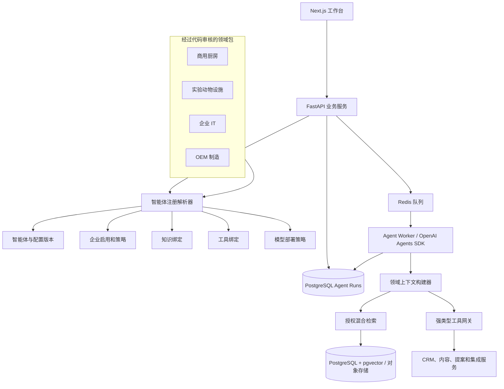
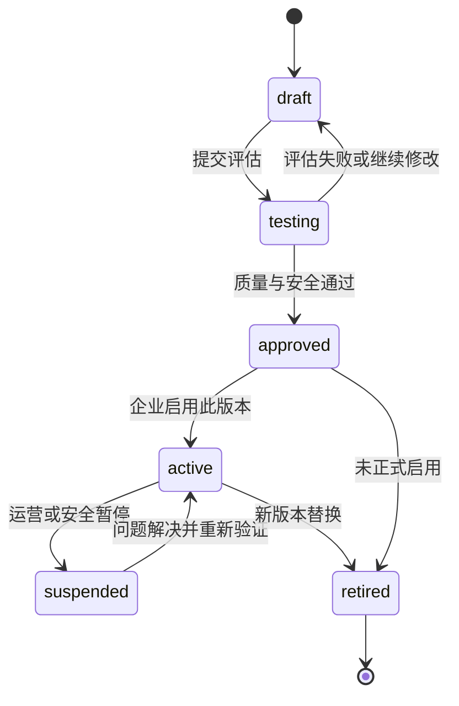
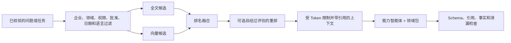
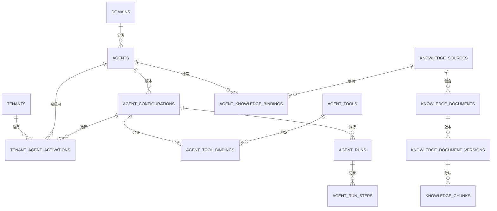

# Phase 2 智能体框架设计

## 可复用的多领域 AI 商务拓展平台

**状态：** 规划基线；本文档不代表已经批准开发或部署  
**当前系统基线：** Sari Arta Phase 1 MVP 已完成 M8 验收  
**主要技术栈：** Next.js、FastAPI、PostgreSQL/pgvector、Redis Worker、OpenAI Agents SDK、n8n、Docker  
**文档版本：** 1.0

> 英文技术基线：[Phase 2 Agent Framework Design](phase-2-agent-framework-design.en.md)。中文版本用于业务和架构审核；数据库表名、字段名、接口和状态值以英文技术基线为准。

## Phase 2.5 实现说明

本框架描述的可复用知识基础现已用于明确绑定并批准的 Sari Arta 文档。它包括租户范围的
来源、精确领域/智能体绑定、持久化摄取、提取、分块、Embedding 适配器、pgvector 证据
检索和引用元数据。这仍然只是基础设施：尚未启用对话式知识助手。IVC 智能体继续保持
`knowledge_enabled = false`，其检索能力仍为计划状态。参见
`docs/knowledge-foundation-design.zh-CN.md`。

## 1. 设计目的

Phase 2 的目标，是把已经能够工作的 Sari Arta 线索到商机系统，逐步升级成可服务多个行业的 AI 商务拓展框架，同时不重写、不破坏 Phase 1。

目标组合方式是：

```text
共享 CRM 与智能体运行时
        +
版本化领域包
        +
经过批准的知识绑定
        +
最小权限工具绑定
        =
已启用的领域智能体
```

计划支持的领域示例：

- Sari Arta 商用厨房智能体。
- 实验动物设施智能体。
- 企业 IT 解决方案智能体。
- OEM 制造业务智能体。

框架继续复用 Phase 1 已有的身份认证、CRM、Agent Run、重试、取消、故障恢复、人工审核、日志、审计和部署能力。

领域包只能改变业务术语、项目字段、资格评估规则、知识范围、输出结构和允许使用的工具。它不能获得独立数据库、任意执行代码的能力，也不能绕过平台权限和人工审批。

## 2. 范围与非目标

### 2.1 本次 Phase 2 规划范围

- 可发现、可版本化的智能体注册表。
- 安全的领域包契约。
- 按企业启用和配置智能体。
- 知识来源、文档、版本、片段和智能体绑定设计。
- 强类型工具注册和最小权限绑定。
- 把当前线索资格评估智能体迁移为第一个领域智能体。
- 通过已有模型适配层，为未来 OpenAI、Qwen 和经过批准的私有模型保留兼容能力。

### 2.2 当前不做

- 不允许用户上传并直接运行 Python 或 JavaScript 智能体代码。
- 不做智能体市场、SaaS 自助购买或计费。
- 不向普通用户提供任意系统 Prompt 编辑器。
- 不提供任意 SQL、Shell、HTTP、文件、n8n 工作流或 MCP 权限。
- 不允许智能体自主联系客户、报价、承诺技术指标或正式签发提案。
- 单一能力智能体和工具没有通过评估前，不做多智能体总协调器。
- 不为了表名更好看而重命名或破坏 Phase 1 数据表。

## 3. 架构原则

1. **保护现有业务链路。** 注册表先放在现有资格评估接口背后，原接口继续可用。
2. **稳定身份、不可变版本。** 智能体身份保持稳定；指令、Schema、工具和策略通过新版本变更。
3. **领域能力由配置和受审代码共同组成。** 数据库只能选择已安装的领域包，不能保存并执行插件代码。
4. **所有能力明确声明。** 模型、语言、知识、工具和输出能力都必须在启用前验证。
5. **平台注册不等于企业可用。** 智能体注册后，还必须针对具体企业进行启用。
6. **知识默认不可见。** 文档已批准并不代表所有智能体都能使用，还必须存在有效绑定。
7. **工具属于服务器。** 工具解析到经过代码审核的后端服务，不属于模型自身。
8. **每次运行可以复现。** 保存准确的智能体、配置、知识策略、工具策略、模型和业务对象版本。
9. **新领域不能降低安全要求。** 企业或领域策略只能加强审批，不能绕过平台底线。
10. **先证明再抽象。** 先完成 Sari Arta，再用第二个领域验证复用性，不同时铺开四个行业。

## 4. 目标组件架构



解析器根据数据库配置和服务器中已经审核的代码注册信息，生成不可变的 `ResolvedAgentSpec`。Worker 接收的是这个解析结果或不可变 ID，而不是浏览器传来的任意 Prompt。

## 5. 智能体注册表

### 5.1 智能体模型

一个可运行的智能体分为四层：

| 层次 | 责任 | 示例 |
|---|---|---|
| Domain | 行业术语、项目结构、业务规则、知识分类和评估案例 | `commercial_kitchen` |
| Agent | 稳定的能力身份和负责人 | `commercial_kitchen.lead_qualification` |
| Configuration | 不可变的指令、Schema、工具和策略版本 | 资格评估配置 v2 |
| Activation | 某企业实际启用的版本、语言和限制 | Sari Arta 启用 v2，支持英文和中文 |

稳定的 Agent 定义包含：

- 全局唯一且不变化的 `agent_key`。
- 显示名称和说明。
- 所属 `domain_key`。
- `agent_type`，例如 qualification、knowledge、content、proposal。
- 支持的工作流和输入输出契约。
- 代码实现标识和负责人。
- 平台状态、弃用时间和替代智能体。

Agent 定义中不保存可变 Prompt、凭证或密钥。

### 5.2 配置模型

每个配置版本固定保存：

- 指令或 Prompt 工件引用及内容指纹。
- 输入和输出 Schema 版本。
- 所需模型能力和允许的模型路由策略。
- 工具绑定及每个工具的限制。
- 知识检索策略。
- 护栏和审批策略。
- 时间、轮次、Token、检索和费用预算。
- 支持的语言。
- 评估集版本和最低通过标准。
- 创建、批准、启用和停用信息。

已经启用的配置不能原地修改。任何改动都创建新的 draft 版本，旧 Agent Run 继续引用原版本。

### 5.3 生命周期



稳定 Agent 本身使用 `available`、`suspended`、`deprecated`、`retired`。配置版本使用单独状态，因此一个坏版本可以被暂停，而不需要删除 Agent 或运行历史。

### 5.4 启用条件

启用是一个事务化命令，不是简单修改状态。系统必须验证：

1. Agent 和配置均已批准并且互相兼容。
2. 企业有权使用这个领域和工作流。
3. 权限和人工审批策略完整。
4. 所有必需工具有效且版本兼容。
5. 必需知识来源和文档已批准并可用。
6. 至少一个模型部署满足能力、数据地区、数据分类、语言、延迟和预算要求。
7. 完整的配置、工具、知识和模型组合已经通过评估。
8. 没有被全局或企业紧急停止开关阻止。

启用记录包括操作者、时间、原因、准确配置、策略指纹和灰度比例。每个 `(tenant, agent, environment)` 只能有一个主要启用版本。回滚是重新选择上一版，而不是修改历史。

### 5.5 运行时解析

解析器接收服务器控制的参数：

```text
企业 + workflow_type + 业务对象 + 当前登录人
```

返回：

```text
agent_id
agent_config_id 和配置指纹
领域包及版本
输入输出 Schema
模型能力和路由策略
允许使用的工具
允许检索的知识和检索限制
护栏及人工审批要求
运行预算
```

如果工作流未启用、配置不明确、版本不兼容或缺少依赖，必须安全拒绝。普通用户不能直接选择系统指令、工具、模型供应商或知识集合。

## 6. 领域智能体架构

### 6.1 领域包契约

领域包由经过审核的后端代码和版本化数据组成，必须提供：

- 稳定的 `domain_key` 和语义版本。
- 业务名称及支持语言。
- 领域专用的线索或项目 Profile Schema。
- 资格评估规则和结构化输出 Schema。
- 把共享 CRM 数据转换为领域上下文的方法。
- 知识分类和所需文档类型。
- 允许使用的能力和工具 Key。
- 额外护栏及人工审批规则。
- 代表性的合成评估案例。
- 只能影响展示、不能改变权限的 UI 提示。

领域包随应用部署。数据库只能启用已经安装的领域包，不能安装或执行代码。

### 6.2 平台与领域的职责边界

| 共享平台负责 | 领域包负责 |
|---|---|
| 身份、角色、企业上下文 | 行业术语和字段名称 |
| 公司、联系人、线索、商机、任务 | 项目 Profile Schema 和校验 |
| Agent Run、队列、重试、取消、恢复 | 资格规则和结果解释 |
| 模型路由与预算 | 模型、语言能力要求 |
| 工具权限和审计 | 领域工具白名单 |
| 知识处理与检索管线 | 知识分类和检索过滤 |
| 通用审批引擎 | 额外行业风险规则 |
| 日志、监控、备份 | 合成评估集和通过标准 |

公共 CRM 字段继续使用关系型列。变化较大的行业需求放入版本化 Domain Profile，而不是给 `leads` 增加所有行业字段，也不能使用没有 Schema 的随意 JSON。

建议未来新增：

```text
business_object_domain_profiles
- tenant_id
- domain_id
- subject_type: lead | opportunity | organization
- subject_id
- schema_key 和 schema_version
- validated_data jsonb
- created_at、updated_at、version
```

高频查询和报表字段在证明有真实需求后，再提升为正式列或领域子表。

### 6.3 四类领域示例

#### Sari Arta 商用厨房智能体

- 项目：学校、医院、工厂/企业食堂、中央厨房。
- 核心信息：供餐量、设施类型、平面图、机电条件、卫生分区、服务范围、地点、时间、预算和决策人。
- 知识：工程能力、批准的设备目录、案例、安装范围、除外项和服务规则。
- 工具：读取 CRM、任务和批准知识，保存资格评估草稿；以后可保存提案草稿。
- 护栏：不能编造价格、交期、机电计算、合规保证或已完成项目案例。

#### 实验动物设施智能体

- 核心信息：动物种类、容量、生物安全等级、区域、HVAC/环境要求、认证背景和投运时间。
- 知识：批准的标准、设备手册、设计指南和企业能力。
- 护栏：不能编造动物福利、生物安全、法规、工程或认证结论，必须由领域专家审核。

#### 企业 IT 解决方案智能体

- 核心信息：用户和站点、现有架构、安全合规、集成、迁移、SLA、预算和采购流程。
- 知识：批准的架构、服务目录、兼容矩阵、案例和安全声明。
- 护栏：不能擅自承诺安全、许可价格、SLA、数据地区或兼容性。

#### OEM 制造智能体

- 核心信息：产品、图纸成熟度、材料、公差、认证、MOQ、目标成本、数量、模具、质量和交期。
- 知识：已批准的工艺、设备能力、材料规则、质量体系、产能和案例。
- 护栏：不能在未经工程或商务审核时承诺可制造性、公差、认证、成本、产能或交期。

### 6.4 能力智能体与领域智能体的组合

不能为每个行业复制一套所有功能。框架使用两个维度：

- **能力智能体：** 资格评估、知识问答、内容起草、提案起草。
- **领域包：** 商用厨房、实验动物设施、企业 IT、OEM 制造。

组合示例：

```text
qualification 能力 + commercial_kitchen 领域
knowledge_assistant 能力 + enterprise_it 领域
proposal_drafting 能力 + oem_manufacturing 领域
```

Phase 2 首先用 Sari Arta 验证资格评估和知识助手。第二个行业初期只复用资格评估和知识助手，不启动通用多智能体协调器。

## 7. 知识架构

### 7.1 知识层次

| 层次 | 示例 | 负责人 |
|---|---|---|
| 平台策略 | 安全、审批、引用规则 | 平台运营方 |
| 领域参考 | 行业术语、通用方法、公开标准分类 | 领域负责人，并审核版权许可 |
| 企业知识 | Sari Arta 能力、批准目录、政策和案例 | 企业知识管理员 |
| 商机上下文 | 客户 Brief、图纸、需求和会议记录 | 有权访问商机的团队 |

四层数据必须分开保存和检索。行业资料不能自动变成企业能力声明，企业资料不能跨企业共享。

Phase 2 第一版所有可检索数据仍保持企业范围。经过审核的行业参考包复制为企业自己的知识来源，同时保留来源和发布版本指纹。跨企业共享向量库要等版权、更新、撤销和 RLS 机制成熟后再考虑。

### 7.2 知识来源和文档生命周期

```text
注册来源
→ 上传或同步文件
→ 病毒和文件类型检查
→ 不可变文档版本
→ 文字提取与语言识别
→ 分块
→ 向量化和全文索引
→ 人工批准
→ 允许已绑定智能体检索
→ 被替换、过期或归档
```

只有无病毒、已批准、当前有效、未隔离的版本可以检索。重新处理时创建新的处理版本或向量集合，不能覆盖历史 Agent Run 使用过的证据。

### 7.3 知识来源类型

建议按以下顺序增加：

1. 人工文字和受控文件上传。
2. 经过批准的网站快照或导入。
3. 产品目录或文档系统集成。
4. 以后再接入批准的 CRM 或商机文件。

每个来源保存企业/领域范围、负责人、来源类型、访问规则、同步规则、数据分类、保留期限、默认语言和安全连接设置。凭证只能存入密钥系统。

### 7.4 智能体知识绑定

智能体不能查询企业中的全部知识。`agent_knowledge_bindings` 定义：

- Agent 和可选配置版本。
- 来源、文档集合或分类范围。
- 使用目的：`qualification_evidence`、`answering`、`content_claims`、`proposal_scope`。
- 必需或可选。
- 允许的文档类型和语言。
- 最高数据敏感等级。
- Top-K、候选数量、混合权重、重排、最低分数和上下文 Token 预算。
- 是否强制引用。
- 状态和生效日期。

运行时允许范围取以下条件的交集，而不是并集：企业策略、当前用户权限、业务对象权限、Agent 绑定、文档权限和模型供应商数据策略。

### 7.5 未来 RAG 流程

第一版使用 PostgreSQL 全文检索和 pgvector：



要求：

- 内容离开 PostgreSQL 前先执行权限过滤。
- 引用必须包含文档、不可变版本、页码/章节和 Chunk。
- Agent Run 保存使用过的 Chunk ID 和相关分数。
- 检索内容中的指令不得进入系统指令层。
- 没有可靠证据时返回 `insufficient_evidence`。
- 每个行业和语言分别评估召回率、引用正确性、忠实度、完整性、延迟和费用。
- Embedding 维度变化时使用平行版本，不能混入同一个向量列。

## 8. 工具架构

### 8.1 工具类别

| 类别 | 示例 | 默认风险 |
|---|---|---|
| 读取 | `get_lead_context`、`get_opportunity`、`list_open_tasks` | 低，但敏感读取仍要授权和审计 |
| 检索 | `search_approved_knowledge`、`get_citation_source` | 低至中 |
| 保存草稿 | `save_assessment_draft`、`save_content_draft`、`save_proposal_draft` | 中，必须校验和版本化 |
| 业务命令 | `create_task`、`submit_for_approval` | 中至高，确定性服务负责状态变化 |
| 外部动作 | 未来的 `send_approved_message`、`publish_approved_content` | 高，强制策略和人工审批 |
| 工作流 | `start_approved_workflow` | 取决于已批准工作流的影响 |

### 8.2 工具契约

每个工具必须有：

- 稳定 `tool_key`、语义版本、代码实现 Key 和负责人。
- 严格的 JSON 输入输出 Schema。
- 所需权限和支持的业务对象类型。
- 风险等级及副作用类型。
- 幂等、超时、重试和限流策略。
- 审批策略和数据敏感度上限。
- 脱敏和审计策略。
- 可用、弃用和停用状态。

模型只能提供业务参数。运行时自动注入企业、当前人员、Agent、配置、Run、Correlation ID、语言和允许访问的对象。

工具不得接受模型自行指定的 Tenant ID、密钥引用、数据库连接、Base URL 或原始 Token。

### 8.3 工具网关执行顺序

1. 查找配置绑定的工具和准确版本。
2. 检查 Agent Run 是否仍可运行或已取消。
3. 检查平台权限、企业、对象、负责人和领域限制。
4. 校验并标准化参数。
5. 执行审批、幂等、预算、限流、超时和并发策略。
6. 调用窄权限 FastAPI 应用服务或批准的集成适配器。
7. 校验并缩小返回内容。
8. 保存脱敏的执行记录和审计信息。

工具异常转换为稳定且安全的错误代码。原始供应商、SQL、网络或密钥错误不能返回给模型或普通用户。

### 8.4 外部集成

- CRM 工具调用内部应用服务。
- 知识工具调用授权检索服务。
- 第三方工具使用配置好的集成账户和密钥引用。
- n8n 只能通过白名单工作流及强类型输入输出调用。
- 未来 MCP Server 也只是集成适配器；每个 MCP 操作仍需注册工具包装和权限检查。

生产智能体不能获得通用 `http_request`、任意 n8n Workflow ID 或无限制 MCP Discovery。

### 8.5 长任务执行

```text
校验工具请求
→ 保存持久化执行步骤
→ 进入队列
→ 调用适配器
→ 重试或暂停等待审批
→ 校验结果
→ 恢复 Agent Run
```

重要动作暂停时保存内容或动作指纹。审批只对准确内容有效，参数改变后原审批自动失效。

## 9. 数据库变化

所有数据库变化均为增量式。保留现有 `agent_configurations` 和 `agent_runs`。

### 9.1 核心注册表

#### `domains`

| 字段 | 用途 |
|---|---|
| `id`、时间戳 | UUID 和审计时间 |
| `domain_key` | 唯一稳定 Key，如 `commercial_kitchen` |
| `display_name`、`description` | 管理界面信息 |
| `package_key`、`package_version` | 已审核代码包身份 |
| `profile_schema_key`、`profile_schema_version` | 领域数据契约 |
| `status` | `draft`、`available`、`suspended`、`deprecated`、`retired` |
| `owner`、`metadata` | 有边界的治理信息 |

#### `agents`

| 字段 | 用途 |
|---|---|
| `id`、时间戳 | 稳定 UUID |
| `agent_key` | 全局唯一且不可变 |
| `domain_id` | 可为空；领域无关的能力 Agent 不需要领域 |
| `agent_type` | qualification、knowledge、content、proposal 或 specialist |
| `display_name`、`description` | 管理界面信息 |
| `implementation_key` | 服务器中已审核的实现，不是代码正文 |
| `input_contract_key`、`output_contract_key` | Schema Registry Key |
| `status` | draft、available、suspended、deprecated、retired |
| `owner`、`deprecated_at`、`replacement_agent_id` | 生命周期治理 |

索引：唯一 `agent_key`；组合索引 `(domain_id, agent_type, status)`。

#### 现有 `agent_configurations`，即逻辑上的 `agent_configs`

项目已经存在 `agent_configurations`，因此不创建重复的 `agent_configs`，也不在 Phase 2 重命名。建议新增：

| 字段 | 用途 |
|---|---|
| `agent_id` | 回填后必须关联稳定 `agents` |
| `config_digest` | 有效配置的唯一不可变指纹 |
| `input_schema_version` | 与现有输出 Schema 配套 |
| `required_model_capabilities` | 已校验模型能力策略 |
| `tool_policy_version`、`knowledge_policy_version` | 运行可复现 |
| `guardrail_policy`、`approval_policy` | 护栏和审批规则 |
| `supported_locales` | 受约束数组或子表 |
| `evaluation_suite_version`、`evaluation_result_id` | 上线评估证据 |
| `created_by`、`approved_by`、`approved_at`、`activated_at` | 治理记录 |

现有唯一约束 `(tenant_id, agent_key, version_number)` 先保留。全部数据回填后，再迁移到 `(tenant_id, agent_id, version_number)`。兼容阶段仍保留 `agent_key`，等所有代码改用 `agents` 后才弃用。

#### `tenant_agent_activations`

| 字段 | 用途 |
|---|---|
| `id`、`tenant_id`、`agent_id` | 企业启用记录 |
| `agent_configuration_id` | 准确配置版本 |
| `environment` | development、staging、production |
| `status` | pending、active、suspended、retired |
| `locale_policy`、`model_routing_policy_id` | 企业运行策略 |
| `rollout_percentage` | 灰度比例，小规模企业通常为 100 |
| `activated_by`、`activated_at`、`suspended_at`、`reason` | 审计 |

每个 `(tenant_id, agent_id, environment)` 只能有一个主要 Active 版本。索引 `(tenant_id, status, agent_id)`。

### 9.2 知识表

沿用企业架构中的名称：

- `knowledge_sources`。
- `knowledge_documents`。
- `knowledge_document_versions`。
- `knowledge_chunks`。
- 多 Embedding 版本需要时增加 `knowledge_embedding_sets`。
- 使用 `agent_knowledge_bindings` 连接 Agent 与知识。

`agent_knowledge_bindings` 建议字段：

| 字段 | 用途 |
|---|---|
| `id`、`tenant_id`、时间戳 | 企业范围身份 |
| `agent_id`、可选 `agent_configuration_id` | 默认绑定或版本专用绑定 |
| `knowledge_source_id` | 知识来源 |
| `purpose` | qualification、answering、content、proposal |
| `status`、生效日期 | 生命周期 |
| `required` | 必需来源不可用时禁止启用 |
| `document_type_filter`、`language_filter` | 文档和语言过滤 |
| `maximum_classification` | 敏感度上限 |
| `retrieval_policy` | 有 Schema 的参数，不允许执行代码 |
| `citations_required` | 是否强制引用 |

逻辑唯一约束：`(tenant_id, agent_configuration_id, knowledge_source_id, purpose)`。增加 Active Agent Binding 和来源影响分析索引。

### 9.3 工具表

#### `agent_tools`

这是 Phase 2 要求的工具定义注册表：

| 字段 | 用途 |
|---|---|
| `id`、时间戳 | 稳定 UUID |
| `tool_key`、`version_number` | 唯一工具版本 |
| `display_name`、`description` | 管理界面信息 |
| `implementation_key` | 已审核适配器 Key |
| `category`、`risk_class`、`side_effect_class` | 策略分类 |
| `input_schema`、`output_schema` | 严格 JSON Schema 或引用 |
| `required_permissions` | 权限 Key |
| `supported_subject_types` | lead、opportunity、organization 等 |
| `idempotency_policy`、`timeout_seconds`、`retry_policy` | 可靠性契约 |
| `approval_policy`、`audit_policy`、`redaction_policy` | 治理规则 |
| `maximum_data_classification` | 数据边界 |
| `status`、`deprecated_at` | 生命周期 |

唯一 `(tool_key, version_number)`；索引 `(status, tool_key)`。

#### `agent_tool_bindings`

| 字段 | 用途 |
|---|---|
| `id`、可选 `tenant_id` | 平台默认或企业专用绑定 |
| `agent_configuration_id`、`agent_tool_id` | 准确配置和工具版本 |
| `status` | active、disabled、retired |
| `required` | 是否为启用必需条件 |
| `usage_limits` | 每 Run 次数、每分钟次数和结果大小 |
| `argument_constraints` | 缩小参数范围的规则 |
| `approval_override` | 只能加强，不能降低基础审批 |
| `created_by`、时间戳 | 治理信息 |

唯一 `(agent_configuration_id, agent_tool_id)`；按配置建立 Active Binding 索引。

#### 执行记录

启用企业设计中的 `agent_run_steps`。工具步骤保存工具版本、状态、时间、安全错误、审批引用、幂等键和脱敏输入输出指纹，不能保存密钥或无限制原始内容。

### 9.4 领域 Profile 和评估表

建议增加：

- `business_object_domain_profiles`：保存经过 Schema 校验的版本化行业数据。
- `agent_evaluation_suites` 和不可变 `agent_evaluation_results`。
- `agent_activation_events`，或者继续写入通用审计表。
- 后续采用企业设计中的 `model_providers`、`model_deployments`、`model_routing_policies`。

### 9.5 主要关系



所有企业数据表继续强制 PostgreSQL RLS。跨表服务还要检查相关 Tenant ID 一致；普通外键并不能自动证明租户一致，必要时使用包含 Tenant ID 的组合外键。

## 10. API 和管理界面方向

建议逐步增加：

- `GET /api/v1/agents`：查看本企业可用智能体。
- `GET /api/v1/agents/{agent_id}`：查看稳定定义和 Active 版本。
- `GET /api/v1/agents/{agent_id}/configurations`：查看版本历史。
- `POST /api/v1/agent-configurations/{id}/evaluation-runs`：评估 Draft。
- `POST /api/v1/agent-configurations/{id}/activations`：通过门槛后启用。
- `POST /api/v1/agent-activations/{id}/suspensions`：计划暂停或紧急停止。
- 知识和工具 API 沿用 `docs/api-design.en.md` 的方向。

通用 `POST /api/v1/agent-runs` 只能接受白名单 `workflow_type` 和强类型业务输入，不能接受任意 Prompt、工具或模型。领域专用接口仍然优先，内部可以调用相同解析器。

管理界面展示依赖、评估证据、当前版本、变更指纹、知识和工具绑定、模型策略、灰度、运行健康和回滚入口，但不展示密钥或模型隐藏推理。

## 11. 迁移计划

### Stage 0：保护 Phase 1 基线

- 固定并记录 M8 的数据库版本、API、演示数据和测试结果。
- 保留现有资格评估接口、Mock 模式、Worker 队列及恢复机制。
- 修改解析逻辑前，先为配置查找和历史 Agent Run 引用增加特征测试。

### Stage 1：增加注册表 Schema

- 通过增量 Migration 增加 `domains`、`agents`、`tenant_agent_activations`。
- 给现有 `agent_configurations` 增加可空 `agent_id` 和治理字段。
- 注册 `commercial_kitchen` 领域和稳定的 Sari Arta Qualification Agent。
- 暂时不修改运行时读取逻辑。

### Stage 2：把 Sari Arta 回填为第一个领域智能体

创建固定记录：

```text
domain_key: commercial_kitchen
agent_key: commercial_kitchen.lead_qualification
agent_type: qualification
implementation_key: lead_qualification_v1
tenant: Sari Arta
active configuration: 当前 Phase 1 配置
```

- 把现有所有 `agent_configuration` 关联到新的稳定 Agent。
- 不改变现有 `agent_runs.agent_configuration_id`，完整保留历史。
- 创建指向当前配置的 Sari Arta Active Activation。
- 把现有评分规则、Schema、运行限制、Mock/OpenAI 能力和人工审核规则固化为第一个不可变配置。

### Stage 3：在现有 API 后加入解析器

- 使用 Feature Flag 引入注册解析器。
- 先进行 Shadow Resolution，只比较新旧结果，不改变执行。
- 一致性测试通过后，现有资格评估接口改用 Registry 查找 Sari Arta Agent。
- 保持原 URL、请求响应、幂等、Run、重试、取消、恢复和 Dashboard 行为。
- 回滚时关闭 Registry Resolution，恢复 Phase 1 查找方式，无需回滚数据。

### Stage 4：引入工具注册

- 把当前资格评估的上下文读取和评估保存注册为受审工具或运行能力。
- 给 Sari Arta 配置绑定准确工具版本。
- 先运行审计或 Shadow 模式，再正式强制绑定策略。
- 只有原有测试和评估证明行为一致后才启用强制最小权限。

### Stage 5：建立知识基础设施

- 实现文件元数据、对象存储、病毒检查、来源、文档、不可变版本、Chunk 和处理任务。
- 首先支持 Sari Arta 英文和中文文件的人工上传。
- 先完成批准和访问控制，再允许检索。
- 增加 `agent_knowledge_bindings`，任何来源都不能默认全局检索。
- 先上线能够引用来源并支持 `insufficient_evidence` 的知识助手。

### Stage 6：增加 Phase 2 能力智能体

推荐顺序：

1. Sari Arta 知识助手。
2. Sari Arta 内容起草智能体，必须人工审批。
3. Sari Arta 提案起草智能体，价格计算由确定性服务控制，草稿版本化。
4. 增加质量、用量、延迟、费用和引用 Dashboard。

整个过程中，现有资格评估功能保持可用。

### Stage 7：验证第二个领域

- 选择一个有领域专家和合成评估集的行业。
- 增加其领域包、Profile Schema、知识分类、资格配置和工具绑定。
- 复用同一 CRM、Registry、Worker、检索和审批服务。
- 记录哪些地方真的需要扩展，只有两个行业共同证明的需求才继续通用化。

不要同时接入所有示例领域。

## 12. 兼容、灰度和故障隔离

### 12.1 向后兼容

- 保留 Phase 1 URL 和响应结构。
- 保持 `agent_runs.agent_configuration_id` 有效且不可变。
- 不把 `agent_configurations` 重命名成 `agent_configs`。
- 先增加可空字段，完成回填和校验后，再在后续 Migration 加非空约束。
- 关键解析切换前使用双读和 Shadow Compare。
- 不用新配置重新计算或覆盖历史评估结果。

### 12.2 故障隔离

- 暂停一个领域智能体不会关闭 CRM 或其他智能体。
- 缺少知识时返回 `insufficient_evidence`，不能编造。
- 工具或集成失败不能在确定性事务之外修改业务状态。
- 模型失败沿用 M8 的有界重试、取消和恢复机制。
- 全局和企业紧急停止可以禁止新 Agent Run，同时保留 CRM 查询和人工操作。

### 12.3 新领域启用前安全门槛

- 完成领域数据和 Prompt Injection 威胁建模。
- 批准模型供应商和数据地区规则。
- 验证 RLS 和业务对象权限。
- 审核每个工具绑定及审批要求。
- 扫描并批准知识来源。
- 通过结构输出、工具滥用、泄漏、引用、危险输出、延迟和成本评估。
- 验证取消、重试、恢复、审计和回滚。

## 13. 推荐 Phase 2 里程碑

以下为推荐交付顺序，并标注当前实现状态：

| 里程碑 | 结果 |
|---|---|
| P2-M1 Registry Foundation | **进行中：** Registry 数据库/API、配置版本、Sari Arta 回填和 IVC 草稿领域包已完成；Shadow Resolver 待开发 |
| P2-M2 Knowledge Ingestion | 安全上传、文档版本、处理、批准和混合检索 |
| P2-M3 Knowledge Assistant | 带引用的 Sari Arta 知识问答及无证据处理 |
| P2-M4 Tool Registry | 工具版本、绑定、执行步骤和审批网关 |
| P2-M5 Content Agent | 基于批准知识生成草稿并人工审批 |
| P2-M6 Proposal Agent | 结构化版本草稿及确定性商业计算 |
| P2-M7 Second-domain Proof | 第二个领域复用框架，不复制平台 |

每个里程碑都必须包含 Migration、权限测试、RLS 测试、契约测试、Agent Evaluation、运行指标、文档和回滚方法。

## 14. 开发前需要确认的事项

1. 用哪个第二领域验证复用，谁负责审核其业务规则？
2. 哪些 Sari Arta 文件允许进入 Phase 2 知识库，并允许发送给外部模型？
3. 第一版知识功能只支持英文和中文，还是同时加入印尼语？
4. 每个数据敏感级别允许使用哪些模型部署和数据地区？
5. 谁能维护知识、批准配置、启用或暂停智能体？
6. 引用质量、延迟、费用和行业准确率达到什么标准才允许上线？

这些事项批准前，Phase 1 Sari Arta 资格评估工作流继续作为正式运行基线。

## 15. Agent Registry MVP 实现状态

第一批 Phase 2 增量已完成：

- 全局 `domain_packages`、`agents` 和 `agent_capabilities` 注册数据。
- 保留 `agent_configurations` 作为企业级、可版本化的 Agent 配置。
- 增加带强制 RLS 的 `agent_capability_bindings` 和 `tenant_agent_activations`。
- Sari Arta 注册为 `commercial_kitchen`；现有 `lead_qualification` 运行键和 Phase 1 流程保持不变。
- 实验动物设施注册为 `laboratory_animal_facility`；IVC 配置为草稿、禁止执行、未激活。
- 领域清单以代码定义业务目标、资格字段、知识分类、能力及 `en`、`zh-CN`、`id` 三语文案。
- 管理员只读接口：`/api/v1/agent-registry/domains`、`/agents`、`/agents/{agent_key}`。

本批次未实现：Shadow Runtime Resolver、IVC Prompt 执行、IVC 知识导入或检索、工具执行、新前端页面，以及任何 Phase 1 正式工作流修改。
