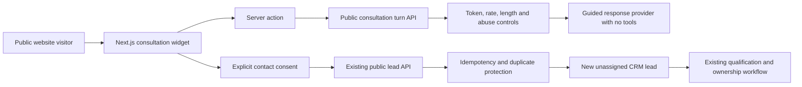

# Public Consultation Agent Design

## 1. Purpose and scope

Phase 3.1 adds the customer-facing **Commercial Kitchen Consultation Agent** to the Sari Arta public website. It is a guided project-intake assistant, not the authenticated Enterprise Knowledge Assistant and not a general chatbot.

The assistant supports English and Simplified Chinese. It organizes a visitor's project brief and, only after explicit contact consent, creates a candidate lead through the existing CRM intake workflow. It cannot send messages, qualify or convert a lead, assign ownership, or perform any autonomous sales action.

## 2. Architecture and trust boundary



The browser never receives `PUBLIC_SITE_TOKEN`. Next.js server actions hold the token and call FastAPI. The public agent has no database tool, CRM read tool, retrieval tool, arbitrary HTTP tool, or external communication tool.

## 3. Knowledge boundary

The MVP uses a small, code-owned public information snapshot. It does not query the governed internal knowledge store. This is deny-by-default and prevents an incorrectly classified internal document from becoming public.

| Allowed | Prohibited |
|---|---|
| Approved company introduction | Internal documents and internal SOP |
| Public service descriptions | Prices, discounts and quotations |
| Public product categories | Customer records and CRM data |
| Public case-study categories | Sales pipeline and ownership data |
| General project discovery guidance | Private cases, technical guarantees and contractual commitments |

A future governed public retrieval source must require an explicit public-visibility classification, publication approval, agent binding, and separate security review. It must not reuse authenticated internal retrieval merely by omitting a user identity.

## 4. Guided conversation

The fixed sequence is:

```text
facility_type
→ project_type
→ location
→ capacity
→ timeline
→ budget_range (optional)
→ contact_name
→ company
→ email
→ review
→ explicit contact consent
→ lead candidate creation
```

Each answer is validated server-side, limited to 500 characters, and screened for basic abuse and prompt-injection patterns. Email has format validation. Budget can be skipped. The visitor can change between English and Chinese without changing the stored business values.

## 5. Response provider

The deterministic guided provider is the default and keeps the flow usable without an AI key. An OpenAI Agents SDK provider exists behind both `AI_ENABLED=true` and `PUBLIC_CONSULTATION_AI_ENABLED=true`. It has no tools, one turn, bounded output, disabled sensitive tracing, and a public-only instruction boundary.

Contact name, company name, and email always use the deterministic provider and are never sent to the model. Enabling the public model path for project answers requires approval of the real visitor-data notice and external AI data-processing policy.

## 6. Lead creation and CRM integration

After the visitor checks the contact-consent control, the widget calls the existing `POST /api/v1/public/lead-submissions` contract with:

```json
{
  "attribution": {
    "source": "website_ai_assistant",
    "campaign": "public-consultation-agent"
  },
  "consent": {
    "privacy_policy_version": "public-consultation-v1",
    "contact_consent": true,
    "marketing_consent": false
  }
}
```

The command preserves the existing transaction, validation, idempotency key, tenant context and rate limit. A second submission within 24 hours with the same normalized email, source, project type and city returns the existing lead rather than creating another one. Creation and duplicate detection produce `public_lead.created` and `public_lead.duplicate_detected` audit events.

The created lead remains `new`, unassigned and unqualified. Existing human ownership, qualification review and opportunity conversion rules continue unchanged.

## 7. Public APIs

### `POST /api/v1/public/consultation/turns`

Headers:

```http
X-Site-Token: <server-held token>
```

Request:

```json
{
  "language": "en",
  "field": "facility_type",
  "answer": "School"
}
```

Response:

```json
{
  "accepted_value": "School",
  "assistant_message": "Thank you. Is this a new kitchen, renovation, expansion, or equipment replacement project?",
  "next_field": "project_type",
  "next_prompt": "Is this a new kitchen, renovation, expansion, or equipment replacement project?",
  "ready_for_consent": false,
  "provider_type": "mock",
  "correlation_id": "00000000-0000-4000-8000-000000000000"
}
```

### `POST /api/v1/public/lead-submissions`

The existing endpoint now accepts public-agent facility and budget metadata, `website_ai_assistant` attribution, and returns a `duplicate` flag.

## 8. Security and abuse controls

- Server-held site token and constant-time comparison.
- Separate Redis fixed-window limits for turns and lead submissions.
- Strict schemas, extra-field rejection, field lengths and email validation.
- Prompt-injection, script and repeated-character screening.
- No public access to internal retrieval, CRM reads, pricing or tools.
- Contact consent is a literal `true` requirement.
- Idempotency and recent duplicate protection.
- Correlation IDs and content-minimized structured logs.
- Safe `401`, `422`, `429` and `503` failures.
- External model processing disabled by default.

The controls are practical MVP protections, not a replacement for a production WAF, bot-management service, privacy notice, penetration test or incident monitoring.

## 9. Frontend behavior

The widget appears on every public marketing page as a fixed bottom-right launcher. On desktop it opens a compact panel; on mobile it expands within the viewport. It provides greeting, language switch, guided questions, summary, contact and optional marketing consent, success, duplicate, loading and error states. It visibly states that no price, delivery or technical commitment is made.

## 10. Observability and validation

Turn logs contain correlation ID, language, provider type, duration and outcome, but not visitor answers or contact details. Lead actions are auditable in PostgreSQL.

Validation covers bilingual prompting, bad-token rejection, prompt-injection rejection, consented lead creation, source attribution, duplicate suppression, audit events, unchanged lead ownership/qualification state, frontend accessibility, linting, typing and production build.

## 11. Deferred capabilities

- Conversational public RAG and free-form general chat.
- WhatsApp, email and social publishing.
- Autonomous qualification, assignment, follow-up or opportunity conversion.
- Pricing, quotations and proposal generation.
- IVC public consultation.

