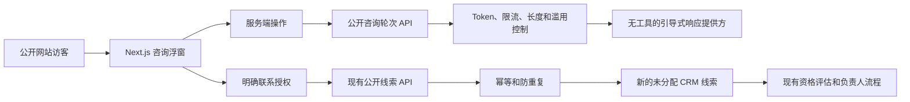

# 公开项目咨询智能体设计

## 1. 目的和范围

Phase 3.1 在 Sari Arta 公开网站中增加面向客户的 **商用厨房项目咨询智能体（Commercial Kitchen Consultation Agent）**。它是一个引导式项目需求收集助手，不是需要登录的企业知识助手，也不是通用聊天机器人。

该助手支持英文和简体中文。它负责整理访客的项目简报，并且只有在访客明确同意联系后，才通过现有 CRM 询盘流程创建候选销售线索。它不能发送消息、评估或转换线索、分配负责人，也不能执行任何自主销售动作。

## 2. 架构和信任边界



浏览器不会获得 `PUBLIC_SITE_TOKEN`。Next.js 服务端操作保存该 Token 并调用 FastAPI。公开智能体没有数据库工具、CRM 读取工具、检索工具、任意 HTTP 工具或外部沟通工具。

## 3. 知识边界

MVP 使用一份小型、由代码管理的公开信息快照，不查询受治理的内部知识库。这采用默认拒绝策略，可以避免错误分类的内部文档被公开。

| 允许 | 禁止 |
|---|---|
| 已批准的公司介绍 | 内部文档和内部 SOP |
| 公开服务说明 | 价格、折扣和报价 |
| 公开产品类别 | 客户记录和 CRM 数据 |
| 公开案例类别 | 销售漏斗和负责人数据 |
| 一般项目需求梳理指导 | 私有案例、技术保证和合同承诺 |

未来如增加受治理的公开检索源，必须具有明确的公开可见性分类、发布审批、智能体绑定和独立安全审核。不得通过简单省略用户身份的方式复用需要登录的内部检索。

## 4. 引导式对话

固定顺序为：

```text
facility_type
→ project_type
→ location
→ capacity
→ timeline
→ budget_range（可选）
→ contact_name
→ company
→ email
→ 检查摘要
→ 明确联系授权
→ 创建候选销售线索
```

每个回答均由服务端验证，最长 500 个字符，并执行基础滥用和提示注入模式检查。邮箱需要通过格式验证，预算可以跳过。访客可在英文和中文之间切换，不会改变已保存的业务值。

## 5. 响应提供方

系统默认使用确定性引导提供方，即使没有 AI Key，流程仍可工作。OpenAI Agents SDK 提供方同时受到 `AI_ENABLED=true` 和 `PUBLIC_CONSULTATION_AI_ENABLED=true` 两个开关控制。它没有工具，只运行一轮，限制输出长度，关闭敏感 Trace，并使用仅限公开信息的指令边界。

联系人姓名、公司名称和邮箱始终使用确定性提供方，永远不会发送给模型。在为项目回答启用公开模型路径前，必须先批准真实访客数据告知和外部 AI 数据处理政策。

## 6. 线索创建和 CRM 集成

访客勾选联系授权后，浮窗通过现有的 `POST /api/v1/public/lead-submissions` 合同提交：

```json
{
  "attribution": {
    "source": "website_ai_assistant",
    "campaign": "public-consultation-agent"
  },
  "consent": {
    "privacy_policy_version": "public-consultation-v1",
    "contact_consent": true,
    "marketing_consent": false
  }
}
```

该命令保留现有事务、验证、幂等键、租户上下文和限流。如果 24 小时内出现标准化邮箱、来源、项目类型和城市均相同的第二次提交，系统返回原线索而不会重复创建。创建和发现重复分别生成 `public_lead.created` 和 `public_lead.duplicate_detected` 审计事件。

新线索仍为 `new` 状态，尚未分配且尚未资格评估。现有的人工负责人、资格审核和商机转换规则保持不变。

## 7. 公开 API

### `POST /api/v1/public/consultation/turns`

请求头：

```http
X-Site-Token: <仅由服务端保存的 Token>
```

请求：

```json
{
  "language": "en",
  "field": "facility_type",
  "answer": "School"
}
```

响应：

```json
{
  "accepted_value": "School",
  "assistant_message": "Thank you. Is this a new kitchen, renovation, expansion, or equipment replacement project?",
  "next_field": "project_type",
  "next_prompt": "Is this a new kitchen, renovation, expansion, or equipment replacement project?",
  "ready_for_consent": false,
  "provider_type": "mock",
  "correlation_id": "00000000-0000-4000-8000-000000000000"
}
```

### `POST /api/v1/public/lead-submissions`

现有端点现在接受公开智能体的设施和预算元数据、`website_ai_assistant` 来源，并返回 `duplicate` 标志。

## 8. 安全和滥用控制

- 仅服务端保存的网站 Token，并使用恒定时间比较。
- 咨询轮次和线索提交使用独立的 Redis 固定窗口限流。
- 严格 Schema、拒绝额外字段、字段长度和邮箱验证。
- 提示注入、脚本和重复字符模式检查。
- 公开端无法访问内部检索、CRM 读取、价格或工具。
- 联系授权必须为字面值 `true`。
- 幂等和近期重复提交保护。
- Correlation ID 和最小化内容的结构化日志。
- 安全的 `401`、`422`、`429` 和 `503` 失败响应。
- 默认关闭外部模型处理。

这些控制属于可落地的 MVP 防护，不能替代生产 WAF、Bot 管理服务、隐私告知、渗透测试或安全事件监控。

## 9. 前端行为

浮窗以右下角固定入口出现在所有公开营销页面。桌面端打开紧凑面板，移动端在视口内展开。它提供欢迎语、语言切换、引导问题、摘要、联系授权和可选营销授权、成功、重复、加载和错误状态，并明确显示这里不会作出价格、交期或技术承诺。

## 10. 可观测性和验证

轮次日志包含 Correlation ID、语言、提供方类型、耗时和结果，但不记录访客回答或联系方式。线索动作保存在 PostgreSQL 审计记录中。

验证范围包括双语提示、错误 Token 拒绝、提示注入拒绝、授权后创建线索、来源记录、防重复、审计事件、线索负责人和资格状态不变、前端可访问性、Lint、类型检查和生产构建。

## 11. 暂缓能力

- 公开对话式 RAG 和自由通用聊天。
- WhatsApp、邮件和社交媒体发布。
- 自主资格评估、分配、跟进或商机转换。
- 价格、报价和提案生成。
- IVC 公开项目咨询。

