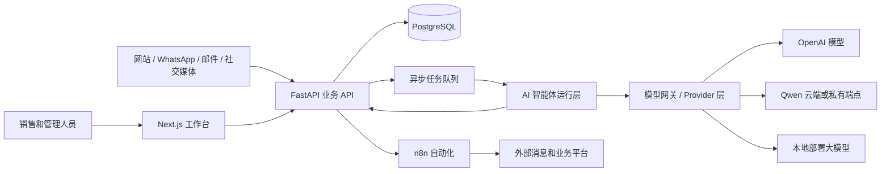
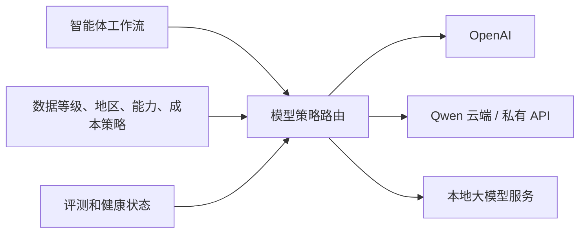
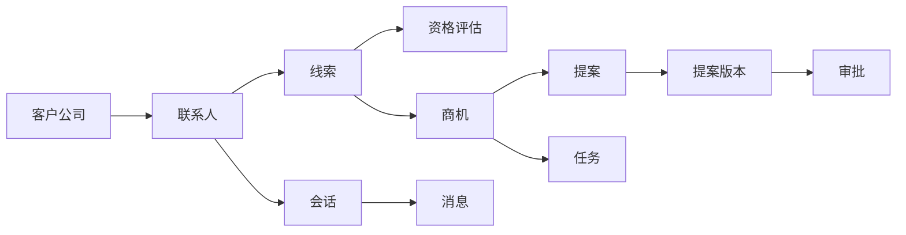

# 企业级 AI 商务拓展智能体平台

## 中文架构说明与项目决策

**参考业务：** 印度尼西亚 Sari Arta 商用厨房工程业务  
**对应英文基线：** `technical-architecture.md`、`database-design.md`、`api-design.md`  
**用途：** 用中文说明整体设计和已经采用的项目决策；不要求项目负责人审核技术细节

## 1. 先看结论

这套设计的核心不是做一个“会聊天的机器人”，而是建设一个有完整业务数据、权限、审批、审计和人工接管能力的企业系统。

平台将完成五类工作：

1. 从网站、WhatsApp、邮件和社交媒体接收客户线索。
2. 整理客户、联系人、需求和沟通记录。
3. 使用 AI 对线索进行资格判断、客户研究和知识问答。
4. 协助生成营销内容和项目提案。
5. 把重要决定、审批和外发动作保留给销售或管理人员。

设计采用以下技术方向：

| 层次 | 技术 | 作用 |
|---|---|---|
| 前端 | Next.js | 销售工作台、线索、商机、沟通、提案和管理页面 |
| 后端 | FastAPI | API、业务规则、权限、审批和数据操作 |
| 数据库 | PostgreSQL | 保存客户、线索、商机、消息、知识、AI 运行和审计记录 |
| AI 编排 | OpenAI Agents SDK | 管理智能体、工具调用、专业智能体协作、护栏和运行追踪 |
| AI 模型 | OpenAI、Qwen、本地大模型 | 由统一模型 Provider 层按任务、数据安全、质量、成本和可用性选择 |
| 自动化 | n8n | 定时提醒、第三方连接、跟进流程和运营自动化 |
| 部署 | Docker | 统一开发、测试和生产环境的运行方式 |

## 2. 审核时最需要理解的七个原则

### 2.1 PostgreSQL 是唯一业务事实来源

客户、线索、商机、提案状态和审批结果以 PostgreSQL 为准。

AI 对话记录、n8n 流程记录或第三方平台数据不能单独作为正式业务记录。这样可以避免：

- AI 说已经修改，但数据库没有修改。
- n8n 工作流被删除后，业务历史也丢失。
- WhatsApp 或邮件供应商更换后，内部客户数据无法迁移。

**审核重点：** 公司希望哪些信息成为正式业务档案？这些信息是否都在数据库设计中出现？

### 2.2 AI 负责分析和起草，确定性服务负责交易

AI 可以：

- 判断客户需求和线索质量。
- 总结沟通内容。
- 查找知识库。
- 起草回复、营销内容和提案。
- 提出下一步建议。

AI 不应直接：

- 绕过权限修改数据库。
- 自行承诺价格、交期或合同条款。
- 未审批就向客户发送重要内容。
- 使用任意 SQL、Shell、HTTP 或读取系统密钥。

所有 AI 工具都是后端提供的窄接口，例如“读取这个商机”“保存提案草稿”“提交审批”，每个工具都要再次检查权限。

### 2.3 重要动作必须有人审批

以下动作默认需要人工确认：

- 对外发送 AI 生成的重要销售信息。
- 发布营销内容。
- 正式签发项目提案。
- 涉及价格、折扣、利润或交期承诺。
- 把客户研究结果写成“已验证事实”。
- 低置信度或高价值线索的资格判断。

审批不是一个简单按钮。系统会保存：

- 谁申请。
- 谁审批。
- 审批时看到的内容。
- 内容指纹。
- 审批意见。
- 决定时间。
- 是否过期。

审批后如果内容发生变化，原审批自动失效，防止“审批 A，发送 B”。

### 2.4 FastAPI 和 n8n 有明确边界

FastAPI 管理：

- 权限。
- 业务状态。
- 数据一致性。
- 审批。
- 审计。
- 正式 API。

n8n 管理：

- 定时任务。
- 跟进提醒。
- 连接外部平台。
- 触发营销或通知流程。
- 可视化运营自动化。

n8n 不直接访问生产业务表，也不保存唯一的商机或审批记录。这样即使工作流变化，核心业务不会失控。

### 2.5 所有慢任务都异步执行

客户研究、AI 运行、知识文档处理、提案渲染、大批量导入和外部发送不会长期占用网页请求。

用户提交后马上得到一个运行编号，并能看到：

```text
queued → running → awaiting_approval → succeeded / failed / cancelled
排队中 → 运行中 → 等待审批 → 成功 / 失败 / 已取消
```

这让系统可以扩容、重试和恢复，也避免用户因为页面超时重复提交。

### 2.6 从第一天支持租户隔离

虽然第一家参考客户是 Sari Arta，设计仍然把每个企业作为独立租户。

租户隔离覆盖：

- 数据库每一行业务数据。
- API 权限。
- 缓存键。
- 文件目录。
- 消息和自动化事件。
- AI 检索条件。
- 日志和审计。

这不是为了立刻做 SaaS，而是避免以后增加第二家公司时重构全部系统。

### 2.7 AI 输出必须可追踪

系统记录每次 AI 运行的：

- 谁发起、为哪个客户或商机运行。
- 使用哪个智能体配置和模型。
- 调用了哪些受控工具。
- 使用了哪些知识来源。
- 是否触发护栏或审批。
- 花费时间、Token 和估算成本。
- 最终结构化结果。

系统不向普通用户展示模型隐藏推理过程，也不会把敏感原文无条件写入普通日志。

## 3. 系统架构怎么审核

对应英文文档：[technical-architecture.md](</Users/sujie/Documents/ChatGPT/Enterprise AI Business Development Agent Platform/docs/technical-architecture.md>)

### 3.1 系统组件

完整链路是：



关键点：

- 前端不直接访问数据库。
- AI 不直接访问数据库。
- n8n 不直接访问生产业务表。
- 所有写操作最终通过后端业务服务完成。

### 3.2 前端

Next.js 工作台计划包含：

- 登录和企业选择。
- 销售仪表盘和待办队列。
- 客户公司和联系人。
- 线索和资格评估。
- 商机和销售漏斗。
- 全渠道沟通记录。
- 提案和审批。
- 营销内容工作室。
- 知识库管理。
- AI 运行记录。
- 用户、角色、集成和审计管理。

AI 内容必须有明确标识，并显示引用、置信度或需要人工确认的状态。

**第一版决定：**

- 桌面端优先。
- 英文界面优先，AI 内容支持英语和印度尼西亚语。
- 第一版只做登录、仪表盘、线索、客户/联系人、任务、商机、AI 线索资格评估和简单设置。
- 销售漏斗先显示各阶段商机数量、金额、负责人和逾期任务。
- 知识助手、提案编辑、全渠道沟通、营销内容工作室和复杂管理页面暂缓。

### 3.3 后端

后端先采用“模块化单体”，而不是一开始拆成很多微服务。

原因是线索转商机、提案审批等操作需要数据库事务，模块化单体更容易保证一致性，也能降低早期部署和运维成本。

内部仍按模块划分：

- 身份和权限。
- CRM。
- 会话和消息。
- 知识库。
- AI 运行。
- 提案。
- 营销内容。
- 第三方集成。
- 自动化。
- 通知。
- 审计和合规。

当某个模块确实需要独立扩容或独立团队维护时，再拆成服务。

### 3.4 AI 智能体

平台设计一个协调智能体和五个专业智能体：

| 智能体 | 主要工作 | 最终决定者 |
|---|---|---|
| 商务拓展协调智能体 | 选择合适的专业智能体并整合结果 | 系统规则或人工 |
| 线索资格智能体 | 评分、需求、缺失信息和下一步建议 | 销售审核高价值或低置信度结果 |
| 客户研究智能体 | 调研企业背景、风险和机会 | 人工把研究草稿验证成事实 |
| 知识助手 | 根据批准的知识回答问题并给出处 | 用户判断是否采用 |
| 内容生成智能体 | 生成不同渠道的内容草稿 | 市场人员审批发布 |
| 提案智能体 | 生成结构化提案草稿 | 销售或管理人员审批签发 |

技术设计优先采用“协调者调用专业智能体”的模式。只有当某个专业智能体需要真正接管持续对话时，才使用 handoff。

#### 3.4.1 支持 OpenAI、Qwen 和本地大模型

OpenAI Agents SDK 在这里是“智能体编排框架”，不等于所有 AI 请求必须使用 OpenAI 模型。

平台增加统一模型 Provider 层：



计划支持：

| 模型来源 | 例子 | 适合场景 |
|---|---|---|
| OpenAI 托管模型 | 经过批准的 OpenAI 模型 | 复杂工具调用、研究和高质量提案 |
| 其他云端模型 | Qwen 云端或企业私有 API | 中文、印度尼西亚语、成本或地区要求 |
| 本地部署模型 | Qwen、Llama、Mistral 等经过批准的模型 | 高敏感数据、离线环境或企业私有部署 |

本地模型可以通过 vLLM、TGI、Ollama 或企业推理网关提供服务，具体实现到开发阶段再确定。

但是“接口看起来兼容 OpenAI”不代表能力完全相同。每个模型都必须登记和测试：

- 是否可靠支持工具调用。
- 是否可靠返回结构化 JSON。
- 是否支持流式输出、图片或长上下文。
- 英语、印度尼西亚语和中文质量。
- 延迟、吞吐量和并发能力。
- 数据是否离开企业网络。
- 服务商是否保存数据或用于训练。
- Token 或本地 GPU 成本。
- 当前健康状态和允许的备用模型。

工作流先声明需要的能力和允许的数据范围，再由服务器选择模型。普通用户或智能体不能自行指定任意模型。

例如：

- 普通内容草稿可以使用通过评测的 Qwen。
- 高敏感客户资料可以强制 `local_only`，只进入本地模型。
- 复杂提案可以使用评测得分最高的批准模型。
- 本地模型宕机时，高敏感数据不能自动转发到外部云模型；系统应排队、失败或转人工。

**需要业务和技术共同确认：**

- 哪些工作必须使用本地模型？
- 是否允许客户数据发送到 OpenAI 或 Qwen 云端？
- 是否需要针对不同租户配置不同模型政策？
- 模型选择优先质量、成本、速度、数据地区还是私有化？
- 本地部署是否已有 GPU、推理平台和运维团队？

### 3.5 知识库

知识文档经过以下流程：

```text
上传 → 杀毒 → 文字提取 → 分块 → 向量化 → 人工批准 → 可检索
```

每个知识片段保留：

- 所属企业。
- 来源文档。
- 文档版本。
- 页码和章节。
- 语言。
- 生效和失效时间。
- 访问范围。
- 内容指纹。

AI 只能检索当前租户、有权限、已批准、未过期、未隔离的知识。

**第二阶段决定：**

- 开发阶段使用合成的公司介绍、能力、产品目录、案例和提案措辞。
- 正式运营时，只有管理员激活的真实文档才能被 AI 检索。
- 价格、交期和合同承诺不进入自动生成逻辑，由人工填写和确认。
- 新文档版本激活后，旧版本退出默认检索，但保留历史记录。

知识库和知识助手不属于第一版，第一版完成并验收后再实施。

### 3.6 外部集成

第一批可能包括：

- 网站询盘表单。
- 邮件。
- WhatsApp Business。
- Instagram、Facebook、TikTok。
- 企业身份系统。
- 对象存储。
- 经过批准的客户研究来源。

所有第三方事件都要验证签名并去重。系统假设供应商可能重复发送同一事件。

外发消息采用以下状态：

```text
draft → policy_check → approval → queued → sent → delivered/read/failed
草稿 → 策略检查 → 审批 → 排队 → 已发送 → 已送达/已读/失败
```

### 3.7 部署

开发环境可以使用 Docker Compose。生产环境建议使用托管容器平台，运行：

- Next.js 容器。
- FastAPI 容器。
- 不同类型的 Worker 容器。
- 单实例调度和事件分发器。
- n8n 主服务和 Worker。

PostgreSQL、Redis、对象存储和密钥管理在生产环境优先使用托管服务。

开发、测试和生产完全隔离；不把真实客户数据直接复制到测试环境。

### 3.8 安全

安全设计包括：

- OIDC 单点登录和多因素认证。
- 基于角色和对象的权限。
- 数据库行级租户隔离。
- TLS 和静态加密。
- 密钥管理和轮换。
- 文件杀毒。
- Webhook 签名验证。
- API 限流和重放保护。
- 审计日志。
- AI 提示注入、越权工具和数据泄漏防护。
- 全局和单租户 AI/自动化紧急停止开关。

**需要管理层确认：**

- 是否存在数据必须留在印度尼西亚或特定地区的要求？
- 审计和客户沟通记录保存几年？
- 哪些岗位可以导出客户数据？
- 哪些外发动作必须由经理审批？
- 是否需要与现有企业身份系统集成？

## 4. 数据库设计怎么审核

对应英文文档：[database-design.md](</Users/sujie/Documents/ChatGPT/Enterprise AI Business Development Agent Platform/docs/database-design.md>)

### 4.1 数据分为九组

| 数据组 | 主要表 | 要解决的问题 |
|---|---|---|
| 企业和权限 | tenants、users、memberships、roles | 谁属于哪家公司、拥有什么权限 |
| CRM | organizations、contacts、leads、opportunities | 客户、联系人、线索和商机 |
| 销售执行 | activities、tasks | 跟进历史和待办 |
| 沟通 | conversations、messages、files | 各渠道对话、消息和附件 |
| 知识 | sources、documents、versions、chunks | 可靠的可追溯知识检索 |
| AI | providers、deployments、routing policies、configurations、runs、steps、citations | 模型供应方、模型部署、路由策略、AI 配置、运行、工具和引用 |
| 提案和内容 | proposals、content_items 及其版本 | 草稿、版本、审批和发布 |
| 集成和可靠性 | integrations、webhooks、outbox、delivery | 第三方连接、去重、重试 |
| 审计和合规 | audit、data requests、imports、exports | 追责、隐私、导入和导出 |

### 4.2 主要业务关系



### 4.3 为什么大量使用版本

以下内容不直接覆盖旧值：

- 线索资格评估。
- 知识文档。
- AI 配置。
- 提案。
- 营销内容。

修改后创建新版本，可以回答：

- 当时 AI 使用了哪一版规则？
- 客户收到的是哪一版提案？
- 审批人批准了什么内容？
- 当前答案引用的是哪一版资料？

### 4.4 重点业务字段

#### 客户公司

包括名称、网站、域名、行业、国家、城市、语言、负责人、生命周期和研究验证状态。

#### 联系人

包括姓名、职位、部门、邮箱、电话、WhatsApp、国家、语言、首选渠道、营销同意和禁止联系状态。

#### 线索

包括来源渠道、询盘摘要、状态、优先级、负责人、预计金额、币种、时间要求、项目国家、评分和淘汰原因。

#### 商机

包括客户、主要联系人、来源线索、阶段、赢率、预计金额、预计成交日、项目地点、项目需求、负责人和输单原因。

#### Sari Arta 项目需求

`opportunities.requirements` 暂时设计为经过验证的结构化 JSON，适合容纳商用厨房项目中会变化的需求，例如：

- 餐饮类型和场景。
- 每日或每餐产能。
- 厨房类型。
- 空间面积。
- 平面图和机电条件。
- 设备范围。
- 安装、培训和售后需求。
- 项目时间和预算。

在需求稳定后，应把高频筛选和报表字段提升为正式列或子表。

**这是最需要 Sari Arta 业务人员审核的部分。**

### 4.5 金额设计

金额不用浮点数，而使用高精度 `numeric`，并且每个金额都带币种。

AI 可以起草产品描述和提案文字，但价格合计、税额、折扣和利润校验由确定性程序完成。

### 4.6 删除和合规

普通“删除”多数是软删除，方便恢复和保留历史。真正清除客户个人信息通过受控的隐私流程完成。

租户、审计记录和正式提案不能通过普通级联删除一次性清空。

### 4.7 索引

数据库索引重点支持：

- 按状态、负责人、优先级查看线索。
- 按阶段和预计成交日查看商机。
- 按联系人邮箱或电话匹配客户。
- 按最后消息时间查看会话。
- 查找当前待审批事项。
- 处理待发送事件和失败重试。
- 全文和向量检索知识。
- 按人员、对象和时间查询审计。

所有常用业务索引首先包含租户 ID，防止跨租户扫描并提升查询效率。

## 5. API 设计怎么审核

对应英文文档：[api-design.md](</Users/sujie/Documents/ChatGPT/Enterprise AI Business Development Agent Platform/docs/api-design.md>)

### 5.1 API 基本规则

- 所有正式接口位于 `/api/v1`。
- 数据使用 JSON 和 `snake_case` 字段。
- ID 使用 UUID。
- 时间统一使用 UTC。
- 列表使用游标分页。
- 更新重要记录时需要版本号，防止两个人互相覆盖。
- 重试敏感操作需要幂等键，防止重复创建或重复发送。
- 错误返回安全的问题编号和请求编号，不暴露内部堆栈。

### 5.2 身份认证

人员登录采用 OIDC Authorization Code + PKCE。

浏览器使用安全 Cookie，不把长期 Token 放进 `localStorage`。

n8n 和后台服务使用服务账户和短期访问 Token。每个服务账户只拥有完成工作所需的最小权限。

第三方 Webhook 不使用普通登录 Token，而使用供应商签名验证、时间窗口和事件去重。

### 5.3 API 资源

接口按以下业务资源组织：

- 当前用户、租户、成员和角色。
- 客户公司和联系人。
- 线索、评估、分配、淘汰和转商机。
- 商机、阶段、活动和任务。
- 会话、消息和文件。
- 知识来源、文档、版本、搜索和问答。
- AI 运行、步骤、事件、取消和重试。
- 审批队列和决定。
- 提案生成、版本、渲染、审批和签发。
- 营销内容生成、审批、排期和发布。
- 集成账户和 n8n 自动化执行。
- 审计、导入、导出和隐私请求。

### 5.4 为什么需要幂等键

例如用户点击两次“发送 WhatsApp”，或者网络超时后 n8n 自动重试。如果没有幂等控制，客户可能收到两条消息。

客户端提交 `Idempotency-Key` 后：

- 同一个键、同一个请求：返回第一次结果。
- 同一个键、不同请求：拒绝并返回冲突。

线索提交、转商机、AI 运行、提案签发、审批、外发消息和批量导入都使用这个机制。

### 5.5 为什么更新需要版本

销售 A 和销售 B 同时打开一个商机。A 先修改，记录从版本 3 变成版本 4。B 仍然拿版本 3 提交时，系统拒绝覆盖，并提示重新读取。

这比“最后提交的人覆盖所有人”更安全。

### 5.6 AI 接口不能接收任意 Prompt

通用 AI 接口只允许提交预先批准的 `workflow_type`，例如：

- `lead_qualification`
- `customer_research`
- `knowledge_answer`
- `proposal_generation`
- `content_generation`

调用者不能通过 API 自定义系统指令、任意工具或模型。这可以防止把生产 AI 层变成不受控的通用执行器。

### 5.7 API 示例

英文 API 文档已经给出完整 JSON 示例，包括：

- 网站线索提交。
- 内部创建线索。
- 安全更新线索。
- 启动 AI 资格评估。
- 查看资格评估结果。
- 线索转商机。
- 知识问答和引用。
- 启动提案生成。
- 审批决定。
- WhatsApp 外发消息。

审核示例时，重点看字段是否符合实际业务，不需要审核 UUID 或示例时间。

## 6. 中英文术语对照

| English | 中文建议 |
|---|---|
| Tenant | 租户 / 企业客户 |
| Organization | 客户公司 / 组织 |
| Contact | 联系人 |
| Lead | 线索 |
| Lead qualification | 线索资格评估 |
| Opportunity | 商机 |
| Pipeline | 销售漏斗 / 商机管道 |
| Activity | 活动记录 / 跟进记录 |
| Task | 任务 |
| Conversation | 会话 |
| Message | 消息 |
| Knowledge base | 知识库 |
| Knowledge chunk | 知识片段 |
| Retrieval | 检索 |
| Grounded answer | 有依据的回答 |
| Citation | 引用 / 来源 |
| Agent | 智能体 |
| Agent run | 智能体运行 |
| Model provider | 模型供应方 / Provider |
| Model deployment | 模型部署 |
| Model gateway | 模型网关 |
| Routing policy | 模型路由策略 |
| Orchestration | 编排 / 协调 |
| Handoff | 智能体移交 |
| Tool | 智能体工具 |
| Guardrail | 护栏 / 安全校验 |
| Human in the loop | 人工参与决策 |
| Approval | 审批 |
| Proposal | 提案 / 方案书 |
| Content item | 营销内容项 |
| Integration | 第三方集成 |
| Webhook | 外部事件回调 |
| Idempotency | 幂等 / 防重复执行 |
| Optimistic concurrency | 乐观并发控制 |
| Outbox event | 事务事件箱事件 |
| Audit event | 审计事件 |
| Soft delete | 软删除 |
| Row-Level Security | 数据库行级安全 |
| Object storage | 对象存储 |
| Service account | 服务账户 |

## 7. 已采用的 MVP 默认方案

项目负责人不需要逐项决定技术细节。第一版直接采用以下方案：

- 单一 Sari Arta 工作区，不建设 SaaS 租户管理。
- Supabase 提供登录和 PostgreSQL；pgvector 与私有文件存储留给第二阶段知识库使用。
- OpenAI 作为第一版模型路径；保留以后增加 Qwen 或本地模型的适配边界。
- 英文界面优先，AI 业务内容支持英语和印度尼西亚语。
- 两个角色：管理员和销售。
- 线索状态：新建、评估中、已合格、已转商机、已淘汰。
- 商机阶段：需求发现、需求确认、提案、谈判、赢单、输单。
- 资格评估采用 BANT 思路：需求匹配 35%、时间 25%、预算 20%、决策权 20%。
- 75 分及以上为高质量，45–74 分为中等，低于 45 分为低质量。
- 所有 AI 资格结果都需要销售人员接受，不自动转商机或淘汰。
- 第一版只实现线索资格智能体；知识、内容和提案智能体属于第二阶段。
- WhatsApp、邮件和 n8n 自动化属于第三阶段。
- 客户研究、多智能体、MCP、Qwen 和本地模型的生产接入属于第四阶段。
- 技术实现、字段、API、页面和测试由 AI 工程代理负责决定。

### 7.1 真实运营前才需要确认的内容

以下内容不能由系统虚构，只在接入真实业务或正式上线前需要提供或确认：

- 真实客户资料是否可以进入系统和外部 AI。
- Sari Arta 正式公司介绍、能力说明、产品目录和案例。
- 真实价格、折扣、税、利润、交期和币种。
- 技术保证、保修、合同、免责声明和正式提案措辞。
- 哪些真实知识文档允许 AI 使用。
- 向真实客户发送邮件、WhatsApp、提案或营销内容。
- 正式生产部署、付费服务和不可恢复的数据操作。

在这些材料提供前，开发和演示统一使用明确标记的合成数据。

## 8. 技术团队必须验证的事项

- PostgreSQL 行级安全是否能阻止跨租户查询。
- API 是否对每个对象执行权限检查。
- 第一版资格智能体是否只能通过只读、强类型工具读取 CRM 数据。
- AI 工具是否全部是窄权限、强类型工具。
- AI 资格结果是否经过结构校验并要求人工接受或拒绝。
- 重要写操作是否支持幂等和版本冲突。
- 数据库备份是否真的可以恢复。
- 日志、Trace 和错误信息是否完成脱敏。
- 队列失败后是否进入死信并可安全重放。
- 每个环境是否使用独立数据和密钥。

n8n、Webhook、检索、提案审批、多模型和本地模型的验证在对应后续阶段执行。

## 9. 后续执行方式

不再安排正式技术审核。AI 工程代理按照 `docs/mvp-scope.md` 和根目录 `AGENTS.md` 自主完成：

- 页面和交互设计。
- 数据库字段和迁移。
- FastAPI 接口。
- AI 工具、Prompt、结构化输出和测试。
- Docker 开发环境。
- 开发顺序和技术取舍。

第一版采用：

1. Supabase Auth 和 PostgreSQL；第一阶段暂不建设知识文件存储。
2. Next.js + FastAPI 模块化单体。
3. OpenAI 作为首个模型路径。
4. 只实现线索资格智能体。
5. 网站和人工线索录入，不做完整 WhatsApp/社交媒体收件箱。
6. 第一阶段不实现知识库、内容生成、提案生成或 n8n 自动化。
7. 以 `docs/roadmap.md` 的阶段边界作为后续功能实施依据。

## 10. 项目负责人只需要参与的事项

- 提供或授权使用真实 Sari Arta 资料。
- 决定是否允许真实客户数据进入外部 AI。
- 确认真实价格、折扣、交期、技术保证和合同内容。
- 批准向真实客户发送消息或提案。
- 批准付费服务和正式生产部署。
- 指出系统流程与真实业务明显不符的地方。

除此之外，AI 工程代理直接决定并继续实施。
