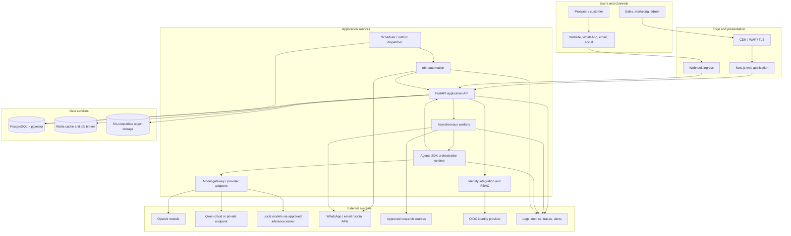
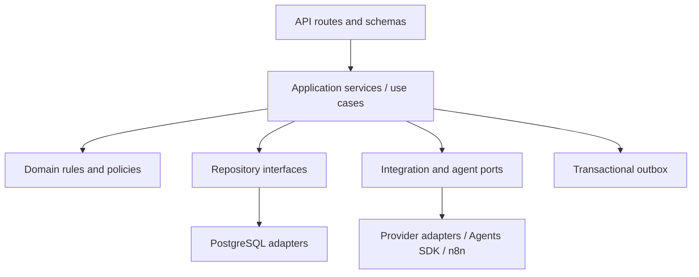
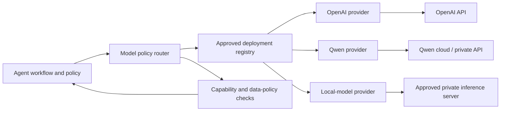
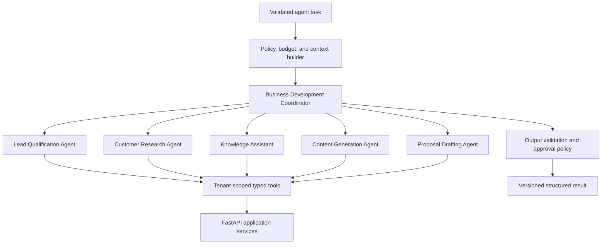
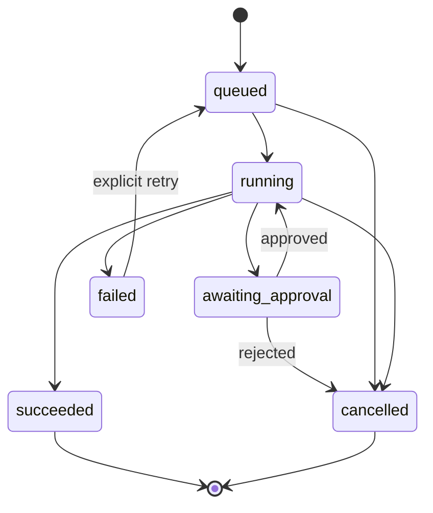
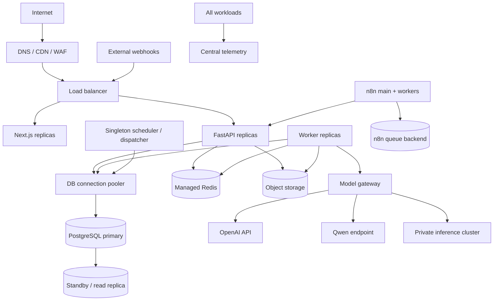

# Enterprise AI Business Development Agent Platform

## Technical Architecture Design

> Chinese translation: [technical-architecture.zh-CN.md](technical-architecture.zh-CN.md). This English document is the primary engineering baseline.

**Reference business:** Sari Arta, Indonesia commercial kitchen engineering  
**Status:** Enterprise architecture baseline with Phase 1 M8 acceptance status
**Primary stack:** Next.js, FastAPI, PostgreSQL, OpenAI Agents SDK with multi-model provider adapters, n8n, Docker  
**Document version:** 1.0

> 中文审阅入口：[中文架构审阅指南](</Users/sujie/Documents/ChatGPT/Enterprise AI Business Development Agent Platform/docs/review-guide.zh-CN.md>)。本英文文档是正式技术基线，中文指南提供逐主题解释、术语对照和审核问题。

## Phase 2.5 implementation status

The Knowledge Foundation is implemented as an additive module. FastAPI owns source, binding,
document, approval, ingestion-run, and retrieval contracts. A separate Redis knowledge queue carries
durable ingestion-run references to the existing Worker process. Private storage retains file bytes;
PostgreSQL retains metadata, approval, lineage, chunks, 1,536-dimensional pgvector embeddings, and
citations. Retrieval is deny-by-default and requires tenant RLS, an enabled source/domain/agent
binding, an active tenant agent configuration with the approved retrieval capability, and an approved
ready document. It returns evidence candidates only and does not change Sari Arta or IVC qualification
workflows. See `docs/knowledge-foundation-design.en.md`.

## Current implementation status — Phase 1 M8

The working MVP implements the public Sari Arta website, consultation lead capture,
authenticated CRM workspace, company/contact relationships, lead and follow-up management,
AI lead qualification with human review, transactional opportunity conversion, and an
actionable sales dashboard.

The M8 runtime uses PostgreSQL as the canonical Agent Run store and Redis only as transport.
Each run records provider/model identity, correlation ID, attempt count, bounded maximum
attempts, heartbeat, next retry time, structured output, and safe terminal failure. API and
Worker processes emit JSON logs with correlation fields and exclude credentials, raw provider
errors, prompts, and hidden model reasoning.

The Worker periodically recovers stale durable runs after an interrupted process or lost Redis
delivery. Queued/running work supports cooperative user cancellation, and a late provider result
cannot overwrite a cancelled run. Critical qualification requests, cancellations, and review
decisions create audit events.

The repository also includes idempotent synthetic A/B/C acceptance scenarios, a repeatable
five-minute Phase 1 demo, and local database backup/restore verification. Managed production
hosting, real identity/provider configuration, monitoring retention, and real-data/AI processing
approval remain deployment gates rather than application-development work.

## 1. Purpose and scope

This document defines the enterprise-grade technical architecture for a multi-tenant platform that captures overseas business-development leads, qualifies opportunities, assists sales users with grounded knowledge, researches customers, creates marketing content, and generates reviewable proposals.

The first deployment may serve Sari Arta as one organization, but tenant boundaries are included from the start so the platform can support additional businesses without redesigning its data model or authorization layer.

The architecture prioritizes:

- Clear ownership of business data and decisions.
- Stateless horizontal scaling for web and API workloads.
- Durable, observable asynchronous processing.
- Bounded AI autonomy with typed tools, guardrails, and human approval.
- Replaceable external connectors and AI models.
- Security, auditability, privacy, and operational recovery.

### 1.1 Architectural principles

1. **PostgreSQL is the system of record.** Agent context, n8n executions, and provider payloads do not replace canonical business records.
2. **FastAPI owns business invariants.** All interactive clients, agents, and automations use authenticated service interfaces rather than writing business tables directly.
3. **Agents reason; deterministic services transact.** Agents may classify, summarize, research, and draft. Typed application tools validate and perform reads or writes.
4. **Human approval gates consequential actions.** Proposal publication, external messages, status changes with commercial impact, and destructive actions require explicit authorization.
5. **Async by default for slow work.** Research, document generation, bulk ingestion, embeddings, and external delivery run through durable jobs.
6. **Tenant isolation is enforced at every layer.** Tenant context is present in identity claims, queries, cache keys, object paths, events, logs, and agent tools.
7. **Observability is part of the contract.** Every request, job, automation, and agent run carries correlated identifiers.
8. **Provider details stay behind adapters.** WhatsApp, email, social channels, object storage, identity, and AI providers are replaceable integrations.

## 2. System context and quality targets

### 2.1 Actors

| Actor | Main capabilities |
|---|---|
| Prospect/customer | Submit inquiries; exchange messages; upload requirements |
| Sales representative | Review and qualify leads; manage opportunities and tasks; approve communications and proposals |
| Sales manager | Assign work; approve commercial content; inspect pipeline and performance |
| Marketing user | Request, review, and publish generated content |
| Knowledge manager | Curate products, capabilities, case studies, documents, and approved claims |
| Tenant administrator | Manage users, roles, integrations, policies, and audit access |
| Platform operator | Operate infrastructure without receiving implicit tenant business access |
| Service account | Run approved n8n, ingestion, notification, or internal service workflows |

### 2.2 Service-level objectives

Initial production targets, to be refined through load testing:

| Area | Target |
|---|---|
| API availability | 99.9% monthly, excluding announced maintenance |
| Read API latency | p95 under 500 ms for non-AI, non-export endpoints |
| Write API latency | p95 under 800 ms for non-AI endpoints |
| Agent request acknowledgement | Under 1 second with an asynchronous run ID |
| Dashboard freshness | Under 60 seconds for operational views |
| Recovery point objective | 15 minutes for PostgreSQL; 24 hours for reconstructable analytics |
| Recovery time objective | 4 hours for a regional production recovery |
| Webhook ingestion | At-least-once, deduplicated, acknowledged within provider limit |
| Audit retention | Configurable; default 7 years for material sales and security events |

No single SLO should assume that an external channel or AI provider has the same availability. Provider degradation must produce queued, retryable, or clearly failed work rather than corrupting business state.

## 3. System component architecture

### 3.1 Component responsibilities

| Component | Responsibilities | Explicitly not responsible for |
|---|---|---|
| Next.js | User experience, server-rendered pages, client state, accessibility, localization, API consumption | Business-rule enforcement; direct database access |
| FastAPI | REST contracts, authorization, validation, business workflows, idempotency, audit events | Long-running work in request processes |
| Worker | Durable jobs, retries, document processing, agent runs, outbound delivery | Accepting public traffic |
| Agents SDK runtime | Provider-neutral agent definitions, tool loop, handoffs/agents-as-tools, guardrails, structured results, traces | Canonical authorization, unrestricted database access, or assuming every model supports the same features |
| Model gateway/provider adapters | Resolve approved model deployment, normalize requests/results, enforce routing and data policies, collect usage and health | Business decisions, prompt ownership, or bypassing agent/tool guardrails |
| n8n | Schedules, connector-heavy workflows, event-triggered automation, operational workflow visibility | Core business data or policy decisions |
| PostgreSQL | Transactional records, authorization data, audit metadata, agent/run metadata, vector search | Binary document storage |
| Redis | Short-lived cache, rate-limit counters, distributed locks, job broker/result hints | Durable source-of-truth state |
| Object storage | Original uploads, normalized documents, generated artifacts, exports | Public unrestricted file access |
| Webhook ingress | Signature verification, normalization, deduplication, fast acknowledgement | Complex synchronous processing |

### 3.2 Primary data flows

#### Lead capture

1. A channel submits an inquiry to a channel-specific webhook or public lead endpoint.
2. Ingress validates origin, enforces limits, stores the raw envelope safely, and derives an idempotency key.
3. FastAPI creates or matches contact, organization, lead, conversation, and message records in one transaction.
4. An outbox event is committed with the business records.
5. The dispatcher enqueues qualification and notification jobs.
6. The qualification agent returns structured assessment and evidence; the service persists a versioned assessment.
7. A salesperson reviews low-confidence or high-value cases.

#### Knowledge assistance

1. An authenticated user asks a question within a tenant and optional opportunity context.
2. FastAPI creates an agent run and supplies scoped tools.
3. Retrieval applies tenant and document-status filters before vector and keyword search.
4. The agent produces a structured answer with citations to knowledge chunks.
5. The answer, citations, model metadata, token usage, latency, and guardrail outcomes are recorded.

#### Proposal generation

1. A user requests a draft for an opportunity and selects scope, language, currency, and template.
2. Preflight checks verify permissions and required opportunity data.
3. A proposal run collects approved product, pricing, case-study, and customer data through read-only tools.
4. The agent creates typed proposal sections; deterministic rendering produces the artifact.
5. The proposal remains `draft` or `in_review`.
6. Authorized staff approve a version before it is shared externally.

## 4. Frontend architecture

### 4.1 Next.js application structure

Use the Next.js App Router and organize by business capability:

- Authentication and tenant selection.
- Dashboard and work queue.
- Leads and contacts.
- Organizations and research.
- Opportunities and pipeline.
- Conversations and omnichannel activity.
- Proposals and approvals.
- Content studio.
- Knowledge management.
- Agent run inspection.
- Administration, integrations, and audit.

Prefer React Server Components for data-heavy initial rendering. Use client components only for interaction-intensive features such as editable forms, kanban movement, streaming agent output, and file upload progress.

### 4.2 Rendering and data access

| Need | Pattern |
|---|---|
| Initial authenticated page | Server-rendered fetch from FastAPI using a short-lived user access token |
| Interactive query | Typed REST client with query caching and cancellation |
| Mutation | Server action or client mutation to FastAPI; never direct database access |
| Agent progress | Server-Sent Events for one-way event streaming; polling fallback |
| Live conversation updates | SSE initially; WebSocket only if two-way low-latency requirements emerge |
| Large upload | Request presigned URL, upload directly to object storage, then finalize metadata |
| Export/download | Short-lived signed download URL after an authorization check |

OpenAPI is the contract source for generated TypeScript API types. Runtime response validation should be used at high-risk boundaries, while compile-time types improve developer feedback.

### 4.3 State management

- **URL state:** filters, paging, sorting, selected pipeline, and report ranges.
- **Server state:** API query cache with tenant-aware keys.
- **Form state:** local form library plus schema validation that mirrors API constraints.
- **Ephemeral UI state:** component or small application store.
- **No canonical business state in the browser:** reloads always reconcile with the API.

Optimistic updates are limited to reversible, low-risk interactions. Assignment, approval, stage changes, and outbound sends await server confirmation and include a record version to prevent lost updates.

### 4.4 Frontend security

- OIDC Authorization Code flow with PKCE.
- Prefer secure, `HttpOnly`, `SameSite` cookies for browser sessions; do not store bearer tokens in local storage.
- CSRF protection for cookie-authenticated state-changing requests.
- Strict Content Security Policy, trusted asset origins, and clickjacking protection.
- Output encoding and sanitization for rich text, imported HTML, AI content, and user-generated content.
- Redact sensitive fields from browser telemetry.
- Tenant and role checks control navigation for usability, but the API independently enforces every permission.

### 4.5 User experience requirements

- Responsive desktop-first sales workspace with usable tablet support.
- WCAG 2.1 AA target.
- English and Bahasa Indonesia initially; locale-aware dates, numbers, phone numbers, time zones, and currencies.
- All AI output is labeled as generated, shows source evidence where applicable, and exposes approval state.
- Long-running work returns immediately with visible queued/running/completed/failed states.
- Errors include a support-safe correlation ID, not stack traces or provider secrets.

## 5. Backend architecture

### 5.1 FastAPI modular monolith

Begin with a modular monolith rather than independent microservices. It provides transactional consistency and simpler operations while preserving extraction boundaries.

Recommended modules:

| Module | Core ownership |
|---|---|
| Identity and access | User profile mapping, tenants, memberships, roles, permissions, service accounts |
| CRM | Organizations, contacts, leads, qualification, opportunities, assignments |
| Conversation | Channels, conversations, messages, attachments, consent |
| Knowledge | Sources, documents, versions, chunks, embeddings, retrieval policy |
| Agents | Agent definitions/config versions, runs, steps, approvals, citations, evaluations |
| Proposals | Templates, proposals, versions, sections, approvals, generated artifacts |
| Content | Campaign briefs, content items, revisions, review/publish state |
| Integrations | Connector accounts, webhook events, delivery attempts, provider mappings |
| Automation | n8n-facing events, workflow registrations, executions |
| Notifications | In-app and outbound notification intents/preferences |
| Audit and compliance | Immutable audit entries, exports, retention and deletion requests |

Each module exposes application services and repository interfaces. Cross-module mutation occurs through service methods or domain events, not ad hoc table access.

### 5.2 Layering

- **Routes:** transport concerns, authentication dependency, request parsing, response mapping.
- **Application services:** unit-of-work boundaries, authorization policy calls, orchestration, idempotency.
- **Domain layer:** status transitions, qualification rules, approval policy, value objects.
- **Adapters:** SQL, object storage, provider APIs, job queue, agent runtime.

### 5.3 Transaction and consistency model

- Use ACID transactions for business aggregates and their outbox events.
- Use optimistic concurrency with `version` columns or `updated_at` preconditions for user-edited aggregates.
- Use the transactional outbox pattern for work leaving PostgreSQL.
- Consumers are idempotent and record processed event or delivery keys.
- External side effects use a state machine: `pending`, `processing`, `succeeded`, `failed`, `dead_letter`.
- Do not hold database transactions open across AI or provider calls.
- Use compensating actions for multi-system processes rather than distributed transactions.

### 5.4 Asynchronous processing

Use a Python worker system backed by Redis initially, while PostgreSQL retains canonical job/run state. Production may move the broker to a managed Redis or durable message service without changing application contracts.

Separate queues by workload:

- `critical.webhooks`
- `crm.qualification`
- `agents.interactive`
- `agents.batch`
- `knowledge.ingestion`
- `documents.render`
- `integrations.outbound`
- `notifications`

Apply queue-specific concurrency, timeout, retry, and dead-letter policies. Retry only transient failures, with exponential backoff and jitter. Non-retryable validation and authorization failures fail immediately.

### 5.5 Caching

- Cache reference data, permissions, dashboard aggregates, and retrieval results only when measurable.
- Every key includes tenant ID and a schema/version prefix.
- Use short TTLs and event-based invalidation for security-relevant data.
- Never cache access tokens, raw secrets, or sensitive agent prompts in shared plaintext.
- Cache failure must degrade performance, not correctness.

### 5.6 API conventions

The detailed contract is in `api-design.en.md`. Globally:

- REST under `/api/v1`.
- JSON uses `snake_case`.
- UUID identifiers.
- UTC RFC 3339 timestamps.
- Cursor pagination for growing activity collections; offset pagination only for small administration lists.
- `Idempotency-Key` required for public lead creation, external sends, and other retry-prone creates.
- `ETag` or explicit `version` for concurrency-sensitive updates.
- Problem Details-compatible error objects.

## 6. AI Agent layer architecture

The OpenAI Agents SDK is used as the orchestration framework because the server should own typed tools and durable business state while the SDK manages bounded agent loops, specialist orchestration, guardrails, sessions where appropriate, approvals, and traces. It is not a requirement that every run use an OpenAI-hosted model. Official OpenAI documentation identifies provider/adapter surfaces for non-OpenAI models and mixed-provider stacks, while noting that some SDK capabilities depend on the OpenAI Responses path. See [OpenAI Agents SDK guidance](https://developers.openai.com/api/docs/guides/agents) and [models and providers](https://developers.openai.com/api/docs/guides/agents/models).

### 6.1 Multi-model provider architecture

The Agents SDK remains the preferred orchestration layer. Each non-OpenAI integration uses a supported model-provider interface or an internal adapter implementing the required runtime contract. OpenAI-compatible HTTP syntax alone is not considered proof of behavioral compatibility.

Supported provider classes:

| Provider class | Examples | Intended use |
|---|---|---|
| OpenAI-hosted | Approved OpenAI text/reasoning models | High-quality tool use, complex proposal and research workflows |
| External cloud | Qwen through an approved Alibaba Cloud or compatible private endpoint | Chinese/Indonesian workloads, regional or cost requirements |
| Self-hosted/private | Qwen, Llama, Mistral, or another approved model behind vLLM, TGI, Ollama, or an enterprise inference gateway | Restricted-data processing, offline/private deployment, predictable infrastructure control |

Every deployable model has a capability profile:

- Text and supported languages.
- Context and output limits.
- Structured-output reliability.
- Function/tool calling and parallel-call support.
- Streaming support.
- Vision or document-input support.
- Reasoning controls, if any.
- Provider-native tracing and usage reporting.
- Data region, retention, training-use policy, and network boundary.
- Measured quality, latency, throughput, and cost.

An agent workflow declares required capabilities and allowed data classifications. The router selects only an active model deployment satisfying both. A model is not enabled for a workflow until it passes that workflow's evaluation and security baseline.

### 6.2 Agent topology

Use manager-style orchestration for platform workflows: one workflow coordinator owns the final typed result and invokes specialists as tools. Use a handoff only when a specialist should take over the ongoing customer conversation.

### 6.3 Agent responsibilities

| Agent | Inputs | Allowed outputs | Key tools | Approval |
|---|---|---|---|---|
| Lead Qualification | Lead, messages, source, qualification rubric | Score, tier, needs, gaps, next action, evidence, confidence | Read lead/contact; retrieve knowledge; save draft assessment | Human review for high-value or low-confidence result |
| Customer Research | Organization, country, domain, research brief | Facts with sources, risks, hypotheses, unresolved questions | Approved web/research adapter; read CRM; save research draft | Required before facts become verified CRM data |
| Knowledge Assistant | User question, tenant scope, optional opportunity | Answer, citations, uncertainty, suggested next step | Hybrid retrieval over approved documents | No external action |
| Content Generation | Brief, audience, channel, brand policy | Draft variants, claims/citations, localization notes | Knowledge retrieval; brand rules; content draft save | Required before publish |
| Proposal Drafting | Opportunity, scope, approved catalog/pricing, template | Structured proposal sections, assumptions, exclusions, missing data | CRM reads; approved knowledge; pricing service; proposal draft save | Required before issue/send |
| Coordinator | Task and policy context | Validated specialist result or escalation | Specialists as tools, status tool | Per underlying action |

### 6.4 Run lifecycle

Every run records tenant, initiating principal, purpose, agent/config version, input reference, model configuration, status, trace correlation, token/cost estimates, timing, guardrail results, and final structured output. Raw sensitive inputs and outputs have separate retention and access policies.

### 6.5 Context engineering

Context is assembled server-side and kept minimal:

1. Stable agent instructions and policy version.
2. Authenticated tenant, user, role, locale, and task purpose.
3. Selected CRM facts, referenced by record ID and version.
4. Retrieved knowledge chunks with document/version provenance.
5. Conversation window or summary where necessary.
6. Tool descriptions limited to this agent and task.
7. Explicit autonomy, approval, time, tool-call, and token budgets.

Do not insert untrusted channel text into system instructions. Treat customer messages, documents, web pages, and tool outputs as untrusted data that may contain prompt injection.

### 6.6 Tools

All agent tools are narrow, typed, auditable wrappers over application services. They:

- Receive an unforgeable runtime context rather than tenant IDs selected by the model.
- Validate identifiers and object-level access.
- Distinguish read, draft-write, consequential-write, and external-action capabilities.
- Return small, structured results with stable error codes.
- Enforce timeouts, output limits, and rate limits.
- Create audit records for sensitive reads and all writes.
- Require a resumable approval for consequential actions.

No generic SQL, shell, arbitrary HTTP, secret-reading, or unrestricted file tool is available to production business agents.

### 6.7 Retrieval-augmented generation

- Ingestion scans uploads, extracts text, detects language, normalizes, chunks, and embeds asynchronously.
- Each chunk carries tenant ID, source/document/version IDs, access scope, approval status, effective dates, language, and content hash.
- Retrieval combines PostgreSQL full-text search and pgvector similarity, then reranks if justified by evaluation.
- SQL filters enforce tenant and document access **before** candidate text reaches the model.
- Answers cite document title, version, page/section, and chunk ID.
- Superseded, quarantined, expired, or unapproved documents are excluded.
- “No evidence found” is a valid result; the agent must not manufacture an answer.

### 6.8 Guardrails and human-in-the-loop

Guardrail layers:

1. **Ingress:** file type/size, malware scan, abuse limits, consent and channel validation.
2. **Input:** prompt-injection detection, prohibited content, PII classification, scope validation.
3. **Tool:** authorization, allowed operation, data minimization, argument constraints, approval requirement.
4. **Output:** schema validation, citation presence, unsupported claim checks, sensitive data leakage, brand/commercial rules.
5. **Business:** deterministic thresholds such as margin floor, discount authority, proposal completeness, and allowed lead status transitions.

Human approval records capture requester, approver, action digest, preview, expiry, decision, comments, and timestamps. Changing action parameters after approval invalidates the approval.

### 6.9 Model routing, fallback, and prompt governance

- Provider, deployment, model ID, and parameters are versioned configuration, not hard-coded business logic.
- Pin production model versions or immutable deployment aliases where consistency is more important than automatic upgrades.
- A tenant policy may require `local_only`, allow selected regions/providers, or permit any approved deployment.
- Workflow policy defines primary and fallback deployments. Fallback is allowed only when data classification, capabilities, approval risk, and evaluation thresholds still match.
- Never send a restricted payload to an external fallback when the primary local model is unavailable. Queue, fail safely, or route to a human instead.
- Normalize only the common runtime contract. Provider-specific features remain explicit capabilities rather than being hidden behind a misleading lowest-common-denominator interface.
- Version instructions, tools, output schemas, guardrails, and retrieval configuration together.
- Promote changes through development, staging, offline evaluation, limited rollout, and production.
- Evaluate every provider/model combination for qualification accuracy, citation faithfulness, proposal completeness, tool-call correctness, structured-output validity, harmful output, latency, and cost on representative English, Bahasa Indonesia, and Chinese cases where relevant.
- Maintain fallback behavior: queue/retry, use another pre-approved deployment for permitted tasks, or route to human review. Never silently downgrade a high-risk workflow.

### 6.10 Agent observability

Correlate application `request_id`, `job_id`, `agent_run_id`, provider response ID, SDK trace ID, and business object IDs. Capture:

- Agent and tool timing.
- Tool calls and results with configurable redaction.
- Handoffs, guardrails, approvals, and errors.
- Token usage and estimated cost by tenant, workflow, provider, and model deployment.
- Routing decisions, capability checks, fallback reason, endpoint health, and local GPU utilization where applicable.
- Retrieval hit quality and citation utilization.
- Outcome feedback and later human corrections.

Sensitive trace payloads are disabled or redacted by default. Access to trace content is narrower than access to normal application logs.

## 7. Database and storage architecture

PostgreSQL is the authoritative relational store. The detailed logical design is in `database-design.en.md`.

### 7.1 PostgreSQL topology

- PostgreSQL 16+ with `pgvector`, `pg_trgm`, and `citext` where approved.
- Primary plus synchronous or near-synchronous standby within the production region.
- Read replica for dashboards, exports, and analytics when load justifies it.
- Connection pooler between application processes and PostgreSQL.
- Automated backups, continuous WAL archiving, point-in-time recovery, and restore tests.
- Schema migrations are forward-compatible and run through CI/CD.

### 7.2 Tenant isolation

Every tenant-owned table includes `tenant_id`. Repository methods require tenant context, and PostgreSQL Row-Level Security is a defense-in-depth control for application roles. Background jobs and n8n service calls set tenant context through authenticated service claims; they do not use a bypass role for routine work.

Platform operations that require cross-tenant access use separate audited roles and time-bound elevation.

### 7.3 Storage classes

| Data | Store | Policy |
|---|---|---|
| CRM and workflow records | PostgreSQL | Transactional, backed up, tenant-scoped |
| Embeddings | PostgreSQL/pgvector | Rebuildable from approved chunk versions |
| Files and generated artifacts | S3-compatible storage | Encrypted, versioned, private, malware-scanned |
| Cache and broker data | Redis | Ephemeral; no unique business facts |
| Logs/metrics/traces | Observability platform | Redacted and retention-tiered |
| Analytics | Read replica initially; warehouse later | De-identified/minimized where possible |

### 7.4 Data lifecycle

- Per-tenant retention policies define message, file, trace, and audit retention.
- Legal holds override normal deletion.
- Soft deletion supports normal recovery; privacy erasure is a controlled purge/anonymization workflow.
- Object deletion is coordinated with metadata and backup retention.
- Derived embeddings and summaries are deleted or regenerated when their source is removed or superseded.

## 8. External integration architecture

### 8.1 Adapter pattern

Each provider adapter exposes canonical operations such as `send_message`, `fetch_profile`, `verify_webhook`, or `publish_content`. Provider IDs and raw payloads live in integration tables, while CRM and conversation modules use canonical records.

### 8.2 Channel ingress

1. Receive request on a provider-specific endpoint.
2. Preserve raw body for signature verification.
3. Validate signature, timestamp, content type, and size.
4. Store webhook event with provider event ID and payload hash.
5. Return provider acknowledgement quickly.
6. Process asynchronously into canonical contact, conversation, message, and attachment records.
7. Quarantine unsupported or suspicious content.

At-least-once delivery is expected. Unique constraints on provider, account, and event/message IDs provide deduplication.

### 8.3 n8n boundary

n8n receives signed platform events or calls service-account REST endpoints. It may:

- Run schedules and reminders.
- Coordinate approved CRM notifications.
- Connect provider APIs where its connector is operationally useful.
- Trigger content calendars and follow-up sequences.
- Report workflow execution state.

n8n must not:

- Connect directly to production business tables.
- Hold tenant-wide superuser credentials.
- Make autonomous commercial commitments.
- Become the only record of an opportunity, message, approval, or failure.

Workflow definitions are version-controlled and promoted by environment. Credentials are stored in an encrypted credential backend. Each workflow has concurrency limits, retry rules, owner, tenant scope, and kill switch.

### 8.4 Outbound communications

Outbound messages follow: draft → policy check → approval when required → queued → provider accepted → delivered/read/failed. Provider callbacks update delivery state idempotently. Consent, opt-out, quiet-hour, sender-identity, and jurisdiction policies are checked immediately before sending.

### 8.5 Integration resiliency

- Timeout every provider call.
- Retry transient errors with exponential backoff and provider-aware rate limiting.
- Use circuit breakers for repeated provider failures.
- Dead-letter exhausted events with an operator replay mechanism.
- Record request/response metadata with secret and PII redaction.
- Reconcile periodically against provider state for high-value workflows.

## 9. Deployment architecture

Docker is the packaging standard. Development may use Docker Compose; enterprise production should use a managed container orchestrator while retaining the same images.

### 9.1 Container roles

- `web`: Next.js production server.
- `api`: FastAPI ASGI process; stateless.
- `worker`: queue consumers with workload-specific deployments.
- `model-gateway`: internal provider routing, capability enforcement, health checks, and usage normalization.
- `inference-server`: optional private GPU/CPU-backed model serving; deployed only when local models are enabled.
- `scheduler`: singleton leader for schedules and outbox dispatch.
- `n8n-main`: editor/API and webhook control plane.
- `n8n-worker`: queue-mode workflow execution.
- Development-only PostgreSQL, Redis, and object-storage containers.

Production databases, Redis, secrets, and object storage should be managed services when available.

### 9.2 Environments

Use separate cloud accounts/projects and data for development, staging, and production. Do not clone production PII into lower environments. Staging uses synthetic or anonymized representative data and separate credentials or inference deployments for every configured model provider.

### 9.3 Scaling

- Autoscale web/API on CPU, memory, latency, and request concurrency.
- Autoscale workers on queue depth and oldest-message age.
- Isolate interactive agent runs from batch ingestion.
- Scale local inference separately by model, GPU memory, request concurrency, tokens per second, and queue age; do not couple it to API replica count.
- Apply per-tenant quotas to API, jobs, agent concurrency, tokens, storage, and outbound sends.
- Scale PostgreSQL vertically first, then add read replicas and partition high-volume append-only tables.
- Use CDN caching only for public, non-sensitive assets.

### 9.4 CI/CD and releases

- Build immutable, minimal, non-root images with pinned dependencies and SBOMs.
- Run lint, type, unit, contract, migration, security, and container scans.
- Sign images and promote the same digest between environments.
- Use rolling or blue/green deployment with health/readiness probes.
- Run backward-compatible database migrations before code that depends on them.
- Feature-flag risky agent or integration changes.
- Automated rollback covers application images; database changes require tested forward fixes or explicit reversible migrations.

### 9.5 Backup and disaster recovery

- PostgreSQL point-in-time recovery with encrypted cross-account backup copies.
- Object storage versioning and lifecycle policies.
- Export/version n8n workflows and non-secret configuration.
- Infrastructure defined as code.
- Quarterly restore exercise and annual regional recovery exercise.
- Document provider credential rotation and webhook endpoint failover.

## 10. Security design

### 10.1 Threat model highlights

Primary threats include account takeover, tenant data leakage, broken object-level authorization, webhook forgery, prompt injection, sensitive-data disclosure through AI or logs, malicious uploads, connector credential theft, unauthorized external communications, and supply-chain compromise.

### 10.2 Identity and access management

- Enterprise OIDC identity provider; MFA enforced for staff.
- Short-lived access tokens with issuer, audience, subject, tenant, session, and authorization claims.
- Tenant membership resolved server-side; never trust a free-form tenant header alone.
- RBAC baseline roles: `tenant_admin`, `sales_manager`, `sales_rep`, `marketing`, `knowledge_manager`, `auditor`, `service_account`.
- Fine-grained permissions and object-level rules supplement roles.
- Service accounts have one workload owner, narrow scopes, expiry/rotation policy, and no interactive login.
- High-risk administration supports step-up authentication.

### 10.3 Authorization

Authorization checks occur:

1. At the route for broad permission.
2. In the application service for object and state-transition policy.
3. In repository queries through tenant scoping.
4. In PostgreSQL RLS as defense in depth.
5. Again inside agent tools and n8n service endpoints.

Deny by default. Return not-found semantics where exposing resource existence would leak cross-tenant information.

### 10.4 Data protection

- TLS 1.2+ externally and encrypted service-to-service traffic.
- Encryption at rest for PostgreSQL, Redis, object storage, backups, and observability stores.
- Field-level envelope encryption for connector tokens and selected high-sensitivity values.
- Keys managed by cloud KMS with separation of duties and rotation.
- Presigned object URLs are short-lived and scoped to one object/action.
- Data classification: public, internal, confidential, restricted.
- Minimize data sent to AI and external research providers; apply tenant-configurable AI data policies.

### 10.5 Application and API security

- Strict schema validation and request size limits.
- Rate limits by IP, user, service account, tenant, endpoint, and provider.
- Parameterized SQL through repositories.
- SSRF protection through outbound allowlists and network egress controls.
- Secure headers, CORS allowlist, CSRF defense, and file download protections.
- Idempotency and replay windows for sensitive operations.
- Webhook signatures and timestamp validation.
- Virus/malware scanning and content-type verification for uploads.
- Dependency, secret, SAST, DAST, and container scanning in CI/CD.

### 10.6 AI-specific security

- Treat all retrieved or user-provided text as untrusted.
- Keep policies outside retrieved context and clearly separate instructions from data.
- Allowlist tools per agent and task; do not expose generic execution tools.
- Use deterministic authorization inside tools, never model judgment.
- Require evidence/citations for factual business claims.
- Validate structured outputs before persistence.
- Enforce tenant data-location policy before routing any prompt or retrieved content to a model provider.
- Treat external and local models as separate trust zones with provider-specific credentials, network policy, logging, retention, and security review.
- Prevent a local inference endpoint from making arbitrary outbound connections or reaching business databases.
- Apply token, time, recursion, tool-call, and spend budgets.
- Pause for approval before external sends, publication, pricing commitments, or sensitive writes.
- Red-team prompt injection, cross-tenant retrieval, tool misuse, and data exfiltration.
- Maintain a global and per-tenant kill switch for agents, tools, and automations.

### 10.7 Secrets and network security

- Secrets reside in a secret manager and are injected at runtime.
- No secrets in images, repositories, n8n exports, prompts, logs, or client bundles.
- Separate network tiers for edge, application, data, and management.
- PostgreSQL and Redis have no public endpoints.
- Workloads use egress allowlists where practical.
- Administrative access uses SSO, audited bastion/private access, and just-in-time elevation.

### 10.8 Audit and incident response

Audit events capture actor, tenant, action, target, result, reason, source IP/session, correlation ID, and before/after summaries where appropriate. Audit storage is append-only to application roles and protected by retention controls.

Alert on:

- Repeated authorization failures or cross-tenant probes.
- Abnormal exports, retrieval volume, or agent token spend.
- Connector credential or webhook verification failures.
- Approval bypass attempts.
- High failure/dead-letter rates.
- Changes to roles, integrations, policies, prompts, or agent configurations.

Incident playbooks cover credential rotation, connector isolation, tenant notification, agent kill switches, evidence preservation, recovery, and post-incident review.

## 11. Observability and operations

Use OpenTelemetry-compatible instrumentation:

- **Metrics:** request rate/error/latency, queue depth, job age, DB pool saturation, agent success/cost/latency, retrieval quality, provider delivery, n8n execution health.
- **Logs:** structured JSON with correlation IDs and redaction.
- **Traces:** HTTP, job, SQL summary, integration, and agent spans.
- **Business telemetry:** qualification conversion, time to first response, opportunity aging, proposal turnaround, human correction rate.

Dashboards distinguish platform health from tenant business analytics. Alerts have owners, severity, runbooks, and noise budgets.

## 12. Architecture decisions and evolution

| Decision | Rationale | Revisit trigger |
|---|---|---|
| Modular monolith | Maintains transactional clarity and lower operational cost | A module needs independent scale/release or team ownership |
| PostgreSQL + pgvector | One secure transactional and retrieval platform initially | Vector corpus/latency exceeds tested PostgreSQL limits |
| Redis-backed workers | Low-latency queueing and operational familiarity | Durability/compliance requires a dedicated message service |
| REST + SSE | Simple integration and streaming progress | Real-time bidirectional channel requirements emerge |
| Agents SDK manager pattern | Coordinator owns output and approval policy | A conversation needs specialist ownership via handoff |
| Governed multi-model provider layer | Supports OpenAI, Qwen, and private models without coupling workflows to one provider | A provider cannot satisfy the required SDK/runtime contract or governance policy |
| n8n behind service APIs | Keeps business rules and data auditable | No planned change; connector implementation may vary |
| Docker package, managed orchestration | Portable development and production scaling | Deployment platform constraints require an alternative |

## 13. Delivery sequence

1. Platform foundation: identity, tenancy, audit, API conventions, PostgreSQL, object storage, queue, observability.
2. CRM core: lead capture, contacts, organizations, opportunities, tasks, dashboard.
3. Conversation integrations: website and email first, then WhatsApp and approved social channels.
4. Knowledge ingestion and grounded assistant.
5. Lead qualification with human review and evaluation baseline.
6. Customer research and proposal drafting.
7. Content workflows and n8n automations.
8. Advanced analytics, model optimization, additional tenants, and regional resilience.

Each phase must include authorization tests, tenant-isolation tests, audit coverage, operational dashboards, backup verification, and agent evaluations where applicable.

## Phase 2.5.1 knowledge management control plane

Enterprise knowledge management uses `knowledge_collections`, logical managed documents, immutable document versions, and explicit document-agent bindings. This control plane is separate from the Phase 2.5 retrieval data plane. Its UI and APIs do not generate embeddings or invoke retrieval; a future explicit publication boundary may transfer only approved/active, tenant-scoped, same-domain bound versions. See `enterprise-knowledge-management-design.en.md`.

Phase 2.5.2 implements that explicit processing boundary through a dedicated Redis queue and Worker. Eligible exact versions are extracted, cleaned, chunked, embedded through a provider interface, and written to agent-isolated `managed_knowledge_chunks`. No user-facing retrieval or answer generation is enabled. See `knowledge-processing-pipeline-design.en.md`.

Phase 2.5.3 governs that boundary with explicit current, published, and active version pointers; separate approver and publisher permissions; immutable successor-version rollback; optimistic concurrency; and a forced-RLS `knowledge_audit_logs` ledger. The `/knowledge/{id}` workspace exposes these controls without enabling retrieval. See `knowledge-governance-design.en.md`.
