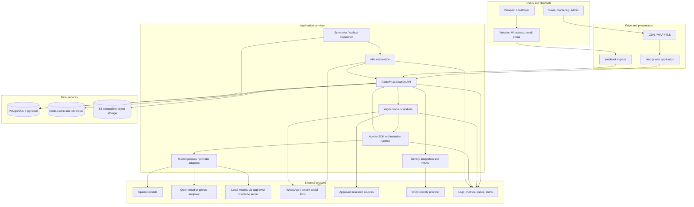
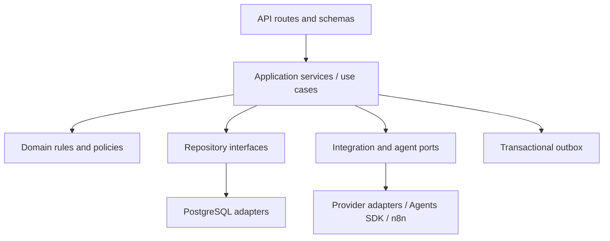
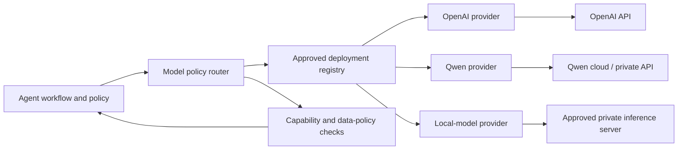
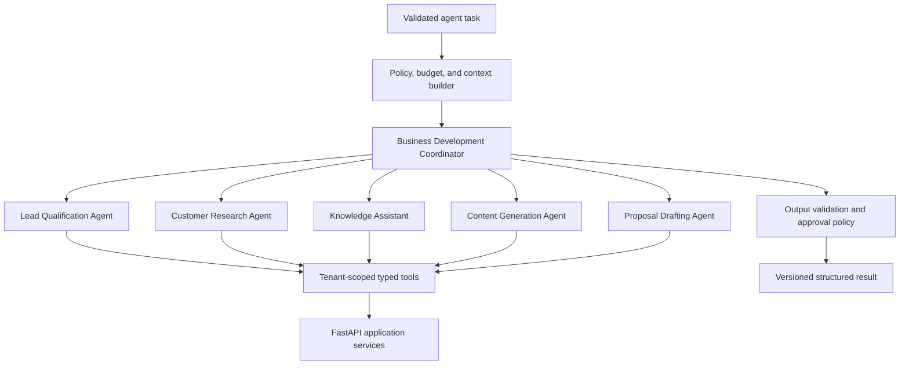
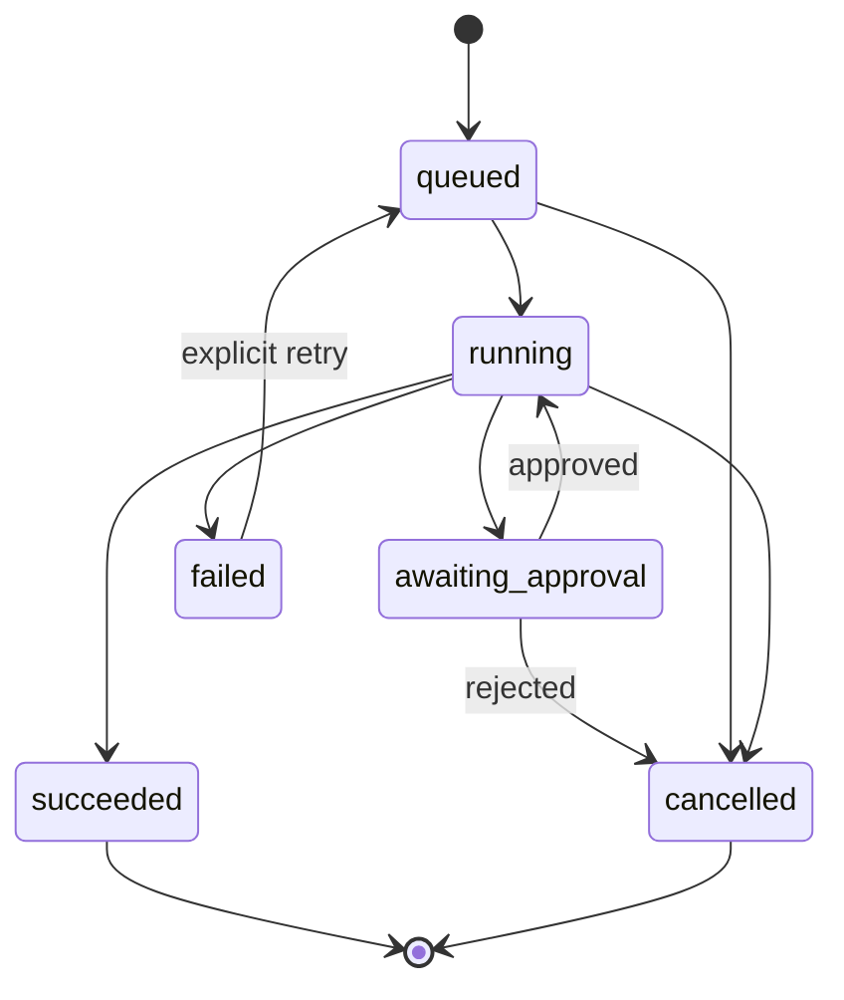
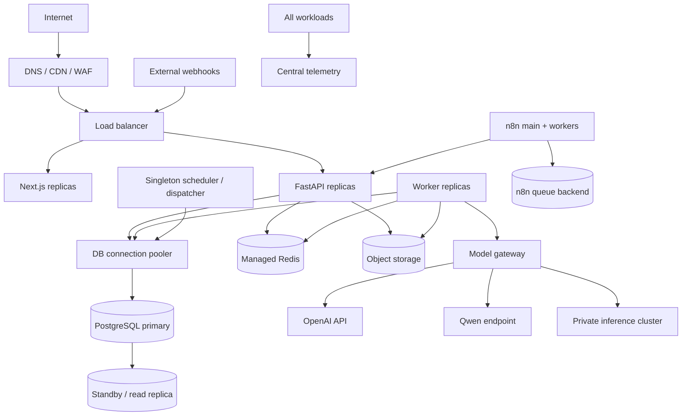

# 企业人工智能业务发展智能体平台

## 技术架构设计

> 英文工程基线：[technical-architecture.en.md](technical-architecture.en.md)。中文版本用于内部审核；如有冲突，以英文版本为准。

**参考业务：** 印度尼西亚商用厨房工程，Sari Arta **状态：** 企业架构基线，第一阶段 M8 验收状态 **主要技术栈：** Next.js, FastAPI, PostgreSQL, OpenAI Agents SDK (包含多模型提供商适配器), n8n, Docker **文档版本：** 1.0

> 中文审阅入口：[中文架构审阅指南](</Users/sujie/Documents/ChatGPT/Enterprise AI Business Development Agent Platform/docs/review-guide.zh-CN.md>)。本英文文档是正式的技术基准，中文指南提供按主题的解释、术语对照和审核问题。

## Phase 2.5 实现状态

知识基础已经作为增量模块实现。FastAPI 负责来源、绑定、文档、审批、摄取运行和检索合同。
独立的 Redis 知识队列把持久化摄取运行引用交给现有 Worker 进程。私有存储保存文件字节；
PostgreSQL 保存元数据、审批、血缘、片段、1,536 维 pgvector 向量和引用。检索默认拒绝，
必须同时满足租户 RLS、已启用的来源/领域/智能体绑定、具有批准检索能力的活动租户智能体
配置，以及已批准且就绪的文档。系统只返回证据候选，不改变 Sari Arta 或 IVC 资格评估
流程。参见 `docs/knowledge-foundation-design.zh-CN.md`。

## 当前实现状态 — 第一阶段 M8

该可运行的MVP实现公共Sari Arta网站，咨询线索获取，认证的CRM工作空间，公司/联系人关系，线索和跟进管理，结合人工审核的AI线索评估，交易机会转化，以及可操作的销售仪表盘。

M8 运行时使用 PostgreSQL 作为标准化的 Agent Run 存储，仅使用 Redis 作为传输。每个运行记录提供商/模型身份、关联 ID、尝试次数、最大尝试次数、心跳、下一次重试时间、结构化输出以及安全的终端故障。 API 和 Worker 进程会发出包含关联字段的 JSON 日志，并排除凭据、原始提供商错误、提示和隐藏的模型推理。

工作进程定期恢复过时的持久运行，在中断的进程或丢失的 Redis 交付后。排队/正在运行的工作支持用户协作取消，并且延迟的提供者结果不能覆盖已取消的运行。关键的资格请求、取消和审核决定会创建审计事件。

该仓库还包括幂等性的 A/B/C 验收场景、可重复的五分钟第一阶段演示，以及本地数据库备份/恢复验证。 托管生产环境、真实身份/提供商配置、监控保留、以及真实数据/AI 处理的审批，仍然是部署的关卡，而不是应用程序开发工作。

## 1. 目的和范围

本文定义了用于多租户平台的企业级技术架构，该平台用于收集海外业务发展线索、评估机会、为销售人员提供实用的知识、研究客户、创建营销内容以及生成可审核的提案。

第一部署可以为Sari Arta提供服务，作为一个组织，但租户边界从一开始就已包含，以便平台能够支持其他企业，而无需重新设计其数据模型或授权层。

该架构优先考虑：

- 明确掌握业务数据和决策的控制权。
- 无状态水平扩展，适用于 Web 和 API 工作负载。
- 耐用、可观察的异步处理。
- 受限的AI自主性，结合类型化的工具、安全措施和人工审批。
- 可替换的外部连接器和人工智能模型。
- 安全、可审计性、隐私和运营恢复。

### 1.1 架构原则

1. **PostgreSQL 是记录系统。** 智能体上下文、n8n 执行和提供方负载不应取代标准的业务记录。
2. **FastAPI 负责处理业务规则。** 所有交互式客户端、智能体和自动化都使用经过身份验证的服务接口，而不是直接编写业务表。
3. **智能体进行推理；确定性服务进行交易。** 智能体可以进行分类、总结、研究和起草。 类型的应用程序工具验证并执行读取或写入操作。
4. **人工审批门，需要采取后续行动。** 提案发布、外部消息、对商业有影响的状态变更，以及破坏性操作，都需要明确的授权。
5. **默认采用异步方式处理耗时任务。** 研究、文档生成、批量导入、嵌入式数据和外部交付等任务通过持久化工作流程进行处理。
6. **在每个层面上都强制执行租户隔离。** 租户上下文存在于身份声明、查询、缓存键、对象路径、事件、日志以及智能体工具中。
7. **可观测性是合同的一部分。** 每一个请求、任务、自动化以及智能体运行都包含相关的标识符。
8. **提供商信息位于适配器后面。** WhatsApp、电子邮件、社交渠道、对象存储、身份验证和人工智能提供商都是可替换的集成。

## 2. 系统背景和质量目标

### 2.1 参与者

| 演员 | 主要功能 |
|---|---|
| 潜在客户/客户 | 提交咨询；交换消息；上传要求 |
| 销售代表 | 审核和评估潜在客户；管理机会和任务；批准沟通和提案 |
| 销售经理 | 分配工作；批准商业内容；检查管道和性能 |
| 营销用户 | 请求、审核和发布生成的內容 |
| 知识管理员 | 策划产品、能力、案例研究、文档和已批准的索赔 |
| 租户管理员 | 管理用户、角色、集成、策略和审计访问 |
| 平台运营商 | 在不获得隐式租户业务访问权限的情况下，操作基础设施 |
| 服务账户 | 运行已批准的 n8n、导入、通知或内部服务工作流程 |

### 2.2 服务级别目标

初始生产目标，将在通过负载测试后进行调整：

| 面积 | 目标 |
|---|---|
| API 可用性 | 99.9% 每月，不包括已宣布的维护 |
| 读取 API 延迟 | p95 在 500 毫秒以内，对于非 AI、非出口端点 |
| 编写 API 延迟 | p95 在非 AI 端点下，延迟低于 800 毫秒 |
| 智能体请求确认 | 小于 1 秒，使用异步运行 ID |
| 仪表盘的更新程度 | 在 60 秒内获取操作视图 |
| 恢复点目标 | 15 分钟用于 PostgreSQL； 24 小时用于可重构的分析 |
| 目标恢复时间 | 4 小时用于区域生产恢复 |
| Webhook 数据导入 | 至少一次、去重、在提供商限制内确认 |
| 审计保留期 | 可配置；默认值为 7 年，适用于材料销售和安全事件 |

单个 SLO 不应假设外部渠道或 AI 提供商具有相同的可用性。 提供商的性能下降必须导致排队、可重试或明确失败的工作，而不是破坏业务状态。

## 3. 系统组件架构

### 3.1 组件职责

| 组件 | 职责 | 明确声明，不对以下情况负责： |
|---|---|---|
| Next.js | 用户体验、服务器渲染的页面、客户端状态、可访问性、本地化、API 消费 | 业务规则执行；直接数据库访问 |
| FastAPI | REST 协议、授权、验证、业务流程、幂等性、审计事件 | 长时间运行的请求处理工作 |
| 工人 | 耐用任务、重试、文档处理、智能体运行、外发交付 | 接受公共流量 |
| 智能体 SDK 运行时 | 供应商无关的智能体定义、工具循环、智能体作为工具、安全措施、结构化结果、跟踪 | 标准的授权、不受限制的数据库访问，或假设每个模型都支持相同的功能 |
| 模型网关/提供商适配器 | 解决已批准的模型部署，规范请求/结果，强制执行路由和数据策略，收集使用和健康状态 | 商业决策、立即拥有、或绕过智能体/工具的安全限制 |
| n8n | 日程安排、连接型工作流程、事件触发自动化、运营工作流程的可视化 | 核心业务数据或政策决策 |
| PostgreSQL | 交易记录、授权数据、审计元数据、智能体/运行元数据、向量搜索 | 二进制文档存储 |
| Redis | 短暂缓存、速率限制计数器、分布式锁、任务代理/结果提示 | 持久的、可靠的、作为事实依据的状态 |
| 对象存储 | 原始上传文件、规范化文档、生成的文件、导出 | 公共、不受限制的文件访问 |
| Webhook 传入 | 签名验证、标准化、去重、快速确认 | 复杂的同步处理 |

### 3.2 主要数据流

#### 潜在客户获取

1. 一个频道向特定于频道的 webhook 或公共线索端点提交一个查询。
2. Ingress 验证来源，强制执行限制，安全地存储原始报文，并生成一个幂等性密钥。
3. FastAPI 可以创建或匹配联系人、组织、潜在客户、对话和消息记录，全部在一个事务中。
4. 一个“发送”事件与业务记录一起提交。
5. 调度器会排队处理资格和通知任务。
6. 评估智能体返回结构化的评估和证据；服务会保留一个版本化的评估。
7. 销售人员审核低置信度或高价值案件。

#### 知识辅助

1. 经过身份验证的用户在一个租户和可选的上下文环境中提出问题。
2. FastAPI 创建一个智能体并提供受限的工具。
3. 检索操作在对向量和关键词搜索之前，先应用租户和文档状态过滤器。
4. 该智能体生成一个结构化的答案，并包含知识单元的引用。
5. 答案、引用、模型元数据、令牌使用情况、延迟以及安全措施结果都被记录。

#### 提案生成

1. 用户请求一份关于机会的草稿，并选择范围、语言、货币和模板。
2. 预检检查验证权限和所需的机会数据。
3. 一项提案运行收集经过批准的产品、定价、案例研究和客户数据，通过只读工具。
4. 智能体创建带有类型结构的提案部分；确定性渲染产生该结果。
5. 该提案仍然是 `draft` 或 `in_review`。
6. 授权员工在共享给外部之前，会先批准版本。

## 4. 前端架构

### 4.1 Next.js 应用结构

使用 Next.js App 路由器，并按业务能力进行组织：

- 身份验证和租户选择。
- 仪表盘和工作队列。
- 联系人和线索。
- 组织和研究。
- 机会与流程。
- 对话和全渠道活动。
- 提案和批准。
- 内容工作室。
- 知识管理。
- 智能体执行检查。
- 管理、集成和审计。

优先使用 React 服务器组件进行数据密集型的初始渲染。仅使用客户端组件来处理交互性强的功能，例如可编辑的表单、看板移动、流式传输智能体输出和文件上传进度。

### 4.2 渲染和数据访问

| 需要 | 模式 |
|---|---|
| 初始认证页面 | 使用 FastAPI 快速渲染并从服务器获取数据，使用短期的用户访问令牌 |
| 交互式查询 | 带有查询缓存和取消功能的类型化 REST 客户端 |
| 突变 | 服务器操作或客户端修改向 FastAPI；永远不要直接访问数据库 |
| 智能体进度 | 服务器端事件，用于单向事件流；轮询作为备选方案 |
| 实时对话更新 | SSE 初始；仅在需要双向、低延迟的情况下使用 WebSocket |
| 大文件上传 | 请求预签URL，直接上传到对象存储，然后完成元数据 |
| 导出/下载 | 授权检查后，有效期短的已签名的下载 URL |

OpenAPI 是用于生成 TypeScript API 类型的合同来源。 应该在高风险边界处使用运行时响应验证，而编译时类型可以提高开发人员的反馈。

### 4.3 状态管理

- **URL状态：** 筛选、分页、排序、选择的管道、以及报告范围。
- **服务器状态：** 使用具有租户信息的 API 查询缓存。
- **表单状态：** 本地表单库，以及与API约束相匹配的模式验证。
- **临时的UI状态：** 组件或小型应用程序的存储。
- **在浏览器中没有标准的业务状态：总是与API进行重置。**

乐观更新仅限于可逆、低风险的交互。 任务分配、审批、阶段变更以及发送操作，都需要服务器确认，并且包含版本记录，以防止更新丢失。

### 4.4 前端安全

- 使用 PKCE 的 OIDC 授权码流程。
- 优先使用安全的、`HttpOnly`、`SameSite` Cookie 进行浏览器会话；不要在本地存储 bearer 令牌。
- 使用cookie身份验证的请求，用于保护CSRF（跨站请求伪造）攻击。
- 严格的内容安全策略、可信的资产来源以及点击劫持保护。
- 输出编码和清理，用于富文本、导入的HTML、AI内容和用户生成内容。
- 从浏览器遥测中删除敏感字段。
- 租户和角色检查控制导航以提高可用性，但 API 独立地强制执行每个权限。

### 4.5 用户体验要求

- 响应式桌面优先的销售工作空间，并支持可用的平板电脑。
- WCAG 2.1 AA 目标。
- 英语和印尼语，最初为英语和印尼语；支持本地化日期、数字、电话号码、时区和货币。
- 所有AI生成的内容都标示为“生成”，并在适用情况下显示来源证据，并显示审批状态。
- 长时间运行的任务会立即返回，并显示可见的排队/运行/已完成/失败状态。
- 错误包括一个安全且易于支持的关联ID，而不是堆栈跟踪或提供者密钥。

## 5. 后端架构

### 5.1 FastAPI 模块化单体应用

首先采用模块化单体架构，而不是独立的微服务。它提供事务一致性和更简单的操作，同时保留了模块化的边界。

推荐模块：

| 模块 | 核心所有权 |
|---|---|
| 身份和访问 | 用户资料映射、租户、会员、角色、权限、服务账户 |
| CRM | 组织、联系人、潜在客户、资格评估、商机、分配 |
| 对话 | 频道、对话、消息、附件、同意 |
| 知识 | 来源、文档、版本、块、嵌入、检索策略 |
| 智能体 | 智能体定义/配置版本、运行、步骤、审批、引用、评估 |
| 建议 | 模板、提案、版本、章节、批准、生成的成果 |
| 内容 | 活动简报、内容项目、修订、审核/发布状态 |
| 集成 | 连接账户、Webhook 事件、交付尝试、提供商映射 |
| 自动化 | n8n 相关的事件、工作流程注册、执行 |
| 通知 | 应用内和外部通知意图/偏好 |
| 审计与合规 | 不可变审计记录、导出、保留和删除请求 |

每个模块都暴露应用程序服务和存储接口。跨模块的修改是通过服务方法或领域事件进行，而不是直接访问表。

### 5.2 叠层

- **路由：** 运输相关问题、身份验证依赖、请求解析、响应映射。
- **应用服务：** 工作单元边界、授权策略调用、编排、幂等性。
- **领域层：** 状态转换、资格规则、审批策略、值对象。
- **适配器：** SQL、对象存储、提供商 API、任务队列、智能体运行时。

### 5.3 交易和一致性模型

- 使用 ACID 事务来处理业务聚合及其出站事件。
- 使用乐观并发，使用`version`列或`updated_at`前提条件，用于用户编辑的聚合。
- 使用事务性出局模式来处理离开 PostgreSQL 的工作。
- 消费者是幂等的，并记录已处理的事件或交付键。
- 外部副作用使用状态机：`pending`、`processing`、`succeeded`、`failed`、`dead_letter`。
- 请不要在 AI 或提供商调用之间打开数据库事务。
- 使用补偿性操作来处理多系统进程，而不是分布式事务。

### 5.4 异步处理

最初使用由 Redis 支持的 Python 任务系统，同时 PostgreSQL 保持任务/运行状态的规范。生产环境可以将消息代理迁移到托管的 Redis 或持久的消息服务，而无需更改应用程序合同。

按工作负载划分队列：

- `critical.webhooks`
- `crm.qualification`
- `agents.interactive`
- `agents.batch`
- `knowledge.ingestion`
- `documents.render`
- `integrations.outbound`
- `notifications`

应用针对队列的并发、超时、重试和死信策略。仅重试瞬时故障，采用指数退避和抖动。不可重试的验证和授权失败会立即失败。

### 5.5 缓存

- 仅在可测量时，缓存参考数据、权限、仪表盘聚合数据和检索结果。
- 每个键都包含租户 ID 和一个模式/版本前缀。
- 使用短 TTL（时间到期）和基于事件的失效，用于安全相关的。
- 永远不要在共享的纯文本中缓存访问令牌、原始密钥或敏感的智能体提示。
- 缓存失效必须降低性能，而不是降低正确性。

### 5.6 API 规范

详细合同位于 `api-design.en.md`。 全局：

- REST 在 `/api/v1` 下。
- JSON 使用 `snake_case`。
- UUID标识符。
- 协调世界时 (UTC) RFC 3339 时间戳。
- 光标分页，用于大型活动集合；仅限小管理员列表的偏移分页。
- `Idempotency-Key` 是创建公共联系人、发送外部邮件以及其他容易出现重试的情况的必要条件。
- `ETag`或明确`version`用于对并发敏感的更新。
- 与 Problem Details 兼容的错误对象。

## 6. AI 智能体层架构

OpenAI 智能体 SDK 被用作编排框架，因为服务器应该拥有类型化的工具和持久的业务状态，而 SDK 则负责管理有限的智能体循环、专家编排、安全措施、适当的会话、审批和跟踪。并非每个运行都需要使用由 OpenAI 托管的模型。官方 OpenAI 文档标识了用于非 OpenAI 模型的提供商/适配器表面以及混合提供商堆栈，同时指出某些 SDK 功能依赖于 OpenAI Responses 路径。请参阅 [OpenAI 智能体 SDK 指导](https://developers.openai.com/api/docs/guides/agents) 和 [模型和提供商](https://developers.openai.com/api/docs/guides/agents/models)。

### 6.1 多模型提供者架构

Agent SDK 仍然是首选的编排层。 每一个非 OpenAI 集成都使用支持的模型提供者接口或内部适配器，该适配器实现了所需的运行时合同。 仅使用与 OpenAI 兼容的 HTTP 语法并不能被视为行为兼容性的证明。

支持的提供商类：

| 提供者类 | 示例 | 预期用途 |
|---|---|---|
| 由OpenAI托管 | 已批准的 OpenAI 文本/推理模型 | 高质量的工具使用，复杂的提案和研究工作流程 |
| 外部云 | Qwen 通过已批准的阿里云或兼容的私有端点 | 中文/印尼工作负载，区域或成本要求  中文: |
| 自托管/私有 | Qwen、Llama、Mistral，或vLLM、TGI、Ollama，或企业推理网关背后的另一个已批准的模型 | 受限数据处理、离线/私有部署、可预测的基础设施控制 |

每个可部署的模型都具有一个能力配置文件：

- 文本和支持的语言。
- 上下文和输出限制。
- 结构化输出的可靠性。
- 功能/工具调用以及并行调用支持。
- 支持流式传输。
- 支持视觉或文档输入。
- 推理控制，如有。
- 提供者原生追踪和使用报告。
- 数据区域、保留策略、训练-使用策略，以及网络边界。
- 测量质量、延迟、吞吐量和成本。

一个智能体工作流程声明了所需的能力和允许的数据分类。路由器仅选择满足这两个条件的活动模型部署。一个模型只有在通过该工作流程的评估和安全基线后，才能被启用。

### 6.2 智能体拓扑

使用管理风格的流程编排，用于平台工作流：一个流程协调员负责最终的类型化结果，并作为工具调用专家。仅在专家应接手持续的客户对话时，才进行任务交接。

### 6.3 智能体职责

| 智能体 | 输入 | 允许的输出 | 关键工具 | 批准 |
|---|---|---|---|---|
| 潜在客户评估 | 负责人、消息、来源、资格评估标准 | 得分, 级别, 需求, 差距, 接下来行动, 证据, 信心 | 读取姓名/联系方式；检索知识；保存草稿评估 | 人工审核，用于高价值或低置信度的结果 |
| 客户调研 | 组织、国家、域名、研究简报 | 事实与来源、风险、假设、未解决的问题 | 已批准的 Web/研究适配器；读取 CRM；保存研究草稿 | 在事实得到验证之前，必须存在 CRM 数据 |
| 知识助手 | 用户问题，租户范围，可选机会 | 答案、引用、不确定性、建议的下一步 | 混合检索，针对已批准的文档 | 无外部操作 |
| 内容生成 | 简短、受众、渠道、品牌政策 | 草稿变体、主张/引用、本地化说明 | 知识检索；品牌规则；内容草稿保存 | 发布前必须完成 |
| 提案起草 | 机会、范围、已批准的目录/价格、模板 | 结构化的提案部分、假设、排除项、缺失数据 | CRM 阅读；已批准的知识；定价服务；提案草稿保存 | 需要在发送/发出之前必须完成 |
| 协调员 | 任务和政策背景 | 已验证的专科医生结果或升级 | 专家作为工具，状态工具 | 根据底层操作 |

### 6.4 运行生命周期

每次运行记录租户、发起方、目的、智能体/配置版本、输入参考、模型配置、状态、跟踪关联、令牌/成本估算、时间、安全措施结果以及最终的结构化输出。原始敏感输入和输出有单独的保留和访问策略。

### 6.5 上下文工程

上下文在服务器端进行组装，并保持简洁：

1. 稳定智能体的指令和策略版本。
2. 已验证的租户、用户、角色、区域和任务目的。
3. 已选择的CRM事实，通过记录ID和版本进行引用。
4. 检索到的知识片段，包含文档/版本来源信息。
5. 对话窗口或摘要，如果需要。
6. 工具描述仅限于此智能体和任务。
7. 明确的自主权、批准、时间、工具调用和代币预算。

请勿将来自不可信渠道的文本插入系统指令中。 将客户消息、文档、网页和工具输出视为可能包含提示注入的不可信数据。

### 6.6 工具

所有智能体工具都是对应用程序服务的窄、类型化的、可审计的包装。它们：

- 接收模型选择的租户ID，而不是可防伪的运行时上下文。
- 验证标识符和对象级别的访问权限。
- 区分读、草稿编写、结果编写和外部操作的能力。
- 返回小而结构化的结果，并提供稳定的错误代码。
- 强制执行超时、输出限制和速率限制。
- 创建对敏感数据的读取和所有写入的审计记录。
- 需要对后续行动进行可恢复的审批。

没有可用的通用 SQL、shell、任意 HTTP、秘密读取或不受限制的文件工具，这些工具是面向生产业务智能体的。

### 6.7 基于检索的生成

- 异步上传、提取文本、检测语言、规范化、分块和嵌入。
- 每个块都包含租户ID、源/文档/版本ID、访问权限、审批状态、生效日期、语言以及内容哈希。
- 检索功能结合了 PostgreSQL 的全文搜索和 pgvector 的相似度搜索，然后根据评估结果重新排序。
- SQL 过滤器在候选文本到达模型**之前**，强制执行租户和文档访问权限。
- 答案引用文档标题、版本、页/章节以及区块 ID。
- 被取代、隔离、过期或未批准的文件将被排除。
- “未找到证据”是一个有效的结果；智能体不得自行制造答案。

### 6.8 保护栏和人工干预

防护栏层：

1. **入口:** 文件类型/大小、恶意软件扫描、滥用限制、同意和渠道验证。
2. **输入:** 提示注入检测、禁止内容、PII分类、范围验证。
3. **工具：** 授权、允许的操作、数据最小化、参数约束、审批要求。
4. **输出:** 模式验证、引用是否存在、不支持的声明检查、敏感数据泄露、品牌/商业规则。
5. **业务：** 确定性阈值，例如利润底线、折扣权限、提案完整性以及允许的潜在客户状态转换。

人类审批记录记录请求人、审批人、操作摘要、预览、到期时间、决定、评论和时间戳。在审批后更改操作参数会使审批失效。

### 6.9 模型路由、备用方案和提示管理

- 提供方、部署、模型ID和参数是版本化的配置，而不是硬编码的业务逻辑。
- 生产型号或不可变部署别名，优先考虑一致性，而不是自动升级。
- 一个租户策略可能需要`local_only`，允许选定的区域/提供商，或允许任何已批准的部署。
- 工作流程策略定义了主要部署和备用部署。 备用部署仅在数据分类、能力、审批风险和评估阈值仍然匹配时允许。
- 永远不要将受限制的负载发送到外部备用时，当主本地模型不可用时。 采用排队、安全失败或将任务路由给人工处理。
- 仅对常见的运行时合同进行标准化。 供应商特定的功能仍然是显式的能力，而不是隐藏在误导性的最低共同 denominator 接口后面。
- 版本说明、工具、输出模式、安全措施以及检索配置，统一起见。
- 通过开发、测试、离线评估、有限部署和生产环境，推广变更。
- 评估每个提供商/模型组合在代表性的英语、印尼语和中文案例中，对于以下方面的准确性：资格准确性、引用忠实度、提案完整性、工具调用正确性、结构化输出有效性、有害输出、延迟和成本。
- 保持备用行为：使用队列/重试，使用已批准的另一个部署方案来执行允许的任务，或将任务路由到人工审核。永远不要在高风险工作流程中默默地降级。

### 6.10 智能体的可观测性

关联应用程序 `request_id`、`job_id`、`agent_run_id`、提供方响应 ID、SDK 跟踪 ID 和业务对象 ID。 捕获：

- 智能体和工具的时间安排。
- 工具调用和结果，具有可配置的遮蔽功能。
- 转移、安全措施、审批、以及错误。
- 按租户、工作流程、提供商和模型部署，估算代币使用情况和成本。
- 路由决策、能力检查、回退原因、端点健康状况，以及适用的本地 GPU 利用率。
- 检索结果质量和引用利用率。
- 结果反馈和后续的人工校正。

敏感的跟踪数据包默认情况下被禁用或被遮蔽。 访问跟踪数据的权限比访问常规应用程序日志的权限更窄。

## 7. 数据库和存储架构

PostgreSQL 是权威的关系型存储。 详细的逻辑设计在 `database-design.en.md` 中。

### 7.1 PostgreSQL 拓扑结构

- PostgreSQL 16及更高版本，带有`pgvector`、`pg_trgm`和`citext`（已批准）。
- 主要冗余，以及在生产区域内的同步或接近同步备用。
- 在负载允许的情况下，读取仪表盘、导出和分析的副本。
- 应用程序进程和 PostgreSQL 之间的连接池器。
- 自动化备份、持续的 WAL 归档、按时间点恢复以及恢复测试。
- 模式迁移是向前兼容的，并且在 CI/CD 流程中运行。

### 7.2 租户隔离

每个由租户拥有的桌子都包含 `tenant_id`。 仓库方法需要租户上下文，PostgreSQL 的行级别安全是应用程序角色的深度防御控制。 后台任务和 n8n 服务调用通过经过身份验证的服务声明来设置租户上下文；它们不使用用于日常工作的绕过角色。

平台操作，如果需要跨租户访问，则使用单独的经过审计的角色和有时间限制的权限提升。

### 7.3 存储类别

| 数据 | 存储 | 政策 |
|---|---|---|
| CRM和工作流程记录 | PostgreSQL | 事务型，备份，租户范围 |
| 嵌入 | PostgreSQL/pgvector | 从已批准的块版本重建 |
| 文件和生成的文件 | 与S3兼容的存储 | 加密、版本化、私有、恶意软件扫描 |
| 缓存和代理数据 | Redis | 短暂的；没有独特的业务事实 |
| 日志/指标/跟踪 | 可观测性平台 | 已删除并按保留期限分级 |
| 分析 | 最初读取副本；稍后在仓库中 | 尽可能去标识/减少个人信息 |

### 7.4 数据生命周期

- 租户级别的保留策略定义消息、文件、跟踪和审计的保留期限。
- 法律保留会覆盖正常的删除。
- 软删除支持正常恢复；隐私删除是一种受控的清除/匿名化流程。
- 对象删除与元数据和备份保留策略协调。
- 当其来源被删除或被取代时，派生嵌入和摘要将被删除或重新生成。

## 8. 外部集成架构

### 8.1 适配器模式

每个提供者适配器公开标准操作，例如 `send_message`、`fetch_profile`、`verify_webhook` 或 `publish_content`。 提供者 ID 和原始数据在集成表中存储，而 CRM 和对话模块则使用标准记录。

### 8.2 频道输入

1. 在特定提供商的端点处接收请求。
2. 保留原始内容以进行签名验证。
3. 验证签名、时间戳、内容类型和大小。
4. 存储提供商事件 ID 和 payload 哈希的 webhook 事件。
5. 尽快获得供应商确认。
6. 异步地将数据转换为标准化的联系人、对话、消息和附件记录。
7. 隔离未受支持或可疑内容。

预计至少一次交付。 对提供商、账户和事件/消息 ID 的唯一约束提供去重功能。

### 8.3 n8n 边界

n8n 接收经过数字签名的平台事件或调用服务账户的 REST 端点。它可能：

- 运行日程和提醒。
- 协调批准的CRM通知。
- 连接提供商的API，只要其连接器在实际应用中具有用处。
- 启动内容日历并创建后续活动流程。
- 报告工作流程执行状态。

n8n 必须避免：

- 直接连接到生产业务表。
- 存储租户级别的超级用户凭证。
- 制定自主商业承诺。
- 成为唯一记录一个机会、消息、批准或失败的记录。

工作流程定义具有版本控制功能，并由环境进行推广。凭据存储在加密的凭据后端中。每个工作流程都有并发限制、重试规则、所有者、租户范围以及紧急停止功能。

### 8.4 向外通信

发送消息的流程如下：草稿 → 政策检查 → 根据需要批准 → 队列中 → 提供方接受 → 已送达/已阅读/失败。 提供方的回调以幂等方式更新送达状态。 在发送之前，立即检查同意、退订、静默时段、发件人身份和管辖权政策。

### 8.5 集成容错性

- 每当与任何提供商进行通话时，设置超时时间。
- 使用指数退避和具有提供商意识的速率限制来重试瞬态错误。
- 使用断路器来应对重复的提供方故障。
- 处理已耗尽的死信事件，并具有操作员重放机制。
- 记录请求/响应元数据，同时包含秘密和PII（个人身份信息）的遮蔽。
- 定期与提供商状态进行核对，以确保高价值工作流程的正确性。

## 9. 部署架构

Docker 是打包标准。开发人员可以使用 Docker Compose；企业生产环境应使用托管的容器编排器，同时保持相同的镜像。

### 9.1 容器角色

- `web`：Next.js 生产服务器。
- `api`：FastAPI ASGI 进程；无状态。
- `worker`：针对特定工作负载的队列消费者部署。
- `model-gateway`：内部提供商路由、功能验证、健康检查以及使用规范化。
- `inference-server`：可选的私有 GPU/CPU 驱动的模型服务；仅在本地模型已启用时部署。
- `scheduler`：作为任务调度和 Outbox 发送的单一领导者。
- `n8n-main`：编辑器/API 和 Webhook 控制平面。
- `n8n-worker`：排队模式工作流程执行。
- 仅用于开发的 PostgreSQL、Redis 和对象存储容器。

当可用时，生产数据库、Redis、密钥和对象存储应作为管理服务来管理。

### 9.2 环境

使用单独的云账户/项目和数据，用于开发、测试和生产环境。不要将生产环境的 PII 复制到较低的环境中。测试环境使用合成或匿名化的代表性数据，以及为每个配置的模型提供商单独的凭据或推理部署。

### 9.3 扩展

- 自动调整 Web/API 的 CPU、内存、延迟和请求并发。
- 根据队列深度和消息年龄，自动调整工作节点数量。
- 从批量导入中隔离交互式智能体的运行。
- 分别按模型、GPU内存、请求并发、每秒令牌数和队列年龄进行本地推理的规模化；不要将其与API副本数量联系起来。
- 为每个租户应用 API、任务、智能体并发、令牌、存储和出站发送的配额。
- 首先，水平扩展 PostgreSQL，然后添加读副本，并对高吞吐量的只读表进行分区。
- 仅使用 CDN 缓存公开、非敏感的资产。

### 9.4 持续集成/持续交付和发布

- 构建不可变、最小、非根镜像，并使用固定依赖项和 SBOM。
- 运行代码检查、类型检查、单元测试、合约验证、迁移、安全和容器扫描。
- 显示图像并在不同环境中推广相同的摘要。
- 使用滚动部署或蓝绿部署，并使用健康/就绪探测。
- 在依赖于它们的代码之前，先执行向后兼容的数据库迁移。
- 使用功能标志来测试或部署有风险的智能体或集成更改。
- 自动化回滚覆盖应用程序镜像；数据库更改需要经过测试的修复方案或明确的可逆迁移。

### 9.5 备份与灾难恢复

- PostgreSQL 恢复到特定时间，同时使用加密的跨账户备份副本。
- 对象存储版本控制和生命周期策略。
- 导出/版本 n8n 工作流程和非密钥配置。
- 基础设施定义为代码。
- 每季度恢复演习和年度区域恢复演习。
- 文档提供者凭证轮换和 Webhook 终点失效转移。

## 10. 安全设计

### 10.1 威胁模型要点

主要威胁包括账户被盗、租户数据泄露、对象级别权限失效、Webhook 伪造、提示注入、通过 AI 或日志泄露敏感数据、恶意上传、连接器凭据窃取、未经授权的外部通信以及供应链攻击。

### 10.2 身份和访问管理

- 企业 OIDC 身份提供者；强制要求员工使用多因素身份验证。
- 短期的访问令牌，包含颁发者、目标、主体、租户、会话和授权声明。
- 租户成员身份已在服务器端解决；不要单独依赖自由格式的租户标头。
- RBAC 基础角色：`tenant_admin`, `sales_manager`, `sales_rep`, `marketing`, `knowledge_manager`, `auditor`, `service_account`.
- 精细化的权限和对象级别的规则补充了角色。
- 服务账户拥有一个工作负载所有者，具有狭窄的权限范围，有过期/轮换策略，并且不支持交互式登录。
- 高风险管理支持分级身份验证。

### 10.3 授权

权限检查发生：

1. 在广泛授权的路径上。
2. 在对象和状态转换策略的应用服务中。
3. 通过租户范围进行仓库查询。
4. 在 PostgreSQL 中，使用基于角色的访问控制（RLS）作为多层防御。
5. 再次在智能体工具和 n8n 服务端点内部。

默认拒绝。如果暴露资源的存在状态，则返回“未找到”语义，以防止泄露跨租户信息。

### 10.4 数据保护

- TLS 1.2及更高版本，外部和点对点加密服务流量。
- 在静止状态下对 PostgreSQL、Redis、对象存储、备份和可观测性存储进行加密。
- 连接器令牌和选定的高敏感值级别的字段级别的加密。
- 使用云 KMS 管理的密钥，具有职责分离和轮换功能。
- 预签对象 URL 具有短暂的有效期，并且仅适用于单个对象/操作。
- 数据分类：公开、内部、机密、受限。
- 尽量减少发送给 AI 和外部研究提供商的数据；应用租户可配置的 AI 数据策略。

### 10.5 应用和 API 安全

- 严格的模式验证和请求大小限制。
- 按 IP 地址、用户、服务账户、租户、端点和提供商进行速率限制。
- 通过仓库进行参数化 SQL 操作。
- 通过向外允许列表和网络出口控制来增强SSRF防护。
- 安全头部、CORS 允许列表、CSRF 防御以及文件下载保护。
- 对敏感操作的幂等性和重放窗口。
- Webhook 签名和时间戳验证。
- 病毒/恶意软件扫描和上传内容的类型验证。
- 依赖、密钥、静态应用程序安全测试 (SAST)、动态应用程序安全测试 (DAST) 和 CI/CD 中的容器扫描。

### 10.6 针对人工智能的安全

- 将所有从检索或用户提供的文本视为不可信。
- 请将策略保存在检索到的上下文中，并清楚地将指令与数据分开。
- 按智能体和任务分别提供授权工具；不要暴露通用执行工具。
- 在工具内部使用确定性授权，永远不要进行判断建模。
- 需要提供证据/引用来支持商业主张的真实性。
- 在持久化之前，验证结构化输出。
- 在将任何提示或检索到的内容路由到模型提供商之前，必须强制执行租户的数据位置策略。
- 将外部和本地模型视为独立的信任区域，并使用特定于提供商的凭据、网络策略、日志记录、保留策略和安全审查。
- 防止本地推理端点建立任意的向外连接或访问企业数据库。
- 应用代币、时间、递归、工具调用和支出预算。
- 在发送、发布、定价承诺或处理敏感数据之前，进行审批等待。
- 红队提示注入、跨租户检索、工具滥用以及数据泄露。
- 维护一个全局和按租户的“关闭”开关，用于管理智能体、工具和自动化。

### 10.7 秘密和网络安全

- 秘密存储在秘密管理器中，并在运行时注入。
- 在图像、仓库、n8n 导出、提示、日志或客户端包中，没有任何秘密信息。
- 将网络分为边缘、应用、数据和管理四个不同的层级。
- PostgreSQL 和 Redis 没有公开的端点。
- 在可行的情况下，工作负载应使用出口允许列表。
- 管理访问使用 SSO（单点登录），经过审计的 bastion/私有访问，以及按需权限提升。

### 10.8 审计与事件响应

审计事件捕获执行者、租户、操作、目标、结果、原因、源 IP/会话、相关 ID，以及在适当情况下，前后摘要。审计存储是只读的，并针对应用程序角色进行保护，并具有保留控制。

警报触发时：

- 多次授权失败或跨租户探测。
- 异常的出口、检索量，或智能体令牌的使用。
- 连接器凭证或 Webhook 验证失败。
- 审批绕过尝试。
- 高失败/死信率。
- 对角色、集成、策略、提示或智能体配置的更改。

事件应对流程涵盖凭证轮换、连接器隔离、租户通知、智能体关闭、证据保存、恢复以及事后审查。

## 11. 可观测性和运维

使用与 OpenTelemetry 兼容的仪器：

- **指标：** 请求速率/错误/延迟，队列深度，任务年龄，数据库池饱和度，智能体成功/成本/延迟，检索质量，提供方交付，n8n 执行健康。
- **日志：** 结构化的 JSON，包含相关 ID 和脱敏信息。
- **跟踪：** HTTP、任务、SQL 摘要、集成和智能体跨度。
- **业务Telemetry：** 资格转换、首次响应时间、机会老化、提案周转、人工修正率。

仪表盘区分平台健康状况和租户的业务分析。告警有所有者、严重程度、操作手册和噪音预算。

## 12. 架构决策与演变

| 决定 | 理由 | 重新审查触发器 |
|---|---|---|
| 模块化单体 | 保持交易清晰，降低运营成本 | 一个模块需要独立的缩放/释放或团队所有权 |
| PostgreSQL + pgvector | 一个安全的交易和检索平台，最初 | 向量语料库/延迟超过已测试的 PostgreSQL 限制 |
| 使用 Redis 的工作进程 | 低延迟排队和易于操作 | 耐用性/合规性需要一个专门的消息服务 |
| REST + SSE | 简单的集成和流式传输进度 | 实时双向通道需求出现 |
| 智能体 SDK 管理模式 | 协调人拥有输出和审批政策 | 需要通过转移（handoff）来明确指定专人负责对话。 |
| 由多模型提供者层控制 | 支持 OpenAI、Qwen 和私有模型，无需将工作流程与任何一个提供商耦合 | 提供方无法满足所需的 SDK/运行时合同或治理政策 |
| n8n 背后服务 API | 保持业务规则和数据的可审计性 | 未计划进行任何更改；连接器实现可能有所不同 |
| Docker 软件包，管理式编排 | 便携式开发和生产规模扩展 | 部署平台限制要求采用替代方案 |

## 13. 交付顺序

1. 平台基础：身份、租户、审计、API 规范、PostgreSQL、对象存储、队列、可观测性。
2. CRM 核心：潜在客户获取、联系人、组织、商机、任务、仪表盘。
3. 会话集成：首先是网站和电子邮件，然后是 WhatsApp 和已批准的社交渠道。
4. 知识获取与基于知识的助手。
5. 基于人工审查和评估的线索资格评估基准。
6. 客户调研和方案撰写。
7. 内容工作流程和 n8n 自动化。
8. 高级分析、模型优化、额外租户，以及区域韧性。

每个阶段都必须包括授权测试、租户隔离测试、审计覆盖、运营仪表板、备份验证以及适用的智能体评估。

## Phase 2.5.1 知识管理控制面

企业知识管理使用 `knowledge_collections`、逻辑受管文档、不可变文档版本和明确的文档—智能体绑定。该控制面与 Phase 2.5 检索数据面分离。其 UI 和 API 不生成嵌入，也不调用检索；未来的明确发布边界只能转移已批准或已启用、属于当前租户且绑定同业务域智能体的版本。参见 `enterprise-knowledge-management-design.zh-CN.md`。

Phase 2.5.2 通过专用 Redis 队列和 Worker 实现该明确处理边界。符合条件的准确版本会被提取、清洗、分块，通过提供商接口生成嵌入，并写入按智能体隔离的 `managed_knowledge_chunks`。不启用面向用户的检索或回答生成。参见 `knowledge-processing-pipeline-design.zh-CN.md`。

Phase 2.5.3 通过明确的当前、已发布和已生效版本指针，分开的审批人与发布人权限，创建不可变后继版本的回滚，乐观并发控制，以及强制执行 RLS 的 `knowledge_audit_logs` 账本来治理该边界。`/knowledge/{id}` 工作台提供这些控制，但不启用检索。参见 `knowledge-governance-design.zh-CN.md`。

Phase 2.6.1 通过 `POST /api/v1/knowledge/search` 启用第一条只读受治理检索边界。系统先完成租户和智能体能力授权，再生成查询嵌入；之后 pgvector 搜索要求已生效生命周期、准确已发布/已生效版本一致、审核已批准、处理已完成、同智能体绑定已启用，以及语言、提供商/模型和相似度符合条件。它只返回证据和引用，不生成答案。参见 `knowledge-retrieval-design.zh-CN.md`。
