# Enterprise AI Business Development Agent Platform

## Frontend UI/UX Design

**Reference business:** Sari Arta, Indonesia commercial-kitchen engineering  
**Applications:** Public B2B website and internal AI business dashboard  
**Design status:** Product and experience baseline; no frontend implementation  
**Current delivery state:** M1–M5 complete; M6 dashboard is the next MVP milestone  
**Document version:** 1.0

## Document decisions

This design defines two user-facing experiences within one coherent product:

1. A public website that earns trust and converts qualified project inquiries.
2. An authenticated workspace that helps Sari Arta staff decide and perform the next sales action.

The two experiences share brand foundations but not the same navigation, density, or interaction model. The public experience is editorial, visual, proof-led, and conversion-oriented. The internal experience is operational, information-dense, and action-oriented.

This document does not authorize unsupported commercial claims. Statements about manufacturing, certifications, delivery performance, completed projects, warranties, or service coverage must be connected to approved Sari Arta evidence before publication.

### Scope labels used in this document

| Label | Meaning |
|---|---|
| **MVP** | Fits Phase 1 and may be implemented after design approval |
| **Phase 2** | Designed for continuity but not part of current implementation authority |
| **Future** | Direction only; do not implement without a roadmap decision |

## 1. Product UX strategy

### 1.1 Product experience statement

> Help a serious commercial-kitchen buyer move from uncertainty to a confident project conversation, then help Sari Arta move that conversation from inquiry to qualified opportunity without losing context.

The experience should make the platform feel like a connected commercial system rather than a marketing site beside an unrelated CRM.

```mermaid
flowchart LR
    Buyer["Buyer needs a kitchen project"] --> Trust["Understands Sari Arta capability"]
    Trust --> Fit["Recognizes project fit"]
    Fit --> Inquiry["Submits structured inquiry"]
    Inquiry --> Lead["Sales receives complete lead"]
    Lead --> AI["AI identifies evidence and gaps"]
    AI --> Human["Sales reviews and follows up"]
    Human --> Opportunity["Qualified project becomes opportunity"]
```



### 1.2 Experience principles

#### Proof before promotion

Industrial buyers look for delivery confidence, not consumer-style excitement. Every major claim should be followed by proof such as a project case, process artifact, team credential, factory image, installation photo, documented service region, or approved customer quote.

Avoid invented statistics, generic award badges, stock-photo claims, and vague statements such as “world-class quality” without evidence.

#### Sell the delivery system, not only the equipment

The website should position Sari Arta around an end-to-end project outcome:

```text
Requirement discovery
→ workflow and capacity planning
→ equipment engineering and manufacturing
→ logistics and local coordination
→ installation and commissioning
→ training and after-sales support
```

China manufacturing and Indonesia installation should be explained as a coordinated delivery model, not as disconnected geographic advantages.

#### Reduce uncertainty progressively

Do not ask a new prospect for a complete technical brief before earning trust. The public journey starts with role and project type, then progressively asks for location, capacity, timeline, and available drawings.

The internal workspace follows the same principle: show the next decision and missing information first; reveal audit and technical detail on demand.

#### One clear next action per context

- Public website: `Discuss your project`.
- New lead: assign and review.
- Qualifying lead: complete missing information or run qualification.
- Pending AI review: accept or reject the assessment.
- Qualified lead: convert to opportunity.
- Open opportunity: complete the next task or move to the valid next stage.

Secondary actions must not compete visually with the primary workflow.

#### AI is visible, bounded, and reviewable

AI output must always show:

- That it was AI-generated.
- Run status and freshness.
- Score, confidence, evidence available, and missing information.
- The human review state.
- A plain-language explanation that AI does not make the commercial decision.

The interface must not simulate certainty by hiding unknown values or failed runs.

#### Manual work remains first-class

Sales users can edit the record, create a task, add a note, qualify manually, and continue the opportunity workflow when AI is disabled or unavailable.

#### Bilingual by design

- Public website: English first for overseas acquisition, with Bahasa Indonesia as a complete alternate locale.
- Internal workspace: English and Bahasa Indonesia labels, dates, numbers, and currencies.
- Chinese may be added later for supplier/manufacturing coordination, but layouts must already tolerate longer translated strings.

### 1.3 Success measures

#### Public website

- Qualified inquiry completion rate.
- Start-to-submit form completion rate.
- Conversion by solution segment and traffic source.
- Percentage of inquiries containing project type, location, capacity, and timeline.
- Time from submission to first human response.

#### Internal workspace

- Time from sign-in to identifying the next action.
- New leads assigned within the agreed response window.
- Leads with a scheduled next task.
- AI assessments reviewed rather than left pending.
- Time from qualified lead to opportunity conversion.
- Opportunities without recent activity or expected close date.

Metrics are operational signals, not employee surveillance. The MVP should not build advanced analytics beyond the roadmap dashboard.

## 2. User personas

### 2.1 Public personas

#### Persona A — Institutional project owner

Examples: school operator, hospital administrator, corporate cafeteria owner, central-kitchen investor.

| Attribute | Description |
|---|---|
| Goal | Deliver a reliable kitchen within budget and opening schedule |
| Questions | Can this supplier handle our scale, hygiene needs, workflow, installation, and service? |
| Evidence needed | Similar project type, delivery process, local team, technical planning capability |
| Anxiety | Operational disruption, wrong capacity, supplier coordination, hidden costs |
| Preferred action | Discuss the project with a credible specialist |

#### Persona B — Facility or operations manager

| Attribute | Description |
|---|---|
| Goal | Improve throughput, safety, maintainability, and staff workflow |
| Questions | Will the equipment fit the space and utilities? Is it serviceable locally? |
| Evidence needed | Layout/workflow method, equipment scope, installation and after-sales process |
| Anxiety | Downtime, maintenance access, staff adoption, incomplete technical information |
| Preferred action | Share operational requirements and arrange a technical discussion |

#### Persona C — Procurement or project coordinator

| Attribute | Description |
|---|---|
| Goal | Shortlist qualified vendors and collect comparable project information |
| Questions | What is included, what standards apply, and what information is needed for a proposal? |
| Evidence needed | Company credentials, scope boundaries, process, case evidence, response clarity |
| Anxiety | Unverifiable claims, incomplete quotations, delivery ambiguity |
| Preferred action | Submit a structured brief and receive a clear next-step response |

#### Persona D — Consultant, architect, or contractor

| Attribute | Description |
|---|---|
| Goal | Coordinate a kitchen specialist with the wider building project |
| Questions | Can Sari Arta work with drawings, MEP constraints, BOQs, schedules, and site teams? |
| Evidence needed | Coordination process, technical deliverables, project role clarity |
| Anxiety | Interface gaps between supplier, consultant, MEP, contractor, and operator |
| Preferred action | Start a technical consultation with drawings or known constraints |

### 2.2 Internal personas

#### Persona E — Business owner / sales manager

| Attribute | Description |
|---|---|
| Goal | See pipeline health, protect response quality, and focus the team on valuable projects |
| Daily questions | What is new? What is overdue? Which high-value opportunities are stalled? Which AI results need review? |
| Interface need | Actionable overview, pipeline value, exceptions, ownership, recent activity |
| Permission sensitivity | Assignment, closed stages, user administration, business reporting |

#### Persona F — Sales representative

| Attribute | Description |
|---|---|
| Goal | Respond quickly, capture project facts, plan follow-up, and progress qualified deals |
| Daily questions | Who needs a response? What information is missing? What is my next task? |
| Interface need | Fast lead queue, contextual detail page, AI recommendation, one-click follow-up actions |
| Environment | Primarily desktop; tablet or phone for site visits and quick updates |

#### Persona G — Knowledge curator (Phase 2)

This may initially be the business owner or an administrator rather than a dedicated role.

| Attribute | Description |
|---|---|
| Goal | Ensure AI uses current, approved company, capability, product, and case evidence |
| Daily questions | Which documents are current? What is awaiting approval? What answers lack evidence? |
| Interface need | Source status, versions, access scope, review queue, citation preview |

## 3. User journeys

### 3.1 Public discovery-to-inquiry journey

| Stage | User question | Experience response | Primary action |
|---|---|---|---|
| Arrival | “Does this company understand projects like mine?” | Segment-specific hero, concise positioning, visible Indonesia delivery capability | Explore relevant solution |
| Credibility | “Can they actually deliver?” | Delivery model, project process, approved proof and case studies | View project evidence |
| Fit | “Do they cover my facility and scale?” | Solution pages for schools, hospitals, cafeterias, and central kitchens | Review capabilities |
| Preparation | “What will they need from me?” | Project readiness checklist and transparent consultation process | Start project brief |
| Inquiry | “Can I explain what I know without a complete specification?” | Progressive form with optional technical detail | Submit inquiry |
| Confirmation | “What happens now?” | Submission reference, response expectation, preparation checklist | Save reference / return to site |

### 3.2 Institutional buyer journey

```text
Search or referral
→ sector landing section
→ relevant project case
→ delivery process
→ project brief
→ confirmation and human response
```

The experience should preserve the source solution and case context in inquiry attribution so sales understands what created interest.

### 3.3 Sales lead journey

```text
Dashboard exception queue
→ open lead
→ verify company/contact/project facts
→ assign owner and next task
→ run AI qualification
→ inspect score, gaps, confidence, and recommendation
→ accept/reject recommendation
→ mark lead qualified through human action
→ convert to opportunity
```

At each step, the page should answer:

1. What is known?
2. What is missing?
3. What changed recently?
4. What should the salesperson do next?

### 3.4 Opportunity journey

| Stage | Required human outcome | Interface emphasis |
|---|---|---|
| Discovery | Confirm project owner, location, operational need, and next meeting | Missing information and follow-up task |
| Requirements confirmed | Confirm capacity, scope, timeline, site/drawing readiness | Requirements completeness |
| Proposal | Track proposal preparation externally in Phase 1 | Proposal-stage checklist; no fake generator |
| Negotiation | Record decision status, issues, and next commitment | Value, expected close, next action, risk |
| Won | Record verified outcome | Closed summary and handoff placeholder |
| Lost | Record loss reason | Learning summary; stage is terminal in MVP |

### 3.5 Knowledge assistance journey (Phase 2)

```text
User asks business question in opportunity context
→ system searches only approved accessible sources
→ answer shows citations and uncertainty
→ user opens source excerpt
→ user uses answer as guidance, not an automatic commitment
```

## 4. Information architecture

### 4.1 Application boundary

Use one Next.js application with separate route groups and shells:

```text
Public website
├── Home
├── Solutions
├── Capabilities
├── Projects
├── Delivery process
├── About
├── Insights (optional content only)
└── Discuss your project

Authenticated workspace
├── Dashboard
├── Leads
├── Opportunities
├── Follow-up
├── Companies
├── Contacts
├── Knowledge (Phase 2)
└── Administration
```

The public inquiry form must not appear as an internal navigation item. Staff can create leads from the workspace, while the public website has a customer-appropriate project brief.

### 4.2 Public navigation

#### Desktop header

- Sari Arta identity.
- `Solutions` mega-menu or simple dropdown.
- `Capabilities`.
- `Projects`.
- `How we deliver`.
- `About`.
- Language switcher: `EN / ID`.
- Primary CTA: `Discuss your project`.

Keep navigation at five primary information choices plus the CTA. Do not expose internal product terminology such as leads, AI qualification, or pipeline.

#### Solutions taxonomy

- School and education kitchens.
- Hospital and healthcare kitchens.
- Corporate cafeterias.
- Central kitchens and commissaries.
- Other hospitality/institutional projects only when supported by approved evidence.

#### Mobile header

- Logo/wordmark.
- Language control.
- Menu button.
- Persistent but compact `Discuss project` action inside the open menu; optional sticky bottom CTA after the hero.

### 4.3 Internal workspace navigation

#### Primary navigation

1. Dashboard.
2. Leads.
3. Opportunities.
4. Follow-up.
5. Companies.
6. Contacts.
7. Knowledge — visible only when Phase 2 is enabled.

Administration sits at the bottom of navigation and is permission-gated.

#### Global workspace utilities

- Global search or command entry — Phase 1 may start with navigation/search only.
- `Create` menu: lead, company, contact, task.
- Notifications/attention count — initially derived from existing queues; do not build a messaging center prematurely.
- User menu: profile, language, logout.

#### Route recommendation

| Experience | Suggested route | Scope |
|---|---|---|
| Public home | `/` | MVP |
| Solutions index | `/solutions` | MVP content |
| Solution detail | `/solutions/[slug]` | MVP content when evidence exists |
| Projects index/detail | `/projects`, `/projects/[slug]` | MVP content when approved cases exist |
| Delivery process | `/delivery` | MVP content |
| About | `/about` | MVP content |
| Project brief | `/contact/project` | MVP |
| Confirmation | `/contact/project/received` | MVP |
| Dashboard | `/dashboard` | M6 |
| Lead list/detail | `/leads`, `/leads/[id]` | Existing; redesign |
| Opportunity list/detail | `/opportunities`, `/opportunities/[id]` | Existing; redesign |
| Follow-up | `/follow-up` | MVP composition of tasks/activity |
| Companies/contacts | `/companies`, `/contacts` | MVP; consider compatibility redirect from `/organizations` |
| Knowledge | `/knowledge`, `/knowledge/ask` | Phase 2 |
| Admin | `/admin` | MVP minimum |

### 4.4 Content model for the public website

Public pages should be built from governed content objects even if Phase 1 starts with repository-managed content:

- Solution segment.
- Capability.
- Delivery-process step.
- Project case.
- Approved metric.
- Testimonial.
- Certification or standard.
- FAQ.
- Contact and service-region information.

Every proof object should have an owner, approval status, source, last-reviewed date, locale, and optional expiry. A full CMS is not required for the MVP; content governance is.

## 5. Page structures

## 5A. Public website

### 5A.1 Homepage structure

#### 1. Utility and main header

- Optional slim utility row for service location and contact channel only when verified.
- Main navigation with high-contrast CTA.
- Header is transparent over the hero only if text contrast remains accessible; otherwise use a solid light header.

#### 2. Hero — “engineered delivery confidence”

Content hierarchy:

- Sector cue: `Commercial Kitchen Engineering`.
- Outcome-led headline, for example: `Commercial kitchens engineered for demanding daily operations.`
- Supporting statement describing coordinated manufacturing, project engineering, and Indonesia installation without unverified superlatives.
- Primary CTA: `Discuss your project`.
- Secondary CTA: `See project approach`.
- High-quality original project or engineering image.
- Small proof rail for verified service model, relevant sectors, or delivery stages.

The hero should not use a carousel, autoplay video, fake chat widget, or a generic AI graphic.

#### 3. Trust and relevance strip

Use a quiet horizontal band answering “Is this for us?” with the four core segments:

- Education.
- Healthcare.
- Corporate dining.
- Central kitchens.

Each item links to a relevant solution section. Customer logos appear only with permission.

#### 4. Buyer problem statement

A short editorial section explains the operational challenge: a kitchen is a coordinated system of people, menu, capacity, hygiene, utilities, equipment, and service—not a catalogue of machines.

#### 5. Solution-segment cards

Four cards, each containing:

- Segment-specific operating need.
- Typical planning considerations.
- Relevant capability or case link.
- `Explore solution` action.

Cards use diagrams or real project imagery rather than decorative stock icons alone.

#### 6. End-to-end capabilities

Use a structured capability band:

1. Requirement discovery.
2. Kitchen workflow and capacity planning.
3. Equipment specification and engineering.
4. Manufacturing and quality coordination.
5. Indonesia logistics and site installation.
6. Commissioning, training, and after-sales support.

Each capability includes a clear scope statement and proof link. This section should visually communicate continuity across China and Indonesia.

#### 7. China–Indonesia delivery model

An original two-region process visual explains:

- What is coordinated with manufacturing in China.
- What is planned and delivered locally in Indonesia.
- Where quality checks and technical approvals occur.
- How site readiness and installation are coordinated.

Avoid flags as the only visual metaphor. Use a route/process diagram, factory/site photography, and labeled responsibilities.

#### 8. Featured project evidence

Show two or three approved cases using a repeatable case-study pattern:

- Customer type, not confidential identity unless approved.
- Location.
- Project challenge.
- Delivered scope.
- Capacity or scale only when verified.
- Outcome or completion evidence.
- Image captions and alt text.

If approved cases are not ready, use a transparent `Typical project approach` editorial module rather than inventing projects.

#### 9. Delivery process

A six-step numbered sequence sets expectations from first consultation to support. Include what the customer should prepare at each step, especially menu/capacity, location, floor plan, utilities, timeline, and decision stakeholders.

#### 10. Technical confidence section

Present only verified items such as:

- Engineering deliverables.
- Installation/commissioning scope.
- Quality-control checkpoints.
- Supported standards or material specifications.
- Local service method.

Use document-style proof cards and detailed captions rather than an unverified badge wall.

#### 11. Project-readiness CTA

A dark, high-contrast section:

- Headline: `Planning a new kitchen or upgrading an existing operation?`
- Brief checklist of useful starting information.
- CTA: `Start your project brief`.
- Reassurance: incomplete requirements are acceptable; a specialist will review the inquiry.

#### 12. FAQ

Questions should reduce sales friction:

- What project information should we prepare?
- Can we start without a final floor plan?
- Which parts of Indonesia can be supported?
- How are equipment, installation, and commissioning coordinated?
- What happens after we submit an inquiry?

Answers must be approved business copy and avoid binding delivery or warranty promises.

#### 13. Footer

- Short positioning statement.
- Solution links.
- Capabilities and process.
- Company/contact information.
- Language selection.
- Privacy notice and inquiry consent information.
- Internal login link may be discreetly placed under `Staff access`; it should not compete with customer actions.

### 5A.2 Solution detail page

Structure:

1. Segment-specific hero.
2. Operational challenges and stakeholders.
3. Typical workflow zones or capability map.
4. Planning inputs: meals/shift, menu, hygiene separation, utilities, space, schedule.
5. Relevant Sari Arta scope.
6. Approved case evidence.
7. Delivery-process summary.
8. Segment-specific inquiry CTA with attribution preserved.

Do not present a fixed product package if Sari Arta sells engineered projects.

### 5A.3 Project case page

Use an evidence-led narrative:

- Project context.
- Challenge.
- Requirement summary.
- Sari Arta responsibility.
- Engineering/delivery approach.
- Verified result.
- Image gallery with captions.
- Related capability.
- CTA to discuss a comparable project.

Separate facts from editorial explanation. Never reveal confidential customer information.

### 5A.4 Lead capture flow

Use a progressive project brief with four short steps. Save only after explicit submission in the MVP; do not imply draft recovery unless it exists.

#### Step 1 — Contact and organization

- Name.
- Work email.
- Phone/WhatsApp.
- Organization name.
- Role/job title.
- Preferred language.

#### Step 2 — Project context

- Facility type: school, hospital, corporate cafeteria, central kitchen, other.
- New kitchen, renovation, expansion, or equipment replacement.
- Project country and city.
- Estimated operating capacity.
- Target opening or required timeline.

#### Step 3 — Needs and readiness

- Free-text project description.
- Required equipment/service scope when known.
- Floor plan availability: available, in progress, not yet available.
- Budget range: optional and clearly labeled.
- Preferred contact method.

File upload is **Phase 2** because the current MVP does not include the required secure file lifecycle.

#### Step 4 — Review and consent

- Compact summary with edit links.
- Contact consent required.
- Marketing consent optional and separate.
- Privacy-policy version/link.
- Submit button with loading and duplicate-click protection.

#### Confirmation page

- Clear success state and non-sensitive submission reference.
- What happens next.
- Expected response wording approved by the business; do not promise an unsupported SLA.
- Project-preparation checklist.
- No internal score, owner, duplicate warning, or CRM identifiers.

#### Validation behavior

- Validate as the user leaves a field and again on submit.
- Preserve entered values after correctable validation or network errors.
- Accept international phone formats and explain the expected pattern.
- Rate-limit and abuse errors use calm language and a retry path.
- Never state that AI has reviewed or qualified a public submission automatically.

### 5A.5 Public customer journey components

- Evidence-backed hero.
- Sector navigation cards.
- Capability/process rail.
- Delivery responsibility map.
- Case-study cards and detail template.
- Proof/credential cards.
- Project-readiness checklist.
- Progressive inquiry form.
- Consent control.
- Submission confirmation.
- Locale switcher.
- Sticky mobile consultation CTA.

## 5B. Internal AI business dashboard

### 5B.1 Workspace shell

#### Desktop

- Fixed left navigation, 232–256 px wide.
- Compact top bar with current workspace, global create action, attention indicator, and user menu.
- Main canvas constrained for reading pages but allowed to expand for pipeline/table views.
- Active navigation state must be unmistakable; the current M5 shell lacks an active-state treatment.

#### Page header pattern

- Breadcrumb where hierarchy matters.
- Page title and one-line purpose.
- Context status and owner.
- One primary action.
- Optional compact secondary actions menu.

Remove development labels such as `M5 sales pipeline` from the production experience. Build/version information belongs in an about or diagnostics view.

### 5B.2 Dashboard — M6

The dashboard answers `What should I do next?`, not merely `What exists?`.

#### Recommended desktop layout

```text
┌───────────────────────────────────────────────────────────────┐
│ Good morning · date                         + Create lead      │
├───────────────┬───────────────┬───────────────┬───────────────┤
│ New leads     │ Review queue  │ Overdue tasks │ Open pipeline │
├───────────────────────────────┬───────────────────────────────┤
│ Attention queue               │ Opportunity stage summary     │
│ prioritized rows              │ counts + value                │
├───────────────────────────────┼───────────────────────────────┤
│ My next tasks                 │ Recent meaningful activity    │
└───────────────────────────────┴───────────────────────────────┘
```

#### Top summary cards

- New/unassigned leads.
- AI assessments awaiting review.
- Overdue tasks.
- Open opportunity value, currency-aware.

Each card includes the number, comparison only when a reliable period exists, and a direct filtered link. Do not combine different currencies into one misleading total.

#### Attention queue

Prioritize deterministic reasons:

1. Urgent unassigned lead.
2. Overdue follow-up.
3. Pending AI review.
4. Qualified lead not converted.
5. Opportunity with no recent activity.

Rows show reason, customer/project, owner, age/due time, and one next action. AI should not determine this order in Phase 1.

#### Opportunity stage summary

- Horizontal stage distribution on desktop.
- Count and value per stage.
- Open stages emphasized; won/lost visually separated.
- Clicking a stage opens the filtered pipeline/list.

#### Recent activity

Show meaningful business events, not every technical event. Examples: lead created, assessment reviewed, lead converted, stage changed, task completed.

### 5B.3 Lead list

Replace the current combined “list plus full create form” with a focused work queue.

#### Header and controls

- Search.
- Saved/simple views: `My leads`, `Unassigned`, `Needs review`, `Qualified`, `All`.
- Filters: status, priority, owner, source, created date.
- `Create lead` opens a dedicated page or accessible side panel.
- URL stores filters and pagination.

#### Desktop table

Columns:

- Priority.
- Customer/project.
- Company.
- Status.
- AI score and review marker.
- Owner.
- Next task/due date.
- Created/last activity.

Use sortable columns only where the API explicitly supports sorting. Provide row click plus keyboard-accessible explicit detail link.

#### Compact/tablet cards

Show project, company, status, owner, AI score, and next due action. Avoid shrinking a wide table beyond usability.

#### States

- Empty first-use: explain how to create or capture a lead.
- Empty filtered: show active filters and `Clear filters`.
- Loading: stable row skeletons.
- Error: safe message, correlation ID, retry.
- Conflict: explain that the record changed and offer reload.

### 5B.4 Lead detail

The current M5 page proves the workflow but places editing, tasks, history, conversion, and AI in one long page. Redesign around a persistent summary and task-oriented tabs.

#### Header summary

- Project name/summary.
- Company and primary contact.
- Status, priority, owner.
- Project location.
- Latest AI tier/score when available.
- Primary action selected from record state.

#### Tab structure

1. `Overview` — customer, project facts, missing data, next action.
2. `Qualification` — AI runs, current assessment, review history.
3. `Follow-up` — tasks and notes.
4. `Activity` — append-only timeline.

Tabs should have semantic routes or URL state so refresh and sharing preserve context.

#### Overview layout

- Main column: project requirements grouped as operation, location, capacity, scope, timeline, budget/readiness.
- Side rail: owner, status, priority, contact actions, next task.
- Missing fields are shown as actionable gaps, not blank labels.
- Editing occurs in grouped forms with explicit save/cancel; avoid putting the whole page into edit mode.

#### State-driven primary action

| Lead state | Primary action |
|---|---|
| New | Assign and start qualification |
| Qualifying | Complete missing information / run AI |
| AI pending review | Review qualification |
| Qualified | Convert to opportunity |
| Converted | Open linked opportunity |
| Disqualified | View decision record |

The converted state should link directly to the created opportunity. The current implementation only links to the general pipeline; the API/UI contract should expose the specific opportunity relation.

### 5B.5 AI qualification result display

Use an `AI assessment` panel with four layers.

#### Layer 1 — Decision summary

- `AI-generated assessment` label.
- Score displayed as `82 / 100`, not an unexplained large number.
- Tier: hot/warm/cold.
- Confidence with text interpretation: high, medium, low.
- Review status: pending, accepted, rejected, superseded.
- Run freshness and provider/model available under `Run details`, not as the primary message.

Do not use a circular gauge that implies scientific precision. A restrained horizontal score bar plus exact value is clearer.

#### Layer 2 — Qualification dimensions

Four rows:

- Need and project fit — 35%.
- Timeline — 25%.
- Budget — 20%.
- Authority — 20%.

Each row shows status, concise evidence from saved CRM fields, and `Unknown` when missing. Do not manufacture explanations beyond the structured result.

#### Layer 3 — Actionable output

- Need summary.
- Recommended next action.
- Missing information checklist.
- Button to create a follow-up task from a recommendation only after user confirmation; this is a future convenience if the API is added.

#### Layer 4 — Human control

- `Accept assessment` and `Reject assessment` with clear consequences.
- Accepting records the assessment; it does not automatically qualify, convert, or contact the lead.
- `Run again` creates a new version and preserves history.
- Failed state shows safe error, correlation ID when available, retry eligibility, and manual fallback.

#### Run states

| State | UI treatment |
|---|---|
| Queued | Compact progress panel; user may leave safely |
| Running | Current safe stage and elapsed time; no fake token-by-token reasoning |
| Succeeded | Structured assessment and review controls |
| Failed | Safe reason, retry when eligible, manual-work reminder |
| Cancelled | Neutral terminal state with rerun option |

### 5B.6 Project pipeline

Provide both `Pipeline` and `List` views backed by the same filter state.

#### Pipeline view

- Horizontal columns: discovery, requirements confirmed, proposal, negotiation.
- Won and lost appear as closed filters or compact terminal columns.
- Each column shows count and currency-aware value.
- Cards show project, company, owner, value, expected close, probability, next task, and inactivity warning.
- Stage movement waits for server confirmation and uses the record version.

For the first redesign, explicit stage-change actions are safer than drag-and-drop. Drag-and-drop may be added only with accessible keyboard alternatives, transition validation, confirmation for won/lost, and robust conflict recovery.

#### Opportunity detail

Header:

- Opportunity name and company.
- Stage, status, owner.
- Value/currency, probability, expected close.
- Source lead link.

Tabs:

1. `Overview` — project snapshot and requirements.
2. `Follow-up` — opportunity tasks and notes.
3. `Activity` — conversion and stage history.
4. `Proposal` — Phase 1 stage information only; Phase 2 may add proposal artifacts.

Stage control appears as a horizontal progress stepper plus an explicit `Move stage` action. Only valid next/back transitions are offered. `Mark won` and `Mark lost` require confirmation; loss requires a reason.

### 5B.7 Follow-up management

Create a unified `Follow-up` page rather than treating tasks as a disconnected utility.

Views:

- `Overdue`.
- `Today`.
- `Upcoming`.
- `Completed`.
- `All`.

Each task row shows due time, priority, title, related lead/opportunity/company, assignee, and status. Quick complete/start actions are allowed but must await server confirmation.

The page also surfaces records without a next task as a separate exception queue when the necessary query becomes available.

Task creation should default the related record and assignee from context. Date/time controls use the user’s local timezone while the API continues to store UTC.

### 5B.8 Companies and contacts

#### Companies

- Searchable list with lifecycle, industry, location, owner, open leads/opportunities.
- Detail page groups company profile, contacts, leads, opportunities, and activity.
- Duplicate-domain warning is visible but non-blocking.

#### Contacts

- Searchable list with company, job title, preferred language/channel, and consent state.
- Contact detail shows related company and active sales records.
- Email/phone duplicate warnings should identify a possible match without exposing data outside the authorized workspace.

### 5B.9 Knowledge base interface — Phase 2

This interface is intentionally designed now but must not be implemented as part of M6 or the remaining Phase 1 work.

#### Knowledge library

- Search and filters: source type, language, status, access scope, last reviewed.
- Document rows: title, category, current version, status, owner, updated date.
- Statuses: draft, processing, awaiting approval, approved, superseded, quarantined, failed.
- Clear separation between “uploaded” and “approved for AI use.”

#### Document detail

- Metadata and source ownership.
- Version timeline.
- Processing status.
- Page/chunk preview.
- Access scope.
- Effective/expiry dates.
- Approval action with exact version digest.
- Usage/citation history where available.

#### Ask knowledge

- Question composer with optional opportunity context.
- Answer labeled `AI-generated from approved sources`.
- Inline citation markers.
- Expandable source drawer with document title, version, section/page, and excerpt.
- `Insufficient evidence` state with suggested next steps.
- Feedback controls that do not silently rewrite approved knowledge.

#### Knowledge dashboard

- Documents awaiting review.
- Failed/quarantined processing.
- Expired or soon-to-expire sources.
- Common unanswered questions.

## 6. Component design

### 6.1 Shared foundations

- Logo/wordmark lockup.
- Color, typography, spacing, radius, elevation, motion, and icon tokens.
- Locale-aware date, time, number, currency, and phone formatters.
- Buttons, links, form controls, focus rings, tooltip, popover, dialog, drawer.
- Alert, inline message, toast, empty state, skeleton, progress state.
- Status badge with text plus color/icon; color alone is never the only signal.

### 6.2 Public components

| Component | Purpose | Notes |
|---|---|---|
| `MarketingHeader` | Public navigation and locale | Distinct from workspace shell |
| `HeroProject` | Outcome, proof, and CTA | One strong image; no carousel |
| `SectorCard` | Segment relevance | Operational problem + capability link |
| `CapabilityRail` | End-to-end scope | Works as horizontal/stacked sequence |
| `DeliveryMap` | China/Indonesia responsibility | Accessible text alternative required |
| `EvidenceCard` | Verified case/credential/metric | Includes source/approval metadata internally |
| `CaseStudyCard` | Project proof | No confidential data |
| `ProcessSteps` | Delivery expectations | Numbered and scannable |
| `ReadinessChecklist` | Prepare buyer for inquiry | Reused before and after form |
| `ProjectBriefStepper` | Progressive lead capture | Resume claims only if implemented |
| `ConsentFields` | Contact/marketing permissions | Separate required/optional controls |

### 6.3 Workspace components

| Component | Purpose | Required behavior |
|---|---|---|
| `WorkspaceShell` | Navigation and utilities | Responsive, permission-aware, active state |
| `PageHeader` | Context and primary action | Stable hierarchy across modules |
| `MetricCard` | Actionable dashboard count/value | Always links to underlying records |
| `AttentionRow` | Exception requiring action | Reason, age, owner, next action |
| `DataTable` | Desktop work queues | Keyboard navigation, filters, empty states |
| `FilterBar` | Search/views/filters | URL-synchronized and removable chips |
| `RecordSummary` | Lead/opportunity header | Status, owner, value, next action |
| `StatusBadge` | Business state | Text + semantic tone |
| `PriorityMarker` | Low/normal/high/urgent | Never color only |
| `TaskRow` | Follow-up action | Quick transitions with pending state |
| `ActivityTimeline` | Append-only history | Group by date; semantic event labels |
| `QualificationCard` | AI result and review | AI label, confidence, gaps, human control |
| `AgentRunStatus` | Async lifecycle | Safe status, elapsed time, retry/error |
| `StageStepper` | Opportunity progress | Only valid actions, server-confirmed |
| `OpportunityCard` | Pipeline summary | Value, close date, owner, next task |
| `ConflictDialog` | Version conflict recovery | Reload and preserve safe unsaved input where possible |
| `SourceCitation` | Knowledge evidence | Phase 2; document/version/location |

### 6.4 Form conventions

- Labels remain visible; placeholders are examples, not labels.
- Required and optional fields are explicit.
- Help text explains business meaning, not database format.
- Save actions show pending state and prevent duplicate submission.
- Server validation maps errors to fields and provides an error summary.
- Destructive/terminal actions use confirmation with specific consequences.
- Unsaved-change protection applies to substantial editing forms.
- Monetary controls always pair amount and currency.
- Country and phone fields use appropriate international input patterns without assuming Indonesia for overseas prospects.

### 6.5 Status vocabulary

Use human-readable labels in the UI while preserving API codes internally.

| API value | English label | Bahasa Indonesia direction |
|---|---|---|
| `qualifying` | In qualification | Dalam kualifikasi |
| `requirements_confirmed` | Requirements confirmed | Kebutuhan dikonfirmasi |
| `awaiting_approval` | Awaiting review | Menunggu tinjauan |
| `in_progress` | In progress | Sedang dikerjakan |
| `disqualified` | Not qualified | Tidak memenuhi kualifikasi |

Final Bahasa Indonesia terminology requires native business review before release.

## 7. Visual design direction

### 7.1 Concept: “Precision workshop, tropical context”

The visual language combines engineering precision with warm regional confidence. It should feel premium and technical without becoming cold, futuristic, or luxury-consumer styled.

Original design characteristics:

- Strong editorial grid and generous whitespace on the public website.
- Denser but calm operational grid inside the dashboard.
- Fine-line technical diagrams inspired by kitchen plans and process drawings.
- Real materials and project environments: stainless steel, stone, warm timber, factory/site context.
- Restrained copper accent inspired by heat and fabrication.
- Deep green/charcoal foundation connected to durability and the existing prototype direction.
- Motion based on process progression, not decorative spectacle.

This direction may be informed by good industrial communication patterns but must not reproduce another company’s page layout, copy, brand assets, or distinctive visual identity.

### 7.2 Provisional color system

Colors require contrast verification before implementation.

| Token | Direction | Use |
|---|---|---|
| Engineering ink | `#17201C` | Primary text, dark surfaces |
| Foundry green | `#173A2A` | Primary action, navigation emphasis |
| Copper | `#B4512B` | Brand accent, editorial markers |
| Limestone | `#F3F1EA` | Public background |
| Workshop white | `#FFFFFF` | Cards and content surfaces |
| Steel gray | `#66716B` | Secondary text |
| Technical line | `#D8DED8` | Dividers and borders |
| Success | `#287052` | Confirmed/success states |
| Warning | `#A76619` | Due/risk states |
| Danger | `#A23A34` | Errors, urgent, terminal warnings |
| Information | `#315F78` | AI/run information and neutral guidance |

AI should not have a bright “magic purple” theme. Use an information tone plus an explicit AI label so it belongs to the business system rather than looking like an unrelated assistant.

### 7.3 Typography

- Public display: a restrained editorial serif or humanist display face for selected headlines, paired with a highly legible sans serif.
- Workspace: sans serif throughout for density and scanning.
- Use open, self-hostable fonts with appropriate Latin and Indonesian coverage; evaluate `Source Serif 4` plus `Inter` or equivalent before adoption.
- Use tabular numerals for amounts, scores, dates, and dashboard metrics.
- Avoid all-uppercase paragraphs; uppercase is reserved for small section labels.

### 7.4 Photography and imagery

Prioritize original or licensed images of:

- Completed commercial-kitchen spaces.
- Sari Arta staff coordinating or installing.
- Manufacturing and quality-check details.
- Workflow drawings or engineering outputs.
- Real institutional food-service operations where permission exists.

Every image needs origin, permission, caption, locale-specific alt text, and crop guidance. Do not use AI-generated imagery as evidence of delivered projects.

If authentic imagery is temporarily unavailable, use original abstract material photography or clearly labeled diagrams—not fake customer projects.

### 7.5 Iconography and diagrams

- Simple outlined icons with consistent stroke.
- Technical line diagrams for workflow, responsibility, and process.
- Do not rely on icons without labels.
- Charts use accessible patterns, labels, and direct values.
- Flags may identify locale but must not substitute for explaining delivery responsibility.

### 7.6 Motion

- 120–220 ms for controls and state transitions.
- Gentle section reveals only when they improve orientation.
- Respect `prefers-reduced-motion`.
- No autoplay background video, parallax-heavy hero, pulsing AI orb, or animated counters that obscure actual values.

## 8. Responsive design requirements

### 8.1 Target ranges

Design by content behavior rather than device names, using these review widths:

| Range | Review target |
|---|---|
| 360–479 px | Small phone |
| 480–767 px | Large phone |
| 768–1023 px | Tablet |
| 1024–1439 px | Laptop/desktop |
| 1440 px+ | Large desktop |

### 8.2 Public website behavior

- Hero changes from two-column to stacked; CTA remains above the fold where practical.
- Process and capability rails become vertical numbered sequences.
- Case cards become a horizontal touch-safe collection only if all content remains accessible without swiping; otherwise stack them.
- Comparison/responsibility diagrams include a linear text representation.
- Inquiry form uses one column on phone and avoids tiny multi-column field pairs.
- Touch targets are at least 44 × 44 CSS pixels.
- Mobile sticky CTA must not cover form controls, consent text, or browser safe areas.

### 8.3 Workspace behavior

#### Desktop

- Persistent sidebar.
- Tables and pipeline may use the available width.
- Lead/opportunity detail uses main content plus contextual side rail.

#### Tablet

- Collapsible sidebar or navigation drawer.
- Detail side rail moves below the summary or opens as a contextual drawer.
- Pipeline scrolls horizontally by stage with a visible stage selector; cards remain readable.
- Tables switch to reduced columns before becoming cards.

#### Phone

- Bottom or drawer navigation prioritizes Dashboard, Leads, Opportunities, and Follow-up.
- Data tables become task-focused cards.
- Primary actions may use a safe sticky action bar.
- Long forms are sectioned and save explicitly.
- AI qualification dimensions stack; review buttons remain visible without hiding the content under review.
- Pipeline defaults to one selected stage at a time rather than six compressed columns.

Phone support enables quick review, notes, tasks, and status checks. Complex project editing and pipeline analysis remain desktop-first.

### 8.4 Accessibility requirements

- Practical WCAG 2.1 AA target.
- Semantic landmarks, headings, lists, tables, and form groups.
- Full keyboard operation with visible focus.
- Skip link for both shells.
- Text contrast of at least 4.5:1 for ordinary text; verify all token combinations.
- Status never communicated by color alone.
- Dialog focus trap and return focus.
- Live regions for asynchronous run and form status, without excessive announcements.
- Error summary links to invalid fields.
- Charts and diagrams have accessible text/table equivalents.
- Language is set correctly per locale and language changes are announced in markup.
- Dates and amounts include unambiguous localized formatting.

### 8.5 Performance expectations

#### Public

- Server-rendered, indexable core content.
- Optimize responsive images and reserve dimensions to prevent layout shift.
- Avoid heavy client-side animation and third-party scripts.
- Target strong Core Web Vitals on mid-range mobile networks.

#### Workspace

- Server-render first useful data.
- Paginate growing lists.
- Keep filters in URL and cancel stale searches.
- Use skeletons that match final geometry.
- Do not block CRM pages on AI, analytics, or nonessential services.

## 9. Frontend implementation recommendations

### 9.1 Delivery architecture

Use the existing Next.js application with two route groups and layouts rather than creating two repositories or deployments for the MVP:

```text
app/
├── (marketing)/     public website shell
├── (auth)/          login and callback
└── (workspace)/     authenticated business shell
```

This preserves one design system, localization setup, deployment, and API contract while keeping customer and staff navigation separate.

### 9.2 Rendering and state

- React Server Components for public content and authenticated initial reads.
- Client components only for navigation disclosure, filters, dialogs, progressive form behavior, pipeline interaction, and live agent status.
- FastAPI remains the only business API.
- Store filters, selected view, pagination, and detail tab in the URL.
- Keep canonical business state out of browser-only stores.
- Await server confirmation for assignments, AI reviews, conversion, and stage transitions.
- Preserve `ETag`/`If-Match` and idempotency behavior in every redesigned mutation.

### 9.3 Design system approach

Create a small repository-owned component system before redesigning pages:

1. Semantic tokens.
2. Typography and spacing scale.
3. Form controls and buttons.
4. Status/priority/AI state patterns.
5. Feedback and empty states.
6. Table/card/timeline primitives.
7. Public editorial modules.

Do not adopt a large UI framework solely to accelerate the mockup. A headless accessibility primitive library may be evaluated during implementation if it materially improves dialogs, menus, tabs, and focus management without imposing a conflicting visual identity.

### 9.4 API and data gaps to resolve before implementation

The design deliberately reflects the product goal, not only the current screens. The following contract work is required or should be explicitly deferred:

| Gap | Recommendation | Milestone |
|---|---|---|
| No dashboard summary endpoint | Add deterministic aggregate/attention contract | M6 |
| Current UI does not expose existing lead filters | Connect status, priority, owner, search, cursor to URL controls | UI redesign |
| Converted lead lacks direct opportunity link in its response/view | Expose linked opportunity ID or relationship endpoint | UI redesign/API refinement |
| Opportunity list lacks owner/organization expansion and robust filter contract | Add bounded expansion or summary fields | Pipeline redesign |
| Opportunity tasks/notes are not a complete vertical slice | Add contextual opportunity follow-up endpoints before showing full tab | Phase 1 refinement |
| Public API captures fewer fields than the proposed project brief | Expand strict schema deliberately or keep extra fields out of first form | Public-site implementation |
| No secure file lifecycle | Keep floor-plan upload out of Phase 1 | Phase 2 |
| No knowledge ingestion/answer UI contracts in MVP implementation | Do not implement knowledge screens yet | Phase 2 |
| Current API errors are not uniformly full Problem Details | Design error component for both current and target contract | M8 hardening |
| No approved public content/case data source | Establish content evidence inventory before publishing claims | Business prerequisite |

### 9.5 Localization and content

- Use route or locale middleware appropriate to Next.js; avoid hard-coded UI copy inside business components.
- Maintain an English/Bahasa glossary for lead, opportunity, qualification, capacity, commissioning, and related commercial-kitchen terms.
- Treat public copy as governed business content.
- Keep solution/case content in typed repository-managed files initially if no CMS is approved.
- Do not expose internal AI terminology on the public website.

### 9.6 SEO and public discoverability

- Unique title, description, canonical URL, and social preview per public page.
- Semantic organization, service, breadcrumb, and FAQ structured data only when the visible content supports it.
- Solution pages target user intent, not keyword stuffing.
- Case images and pages require permission and meaningful alt/caption content.
- Sitemap includes public pages only; authenticated routes are non-indexable.
- Internal login and API details should not be promoted to search engines.

### 9.7 Security and privacy in the UI

- Keep authentication in secure server-managed sessions; no long-lived token in local storage.
- Public form does not reveal duplicate detection, lead score, staff identity, or CRM status.
- Sanitize any future rich text or AI/knowledge content.
- Keep PII out of client analytics and error telemetry.
- Show consent separately from marketing permission.
- Permission-aware navigation is for usability; FastAPI remains authoritative.
- Do not render restricted actions and then rely only on disabled buttons.

### 9.8 Testing recommendation

Before release, cover:

- Component states: loading, empty, error, success, disabled, conflict.
- Keyboard and screen-reader behavior for navigation, tabs, dialogs, forms, pipeline actions, and AI review.
- English and Bahasa layout expansion.
- Public form validation, retry, idempotent double-submit, rate limit, and confirmation privacy.
- Dashboard metric-to-filter navigation.
- Lead review → AI review → conversion critical path.
- Opportunity valid/invalid stage transitions and version conflict recovery.
- Responsive screenshots at the review widths.
- Public performance and metadata checks.

Use synthetic data only until real-data handling is explicitly approved.

### 9.9 Recommended implementation sequence after design approval

#### UI-0 — Content and design foundations

- Confirm brand assets and provisional visual direction.
- Inventory approved claims, projects, images, service regions, and contact details.
- Establish tokens, typography, shells, primitives, accessibility baseline, and locale structure.

#### UI-1 — Internal shell and M6 dashboard

- Redesign workspace navigation and page header.
- Implement actionable dashboard based on the M6 API.
- Establish metric cards, attention queue, task list, activity, and stage summary patterns.

This sequence preserves the current roadmap priority.

#### UI-2 — Lead and follow-up workflow

- Redesign lead list, filters, detail tabs, AI assessment, tasks, and activity.
- Preserve all M3–M5 business behavior and concurrency controls.

#### UI-3 — Opportunity pipeline

- Add pipeline/list views, richer cards, detail tabs, contextual follow-up, and guarded stage control.

#### UI-4 — Public website and project brief

- Implement approved homepage content, solution/capability pages required for launch, and project inquiry flow.
- Connect attribution and consent to the existing public lead boundary.

Public UI work can be prototyped in parallel with internal design review, but publishing real claims or customer evidence requires business approval.

#### UI-5 — Knowledge experience

- Phase 2 only, after ingestion, approval, retrieval, citation, and authorization contracts are implemented and validated.

### 9.10 Design acceptance criteria

The design is ready for implementation when:

- Public and internal shells are approved as distinct experiences.
- The public homepage hierarchy and primary CTA are approved.
- Sari Arta supplies or explicitly postpones verified capability claims, project evidence, imagery, service coverage, and contact details.
- The lead form field set matches the approved public API scope.
- Internal navigation, dashboard attention priorities, lead tabs, AI display, and pipeline interaction are approved.
- English/Bahasa terminology ownership is assigned.
- Phase 2 knowledge UI is acknowledged as designed but not authorized for Phase 1 implementation.
- Accessibility, responsive behavior, and human-control requirements are accepted as release criteria.

## 10. Recommended design decision

Proceed with a proof-led industrial brand experience called **“Precision workshop, tropical context”**, using one Next.js product with separate public and workspace shells.

For the first implementation after approval:

1. Preserve M6 as the next product milestone.
2. Build the shared design foundations and redesigned workspace shell.
3. Deliver the actionable dashboard.
4. Refine the existing lead and opportunity workflows without changing their business rules.
5. Build the public website only with approved Sari Arta proof and content.
6. Keep the knowledge base interface at design status until Phase 2.

No frontend application code is changed by this document.
