# 企业人工智能业务发展智能体平台

## 前端 UI/UX 设计

> 英文工程基线：[ui-design.en.md](ui-design.en.md)。中文版本用于内部审核；如有冲突，以英文版本为准。

**参考业务：** 印度尼西亚商用厨房工程，Sari Arta **应用：** 公共 B2B 网站和内部 AI 业务仪表盘 **设计状态：** 产品和用户体验基线；无前端实现 **当前交付状态：** M1–M5 已完成；M6 仪表盘是下一个 MVP 里程碑 **文档版本：** 1.0

## 记录决策

这个设计定义了在单一、连贯的产品中，面向用户的两个不同的体验：

1. 一个公共网站，能够建立信任，并将合格的项目咨询转化为实际业务。
2. 一个经过身份验证的工作空间，帮助Sari Arta的员工决定并执行下一步的销售行动。

这两种体验共享品牌基础，但导航、密度和交互模型不同。公开体验是基于编辑、视觉、证据和转化。内部体验是基于运营、信息密集和行动。

本文件不授权未经批准的商业声明。关于制造、认证、交付性能、已完成的项目、保修或服务范围的陈述，必须与已批准的 Sari Arta 证据相关联，在发布前。

### 本文件中使用的范围标签

| 标签 | 含义 |
|---|---|
| **最小可行产品 (MVP)** | 适用于第一阶段，并且在设计批准后可以实施 |
| **第二阶段** | 专为连续性设计，但目前未纳入实施权限 |
| **未来** | 仅限方向；在没有路线图决策的情况下，请勿实施 |

## 1. 产品用户体验策略

### 1.1 产品体验声明

> 帮助一位认真负责的商业厨房采购者，从不确定性过渡到自信的讨论，然后帮助 Sari Arta 将这种讨论从询问转变为有价值的机会，同时保持讨论的连贯性。

这个体验应该让平台感觉像一个集成的商业系统，而不是一个与CRM系统无关的营销网站。

```mermaid
flowchart LR
    Buyer["Buyer needs a kitchen project"] --> Trust["Understands Sari Arta capability"]
    Trust --> Fit["Recognizes project fit"]
    Fit --> Inquiry["Submits structured inquiry"]
    Inquiry --> Lead["Sales receives complete lead"]
    Lead --> AI["AI identifies evidence and gaps"]
    AI --> Human["Sales reviews and follows up"]
    Human --> Opportunity["Qualified project becomes opportunity"]
```



### 1.2 经验原则

#### 推广前验证

工业客户更看重交付的可靠性，而不是消费者的兴奋。 每一个主要声明都应有相应的证明，例如项目案例、流程产物、团队资质、工厂图片、安装照片、已记录的服务区域或已批准的客户报价。

避免使用虚构的统计数据、泛泛的奖章、与库存照片相关的说法，以及缺乏证据的模糊陈述，例如“世界一流质量”。

#### 销售交付系统，不仅仅是设备

网站应将 Sari Arta 围绕一个从头到尾的项目成果进行定位：

```text
Requirement discovery
→ workflow and capacity planning
→ equipment engineering and manufacturing
→ logistics and local coordination
→ installation and commissioning
→ training and after-sales support
```

中国制造和印度尼西亚安装应被解释为一种协调的交付模式，而不是将它们视为地理上的独立优势。

#### 逐步降低不确定性

在建立信任之前，不要在与潜在客户沟通时，立即要求他们提供完整的技术说明。 沟通的初期阶段应从角色和项目类型入手，然后逐步询问关于地点、容量、时间表和可用图纸的信息。

内部工作空间遵循相同的原则：首先显示下一步的决策和缺失的信息；按需显示审计和技术细节。

#### 每个上下文明确的下一步行动

- 公共网站：`Discuss your project`。
- 新的任务：分配并审核。
- 资格要求：完整缺失信息或进行资格确认。
- 待AI审核：接受或拒绝评估结果。
- 合格潜在客户：转换为商机。
- 开放机会：完成下一个任务或进入下一个有效阶段。

次要操作不应与主要工作流程在视觉上产生冲突。

#### AI 是可见的、有界限的，并且可以进行审查的。

AI 输出必须始终显示：

- 这表明它是由人工智能生成的。
- 运行状态和新鲜度。
- 得分、置信度、证据以及缺失的信息。
- 人类审核状态。
- 用通俗易懂的语言解释：人工智能不会做出商业决策。

界面不能通过隐藏未知值或失败运行来模拟确定性。

#### 手工制作仍然是顶尖的

销售用户可以编辑记录、创建任务、添加备注、手动进行资格评估，并在AI处于禁用或不可用状态时继续机会流程。

#### 设计双语  中文:

- 公共网站：首选英语，用于海外获取，并提供印尼语作为完整的替代语言环境。
- 内部工作空间：英语和印尼语标签、日期、数字和货币。
- 中文可能会稍后添加，用于与供应商/制造商的协调，但布局必须能够容纳更长的翻译后的字符串。

### 1.3 成功指标

#### 公共网站

- 合格的调查完成率。
- 从开始到提交表单的完成率。
- 按解决方案部分和流量来源进行转换。
- 包含项目类型、地点、容量和时间线的查询百分比。
- 从提交到首次人工回复的时间。

#### 内部工作空间

- 从登录到识别下一步操作的时间。
- 新问题分配在约定的响应时间内。
- 优先执行下一个已计划的任务。
- AI 评估已完成审查，而不是处于待处理状态。
- 从合格潜在客户到机会转化的时间。
- 近期活动或预计成交日期为空的情况。

指标是运营信号，而不是员工监控。MVP 不应构建超出路线图仪表板的高级分析。

## 2. 用户画像

### 2.1 公共形象

#### Persona A — 机构项目负责人

示例：学校运营商、医院管理者、企业食堂业主、中央厨房投资者。

| 属性 | 描述 |
|---|---|
| 目标 | 在预算和开业时间范围内，提供一个可靠的厨房 |
| 问题 | 该供应商能否满足我们的规模、卫生需求、工作流程、安装和售后服务？ |
| 需要证据 | 相似的项目类型、交付流程、本地团队、技术规划能力 |
| 焦虑 | 运营中断、容量错误、供应商协调、隐藏成本 |
| 首选操作 | 与一位可靠的专家讨论项目 |

#### Persona B — 设施或运营经理

| 属性 | 描述 |
|---|---|
| 目标 | 提高吞吐量、安全、可维护性和员工工作流程 |
| 问题 | 设备是否适合该空间和基础设施？设备是否可以在当地进行维护？ |
| 需要证据 | 布局/工作流程方法、设备范围、安装和售后流程 |
| 焦虑 | 停机时间、维护访问、员工采用、不完整的技术信息 |
| 首选操作 | 分享运营要求并安排技术讨论 |

#### Persona C — 采购或项目协调员

| 属性 | 描述 |
|---|---|
| 目标 | 筛选出合格的供应商，并收集可比的项目信息 |
| 问题 | 包含的内容是什么？适用哪些标准？以及，提案需要提供哪些信息？ |
| 需要证据 | 公司资质、范围界限、流程、案例证据、响应清晰度 |
| 焦虑 | 无法验证的说法，不完整的报价，交付不明确 |
| 首选操作 | 提交结构化的简报，并获得清晰的下一步行动方案 |

#### Persona D — 顾问、建筑师或承包商

| 属性 | 描述 |
|---|---|
| 目标 | 协调厨房专家的工作，使其与整个建筑项目协调一致 |
| 问题 | Sari Arta 是否可以处理图纸、暖通、给排水约束、报价单、进度表以及现场团队？ |
| 需要证据 | 协调流程、技术交付成果、项目角色明确 |
| 焦虑 | 供应商、顾问、暖通、承包商和运营商之间的接口差距 |
| 首选操作 | 开始技术咨询，提供图纸或已知限制 |

### 2.2 内部用户画像

#### Persona E — 业主 / 销售经理

| 属性 | 描述 |
|---|---|
| 目标 | 查看管道健康状况，保护响应质量，并使团队专注于有价值的项目 |
| 每日问题 | 有什么新的？ 哪些任务已逾期？ 哪些高价值机会停滞不前？ 哪些AI结果需要审核？ |
| 接口需求 | 可操作的概述，流程价值，异常，所有者，最近活动 |
| 权限敏感性 | 分配、已完成阶段、用户管理、业务报告 |

#### Persona F — 销售代表

| 属性 | 描述 |
|---|---|
| 目标 | 快速响应，记录项目事实，制定后续计划，并推进合格的交易 |
| 每日问题 | 谁需要回复？ 缺少哪些信息？ 我的下一个任务是什么？ |
| 接口需求 | 快速的潜在客户队列，情境化的详细页面，AI推荐，一键跟进操作 |
| 环境 | 主要用于桌面；平板电脑或手机用于网站访问和快速更新 |

#### Persona G — 知识管理专家 (第二阶段)

这可能最初是企业主或管理员，而不是一个专门的角色。

| 属性 | 描述 |
|---|---|
| 目标 | 确保AI使用当前、经批准的公司、能力、产品和案例证据 |
| 每日问题 | 哪些文件是当前的？ 哪些文件需要审批？ 哪些答案缺乏证据？ |
| 接口需求 | 来源状态、版本、访问权限、审查队列、引用预览 |

## 3. 用户旅程

### 3.1 公开发现到咨询的流程

| 阶段 | 用户问题 | 体验反馈 | 主要操作 |
|---|---|---|---|
| 到达 | “这家公司是否了解像我的项目？” | 按区域定制的旗舰产品，简洁的定位，清晰地展示印尼的交付能力 | 探索相关解决方案 |
| 可信度 | “他们真的能够实现吗？” | 交付模式、项目流程、已批准的证明和案例研究 | 查看项目证据 |
| 匹配 | “他们是否覆盖我的设施和规模？” | 针对学校、医院、食堂和中央厨房的解决方案页面 | 审查能力 |
| 准备 | “他们需要我提供什么？” | 项目准备清单和透明咨询流程 | 开始项目概述 |
| 咨询 | “我可以解释我所知道的内容，而无需完整的规格说明吗？” | 渐进式形式，包含可选的技术细节 | 提交咨询 |
| 确认 | “接下来会发生什么？” | 提交参考，预期回复，准备清单 | 保存参考 / 返回网站 |

### 3.2 机构买家的购买流程

```text
Search or referral
→ sector landing section
→ relevant project case
→ delivery process
→ project brief
→ confirmation and human response
```

体验应保留原始解决方案和案例背景，以便销售人员了解产生兴趣的原因。

### 3.3 销售线索旅程

```text
Dashboard exception queue
→ open lead
→ verify company/contact/project facts
→ assign owner and next task
→ run AI qualification
→ inspect score, gaps, confidence, and recommendation
→ accept/reject recommendation
→ mark lead qualified through human action
→ convert to opportunity
```

在每个步骤中，页面应回答：

1. 已知信息是什么？
2. 缺少什么？
3. 最近发生了什么变化？
4. 销售人员接下来应该做什么？

### 3.4 机会旅程

| 阶段 | 所需的人类结果 | 接口重点 |
|---|---|---|
| 发现 | 确认项目负责人、地点、运营需求以及下一次会议 | 缺少信息和后续任务 |
| 需求已确认 | 确认容量、范围、时间表、场地/图纸准备状态 | 需求完整性 |
| 提案 | 在第一阶段，外部准备跟踪方案 | 提案阶段检查清单；无虚假生成器 |
| 协商 | 记录决策状态、问题和下一步行动 | 价值, 预期收盘价, 下一步行动, 风险 |
| Won | 记录已验证的结果 | 总结和交接摘要 |
| 丢失 | 记录丢失原因 | 学习总结；阶段为 MVP 中的终端阶段 |

### 3.5 知识辅助之旅（第二阶段）

```text
User asks business question in opportunity context
→ system searches only approved accessible sources
→ answer shows citations and uncertainty
→ user opens source excerpt
→ user uses answer as guidance, not an automatic commitment
```

## 4. 信息架构

### 4.1 应用边界

使用一个 Next.js 应用程序，具有不同的路由组和 Shell：

```text
Public website
├── Home
├── Solutions
├── Capabilities
├── Projects
├── Delivery process
├── About
├── Insights (optional content only)
└── Discuss your project

Authenticated workspace
├── Dashboard
├── Leads
├── Opportunities
├── Follow-up
├── Companies
├── Contacts
├── Knowledge (Phase 2)
└── Administration
```

公开调查表不得作为内部导航项目。工作人员可以在工作空间中创建线索，而公共网站则提供适合客户的项目简报。

### 4.2 公共导航

#### 桌面标题

- Sari Arta 身份。
- `Solutions` 巨型菜单或简单的下拉菜单。
- `Capabilities`。
- `Projects`。
- `How we deliver`。
- `About`。
- 语言切换器：`EN / ID`。
- 主要行动号召：`Discuss your project`。

保持导航在五个主要信息选项以及行动号召按钮上。不要暴露内部产品术语，例如潜在客户、AI 资格评估或销售渠道。

#### 解决方案分类

- 学校和教育厨房。
- 医院和医疗机构的厨房。
- 公司食堂。
- 中央厨房和供应仓库。
- 其他酒店/机构项目，仅在提供经过批准的证据时才适用。

#### 移动头部

- 标志/文字标识。
- 语言控制。
- 菜单按钮。
- 在打开的菜单中，持续且紧凑的 `Discuss project` 操作；在英雄区域之后，可选的底部 CTA。

### 4.3 内部工作空间导航

#### 主要导航

1. 仪表盘。
2. Leads.
3. 机会。
4. 后续。
5. 公司。
6. 联系人。
7. 知识 — 仅在第 2 阶段启用时可见。

管理功能位于导航栏底部，并且需要权限才能访问。

#### 全球工作空间工具

- 全球搜索或命令输入 — 第一阶段可能仅限于导航/搜索。
- `Create` 菜单：主页、公司、联系方式、任务。
- 通知/关注数量 — 最初基于现有队列进行计算；不要过早地构建消息中心。
- 用户菜单：个人资料、语言、退出登录。

#### 路线推荐

| 体验 | 建议路线 | 范围 |
|---|---|---|
| 公共住宅 | `/` | MVP |
| 解决方案索引 | `/solutions` | MVP 内容 |
| 解决方案详情 | `/solutions/[slug]` | MVP 内容，当存在证据时 |
| 项目索引/详情 | `/projects`, `/projects/[slug]` | MVP 内容，当已批准的案例存在时 |
| 交付流程 | `/delivery` | MVP 内容 |
| 关于 | `/about` | MVP 内容 |
| 项目概述 | `/contact/project` | MVP |
| 确认 | `/contact/project/received` | MVP |
| 仪表盘 | `/dashboard` | M6 |
| 主列表/详细信息 | `/leads`, `/leads/[id]` | 现有的；重新设计 |
| 机会列表/详情 | `/opportunities`, `/opportunities/[id]` | 现有的；重新设计 |
| 后续 | `/follow-up` | MVP 任务/活动组合 |
| 公司/联系人 | `/companies`, `/contacts` | MVP；考虑从`/organizations`进行兼容性重定向 |
| 知识 | `/knowledge`, `/knowledge/ask` | 第二阶段 |
| 管理员 | `/admin` | MVP 最小要求 |

### 4.4 公共网站的内容模型

公共页面应基于经过管理的内容对象构建，即使第一阶段是从仓库管理的的内容对象开始：

- 解决方案部分。
- 能力。
- 交付流程步骤。
- 项目案例。
- 已批准的指标。
- 用户评价。
- 认证或标准。
- 常见问题解答。
- 联系方式和服务区域信息。

每个证明对象都应有所有者、审批状态、来源、上次审查日期、区域和可选的到期时间。 MVP 不需要完整的 CMS；内容治理是必需的。

## 5. 页面结构

## 5A. 公共网站

### 5A.1 首页结构

#### 1. 功能和主标题

- 可选的简洁服务位置和联系渠道行，仅在已验证时显示。
- 主要导航，具有高对比度的行动号召按钮。
- 标题仅在文本对比可读的情况下，在英雄区域透明显示；否则，使用一个纯色的浅色标题。

#### 2. 英雄 — “打造可靠的交付信心”

内容层级：

- 领域提示：`Commercial Kitchen Engineering`。
- 以结果为导向的标题，例如：`Commercial kitchens engineered for demanding daily operations.`
- 支持性说明，描述了协调的制造、项目工程和印度尼西亚安装，且不包含未经证实的高评价。
- 主要行动号召：`Discuss your project`。
- 次要行动号召：`See project approach`。
- 高质量的原项目或工程图像。
- 适用于经过验证的服务模式、相关行业或交付阶段的微型试验轨道。

英雄角色不应使用旋转轮、自动播放视频、虚假聊天小部件或通用AI图形。

#### 3. 信任和相关性条块

使用一个安静的水平条，上面写着“这适合我们吗？”，包含四个核心部分：

- 教育。
- 医疗保健。
- 公司食堂。
- 中央厨房。

每个项目都链接到相关的解决方案部分。 客户标志仅在获得许可的情况下才会显示。

#### 4. 购买方问题陈述

一个简短的编辑部分解释了运营上的挑战：厨房是一个由人员、菜单、容量、卫生、设备、服务和设备等要素协调运作的系统，而不是一个机器清单。

#### 5. 解决方案分段卡

四张卡片，每张卡片包含：

- 针对特定领域的运行需求。
- 典型规划考虑事项。
- 相关的能力或案例链接。
- `Explore solution` 操作。

卡片使用图表或真实的工程图像，而不是仅仅使用装饰性的通用图标。

#### 6. 完整功能

使用结构化的能力范围：

1. 需求发现。
2. 厨房工作流程和容量规划。
3. 设备规格和工程设计。
4. 生产和质量协调。
5. 印度尼西亚物流和现场安装。
6. 安装、培训和售后支持。

每个能力都包含一个明确的范围说明和证明链接。本部分应以视觉方式展示在中国和印度尼西亚之间的连续性。

#### 7. 中国-印度尼西亚交付模式

一个原始的双区域流程图说明：

- 与中国制造相关的协调事项是什么？
- 计划和在印度尼西亚本地实施的内容。
- 在质量检查和技术审批发生的地方。
- 站点准备和安装如何协调。

避免仅使用标志作为视觉隐喻。使用路线/流程图、工厂/现场照片以及标注好的职责。

#### 8. 重点项目案例

使用可重复的案例研究模式，展示两个或三个已批准的案例：

- 客户类型，除非获得批准，否则不属于保密身份。
- 位置。
- 项目挑战。
- 已交付。
- 仅在确认后，才确定容量或规模。
- 结果或完成证据。
- 图片标题和替代文本。

如果已批准的项目未准备好，请使用透明的 `Typical project approach` 编辑模块，而不是自行创建项目。

#### 9. 交付流程

一个包含六个编号步骤的流程，从首次咨询到支持，设定期望。请在每个步骤中说明客户应准备的内容，特别是菜单/容量、地点、楼层平面、水电、时间表以及决策相关人员。

#### 10. 技术可靠性部分

仅展示经过验证的商品，例如：

- 工程交付成果。
- 安装/调试范围。
- 质量控制检查点。
- 支持的标准或材料规格。
- 本地服务方法。

使用文档形式的证明卡和详细的说明，而不是未经验证的徽章墙。

#### 11. 项目准备状态的行动号召

一个深色、高对比度的部分：

- 标题：`Planning a new kitchen or upgrading an existing operation?`
- 有用的启动信息简要清单。
- CTA：`Start your project brief`。
- 确认：不完整的要求是可以接受的；一位专家将审核此请求。

#### 12. 常见问题解答

问题应该减少销售阻力：

- 我们需要准备哪些项目信息？
- 我们可以先开始，而无需最终的楼层平面图吗？
- 哪些印尼地区可以提供支持？
- 设备、安装和调试如何协调？
- 提交询价后会发生什么？

答案必须是经过批准的商业内容，并且避免做出任何与交付或保修相关的承诺。

#### 13. 页脚

- 简短的产品定位声明。
- 解决方案链接。
- 功能和流程。
- 公司/联系方式。
- 语言选择。
- 隐私声明和询问同意信息。
- 内部登录链接可能被隐蔽地放置在 `Staff access` 下；它不应与客户操作竞争。

### 5A.2 解决方案详情页面

结构：

1. 按模块划分的重点功能。
2. 运营挑战和利益相关者。
3. 典型的工作流程区域或能力图。
4. 规划输入：餐/班次，菜单，卫生隔离，水电，空间，时间表。
5. 相关的 Sari Arta 范围。
6. 已批准的案件证据。
7. 交付流程总结。
8. 按用户细分进行查询行动号召，同时保留归因信息。

如果 Sari Arta 销售工程项目，则不要提供固定产品包装。

### 5A.3 项目案例页面

使用基于证据的叙述：

- 项目背景。
- 挑战。
- 需求总结。
- Sari Arta 的责任。
- 工程/交付方法。
- 已验证结果。
- 带有标题的图片画廊。
- 相关功能。
- 邀请讨论类似项目。

将事实与编辑解释分开。绝不说出任何保密客户信息。

### 5A.4 潜在客户获取流程

使用一个分阶段的项目简报，包含四个简短的步骤。仅在 MVP 中明确提交后保存；除非存在，否则不要暗示草稿恢复。

#### 第一步 — 联系与组织

- 名称。
- 工作邮件。
- 电话/WhatsApp。
- 组织名称。
- 职位/职称。
- 首选语言。

#### 步骤 2 — 项目背景

- 场所类型：学校、医院、公司食堂、中央厨房、其他。
- 新建厨房、翻新、扩建或设备更换。
- 项目所在国家和城市。
- 预估的运行能力。
- 目标开工日期或所需时间表。

#### 步骤 3 — 需求与准备

- 自由文本项目描述。
- 已知时所需的设备/服务范围。
- 楼层平面图可用性：可用、正在制作中、尚未提供。
- 预算范围：可选，并明确标注。
- 首选联系方式。

文件上传是**第二阶段**，因为当前的MVP（最小可行产品）不包含所需的安全文件生命周期。

#### 步骤 4 — 审查和同意

- 简洁摘要，包含编辑链接。
- 需要获得同意。
- 营销同意是可选的，并且是独立的。
- 隐私政策版本/链接。
- 提交按钮，带有加载状态和防止重复点击的功能。

#### 确认页面

- 明确的成功状态和非敏感的提交参考。
- 接下来会发生什么。
- 预期回复措辞已获得业务部门批准；不要承诺无法实现的服务级别协议 (SLA)。
- 项目准备清单。
- 没有内部评分、所有者、重复警告或 CRM 标识。

#### 验证行为

- 在用户离开字段时以及提交时再次验证。
- 在正确验证或网络错误后，保留已输入的值。
- 接受国际电话格式，并解释预期的模式。
- 速率限制和滥用错误使用简洁的语言和重试路径。
- 永远不要声称AI已自动审查或确认公共提交。

### 5A.5 公共客户旅程组件

- 基于证据的明星产品。
- 行业导航卡。
- 能力/流程轨道。
- 交付责任图。
- 案例研究卡片和详细模板。
- 身份证明/凭证卡。
- 项目准备检查清单。
- 逐步调查问卷。
- 同意控制。
- 提交确认。
- 区域切换器。
- 粘性移动咨询行动号召。

## 5B. 内部人工智能业务仪表盘

### 5B.1 工作区 shell

#### 桌面

- 修复了左侧导航栏，宽度为 232–256 像素。
- 紧凑的顶部栏，包含当前工作区、全局创建操作、注意指示器和用户菜单。
- 主要画布被限制用于阅读页面，但允许扩展以显示流程/表格视图。
- 主动导航状态必须清晰可见；当前的 M5 壳体缺少主动状态处理。

#### 页面标题模式

- 面包屑导航，在层级关系中起作用。
- 页面标题和一句话目的。
- 上下文状态和所有者。
- 一个主要操作。
- 可选的紧凑型辅助操作菜单。

从生产环境中移除开发标签，例如`M5 sales pipeline`。构建/版本信息应位于“关于”或“诊断”视图中。

### 5B.2 仪表盘 — M6

仪表盘回答的是`What should I do next?`，而不仅仅是`What exists?`。

#### 推荐的桌面布局

```text
┌───────────────────────────────────────────────────────────────┐
│ Good morning · date                         + Create lead      │
├───────────────┬───────────────┬───────────────┬───────────────┤
│ New leads     │ Review queue  │ Overdue tasks │ Open pipeline │
├───────────────────────────────┬───────────────────────────────┤
│ Attention queue               │ Opportunity stage summary     │
│ prioritized rows              │ counts + value                │
├───────────────────────────────┼───────────────────────────────┤
│ My next tasks                 │ Recent meaningful activity    │
└───────────────────────────────┴───────────────────────────────┘
```

#### 顶层摘要卡

- 新的/未分配的潜在客户。
- AI 评估正在等待审核。
- 逾期任务。
- 开放机会价值，货币意识。

每张卡片包含数字、仅在存在可靠周期时进行比较，以及直接过滤后的链接。不要将不同货币合并成一个具有误导性的总数。

#### 注意队列

优先考虑确定性原因：

1. 紧急未分配的潜在客户。
2. 逾期跟进。
3. 待人工智能审核。
4. 未成功转化为合格潜在客户。
5. 没有近期活动的机会。

行显示原因、客户/项目、负责人、年龄/截止时间，以及下一步行动。在第一阶段，AI 不应确定此顺序。

#### 机会阶段总结

- 桌面上的水平舞台分布。
- 每阶段的数量和价值。
- 强调开放阶段；胜/负情况可视化区分。
- 点击一个阶段会打开筛选后的流程/列表。

#### 最近活动

展示有意义的业务事件，而不是所有技术事件。例如：潜在客户创建、评估审核、潜在客户转化、阶段变更、任务完成。

### 5B.3 潜在客户名单

将当前的“列表+完整创建表单”组合形式替换为专注于的工作队列。

#### 标题和控件

- 搜索。
- 已保存/简易视图：`My leads`、`Unassigned`、`Needs review`、`Qualified`、`All`。
- 筛选条件：状态、优先级、所有者、来源、创建日期。
- `Create lead` 打开一个专用页面或可访问的侧边栏。
- URL 存储过滤器和分页功能。

#### 桌面桌

列：

- 优先级。
- 客户/项目。
- 公司。
- 状态。
- AI 评分和审查标记。
- 所有者。
- 下个任务/截止日期。
- 创建/上次活动。

仅在API明确支持时，使用可排序的列。提供行点击以及键盘可访问的明确详细链接。

#### 紧凑/片状卡

显示项目、公司、状态、所有者、AI 评分以及下一次到期行动。避免将宽表格缩小到不方便使用。

#### 状态

- 首次使用时：解释如何创建或获取潜在客户。
- 已过滤：显示已应用的筛选条件和 `Clear filters`。
- 加载：稳定的行骨架。
- 错误：安全消息，相关ID，重试。
- 冲突：说明记录已更改，并提供重新加载选项。

### 5B.4 铅信息

当前 M5 页面证明了工作流程，但将编辑、任务、历史记录、转换和 AI 功能都放在一个长页面上。重新设计，围绕一个持久的摘要和任务导向的标签。

#### 标题摘要

- 项目名称/摘要。
- 公司名称和主要联系人。
- 状态、优先级、负责人。
- 项目地点。
- 最新 AI 级别/评分（如有）。
- 从记录状态中选择的主要操作。

#### 标签结构

1. `Overview` — 客户信息、项目信息、缺失数据、下一步行动。
2. `Qualification` — AI 运行状态、当前评估、历史审查。
3. `Follow-up` — 任务和笔记。
4. `Activity` — 仅添加的时间线。

标签（tabs）应具有语义路由或 URL 状态，以便刷新和分享时能够保留上下文。

#### 概述布局

- 主列：项目要求按操作、地点、容量、范围、时间表、预算/准备进行分组。
- 侧栏：所有者、状态、优先级、联系方式、下个任务。
- 缺失的字段会显示为可操作的差距，而不是空白标签。
- 编辑操作在分组形式中进行，具有明确的保存/取消功能；避免将整个页面置于编辑模式。

#### 由状态驱动的主要操作

| 主状态 | 主要操作 |
|---|---|
| 新 | 分配并开始资格认证 |
| 符合要求 | 完整缺失信息 / 运行 AI |
| AI 待审核 | 审核资质 |
| 符合要求 | 转换为机会 |
| 转换 | 打开关联机会 |
| 取消资格 | 查看决策记录 |

转换后的状态应直接链接到创建的商机。目前实现仅链接到通用流程；API/UI 接口应暴露具体的商机关系。

### 5B.5 人工智能资格结果显示

使用一个具有四层的`AI assessment`面板。

#### 第一层 — 决策总结

- `AI-generated assessment` 标签。
- 得分显示为`82 / 100`，而不是一个未知的、很大的数字。
- 等级：热/温/冷。
- 对文本解释的信心：高、中、低。
- 审核状态：待审、已接受、已拒绝、已过时。
- 在`Run details`中查看运行状态和提供商/型号的可用性，而不是作为主要消息。

不要使用带有科学精确含义的圆形刻度。使用一个限制性的水平刻度条加上精确值会更清晰。

#### 第二层 — 资格维度

四行：

- 需求与项目匹配度 — 35%。
- 时间线 — 25%。
- 预算 — 20%。
- 权限 — 20%。

每一行显示状态、来自已保存 CRM 字段的简洁证据，以及在缺失时显示 `Unknown`。不要制造超出结构化结果的解释。

#### 层 3 — 可操作的输出

- 需要总结。
- 建议的下一步操作。
- 缺失信息检查清单。
- 仅在用户确认后，才能从推荐中创建后续任务的按钮；如果添加了API，这将成为一项未来便利功能。

#### 层 4 — 人工控制

- `Accept assessment`和`Reject assessment`，并产生明确的后果。
- 接受记录用于评估；它不会自动确认、转换或联系负责人。
- `Run again` 创建一个新的版本，并保留历史记录。
- 失败状态显示安全错误、关联ID（如果可用）、重试资格以及手动回退。

#### 运行状态

| 状态 | UI 样式设计 |
|---|---|
| 排队中 | 紧凑型进度面板；用户可以安全地离开 |
| 运行 | 当前安全阶段和已消耗时间；无虚假、逐个token的推理 |
| 成功 | 结构化的评估和审查控制 |
| 失败 | 安全原因，当条件满足时重试，手动操作提醒 |
| 已取消 | 中性终端状态，带有重新运行选项 |

### 5B.6 项目流程

提供同时支持 `Pipeline` 和 `List` 视图，并且这两种视图都基于相同的过滤状态。

#### 流程视图

- 水平列：发现、需求确认、提案、谈判。
- “胜”和“败”显示为已关闭的过滤器或紧凑的终端列。
- 每一列显示计数和具有货币意识的值。
- 卡片显示项目、公司、所有者、价值、预计完成时间、概率、下个任务以及不活动警告。
- 舞台移动等待服务器确认，并使用记录版本。

对于第一次重新设计，明确的阶段切换操作比拖放更安全。 拖放操作应仅在提供可访问的键盘替代方案、过渡验证、获胜/失败确认以及强大的冲突恢复机制的情况下使用。

#### 机会详情

标题：

- 机会名称和公司名称。
- 阶段, 状态, 负责人。
- 价值/货币, 概率, 预期收盘价。
- 原始线缆链接。

标签：

1. `Overview` — 项目快照和需求。
2. `Follow-up` — 机会任务和笔记。
3. `Activity` — 转换和阶段历史。
4. `Proposal` — 仅包含第一阶段的信息；第二阶段可能添加提案相关内容。

舞台控制显示为水平进度指示器，以及明确的 `Move stage` 操作。 仅提供有效的前进/后退过渡。 `Mark won` 和 `Mark lost` 需要确认； 确认失败需要提供原因。

### 5B.7 后续管理

创建一个统一的 `Follow-up` 页面，而不是将任务视为一个孤立的工具。

查看：

- `Overdue`。
- `Today`。
- `Upcoming`。
- `Completed`。
- `All`。

每一行任务显示截止时间、优先级、标题、相关潜在客户/商机/公司、负责人、以及状态。 允许快速完成/开始操作，但必须等待服务器确认。

该页面还会将没有后续任务的记录作为一个单独的异常队列显示出来，当所需的查询可用时。

任务创建时，应默认关联记录和负责人来自上下文。 日期/时间控件应使用用户的本地时区，而 API 仍然存储 UTC 时间。

### 5B.8 公司和联系人

#### 公司

- 可搜索的列表，包含生命周期、行业、地点、所有者、以及开放的潜在客户/机会。
- 详细页面分组包括公司资料、联系人、潜在客户、商机和活动。
- 重复域名警告显示，但不影响操作。

#### 联系方式

- 可搜索的列表，包含公司、职位、首选语言/渠道以及同意状态。
- 联系方式显示相关公司以及已激活的销售记录。
- 电子邮件/电话重复警告应识别可能的匹配，而无需将数据暴露在授权工作空间之外。

### 5B.9 知识库界面 — 阶段 2

这个接口现在是故意设计的，但不能作为 M6 或剩余的 Phase 1 工作的一部分进行实施。

#### 知识库

- 搜索和筛选：来源类型、语言、状态、访问权限、上次审查。
- 文档行：标题、类别、当前版本、状态、所有者、更新日期。
- 状态：草稿，处理中，等待审批，已批准，已过时，隔离，失败。
- 清晰区分“已上传”和“已批准用于AI使用”的状态。

#### 文档详情

- 元数据和来源所有权。
- 版本时间线。
- 处理状态。
- 页面/区块预览。
- 访问权限。
- 有效/到期日期。
- 精确版本摘要的审批操作。
- 使用/引用历史记录（如果可用）。

#### 请提问

- 问题生成器，可选地包含情境信息。
- 回答标记为 `AI-generated from approved sources`。
- 内嵌引用标记。
- 可扩展的源文档抽屉，包含文档标题、版本、章节/页码，以及摘录。
- `Insufficient evidence` 状态，并提供建议的下一步操作。
- 反馈控制，不应默默地修改已批准的知识。

#### 知识仪表盘

- 待审核的文件。
- 处理失败/已隔离。
- 已过期或即将过期的来源。
- 常见未解答的问题。

## 6. 构件设计

### 6.1 共同的基础

- 标志/文字标志设计。
- 颜色、排版、间距、半径、高度、动画效果和图标标记。
- 具有地域信息的日期、时间、数字、货币和电话格式化器。
- 按钮、链接、表单控件、焦点环、提示信息、弹出窗口、对话框、抽屉。
- 提示, 内嵌消息, 气泡提示, 空状态, 骨架, 进度状态.
- 状态徽章，包含文本、颜色/图标；单独的颜色永远不是唯一的信号。

### 6.2 公共组件

| 组件 | 目的 | 注释 |
|---|---|---|
| `MarketingHeader` | 公共导航和区域设置 | 与工作区壳不同 |
| `HeroProject` | 结果、证明和行动号召 | 一个强有力的图片；无轮播图 |
| `SectorCard` | 分段相关性 | 运营问题 + 能力关联 |
| `CapabilityRail` | 端到端的范围 | 作为水平/堆叠序列工作 |
| `DeliveryMap` | 中国/印度尼西亚责任 | 需要提供可访问的文本替代方案 |
| `EvidenceCard` | 已验证的案例/凭证/指标 | 包含内部的源/审批元数据 |
| `CaseStudyCard` | 项目证明 | 无机密数据 |
| `ProcessSteps` | 预计送达时间 | 编号并可扫描 |
| `ReadinessChecklist` | 为买家准备咨询 | 重复使用的前后表格 |
| `ProjectBriefStepper` | 逐步获取潜在客户 | 仅在已实施的情况下才生效 |
| `ConsentFields` | 联系/营销权限 | 分离必需/可选控件 |

### 6.3 工作区组件

| 组件 | 目的 | 所需行为 |
|---|---|---|
| `WorkspaceShell` | 导航和实用工具 | 响应式，权限感知，活动状态 |
| `PageHeader` | 背景和主要操作 | 模块之间具有稳定的层级结构 |
| `MetricCard` | 可操作仪表盘计数/值 | 始终链接到底层记录 |
| `AttentionRow` | 需要采取行动的异常 | 原因、年龄、车主、下一步行动 |
| `DataTable` | 桌面工作队列 | 键盘导航、筛选、空状态 |
| `FilterBar` | 搜索/视图/筛选 | URL同步和可移除的芯片 |
| `RecordSummary` | 主标题/机会标题 | 状态, 负责人, 值, 下一步行动 |
| `StatusBadge` | 业务状态 | 文本 + 语义语气 |
| `PriorityMarker` | 低/正常/高/紧急 | 永远不要只使用一种颜色 |
| `TaskRow` | 后续行动 | 快速切换，同时考虑待处理状态 |
| `ActivityTimeline` | 只读历史记录 | 按日期分组；语义事件标签 |
| `QualificationCard` | AI 结果和审查 | AI 标签，置信度，差距，人工控制 |
| `AgentRunStatus` | 异步生命周期 | 安全状态，已运行时间，重试/错误 |
| `StageStepper` | 机会进展 | 仅限有效操作，服务器已确认 |
| `OpportunityCard` | 流程总结 | 价值, 截止日期, 负责人, 下一项任务 |
| `ConflictDialog` | 版本冲突恢复 | 重新加载并尽可能地保存安全未保存的输入 |
| `SourceCitation` | 知识证据 | 第二阶段；文档/版本/位置 |

### 6.4 格式规范

- 标签仍然可见；占位符仅为示例，而非标签。
- 必填和可选字段明确标识。
- 帮助文本解释商业含义，而不是数据库格式。
- 保存操作显示待处理状态并防止重复提交。
- 服务器验证将错误映射到字段，并提供错误摘要。
- 破坏性/终结性操作使用确认，并伴随特定的后果。
- 未保存更改保护适用于需要大量编辑的表单。
- 货币控制总是同时指定金额和货币。
- 国家和电话字段使用适当的国际输入模式，而无需假设为海外客户，从而避免了对印尼的假设。

### 6.5 状态词汇

在 UI 中使用易于理解的标签，同时在内部保留 API 码。

| API 值 | 英语标签  中文: | 印尼语方向 |
|---|---|---|
| `qualifying` | 在资格认证阶段 | 在资格审查中 |
| `requirements_confirmed` | 需求已确认 | 需求已确认 |
| `awaiting_approval` | 等待审核 | 等待审核 |
| `in_progress` | 正在进行中 | 正在进行中 |
| `disqualified` | 未通过 | 不符合资格 |

最终印尼语术语需要在发布前进行本地商务审查。

## 7. 视觉设计方向

### 7.1 概念：“精密车间，热带环境”

视觉语言将工程的精确性与温暖的地域特色相结合。它应该既具有高级感和技术性，又不会显得冰冷、未来感或奢侈品消费风格。

原始设计特点：

- 强大的编辑布局和公共网站上的充足空白区域。
- 仪表盘内部，更紧凑但稳定的运行网格。
- 精细的技术图，灵感来源于厨房平面图和工艺图。
- 真实材料和项目环境：不锈钢、石材、温暖的木材、工厂/现场环境。
- 受到热和制造工艺的启发，采用受控的铜色装饰。
- 深绿色/炭黑色底座，与耐用性和现有原型方向相连。
- 基于流程进展，而非装饰效果。

这种方向可能受到良好工业通信模式的影响，但不得复制其他公司的页面布局、内容、品牌资产或独特的视觉标识。

### 7.2 暂定颜色系统

颜色在实施前需要进行对比验证。

| 代币 | 方向 | 使用 |
|---|---|---|
| 工程用墨 | `#17201C` | 主要文本，深色表面 |
| Foundry 绿色 | `#173A2A` | 主要操作，导航重点 |
| 铜 | `#B4512B` | 品牌突出，编辑标记 |
| 石灰石 | `#F3F1EA` | 公共背景 |
| 工作坊白色 | `#FFFFFF` | 卡片和内容表面 |
| 钢铁灰色 | `#66716B` | 次要文本 |
| 技术线 | `#D8DED8` | 分隔符和边框 |
| 成功 | `#287052` | 确认/成功状态 |
| 警告 | `#A76619` | 可能/风险状态 |
| 危险 | `#A23A34` | 错误，紧急，终端警告 |
| 信息 | `#315F78` | AI/运行信息和中立指导 |

AI 应该避免使用鲜艳的“魔法紫色”主题。应采用信息提示语，并明确标注为“AI”，使其属于企业系统，而不是看起来像一个与系统无关的助手。

### 7.3 字体

- 公共显示：用于选定标题的，一种克制、衬线或人文主义显示字体，与高度可读的无衬线字体配对。
- 工作区：整个区域采用无衬线字体，以提高密度和扫描效率。
- 使用可公开使用、可自行托管的字体，并确保具有适当的拉丁语和印尼语支持；在采用之前，评估`Source Serif 4`以及`Inter`或等效字体。
- 使用表格数字表示金额、分数、日期和仪表盘指标。
- 避免使用全部大写段落；大写仅用于小节标签。

### 7.4 摄影和图像

优先使用原始或授权的图像：

- 已完成的商业厨房空间。
- Sari Arta 员工负责协调或安装。
- 生产和质量检验详情。
- 工作流程图或工程输出。
- 在有权限的实际机构餐饮运营中。

每个图像都需要来源、权限、标题、特定于地区的替代文本，以及裁剪指导。请勿使用人工智能生成的图像作为已交付项目的证据。

如果无法获取真实的图像，请使用原始的抽象材料照片或清晰标记的图表——而不是虚假的客户项目。

### 7.5 图标和图表

- 简单的轮廓图标，具有一致的线条。
- 技术工作流程、责任和流程的示意图。
- 请不要仅凭图标来判断。
- 图表使用易于理解的模式、标签和直接数值。
- 标志可能用于标识区域，但不能代替说明交付责任。

### 7.6 运动

- 控制和状态转换的时间为 120–220 毫秒。
- 温和的区域只有在它们改善方向时才会显现。
- 尊重 `prefers-reduced-motion`。
- 不支持自动播放的背景视频、以全景效果为主的英雄区域、闪烁的AI球体，或动画计数器，这些计数器会遮挡实际数值。

## 8. 响应式设计要求

### 8.1 目标范围

根据内容行为进行设计，而不是设备名称，使用以下审查宽度：

| 范围 | 审查目标 |
|---|---|
| 360–479 像素 | 小手机 |
| 480–767 像素 | 大型手机 |
| 768–1023 像素 | 平板电脑 |
| 1024–1439 像素 | 笔记本电脑/台式机 |
| 1440 px+ | 大型桌面 |

### 8.2 公共网站行为

- Hero 布局从两栏变为堆叠式；在可行的情况下，行动号召按钮仍然位于页面顶部。
- 流程和能力轨条变成垂直的编号序列。
- 如果所有内容都能在不滑动的情况下访问，则卡片式文件只能以水平、防触摸的方式进行收集；否则，请将其堆叠。
- 比较/责任图包含线性文本表示。
- 调查表使用单列布局，避免使用小型的多列字段对。
- 触摸目标至少为 44 × 44 CSS 像素。
- 移动式固定式行动号召按钮（CTA）不得覆盖表单控件、同意文本或浏览器安全区域。

### 8.3 工作区行为

#### 桌面

- 始终存在的侧边栏。
- 表格和流程可能使用可用的宽度。
- 主内容加上上下文侧栏，用于显示/展示项目/机会的详细信息。

#### 平板电脑

- 可折叠侧边栏或导航抽屉。
- 详细侧边栏在摘要下方移动，或作为上下文抽屉打开。
- 流程以阶段为单位水平滚动，并具有可见的阶段选择器；卡片仍然可读。
- 表格在转换为卡片之前，会减少列数。

#### 电话

- 底部或抽屉导航优先显示仪表盘、潜在客户、商机和跟进。
- 数据表格变为任务导向的卡片。
- 主要操作可以使用安全的、可粘附的动作栏。
- 长文本被分割成部分，并可以明确地保存。
- AI 资格维度堆栈；审查按钮保持可见，而不会隐藏正在审查的内容。
- 管道默认一次只选择一个阶段，而不是六个压缩后的列。

电话支持可快速进行审查、记录、任务和状态检查。 复杂的项目编辑和流程分析仍然以桌面为中心。

### 8.4 可访问性要求

- 实际 WCAG 2.1 AA 目标。
- 语义地标、标题、列表、表格和表单组。
- 完整键盘操作，显示焦点。
- 跳过链接，适用于两个壳。
- 普通文本的对比度至少为 4.5:1；验证所有字符组合。
- 状态不能仅通过颜色来指示。
- 对话框焦点锁定和返回焦点。
- 用于异步运行和表单状态的实时区域，避免过多的通知。
- 错误摘要链接指向无效字段。
- 图表和图示具有可访问的文本/表格等效版本。
- 语言已根据区域和语言设置正确，并且语言更改已在标记中宣布。
- 日期和金额包含明确的本地化格式。

### 8.5 性能期望

#### 公开

- 服务器端渲染，可索引的核心内容。
- 优化响应式图片，并预留尺寸，以防止布局移动。
- 避免使用复杂的客户端动画和第三方脚本。
- 目标是在中等范围的移动网络上实现强大的核心 Web 性能指标。

#### 工作空间

- 服务器渲染并获取有用的数据。
- 分页显示不断增长的列表。
- 保持过滤器在 URL 中，并取消无效搜索。
- 使用与最终几何形状相匹配的骨架。
- 请勿阻止 CRM 页面在 AI、分析或非必要服务中。

## 9. 前端实现建议

### 9.1 交付架构

使用现有的 Next.js 应用程序，该应用程序包含两个路由组和布局，而不是为 MVP 创建两个仓库或部署：

```text
app/
├── (marketing)/     public website shell
├── (auth)/          login and callback
└── (workspace)/     authenticated business shell
```

这同时保留了一个设计系统、本地化设置、部署以及 API 契约，同时保持客户和员工导航的独立性。

### 9.2 渲染与状态

- React 服务器组件，用于公共内容和已认证的初始读取。
- 仅用于客户端，功能包括导航、筛选、对话框、渐进式表单行为、管道交互以及实时客服状态。
- FastAPI 仍然是唯一的业务 API。
- 在 URL 中存储筛选器、选择的视图、分页以及详细选项卡。
- 请将标准的业务状态排除在仅在浏览器中使用的商店之外。
- 等待服务器确认作业、AI 审核、转换和阶段过渡。
- 在每次重新设计的变异中，保留 `ETag`/`If-Match` 以及幂等性行为。

### 9.3 设计系统方法

在重新设计页面之前，创建一个由仓库拥有的小型组件系统：

1. 语义标记。
2. 字体和间距比例。
3. 表单控件和按钮。
4. 状态/优先级/AI 状态模式。
5. 用户反馈和空状态。
6. 表格/卡片/时间轴的基本元素。
7. 公共编辑模块。

不要仅仅为了加速原型设计而采用大型UI框架。在实施过程中，可以评估无头可访问性基本库，如果它能够实质性地改善对话框、菜单、选项卡和焦点管理，而又不引入与现有视觉风格冲突，则可以考虑使用。

### 9.4 在实施前需要解决的 API 和数据差距

该设计有意识地反映了产品目标，不仅限于当前屏幕。以下合同工作是必需的，或者应该明确地推迟：

| 间隙 | 建议 | 里程碑 |
|---|---|---|
| 没有仪表盘摘要端点 | 添加确定性聚合/注意力合约 | M6 |
| 当前用户界面不显示现有的潜在客户筛选器 | 连接状态、优先级、所有者、搜索、光标与 URL 控制 | UI重新设计 |
| 转换后的铅元素缺少在响应/视图中直接的关联机会 | 暴露关联的机会 ID 或关系端点 | UI重新设计/API优化 |
| 机会列表缺乏所有者/组织扩展以及强大的筛选合同 | 添加有限扩展或摘要字段 | 管道重新设计 |
| 机会任务/笔记并非完整的垂直切片 | 在显示完整标签之前，添加上下文机会跟进端点 | 第一阶段优化 |
| 公共API捕获的字段比拟议项目简报少 | 故意扩展严格的模式，或者将额外的字段排除在第一种形式之外 | 公共网站部署 |
| 无安全的存储生命周期 | 请将楼盘上传功能排除在第一阶段之外 | 第二阶段 |
| MVP 实施中，没有知识导入/回答 UI 契约 | 不要在当前阶段实现知识屏幕功能。 | 第二阶段 |
| 当前 API 错误信息并非统一完整的问题详情 | 设计错误组件，适用于当前合同和目标合同 | M8 加固 |
| 未批准的公共内容/案例数据源 | 在发布声明之前，建立内容证据库存 | 业务前提条件 |

### 9.5 本地化和内容

- 使用适用于 Next.js 的适当的路由或 locale 中间件；避免在业务组件内部硬编码 UI 文本。
- 维护一份英语/印尼语术语词典，包含与销售线索、商机、资格评估、产能、启动和相关餐饮设备相关的术语。
- 将公开内容视为受规章约束的商业内容。
- 如果未批准任何 CMS，则在初始阶段，将解决方案/案例内容存储在由类型仓库管理的文件中。
- 请勿在公开网站上展示内部的人工智能术语。

### 9.6 搜索引擎优化和公众可发现性

- 每个公开页面都有唯一的标题、描述、规范 URL 和社交预览。
- 语义组织、服务、面包屑导航和常见问题解答的结构化数据，仅在可见内容支持时才显示。
- 解决方案页面旨在满足用户的需求，而不是堆砌关键词。
- 案例图片和页面需要获得授权，并且必须包含有意义的替代文本/标题内容。
- 站点地图仅包含公共页面；认证后的路由不可被索引。
- 内部登录和API的详细信息不应被搜索引擎索引。

### 9.7 用户界面中的安全和隐私

- 在安全、由服务器管理的会话中进行身份验证；不要在本地存储中存储长期的令牌。
- 公开表单不会显示重复检测、潜在客户评分、员工身份或CRM状态。
- 对任何未来的富文本或AI/知识内容进行清理和消毒。
- 请将个人身份信息（PII）排除在客户分析和错误跟踪中。
- 分别显示同意和营销许可。
- 权限感知导航是为了提高可用性；FastAPI 仍然是权威来源。
- 不要渲染受限制的操作，然后仅依赖已禁用的按钮。

### 9.8 测试建议

发布前，请务必：

- 组件状态：加载中、空、错误、成功、禁用、冲突。
- 键盘和屏幕阅读器行为，用于导航、标签、对话框、表单、流程操作以及人工智能审查。
- 英语和印尼语布局扩展。
- 公共表单验证、重试、幂等双重提交、速率限制以及确认隐私。
- 仪表盘：指标到筛选的导航。
- 主导审查 → AI 审查 → 关键路径（关注转化率）
- 有效/无效阶段转换和版本冲突恢复的机会。
- 在审查宽度下，响应式截图。
- 公共性能和元数据检查。

仅在明确批准使用真实数据处理之前，才使用合成数据。

### 9.9 建议的设计批准后实施的推荐顺序

#### UI-0 — 内容和设计基础

- 确认品牌资产和初步视觉方向。
- 已批准的库存、项目、图像、服务区域和联系方式。
- 建立标记、排版、容器、基本元素、可访问性基准和区域结构。

#### UI-1 — 内部壳层和 M6 仪表盘

- 重新设计工作空间导航和页面标题。
- 基于 M6 API 实现可操作的仪表盘。
- 建立指标卡、关注队列、任务列表、活动和阶段总结的模式。

此序列保留当前路线图的优先级。

#### UI-2 — 引导和跟进工作流程

- 重新设计主列表、筛选、详情标签、AI评估、任务和活动。
- 保留所有 M3–M5 的业务行为和并发控制。

#### UI-3 — 潜在客户管道

- 添加流水线/列表视图、更丰富的卡片、详细标签、情境式跟进以及受保护的阶段控制。

#### UI-4 — 公共网站和项目概述

- 实施批准的首页内容、以及用于启动所需的解决方案/能力页面，以及项目咨询流程。
- 将归因和同意与现有的公共线索边界连接起来。

公共用户界面工作可以在内部设计审查的同时进行原型设计，但发布真实的声明或客户证据需要获得业务部门的批准。

#### UI-5 — 知识经验

- 第二阶段，在完成吞入、批准、检索、引用和授权合同的实施和验证后。

### 9.10 设计验收标准

设计已准备好实施，当以下条件满足时：

- 公共和内部壳（shell）被视为不同的体验。
- 公共主页的层级结构和主要行动号召按钮已获得批准。
- Sari Arta 提供或明确推迟已验证的能力声明、项目证据、图像、服务覆盖范围以及联系方式。
- 主表字段集与已批准的公共API范围相匹配。
- 内部导航、仪表盘优先级、潜在客户标签、AI 显示以及流程交互已获得批准。
- 英语/巴华语术语的所有权已分配。
- 第二阶段的知识用户界面已确认设计，但未获得第一阶段实施的授权。
- 可访问性、响应式行为以及人工控制要求被视为发布标准。

## 10. 推荐的设计决策

继续进行以“精密工作坊，热带环境”为主题的、以验证为核心的工业品牌体验，使用一个 Next.js 产品，并采用独立的公共和工作区壳。

在获得批准后的首次实施：

1. 保留 M6 作为下一个产品里程碑。
2. 构建共享的设计基础和重新设计的工作空间壳层。
3. 提供可操作的仪表盘。
4. 在不更改其业务规则的前提下，优化现有的潜在客户和商机工作流程。
5. 仅使用已批准的 Sari Arta 证明和内容构建公共网站。
6. 在第二阶段之前，请保持知识库界面处于设计状态。

本文件不修改任何前端应用程序代码。
